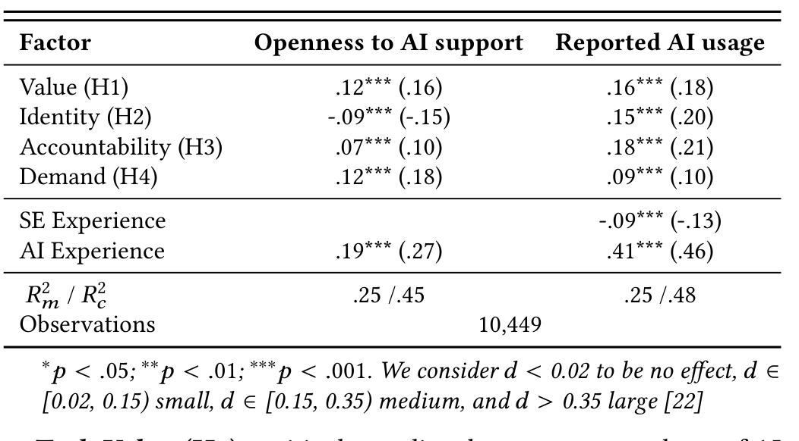
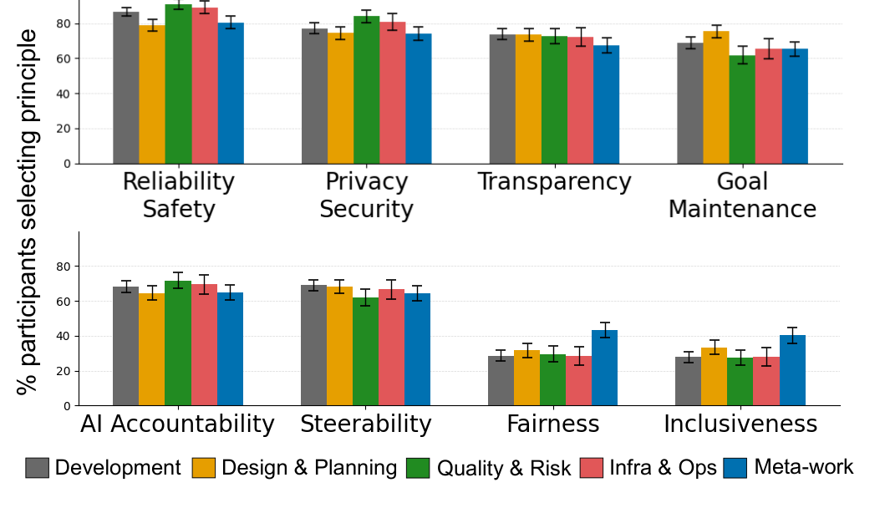
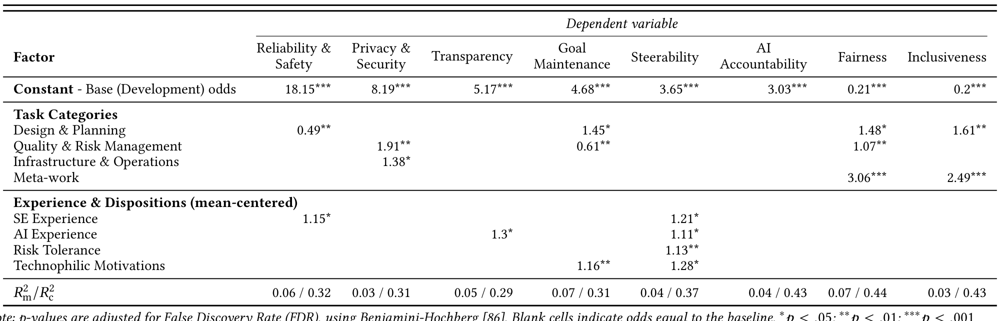

## AI Where It Matters:
### Where, Why, and How Developers Want AI Support in Daily Work

Rudrajit Choudhuri¹, Carmen Badea², Christian Bird², Jenna L. Butler², Robert DeLine², Brian Houck²  
¹ Oregon State University, OR, USA. Email: choudhru@oregonstate.edu  
² Microsoft, WA, USA. Email: cabadea, cbird, jennbu, rdeline, bhouck@microsoft.com

### Abstract
Generative AI is reshaping software work, yet we lack clear guidance on where developers most need and want support, and how to design it responsibly. We report a large-scale, mixed-methods study of N = 860 developers that examines where, why, and how they seek or limit AI help, providing the first task-aware, empirically validated mapping from developers’ perceptions of their tasks to AI adoption patterns and responsible AI priorities. Using cognitive appraisal theory, we show that task evaluations predict openness to and use of AI, revealing distinct patterns: strong current use and a desire for improvement in core work (e.g., coding, testing); high demand to reduce toil (e.g., documentation, operations); and clear limits for identity- and relationship-centric work (e.g., mentoring). Priorities for responsible AI support vary by context: reliability and security for systems-facing tasks; transparency, alignment, and steerability to maintain control; and fairness and inclusiveness for human-facing work. Our results offer concrete, contextual guidance for delivering AI where it matters to developers and their work.

### 1 Introduction
Developers increasingly work with generative AI tools (e.g., Copilot, Cursor) that promise faster delivery and lower cognitive load [8, 62, 78, 90]. Yet adoption in software engineering (SE) reveals a persistent tension. Capabilities are advancing quickly [42], while integration often proceeds without a clear view of where developers need help, where they prefer to retain control, and how to design for responsible support [8, 19, 74]. Without this clarity, automation risks optimizing the wrong aspects of SE work. Industry research highlights a paradox in which developers who use AI report higher satisfaction and more time in a “flow state,” yet spend less time on work they consider valuable, which can weaken professional identity and the quality judgments that define effective software work [80].

In this paper, we use “AI” to refer specifically to developer tools powered by generative AI models, including commercial offerings like GitHub Copilot, Claude, and Cursor, as well as bespoke in-house solutions that assist with various aspects of software development. We argue that meaningful AI integration requires understanding how developers themselves evaluate and experience different aspects of their work. Prior research has documented AI adoption patterns and identified task-level preferences [47, 69, 74]. For example, studies have shown that factors like workflow fit can outweigh perceived usefulness in early adoption [74], and have begun to differentiate AI receptivity across tasks such as coding, testing, and documentation [47, 53, 69]. Other work has highlighted the gap between developers’ ideal and actual workweeks, identifying toil-heavy activities as prime candidates for AI support [50].

While these studies explain which tasks developers want automated, they do not provide accounts for where, why, and how developers seek or limit AI for different aspects of SE work.

To address this gap, we apply cognitive appraisal and work design theories to capture how developers assess tasks along dimensions of relevance, identity congruence, accountability, and cognitive demands [34, 43, 58]. Such appraisals shape not only task engagement

but also openness to external support, making them critical for understanding where AI complements developer workflows [26]. We present findings from a large-scale mixed-methods study of 860 software developers at Microsoft, examining how task appraisals predict AI adoption (where/why) and which design principles developers prioritize for responsible AI integration in SE (how).

Our investigation addresses two research questions (RQs):
- RQ1: How do developers’ task appraisals shape their openness to and use of AI tools? Where and why do they seek or limit AI support?
- RQ2: Which Responsible AI (RAI) design principles do developers prioritize for AI support in SE tasks, and how do these priorities vary with experience and AI dispositions?

Using quantitative ratings across SE task categories and thematic analysis of rationales, combined with forced-choice prioritization of RAI principles, we map current need/usage patterns and the underlying psychological and professional considerations shaping them. Our findings reveal distinct clusters of SE tasks that differ in their suitability for AI support. We present a quadrant map that compares support needs with current use, highlighting gaps between developer preferences and available tools, and identifies opportunities for targeted tool development. We also find that trust requirements depend on context, with system-facing work requiring stronger reliability and transparency than exploratory or creative work. Taken together, these results support a framework for calibrating AI assistance that preserves developer agency, fosters expertise, and sustains meaningful work—delivering AI where it matters to developers.

### 2 Related Work
As AI tools enter development workflows, understanding what drives developers to adopt or resist these tools has become a focal topic in SE research [8, 19, 53, 74]. Prior work has applied technology-acceptance models (e.g., UTAUT [91]) to understand AI adoption, finding evidence that workflow compatibility and habitual use outweigh traditional factors such as performance or effort expectancy [74]. Trust has also emerged as a key factor, shaped by tooling capabilities, user dispositions (e.g., risk tolerance, technophilia), and expectations of control [15, 19, 45].

More recently, studies have shifted from general adoption to investigating task-level differences [47, 50, 69]. Lambiase et al. [53] show that AI receptivity is higher for artifact manipulation and information-retrieval tasks, but lower in collaborative contexts. In SE, Pereira et al. [69] observes stronger adoption patterns for code-intensive work, with limited use in creative aspects. Khemka and Houck [47] report strong demand for AI in testing, debugging, documentation, and compliance, though these preferences were tempered with concerns about AI gimmickry and defects. Complementing these findings, Kumar et al. [50] compares developers’ ideal versus actual time allocations in daily work and show that toil-heavy activities (e.g., documentation, environment setup) correlate with reduced satisfaction and productivity. These tasks are disproportionately seen as work to minimize, positioning them as strong candidates for AI support. Collectively, this literature indicates that AI adoption is not

---

a monolith; it is calibrated to the nature of the task. Yet it stops short of probing the psychological rationales that shape delegability. For example, why does coding count as “ideal” time, while infrastructure work or rote refactoring does not?

Our study addresses this gap by shifting from solely a capability/fit perspective to a meaning-based account: developers ask not only “Can AI do this?” but also “Should it?” and “To what extent?” We examine how developers cognitively appraise various aspects of their SE work and use that to explain where, why, and how they seek or limit AI (see §5.2). This perspective shows where human oversight and control remain essential even when AI is used.

Additionally, to our knowledge, this is the first study to examine developers’ task-conditioned priorities for Responsible AI (RAI) principles in AI-powered SE tools (see §5). We investigate how they want these tools designed—specifically, which RAI features they prioritize for responsible support across SE tasks. Finally, we show priorities vary by SE/AI experience and individual AI dispositions to guide adaptive, task- and user-sensitive design.

## 3 Appraisal Foundations & Hypotheses

Individuals are meaning-makers; we actively seek significance and value in our experiences [58]. At work, we implicitly evaluate tasks by asking: Is this important to me? Does this align with what I want to do? Am I responsible if it fails? Can I handle its demands? Cognitive appraisal theory [54, 72] formalizes these judgments across dimensions of relevance/importance, congruence with one’s motivations or identity, accountability, and cognitive demands. These appraisals shape coping strategies [16] and predict downstream outcomes such as engagement, persistence, and discretionary effort [64]. Complementing this, decades of work-design research [43, 58] show that job characteristics cluster into motivational (value, enjoyment), social (responsibility), and contextual (workload) factors, explaining substantial variance in work satisfaction and productivity [43].

At this intersection, we focus on four appraisal drivers: Value, Identity, Accountability, and Demands. Value and Identity capture motivational aspects that make tasks meaningful [58]; Accountability reflects the social stakes of responsibility [85]; and Demands index the contextual difficulty and cognitive effort involved [6]. These drivers shape how individuals perceive ownership, risk, and burden [5, 6, 49], thereby influencing whether, when, and to what extent they seek support [59, 68, 77]. In SE, we hypothesize that developers’ openness to and use of AI are shaped by these drivers:

Value is the perceived importance of a task, i.e., its significance to project success, stakeholders, or personal goals [39]. It contributes to a belief system that one’s work matters [3, 57]. Accordingly, high-value tasks heighten attention, focus, and satisfaction, but also raise anxiety about failure [5]. Historically, such tasks attract tooling support, provided reliability is high [68]. In SE, this tension could mean that developers welcome AI assistance to increase efficiency, yet hesitate to cede too much control in core aspects.

H1. Higher task value increases developers’ openness to AI support and usage. We expect that developers seek AI support as a means to complement meaningful tasks, rather than replacing them outright.

Identity alignment is the degree to which a task reflects one’s interests, expertise, or professional self-concept [39, 75]. Such tasks are intrinsically motivating and foster a sense of authenticity, purpose, and ownership [46, 49], which can heighten reluctance to delegate them to AI [59]. Yet, identity can also increase engagement with tools that help enact or amplify one’s craft [77]. Developers may therefore resist ceding identity-defining work, while strategically using AI to explore or extend their capabilities.

H2. Higher task identity reduces developers’ openness to AI support, but can increase usage when AI serves to complement expertise.

Accountability refers to the degree of perceived responsibility and potential blame an individual feels for a task’s outcome [56, 85]. High-accountability tasks are those where errors carry serious reputational or organizational consequences (e.g., customer-facing failures). Accountability Theory [85] suggests that when individuals anticipate evaluation or social recognition, they become more deliberate and information-seeking, often turning to external aids as safeguards against errors [59] and decisions [41, 56]. This could mean, rather than avoiding AI, developers strategically use it to substantiate contributions in high-stakes tasks.

H3. Higher task accountability increases developers’ openness to AI support and usage. At the same time, accountability lowers tolerance for automation bias [67, 68]. Since mistakes ultimately fall on them, developers are likely to adopt a cautious stance, insisting on oversight and decision control.

Demands capture the cognitive effort and load a task imposes [6]. High-demand work strains coping resources, increasing receptivity to aids that reduce mental load [54, 82]. Developers may turn to AI to lower the cognitive cost of experimentation, delegate effort-intensive components, and sustain momentum in demanding work.

H4. Higher task demands increase developers’ openness to AI support and usage.

Controls and Groups: We control for developers’ SE and AI experience, as both can shape baseline attitudes toward AI [7, 25]. Beyond expertise, individual dispositions can condition how task appraisals translate into AI use. Here, we emphasize risk tolerance and technophilia [14]—traits linked to stronger AI-adoption tendencies [19]. Risk-tolerant developers may delegate demanding work and feel less deterred by accountability pressures, while technophiles (intrinsically eager to experiment with tools) actively seek opportunities to integrate AI [19]. Accordingly, we expect these factors to moderate the hypothesized relationships.

## 4 Method

To address our RQs, we surveyed software developers at Microsoft. Microsoft employs over 60,000 developers worldwide, spanning diverse domains, team structures, processes, and stakeholder contexts. This scale, combined with exposure to both mature and emerging AI tooling, makes it a rich and diverse setting for our study.

### 4.1 Study Design

The goal of our study was to:
- (1) characterize how developers appraise SE tasks;
- (2) assess how these appraisals shape their openness to and use of AI;
- (3) identify opportunities and gaps where AI can better support developer workflows; and
- (4) understand which Responsible AI (RAI) design principles developers prioritize in AI tools to credibly support different aspects of SE work.

The study was reviewed and approved by Microsoft’s IRB.

Synthesizing a taxonomy of SE tasks: To study task appraisals (RQ1), we first constructed a representative, grounded taxonomy of SE tasks (Table 1), integrating multiple empirical sources [19, 47, 50, 63]. We first drew on recent work-week studies of developer activities [50, 63], that provided detailed task inventories and their higher-level groupings. We then enriched this set with job-distribution insights from large-scale developer surveys on AI trust and adoption [19, 47], ensuring our taxonomy reflected SE responsibilities distributed across roles, geographies, and contexts. Finally, we triangulated coverage through pilot sessions with developers and SE researchers outside our team, identifying any missing tasks and

---

Validating the clarity of category boundaries.

Responsible AI (RAI) principles: To assess developers’ RAI priorities in AI-enabled SE tools (RQ2), we anchored our study in Microsoft’s Responsible AI framework [23]. This framework synthesizes established AI ethics and governance guidelines [21, 27, 31, 37], and includes: Reliability & Safety, Privacy & Security, AI Accountability (provenance), Fairness, Inclusiveness, and Transparency. We extended this set with Steerability (user agency/autonomy) and Goal maintenance (sustained alignment with user goals) principles, both centrally emphasized in recent RAI research [19, 44, 60, 83]. This combined set provided a comprehensive basis for answering RQ2.

Survey design: We followed Kitchenham’s guidelines for conducting surveys [48] and drew on established theoretical frameworks and validated instruments from behavioral sciences and Human–AI Interaction (HAI) research (Table 2). The survey was refined through iterative validation with external researchers, and multiple one-on-one sandbox testing and pilot rounds.

Our final survey comprised three sections:

1. AI experience and dispositions: After obtaining informed consent, we asked participants about their experience with AI tools and their dispositions toward its use in work. We prefaced this section with a standard description of developer-facing AI tools, adapted from the DORA 2025 survey [84]. Participants with no prior AI-tool experience exited the survey at this point.

Table 1: Grounded taxonomy of SE tasks [19, 47, 50, 63]

2. Background & Demographics: Participants reported SE experience and, optionally, gender and country of residence. They then selected 2–3 task categories (in Table 1) that best reflected their current work and answered the subsequent questions for those categories. To reduce fatigue, the meta-work category (applicable to all developers) was excluded from the initial selection and shown only if a participant had selected two categories; thus, no participant completed more than three category blocks.

3. Task Category blocks: Each task category was a separate block. For each selected category (e.g., Development, Design & Planning, Quality & Risk Management; see Table 1), participants answered:

(a) RQ1: Task appraisals and AI use. For each task in a category (e.g., Testing/QA, Security, and Code Review under Quality & Risk Management), participants rated task value, identity, accountability, and demands measured with validated instruments (Table 2). We used single-item measures to reduce participant fatigue, given these items retain psychometric validity for concrete, well-scoped constructs [61]. Participants then reported their openness to AI support and frequency of AI use for each task (dependent variables for RQ1). Finally, we asked two open-ended questions: (a) where they most wanted AI

support, and (b) where they preferred to limit it; within the task category (e.g., in Quality & Risk Management), and why.

Table 2: Theoretical constructs and instruments

### (b) RQ2 — RAI priorities

Participants selected any five RAI principles (from the eight listed earlier) they deemed most important for AI-enabled tooling in that category (with the five-choice format drawn from prior work [44]). This top-N design forces trade-offs and mitigates ceiling effects (“all-high” bias common in Likert importance ratings) [4, 9]. After selecting, participants could optionally describe experiences that made their choices salient for that category. We tested alternative elicitation formats (ranking, point allocation, MaxDiff, importance categorization) [9] and chose this approach based on sandbox feedback.

Because RAI principles can be abstract and participants may not easily connect them to specific AI contexts [18], we provided on-demand, plain-language explanations (adapted from [44]), via information icons next to each principle. Each explanation followed a consistent format: (a) what a system embodying the principle would do, and (b) an example realizing its application, while retaining a degree of generality (see [44]).

The survey concluded with an open-ended question inviting general comments on AI use at work, and an optional field to share an alias for follow-up contact. In the pilot, participants could also suggest tasks missing from the taxonomy (for the categories they answered) and/or provide general survey feedback.

We administered the survey in Qualtrics [71]. All closed-ended questions used a 5-point Likert scale, and a sixth option (“I’m not sure” or “I don’t do this task/N.A.”) to distinguish ignorance from indifference [38]. The survey took 10–15 minutes to complete. To ensure data quality and reduce response bias, we included attention checks, randomized questions and option orders within each block, and randomized the order of task-category blocks. The complete survey instrument is provided in supplemental material [1].

Sandbox and pilot: We sandboxed the survey one-on-one with developers and SE/HCI researchers (n = 11) to assess its clarity, interpretability, and realism. Based on their feedback, we revised ambiguous questions, added safeguards against automated submissions, and contextualized questions to reflect participants’ current work (e.g., a once-valuable task may no longer be relevant in current work). Initially, all participants saw the meta-work block (Table 1), but pilots showed that limiting each respondent to at most three category blocks improved data quality and reduced fatigue, so we updated the design. Additionally, we tested multiple elicitation formats for RAI prioritization [9]. Respondents were comfortable selecting top-N principles and explaining tradeoffs, over ranking ethical values. We adopted this format consistent with prior work in this field [44].

To finalize the survey, we piloted it with (n = 50) developers. This validated the survey’s clarity and task set coverage. Minor wording edits were made, and pilot responses were excluded from the analysis.

---

## 4.2 Data Collection

Distribution: Following pilots, we distributed the survey to 8,000 software developers at Microsoft via email in July 2025. Developers were sampled uniformly at random across product groups, roles, and geographies, in accordance with internal survey policies. To incentivize participation, respondents could enter a raffle for ten $50 AmEx gift cards. One reminder email was sent after a week to boost response rates. Participation was voluntary; responses were anonymous unless participants opted in to follow-up contact.

Sample size: To determine the appropriate sample size, we conducted an a priori power analysis in G*Power [32] for multiple linear regression with repeated measures, using the number of predictors in our design. We targeted the detection of even a small effect size (d = 0.05) at a significance level of α = 0.05 with power = 0.95. The analysis indicated a minimum of 245 responses. To accommodate missing data, quality exclusions, and subgroup analyses, we targeted at least three times this number.

Responses: We received 1,193 responses, a response rate of 14.86%, consistent with the response rates of prior SE surveys [70, 81]. We removed incomplete (n = 152) and patterned responses (straight-lined or repetitive altering; n = 59), as well as those that failed attention checks (n = 98) or reported no AI experience (n = 24). We considered “I’m not sure” / “I don’t do this task” Likert selections as missing data.

We retained 860 valid responses from developers across six continents, representing a wide distribution of SE and AI experience. Most respondents were from North America (57.4%) and identified as men (73.8%), consistent with distributions reported in prior SE studies [19, 74, 88]. A summary of participant demographics is available in the supplemental [1].

## 4.3 Data Analysis

**Quantitative:** We analyzed data in Python and R to summarize distributions, fit regression models (see §5.1, 5.3), and generate visualizations. Closed-ended responses (Likert; Top-N) were visualized to assess variation in appraisals, openness to AI support, and usage across tasks (Tab. 4, Fig. 1) and RAI priorities across categories (Tab. 5, Fig. 2). For RQ1, the unit of analysis was (participant, task type); for RQ2, (participant, task category). Because the design involved repeated measures within participants and across tasks, we used mixed-effects regression [36]. Full model specifications, diagnostics, and results are deferred to the corresponding subsections in §5; here we outline the overall approach and the units of analysis.

**Qualitative:** We used reflexive thematic analysis [10, 11] to identify patterns in the data, iteratively refining them based on participants’ responses [10]. To ensure rigor, the team held multiple meetings to compare codes, resolved differences, and build consensus, as recommended in thematic analysis [11, 24].

First, we inductively open-coded the data to capture preliminary ideas. We then refined and consolidated codes, merging conceptually similar ones while keeping others distinct, and linked them to relevant text segments. Throughout the process, we used a negotiated agreement protocol to guide team discussions until we reached consensus on the final themes (cataloged in [1]). Next, to understand why specific patterns emerged, we mapped qualitative insights to quantitative findings, again through consensus building. As an additional check, we compared participants’ free-text responses with Likert selections and found no discrepancies between their assessments and explanations. Finally, where relevant, we triangulated findings with behavioral science theories to structure interpretation.

In total, we analyzed 1,528 responses about where developers seek and limit AI support and 2,453 responses explaining RAI-principle priorities, spanning five task categories. Participants are referenced as P1–P860 in subsequent sections.

We used member checking to validate our findings: results were sent to 371 participants who opted in to follow-up contact, and 62 replied. Their feedback affirmed the findings and offered clarifications; no new insights or disagreements emerged.

## 5 Results

In this section, we report (1) how task appraisals shape AI adoption (RQ1a: 5.1), (2) where developers seek or limit AI support (RQ1b: 5.2), and (3) which Responsible AI principles they prioritize in AI tools to credibly support their workflows (RQ2: 5.3).

### 5.1 RQ1a: How do appraisals shape openness to and use of AI support?

To answer RQ1, we first investigated whether task appraisals (value, identity, accountability, demands) predict developers’ (a) openness to AI support and (b) AI usage, and whether these relationships vary by developer characteristics (experience, AI dispositions).

For each outcome, we fit linear mixed-effects regressions [36], with appraisals as fixed effects; controls for developers’ SE and AI experience, and random effects for participant and task type to capture within-person and across-task dependence. Models were estimated for the full sample (Tab. 3) and, per our planned group analyses, stratified by risk tolerance and technophilic motivations (see §3). Group analyses statistics are in supplemental [1].

We checked for multicollinearity among the predictors before examining the results. All Variance Inflation Factors (VIFs) were < 2, well below the accepted cutoff of 5 [40]. We controlled false discovery rates (FDR) using the Benjamini–Hochberg procedure [86] and report results significant at α = .05 after this correction.

Table 3 summarizes the regression results. All hypothesized effects (H1–H4, §3) were supported: each appraisal dimension significantly predicted both developers’ openness to and use of AI support in work. We report marginal (R_m^2; variance explained by fixed effects) and conditional (R_c^2; variance explained by fixed and random effects) fit indices as indicators of model fit [40].

Table 3: Mixed-effects regression results for developers’ (a) openness to AI support and (b) AI usage, estimated for the full sample (N = 860). Cells report standardized regression coefficients (β), p-values, and effect sizes (d) in parentheses. Blank cells indicate non-significant associations after Benjamini-Hochberg FDR adjustment [86].

[0.02, 0.15) small, d ∈ [0.15, 0.35) medium, and d > 0.35 large [22].

Task Value (H1) positively predicted openness to and use of AI support. A one-standard-deviation (SD) increase in perceived task value raised openness by .12 and use by .16 SD units (p < 0.001, FDR-corrected), with medium effects (.16, .18) holding other factors constant (Table 3). In short, when developers viewed a task as important, they were more likely to use AI for efficiency (e.g., automating rote

---

steps, comprehension, collaboration, information retrieval). They, nonetheless, stressed retaining decision control, positioning AI as complementary rather than substitutive (see §5.2).

Task Identity (H2) alignment showed a dual pattern: lower openness to AI support (β = −.09, p < .001) but higher usage (β = .15, p < .001), with medium effects (−.15, .20). Developers protected ownership of identity-defining work (see §5.2); yet used AI to refine their craft (e.g., learning, research, and exploration).

Task Accountability (H3) was positively associated with openness to AI support (β = .07, p < .001) and use (β = .18, p < .001), with small–medium effects (.10, .21). Rather than avoiding AI, developers leveraged it as a safeguard in high-stakes tasks (e.g., to surface issues, verify solutions, or justify decisions), raising both support needs and use. Yet, heightened accountability increased vigilance: they insisted on deliberate review of AI outputs, maintained oversight, and decision control for these tasks (see §5.2).

Finally, Task Demands (H4) positively associated with openness (β = .12, p < .001) and use (β = .09, p < .001), with small–medium effects (.18, .10). For demanding/effort-intensive work, developers were more inclined to use AI to offload rote steps, lower cognitive load, and sustain momentum. In these cases, AI functioned as a cognitive scaffold that freed attention for higher-order knowledge work [55].

Experience: SE experience predicted lower AI use (β = −.09, p < .001). Experienced developers rely on established repertoires [30], reducing the perceived utility of AI delegation, whereas juniors use AI to offset skill gaps [25]. Openness to AI support did not differ significantly by SE experience. Prior AI experience increased both openness and use (β = .19, .41; both p < .001), consistent with familiarity-driven calibration of expectations and AI-usage habits [7].

Group analysis (AI Dispositions): Stratifying by median splits on reported AI dispositions, risk-tolerant (RT) developers showed higher openness and use overall. They sought significantly more AI support for high-value (Δβ = .06, p = .035) and high-demand (Δβ = .09, p = .001) tasks, and used more in high-stakes and demanding situations (Accountability: Δβ = .07, p = .038; Demands: Δβ = .08, p = .002). Risk-averse (RA) peers remained more vigilant under accountability pressures [56,85]. Other associations were consistent across both groups. Technophiles, likewise, showed higher openness and use overall. Crucially, accountability appraisals (H3) predicted these outcomes only among high-technophiles (Support: β = 0.07, p < .001; Usage: β = 0.20, p < .001), indicating that technophily moderates AI adoption under high-stakes conditions.

Consistent with human–AI teaming work [7], high-technophiles have the orchestration habits to use AI as a “second set of eyes,” which outweigh perceived error/coordination costs, whereas low-technophiles—lacking these routines—view AI as net-costly under accountability pressure. Other associations were comparable across both groups (no LT–HT differences; effects significant within each).

> Takeaway: Task appraisals shape AI adoption: Value, Accountability, and Demands increase openness and use; Identity-alignment shows dual effects. Junior, AI-experienced, risk-tolerant, and technophilic developers are more receptive overall, especially for high-value, high-stakes, or demanding work.

### 5.2 RQ1b: Where and why do developers seek or limit AI support?

Given that appraisals predict AI use, we examined how it varied across tasks to locate where and why developers seek or limit support. First, we clustered tasks by their appraisal signatures (Table 4). For each task, we computed top-2 agreement proportion (share selecting 4–5 on a 5-point scale [52]) for the four appraisals, then standardized these values to z-scores (z = (x − x̄) / sd(x)) for cross-scale comparability [40]. We applied agglomerative hierarchical clustering (Ward linkage) [93] on Euclidean distances of these z-scores, selecting k = 3 optimal clusters via silhouette analysis [73] (see [1] for silhouette plot). We used precision-weighting (inverse-variance shrinkage to the grand mean) to address unequal task-Ns and validated cluster stability via stratified bootstraps (B = 1000) [40]. The analysis yielded the following clusters:

- C1: Core work — High value and demands; moderate–high accountability; moderate–strong identity alignment.
- C2: People & AI-building — Moderate value, demands, and accountability; strong identity alignment.
- C3: Ops & Coordination — Moderate–high value, demands, and accountability; weak identity alignment.

We simultaneously mapped tasks onto an Openness to AI Support (x) vs. AI Usage (y) plane (Fig. 1) to visualize gaps in tooling support. Axes show task-level z-scores for openness “need” (x) and reported use (y), with positive values above the sample mean and vice versa. Quadrants (mean-split: z = 0) highlight distinct opportunities/gaps:

- Build (bottom-right; high need, low use): Clear need but limited adoption; reduce friction and prototype new support.
- Improve (top-right; high need, high use): Strong need and adoption; focus on reliability and quality for gains.
- Sustain (top-left; low need, high use): AI is used but not essential; maintain support without over-investment.
- De-prioritize (bottom-left; low need, low use): Limited uptake; expect lower returns from additional investment.

In what follows, we position tasks on this map and, by cluster, draw on qualitative analysis of free-text responses to explain which aspects may benefit (or suffer) from AI involvement and why.

#### 5.2.1 Core work (C1)

Core work (C1) comprised tasks central to development and systemic quality-management: coding, bug fixing, testing/QA, code review, system design, performance optimization, requirements engineering, security; alongside learning and research. Appraised as high-value, high-stakes, and high-demand, most C1 tasks concentrated in the Build/Improve (high-need) zones, indicating a strong appetite for AI support. Identity alignment, however, constrained delegation: participants sought AI primarily as an augmentation support while retaining ownership of core decisions, skills, and responsibilities. In contrast, system design and requirements fell in De-prioritize, due to AI’s contextual misfit and trust concerns.

**Seek AI:** For core work, participants used AI to boost workflow efficiency, delegating tedious steps to reduce cognitive load: “generate boilerplate code, build configurations, test cases... which I know how to write, but I don’t want to write” (P353); freeing focus for creative problem solving: “Leave me to do the fun [parts]” (P319). They sought proactive performance and quality assurance, beyond standards enforcement, to catch “bugs, regressions, [performance] bottlenecks, and potential security issues early... where human review might miss patterns or edge cases” (P241). This required multi- and cross-context awareness—AI that integrates signals across codebases, documents, and related artefacts: “It needs to look at logs, performance counters, etc., understand runtime behavior... then make changes, inspect results, try again” (P195). As P201 noted, “We want/need AI to do a MUCH better job of analyzing a current codebase/architecture so it can understand how/where to add/extend.” (P201). Overall, they envisioned AI as a collaborator, aiding comprehension and pair programming/debugging/testing/review; without overriding human judgment: “The focus should be on AI making ME better at my job” (P213).

---

Table 4: Task appraisal profiles across four drivers: Value, Identity, Accountability, and Demand. Tasks are grouped into three clusters derived from driver-response patterns: Core Work, People & AI Building, and Ops & Coordination. Within each cluster, tasks are sorted by Value agreement (% Agree/Strongly Agree). For each driver, we show (i) the full 5-point Likert distribution, (ii) the % Agree/Strongly Agree with a common color gradient for comparison, and (iii) the task’s rank on that driver. The legend spans 0% (yellow) to 100% (dark blue). Confidence intervals for percentages are in the supplemental; tasks with overlapping CIs are not statistically distinguishable in rank.

For learning/research, participants wanted AI as a personalized guide, a tool for information retrieval/synthesis, and a scaffold for ideation and practice. They stressed adaptive help aligned with skills and goals: "it should build my concepts from the ground up... based on my learning styles" (P281); "walk me through tutorials, provide examples, point me to resources" (P169). They wanted AI to surface relevant material across sources: "Researching could be where AI plays a big role... it can easily pick out relevant information from large amounts of data" (P28). At the same time, they cautioned against shortcutting experiential learning: avoiding cases where "AI does all the work and [they] miss a chance to learn by doing" (P66).

### Limit AI:
Participants resisted fully automating core work. They welcomed assistance but insisted on retaining oversight and decision control: "I can't fully delegate the final code review to AI—my approval puts my name on it" (P117). Others echoed, "deciding whether to ship something with limitations or communicate a risk to leadership requires context, experience, and intuition that AI can't fully grasp" (P301). They emphasized that AI should not absolve them of accountability, "I wouldn't want AI to handle final decision-making in high-stakes scenarios; responsibility should remain with experienced professionals" (P9), or reduce their role to passive overseers: "Should not turn the worker into a George Jetson" (P45).

They also resisted AI to preserve professional identity and craft: "I do not want AI to handle writing code for me. That's the part I enjoy and is the core of my work" (P110), and warned that overreliance risks deskilling: "intellectual offloading can result in errors that eventually no one understands" (P409). P16 captured the ethos: "AI should enhance human engineers' learning and development, not replace tasks that allow them to become better engineers" (P16).

Trust and quality concerns reinforced these limits. Respondents cited hallucinations, lack of transparency, and weak contextual reasoning as reasons to keep AI in a supporting role: "AI should not be the determining factor in how to solve quality problems... it frequently hallucinates with absolute certainty" (P17). They were wary of AI handling sensitive data: "I don't want AI to directly handle sensitive information, as I don't trust that information it sees stays truly secure" (P397). They also flagged maintainability risks and AI-induced technical debt: "AI-generated code is often not very readable or maintainable, which reduces long-term sustainability" (P149).

System design & requirements fell in De-prioritize. Participants reported low need/use due to both AI's capability gaps and its contextual misfit with the situational nature of these tasks: "These decisions require deep domain knowledge and long-term vision that only experienced engineers can provide" (P241). They also warned of homogenized, generic outputs as a risk to innovation: "AI's system design solutions bias toward old known solutions rather than a modern solution that solves the problem better" (P188). Here, respondents preferred human judgment and collaboration.

> Takeaway: Developers seek AI as a collaborator on core work to boost efficiency and reduce cognitive load; redirecting focus on higher-order work (H1, H4), while retaining oversight and decision control in high-stakes, identity-laden aspects (H2, H3).

---

Figure 1: Scatter z-score plot showing relative AI-support needed (z) versus Usage (z) scores for SE tasks. Tasks are grouped into four quadrants representing strategic zones: Build, Improve, Sustain, and De-prioritize.

### 5.2.2 People & AI-Building (C2)

People & AI-Building (C2) covered AI integration (developing/embedding AI features into products) and mentoring. Appraisal-wise, C2 tasks showed strong identity alignment but moderate value, demands, and accountability, placing them in the Sustain/De-prioritize zones (low AI need). Participants preferred to do these themselves, citing intrinsic motivations.

Limit AI: For AI integration, participants largely resisted AI to preserve professional identity and craft: “I don't want AI to handle AI development, as it brings satisfaction to my work and requires craftsmanship” (P285), and favored deterministic workflows over stochastic outputs, citing distrust: “My team is focused on integrating AI into products. I don't feel AI is up to any help for this... using it instead of a predictable workflow will not work out in the end” (P66).

Mentoring drew stronger resistance given its relational nature: “I don't want it to help mentor people. Relationships are important” (P85). Participants cast mentoring as fundamentally interpersonal—building trust, connections, and team culture: “new members need to interact with their team to build relationships. AI can't satisfactorily replace that for many, many years” (P122). They noted that AI might help with “rote onboarding steps” (P70), but AI misguidance can harm mentees: “The cost of it getting it wrong is terrible—and it will get it wrong” (P357). Mentoring is also a growth opportunity for mentors, fostering empathy and learning: “Mentoring teaches the mentor as well... humans need to do it to grow themselves” (P228), reinforcing the need to be kept human-led.

**Takeaway:** For identity-laden and interpersonal work, developers resist AI and retain ownership due to craft, relationships, and personal growth (H2). AI is, at best, peripheral.

### 5.2.3 Ops & Coordination (C3)

Ops & Coordination (C3) covered (a) ops/maintenance toil (“run-the-systems”): DevOps/(CI/CD), environment setup, code maintenance (refactoring/updates), infrastructure monitoring/alerts, documentation; and (b) coordination/support (“relational work”) overhead: project planning/management, stakeholder communications, customer support. Appraisals were moderate–high on value, demands, and accountability but low on identity. Reported need for AI was moderate, yet adoption lagged due to AI limitations, context fit, and trust concerns. In Fig. 1, “run-the-systems” tasks concentrate in Build, while “relational-work” sits in De-prioritize zone.

Seek AI: Participants wanted AI to reduce grunt C3 work (toil), provided it was reliable, deterministic, and context-aware.

For “run-the-systems”, they sought an assistant for well-scoped, effort-heavy tasks (e.g., setup, maintenance, monitoring) that were low in creative value. Current tools were seen as limited: setups remain manual, pipelines fragile, alerts noisy, and documentation stale. Participants desired AI to provision environments and configurations, automate upgrades and migrations, maintain system health, and update documentation from code or design changes. CI/CD was a recurring pain point, with calls for AI to generate and repair pipelines, enforce quality checks, and run unattended deployments. As P261 put it: “AI should help in maintenance of services, making sure that the lights are kept on when the developers move on to new features. Keep systems healthy; where safe, triage and remediate known issues” (P261).

They also emphasized cross-context awareness—linking telemetry and artifacts to infer, triage, and predict failures: “constantly analyze logs, metrics, and system behavior to identify deviations, triage root causes, and predict potential failures before they impact operations or users” (PID309). For large-scale refactoring (situated in the Improve zone), participants wanted architecture-aware changes applied safely across the codebase.

For “relational work”, AI was welcome backstage for handling logistics: drafting updates, summarizing meetings, pulling context across threads, scheduling follow-ups—and for PM support (context-aware plans, dependency tracking, lower coordination overhead), while keeping strategy human-led. “AI should prioritize task by impact/dependencies... free time for creative/strategic thinking... plans must stay adaptive and human-gated” (P403). Net: AI was framed as a peripheral tool and remained largely de-prioritized for relational work, for reasons detailed next:

(Limit AI) Participants de-prioritized AI for “relational work”, arguing that contextual intuition, empathy, and long-term vision aren’t automatable. Strategic calls and ambiguous trade-offs should remain human: “I don't want AI to handle ‘interpretation,’ drive product vision, or make strategic trade-off decisions” (PID3). For stakeholder communications, they emphasized authenticity and relationship-building: “I don't want AI to handle stakeholder comms... these require empathy, trust-building, and nuanced understanding of human dynamics” (PID172); “Client communication needs personal touch. Summarizing meetings is one thing, but replacing real touchpoints is too much” (PID217). Customer support drew similar pushback: “As a customer, being forced to an AI is frustrating” (P41), with accuracy lapses seen as risking support quality and brand damage. These, alongside AI's capability gaps (hallucinations, weak grounding, high prompt overhead), kept it backstage (summarizing, retrieving, scheduling) while “humans hit send” (P47).

By contrast, “run-the-systems” tasks met less resistance in principle, but faced trust, quality, and transparency concerns with (and/or absence of) current tools, that kept them in Build zone. Help was welcome only with determinism, verifiability, and human-gated change control: “Anything that touches prod stays behind human gates—no auto-deploys, no direct live changes, no publishing without”

---

> supervision and transparency” (P165). Performance lapses in current tools fueled caution on large-scale refactors—“AI should not perform any large-scale refactoring” (PID182)—with even small edits requiring review to prevent regressions. Finally, participants warned against over-automation that erodes operational intuition: “Engineers still need to learn how things work... AI should guide, not replace, or leave juniors without a pathway to operational knowledge” (PID16).
>
> Takeaway: Developers offload ops/coordination toil (H2, H4) only when AI is reliable, safe, and context-aware (H1, H3). Still, they resist over-automation that erodes intuition or adds debt. Relational work aspects are off-limits—empathy, intuition, and authenticity remain irreducibly human.

### 5.3 RQ2: Which RAI design principles do developers prioritize in AI for SE tasks?

Recall that participants selected five of eight RAI principles (see §4) for the task categories most relevant to their work; these choices reflect top priorities under forced trade-offs, not an absolute ranking or organizational stance.

As shown in Fig. 2, participants most frequently selected Reliability & Safety (85%), Privacy & Security (77%), Transparency (72%), Goal Maintenance (68%), AI Accountability (67%), and Steerability (67%) across categories. Fairness (32%) and Inclusiveness (32%) followed. Participants' explanations indicated that, given the current maturity of AI tools in SE, they prioritize pre-requisites that ensure correctness, reduce harm, and keep the system aligned and under control, before expecting credible support for broader humanist principles: “Surely all of them are important but at which stage? Right now, the basics aren't even done well, so those are [what] I selected” (P43).

To examine how RAI priorities varied, we fit logistic Generalized Linear Mixed Models (GLMMs) [12] per principle (Table 5). The models predicted whether a principle was prioritized (Outcome = 0/1) as a function of task categories, mean-centered SE & AI experience, risk tolerance, and technophilia, with random intercepts for participant to account for repeated measures.

The intercept (baseline) represents a developer with average SE/AI experience and AI-dispositions (relative to their peers) prioritizing a principle in AI support for development-heavy work. Table 5 reports odds ratios (ORs) relative to this baseline (OR > 1 = higher odds and vice versa). For example, the baseline odds of prioritizing Privacy & Security in AI for development tasks were 8.19 (i.e., 8.19/(1+8.19) ≈ 89% probability). In quality/risk-management tasks, the odds increased by 1.91 (8.19 × 1.91 = 15.65, ≈94% probability).

Next, we integrate qualitative accounts to explain why these patterns emerged and how priorities shifted across SE work categories.

Interpretation guideline: These results reflect preferences under a forced-choice design; they neither prescribe policy nor imply that any RAI principle is optional. All remain essential. Read them as a pragmatic “order of operations” for current tools, varying by task category and individual dispositions, as detailed next.

#### 5.3.1 How do priorities vary across task categories?

1) For systems-facing work (development, infrastructure/ops, quality & risk)—concentrated in the Build/Improve zones of Fig. 1—participants imposed strict gating before AI could be trusted. Reliability & Safety (base odds: 18.15; ≈95%) and Privacy & Security (base odds: 8.19; ≈89%) were non‑negotiable. Participants stressed that for these tasks, AI errors do not “net to zero”—they waste time, send teams down unproductive paths, and amplify risk: “AI MUST BE correct for it to be useful. Incorrect AI may as well be throwing spaghetti at a wall—it's more work to fix it” (P83).

Figure 2: Participants (%) selecting each RAI principle as their top-5 priority for AI support across SE task categories; percentages reflect frequency and do not sum to 100%.

Privacy concerns intensified in infra/ops (OR = 1.38) and quality/risk (OR = 1.91), where artifacts are sensitive: “One privacy slip and trust collapses” (P313). Respondents demanded “absolute assurance that AI safeguards information, preventing leaks or unauthorized access” (P322) and declined tools “for security work unless [they’re] secure... and sources [are] clear” (P435).

Participants next emphasized Transparency (base odds: 5.17; ≈84%), seeking clear explanations to verify assumptions, catch hallucinations, and justify (or revise) AI contributions. They tied this need to personal accountability and learning: “I feel accountable for my work, so I feel accountable for what the AI has done. I want it to explain why an action was taken. This also helps me grow as a developer” (P36).

To keep tools aligned with shifting objectives, they highlighted Goal Maintenance (base odds: 4.68; ≈82%), stressing that AI must adapt as goals evolve; currently it chases tangents and/or resurfaces stale context, forcing rework: “The things I need to be giving my attention to are changing all the time, so if AI could keep up with that via Goal Maintenance, that would be huge” (P791). In cases where drift occurs, participants prioritized control surfaces to redirect AI (Steerability, base odds: 3.65; ≈79%) and provenance to backtrack/trace errors (AI Accountability, base odds: 3.03; ≈75%): “Lack of steerability & accountability makes it hard to use AI for tasks that require extensive time/detail... it's hard to put it back on track and/or tell where it went wrong... I often have to start new chats, which is frustrating, losing progress because the context is gone” (P495).

In quality & risk work, Fairness surfaced as contextually salient (OR = 1.07). Fairness matters because reviews and audits affect releases and defect attribution. Participants stressed the need for unbiased evaluation: “Fairness of PR review is hard for humans, so I want it to be a success metric for AI reviewers” (P196); “It is important to have unbiased AI for quality-related tasks to ensure the integrity of the work is not compromised” (P461). Some saw fairness as nested within reliability/safety; others raised a tension between fairness and privacy, noting that bias checks might require “exposing personal attributes the AI shouldn’t know” (P476).

2) For design and human-facing work (design/planning, meta-work)—concentrated in the De-prioritize zone of Fig. 1—participants elevated Fairness (OR = 1.48, 3.06) and Inclusiveness (OR = 1.61, 2.49). They wanted AI to broaden perspectives and avoid reinforcing bias in collaborative or client-facing contexts: “Inclusiveness and fairness of AI features should be baked into design planning from the start... it needs a grasp of business requirements and diversity of audiences” (P653). This was especially salient for documentation.

---

Table 5: Logistic Generalized Linear Mixed-effects Models (GLMMs) predicting baseline odds and odds ratios (ORs) of Responsible AI design priorities by task category, developer experience, and AI dispositions. Experience and disposition predictors are mean-centered. The constant (baseline) reflects the odds of a developer performing development-heavy tasks with average SE experience, AI experience, risk tolerance, and technophilic motivations. Odds ratios are relative to the baseline odds; priorities differ from baseline only if statistically significant.

Rm2/Rc2 0.06/0.32  0.03/0.31  0.05/0.29  0.07/0.31  0.04/0.37  0.04/0.43  0.07/0.44  0.03/0.43

Note: p-values are adjusted for False Discovery Rate (FDR), using Benjamini-Hochberg [86]. Blank cells indicate odds equal to the baseline. * p < .05; ** p < .01; *** p < .001.

and stakeholder communications: "If AI updates documentation, it must ensure inclusiveness and fairness so content works for all customers" (P120); "It is key that AI is bias/prejudice free to maintain stakeholder relationships" (P195).

Other priorities were consistent with the baseline (e.g., Transparency for learning/research, Privacy for sensitive communications, Steerability, and AI Accountability for system design). In design/planning, however, participants downweighted Reliability when AI served as an ideation scaffold (OR = 0.49), and prioritized Goal Maintenance (OR = 1.45). When AI scaffolds creativity, adaptability can outweigh strict determinism: "Creativity of AI is important; I’m willing to tolerate errors" (P180). Participants valued AI’s ability to surface options that spark innovation (even if imperfect), provided it stayed aligned with (evolving) objectives: "During planning, goals frequently change, so AI needs to keep up with that evolution. I’d also expect AI to bring in much more outside perspectives to synthesize a range of feedback" (P459).

> Takeaway: In systems-facing work, Reliability and Privacy are central; next come Transparency, Goal Maintenance, Steerability, and AI Accountability. In design and human-facing tasks, Fairness and Inclusiveness are elevated. Developers relax Reliability for creative scaffolding and emphasize Goal Maintenance as needs evolve. Net: Get safety/security right; keep AI explainable, aligned, steerable, and accountable, & make outputs fair and inclusive.

### 5.3.2 How do priorities vary by experience/AI dispositions?

Across individual differences, Steerability rose in priority with higher SE experience (OR = 1.21), AI experience (OR = 1.11), risk tolerance (OR = 1.13), and technophilia (OR = 1.28). Viewed through Self-Determination Theory [28, 75], this pattern reflects protection of autonomy and competence: experienced developers favored control that keeps AI actions interruptible and easy to correct, citing course-correction overheads—"Sometimes it spirals off... backtracking is harder than starting over" (P657). Risk-tolerant individuals treated steerability as a safeguard for rapid intervention. Participants also resisted modes (e.g., bulked edits) that could erode competence over time: "Multi-file edit modes feel to take away steerability... Yes, the developer gets the final say, but I’ve noticed it harms the engineer’s skills over the long term more than it helps" (P754).

Experienced SEs prioritized Reliability & Safety (OR = 1.15), consistent with a sharper sense of downstream "automation surprises" [67]. Those with more AI experience prioritized Transparency (OR = 1.30), as familiarity with AI’s quirks heightened demands for visible reasoning and provenance to "debug and justify outputs even when they looked plausible" (P367).

Technophilic individuals prioritized Goal Maintenance (OR = 1.16). As recent work notes [20], their intrinsic drive to explore AI tooling collides with current frictions (prompt churn, drift, and limited affordances), raising the cognitive cost of exploration. Consistent with this pattern, psychological research shows that systems which preserve user intent and minimize orchestration overheads sustain intrinsic engagement [28, 89].

> Takeaway: Individual traits shape RAI priorities: SE experience heightens demands for Reliability & Safety, AI experience for Transparency, and technophilia for Goal Maintenance. SE/AI experience, risk tolerance, and technophilia all amplify emphasis on Steerability, reflecting a strong need for agency.

## 6 Discussion

Our results capture a snapshot of a historic inflection point. Findings may shift as tools evolve, yet both current patterns and their theoretical grounding remain informative. Task forms and positions on our map will change as capabilities grow, but deeper structures from appraisal theory (e.g., enduring needs in quality, coding, documentation, coordination, and people work) are likely to persist. Our mixed-method, clustering-based lens is designed for reuse as the landscape evolves, enabling teams to relocate tasks rather than freeze them in time. Current frictions in reliability, security, and transparency highlight where to invest next, especially in the "outer loop" (e.g., testing, review/release, governance).

### 6.1 Implications for practice

A key implication is to favor augmentation over blunt automation. Developers prefer AI that amplifies creativity and complexity, not just removes toil, consistent with evidence linking meaningful work to growth and contribution rather than extrinsic rewards [57]. The "human / AI / human+AI" framing [65] applies: some activities remain human-led, some AI-led, and many are best as human+AI. Our map shows where each mode fits today and where to invest to enhance meaning rather than hollow it out.

Developers want AI as a cognitive collaborator; helping decom-

---

pose problems, generate alternatives, capture rationale, and pivot across artifacts (code, tests, docs, issues, designs), while preserving oversight, craft, and agency. Concretely:
- Provenance and transparency: show sources, explanations, confidence, and transformations; keep decision paths inspectable; maintain traceable links among artifacts.
- Decision control: default to suggest-only flows with reversible changes, batched diffs with rationales, and explicit approval checkpoints.
- Craft-preserving design: reveal intermediate reasoning and trade-offs so developers learn, avoiding skill erosion from over-automation.

Where work depends on connection, negotiation, and recognition, developers de-prioritize AI. The right stance is peripheral support: assist with preparation (briefings, what-if scripts), reflection (summaries, action extraction), and equity (bias checks, inclusivity), while leaving human contact and credit intact. This “complement, don’t crowd out” principle mitigates AI intrusion into social labor.

Automation often shifts toil rather than eliminating it [2, 17]. Time saved can reappear in setup, oversight, or remediation. Highest returns pair automation with reliability, transparency, and alignment: strong grounding; guardrails for hallucinations or unsafe edits; test-first or co-generated tests; and integration-aware suggestions that respect CI, policy, and compliance. Human oversight remains essential as software work is inherently socio-technical and consequential.

RAI priorities vary by task-context and developer disposition; so there is no one-size “copilot”. Traits should adapt to the work:
- Task-aware personas: exploration (diversity over precision), implementation (precision, diff-awareness), review (risk-sensitivity, policy awareness), operations (traceability, rollbacks).
- User-calibrated agency: adjustable autonomy with clear affordances to ratchet delegation up or down; defaults keyed to task risk.
- Context diet and guardrails: minimal-necessary context; privacy tiers; least-privilege access; bias and security checks on by default.

In practice, ship for augmentation (human-gated control) in Core Work, treat Ops & Coordination as a reliability/traceability problem first, and keep People & AI-Building human-led with AI in a peripheral, assistive role.

Teams can use the map to shift time from low-signal toil to higher-order knowledge and people work, creating room for learning and designing ceremonies that preserve recognition (e.g., crediting rationales and reviews). Leaders should track experience outcomes (flow, satisfaction, confidence) alongside throughput and invest in intentional “moments that matter” to maintain cohesion in an era of AI-accelerated solo work. AI may free time for complex, creative problem-solving and human-facing coordination, but this shift is not automatic; it requires intentional job crafting (redesigning roles, rituals, recognition) so higher-order work is visible/rewarded; and support for horizontal skill expansion (product sense, data/AI literacy, operations). Open questions remain: Does AI truly create time for meaningful human work, or mainly boost throughput? Which job-crafting moves best preserve meaningful work? Under what conditions?

## 6.2 Implications for research

As assistants grow more agentic, three priorities emerge:
1. Transparency & observability. What forms of evidence (e.g., decision logs, artifact lineage, rationales) improve oversight without inducing overreliance [13]? Needed: validated measures of “useful transparency” and experiments on trust calibration/error detection.
2. Goal maintenance. How should evolving goals and constraints be represented so agents detect and prevent drift across artifacts/sessions? Needed: shared human- & AI-legible goal schemas; drift benchmarks; causal tests of guardrails (pre-commit checks, test-first prompts) on quality, latency, and friction.
3. Steerability & developer agency. Which interrupt/redirect mechanisms and delegation policies best balance control under varying risk? Needed: task-typed autonomy ladders/taxonomies (interrupt, revise, rollback); evaluations tying agency to outcome quality.

Because tasks and tools will keep evolving, we present our approach (cognitive appraisal + mixed methods + clustering) as a living instrument. Periodic re-runs (every 6–12 months) can relocate tasks, recalibrate RAI priorities, and test whether improvements in transparency, goal maintenance, and steerability measurably shift developer experience and outcomes.

## 6.3 Limitations

Construct validity. We measured constructs using self-reported items grounded in established theory. Still, surveys can introduce bias or misunderstanding. We mitigated risk by involving practitioners, sandboxing and piloting, randomizing blocks, adding attention checks, and screening patterned responses. To limit burden, we used one item per construct, consistent with evidence that single-item measures remain valid for well-scoped behavioral constructs [61].

Internal validity. As a cross-sectional study [79], we report associations, not causation. Self-selection bias is possible, since those with stronger views may be more likely to respond. We strengthened validity by triangulating quantitative results with coded qualitative data, reaching team consensus, aligning with theory, and using member checking. As with all survey-based work, results reflect self-reported perceptions. For RAI prioritization, we combined quantitative and qualitative evidence to assess how principles were valued across contexts and groups. Interpret these results with care, since a normative “ought” does not follow from an empirical “is” [66]. That is, a principle is not more or less important simply because respondents (de)prioritized it. Our goal is to inform context-sensitive RAI choices in SE tooling and to offer critical reflections, not to prescribe one course of action. Following prior recommendations [29], we do not report frequencies or percentages for qualitative findings.

External validity. We studied Microsoft developers across global sites, diverse teams and roles, many domains, varied processes, and stakeholder contexts. This scope supports industry relevance but may not generalize to smaller organizations or open source communities. We do not claim to represent all software engineers. Instead, we provide an in-depth account of a large and influential organizational context. Single case studies have advanced scientific discovery [33] and produced insights in social science and software engineering [51, 81]. Our findings contribute in this tradition, and future work should test transferability in other contexts.

## 7 Conclusion

Our study shows AI in software engineering should augment, not replace, developers. Demand is highest for tools that cut toil and improve core work, with clear limits around strategic and interpersonal tasks. Developers favor responsible support: reliable and safe, privacy-preserving, transparent, and steerable, so they stay in control and learn. Build goal-aware, observable, interruptible systems, and invest where need outpaces use; putting AI where it matters.

Data availability. Supplementary materials are available at [1]; an interactive dashboard is at https://aka.ms/AI-Where-It-Matters.

---

## Acknowledgments

We thank Emerson Murphy Hill, Sian Lindley, and Saleema Amershi for their valuable feedback on the study. We also thank all the survey respondents for their time and insights.

## References

[1] [n.d.]. Supplemental Package. https://zenodo.org/record/17224961.

[2] Daron Acemoglu and Pascual Restrepo. 2019. Automation and new tasks: How technology displaces and reinstates labor. Journal of Economic Perspectives 33, 2 (2019), 3–30.

[3] Blake A. Allan, Cassondra Batz-Barbarich, Haley M. Sterling, and Louis Tay. 2019. Outcomes of meaningful work: A meta-analysis. Journal of Management Studies 56, 3 (2019), 500–528.

[4] Duane F. Alwin and Jon A. Krosnick. 1991. The reliability of survey attitude measurement: The influence of question and respondent attributes. Sociological Methods & Research 20, 1 (1991), 139–181.

[5] Catherine Bailey, Ruth Yeoman, Adrian Madden, Marc Thompson, and Gary Kerridge. 2019. A review of the empirical literature on meaningful work: Progress and research agenda. Human Resource Development Review 18, 1 (2019), 83–113.

[6] Arnold B. Bakker and Evangelia Demerouti. 2007. The job demands-resources model: State of the art. Journal of Managerial Psychology 22, 3 (2007), 309–328.

[7] Gagan Bansal, Tongshuang Wu, Joyce Zhou, Raymond Fok, Besmira Nushi, Ece Kamar, Marco Tulio Ribeiro, and Daniel Weld. 2021. Does the whole exceed its parts? The effect of AI explanations on complementary team performance. In Proceedings of the 2021 CHI conference on human factors in computing systems. 1–16.

[8] Christian Bird, Denae Ford, Thomas Zimmermann, Nicole Forsgren, Eirini Kalliamvakou, Travis Lowdermilk, and Idan Gazit. 2022. Taking Flight with Copilot: Early insights and opportunities of AI-powered pair-programming tools. Queue 20, 6 (2022), 35–57.

[9] Norman M. Bradburn, Seymour Sudman, and Brian Wansink. 2004. Asking questions: the definitive guide to questionnaire design—for market research, political polls, and social and health questionnaires. John Wiley & Sons.

[10] Virginia Braun and Victoria Clark. 2006. Using thematic analysis in psychology. Qualitative Research in Psychology 3, 2 (2006), 77–101.

[11] Virginia Braun and Victoria Clarke. 2022. Conceptual and design thinking for thematic analysis. Qualitative Psychology 9, 1 (2022), 3.

[12] Norman E. Breslow and David G. Clayton. 1993. Approximate inference in generalized linear mixed models. Journal of the American Statistical Association 88, 421 (1993), 9–25.

[13] Zana Buçinca, Maja Barbara Malaya, and Krzysztof Z. Gajos. 2021. To trust or to think: cognitive forcing functions can reduce overreliance on AI in AI-assisted decision-making. Proceedings of the ACM on Human-Computer Interaction 5, CSCW1 (2021), 1–21.

[14] Margaret Burnett, Simone Stumpf, Jamie Macbeth, Stephann Makri, Laura Beckwith, Irwin Kwan, Anicia Peters, and William Jernigan. 2016. GenderMag: A method for evaluating software’s gender inclusiveness. Interacting with Computers 28, 6 (2016), 760–787.

[15] Jenna Butler, Jina Suh, Sankeerti Haniyur, and Constance Hadley. 2025. Dear Diary: A randomized controlled trial of Generative AI coding tools in the workplace. In 2025 IEEE/ACM 47th International Conference on Software Engineering: Software Engineering in Practice (ICSE-SEIP). IEEE, 319–329.

[16] Tavis S. Campbell, Jillian A. Johnson, and Kristin A. Zernicke. 2020. Cognitive appraisal. In Encyclopedia of Behavioral Medicine. Springer, 486–487.

[17] Thomas Nixon Carver. 1924. Elements of rural economics. Ginn.

[18] Stephen Cave, Claire Craig, Kanta Dihal, Sarah Dillon, Jessica Montgomery, Beth Singler, and Lindsay Taylor. 2018. Portrayals and perceptions of AI and why they matter. (2018).

[19] Rudrajit Choudhuri, Bianca Trinkenreich, Rahul Pandita, Eirini Kalliamvakou, Igor Steinmacher, Marco Gerosa, Christopher Sanchez, and Anita Sarma. 2025. What Guides Our Choices? Modeling Developers’ Trust and Behavioral Intentions Towards GenAI. In 2025 IEEE/ACM 47th International Conference on Software Engineering (ICSE). IEEE, 1691–1703.

[20] Rudrajit Choudhuri, Bianca Trinkenreich, Rahul Pandita, Eirini Kalliamvakou, Igor Steinmacher, Marco Gerosa, Christopher Sanchez, and Anita Sarma. 2025. What Needs Attention? Prioritizing Drivers of Developers’ Trust and Adoption of Generative AI. arXiv preprint arXiv:2505.17418 (2025).

[21] Kelly Churchill and IBM Corporation. 2021. Foundations of Trustworthy AI: Governed Data and AI, AI Ethics and an Open Diverse Ecosystem. https://www.ibm.com/think/insights/trustworthy-ai-foundations. Accessed August 11, 2025.

[22] Jacob Cohen. 2013. Statistical power analysis for the behavioral sciences. Routledge.

[23] Microsoft Corporation. 2025. Responsible AI Principles and Approach. https://www.microsoft.com/en-us/ai/principles-and-approach. Accessed: 2025-08-11.

[24] John W. Creswell and Cheryl N. Poth. 2016. Qualitative inquiry and research design: Choosing among five approaches. Sage publications.

[25] Kevin Crowston and Francesco Bolici. 2025. Deskilling and upskilling with AI systems. Information Research an international electronic journal 30, iConf (2025), 1009–1023.

[26] Julian De Freitas, Stuti Agarwal, Bernd Schmitt, and Nick Haslam. 2023. Psychological factors underlying attitudes toward AI tools. Nature Human Behaviour 7, 5 (2023), 686–696. doi:10.1038/s41562-023-01562-y

[27] Université de Montréal. 2017. The Montreal Declaration for a Responsible Development of Artificial Intelligence. https://perma.cc/8LPD-JN74. Accessed August 11, 2025.

[28] Edward L. Deci and Richard M. Ryan. 2000. The "what" and "why" of goal pursuits: Human needs and the self-determination of behavior. Psychological Inquiry 11, 4 (2000), 227–268.

[29] Norman K. Denzin and Yvonna S. Lincoln. 2011. The Sage handbook of qualitative research. Sage.

[30] K. Anders Ericsson et al. 2006. The influence of experience and deliberate practice on the development of superior expert performance. The Cambridge handbook of expertise and expert performance 38, 685–705 (2006), 2–2.

[31] S. European Commission et al. 2019. Ethics guidelines for trustworthy AI. Publications Office (2019).

[32] Franz Faul, Edgar Erdfelder, Axel Buchner, and Albert-Georg Lang. 2009. Statistical power analyses using G*Power 3.1: Tests for correlation and regression analyses. Behav Res Methods 41, 4 (2009), 1149–1160.

[33] Bent Flyvbjerg. 2006. Five misunderstandings about case-study research. Qualitative Inquiry 12, 2 (2006), 219–245.

[34] Susan Folkman, Richard S. Lazarus, Christine Dunkel-Schetter, Anita DeLongis, and Rand J. Gruen. 1986. Dynamics of a Stressful Encounter: Cognitive Appraisal, Coping, and Encounter Outcomes. Journal of Personality and Social Psychology 50, 5 (1986), 992–1003. doi:10.1037/0022-3514.50.5.992

[35] Yitzhak Fried and Gerald R. Ferris. 1987. The validity of the job characteristics model: A review and meta-analysis. Personnel Psychology 40, 2 (1987), 287–322.

[36] Andrew Gelman and Jennifer Hill. 2007. Data analysis using regression and multilevel/hierarchical models. Cambridge University Press.

[37] Google. 2023. Artificial Intelligence at Google: Our Principles. https://ai.google/responsibility/principles/. Accessed August 11, 2025.

[38] Wolfgang L. Grichting. 1994. The meaning of “I Don’t Know” in opinion surveys: Indifference versus ignorance. Aust Psychol 29, 1 (1994).

[39] J. Richard Hackman and Greg R. Oldham. 1976. Motivation through the design of work: Test of a theory. Organizational Behavior and Human Performance 16, 2 (1976), 250–279.

[40] Joseph F. Hair. 2009. Multivariate data analysis. (2009).

[41] Angela T. Hall, Dwight D. Frink, and M. Ronald Buckley. 2017. An accountability account: A review and synthesis of the theoretical and empirical research on felt accountability. Journal of Organizational Behavior 38, 2 (2017), 204–224.

[42] Xinyi Hou, Yanjie Zhao, Yue Liu, Zhou Yang, Kailong Wang, Li Li, Xiapu Luo, David Lo, John Grundy, and Haoyu Wang. 2024. Large language models for software engineering: A systematic literature review. ACM Transactions on Software Engineering and Methodology 33, 8 (2024), 1–79.

[43] Stephen E. Humphrey, Jennifer D. Nahrgang, and Frederick P. Morgeson. 2007. Integrating motivational, social, and contextual work design features: a meta-analytic summary and theoretical extension of the work design literature. Journal of Applied Psychology 92, 5 (2007), 1332.

[44] Maurice Jakesch, Zana Buçinca, Saleema Amershi, and Alexandra Olteanu. 2022. How different groups prioritize ethical values for responsible AI. In Proceedings of the 2022 ACM conference on fairness, accountability, and transparency. 310–323.

[45] Brittany Johnson, Christian Bird, Denae Ford, Nicole Forsgren, and Thomas Zimmermann. 2023. Make Your Tools Sparkle with Trust: The PICSE Framework for Trust in Software Tools. In 2023 IEEE/ACM 45th International Conference on Software Engineering: Software Engineering in Practice (ICSE-SEIP). IEEE, 409–419.

[46] William A. Kahn. 1990. Psychological conditions of personal engagement and disengagement at work. Academy of Management Journal 33, 4 (1990), 692–724.

[47] Mansi Khemka and Brian Houck. 2024. Toward Effective AI Support for Developers: A survey of desires and concerns. Commun. ACM 67, 11 (2024), 42–49.

[48] Barbara A. Kitchenham and Shari L. Pfleeger. 2008. Personal opinion surveys. In Guide to advanced empirical software engineering. Springer, 63–92.

[49] Richard Koestner, Natasha Lekes, Theodore A. Powers, and Emanuel Chicoine. 2002. Attaining personal goals: self-concordance plus implementation intentions equals success. Journal of Personality and Social Psychology 83, 1 (2002), 231.

[50] Sukrit Kumar, Drishti Goel, Thomas Zimmermann, Brian Houck, B. Ashok, and Chetan Bansal. 2025. Time Warp: The Gap Between Developers’ Ideal vs Actual Workweeks in an AI-Driven Era. arXiv preprint arXiv:2502.15287 (2025).

[51] Adam Kuper. 2004. The social science encyclopedia. Routledge.

[52] Riadh Ladhari. 2010. Developing e-service quality scales: A literature review. Journal of Retailing and Consumer Services 17, 6 (2010), 464–477.

[53] Stefano Lambiase, Gemma Catolino, Fabio Palomba, Filomena Ferrucci, and Daniel Russo. 2025. Exploring Individual Factors in the Adoption of LLMs for Specific Software Engineering Tasks. arXiv preprint arXiv:2504.02553 (2025).

[54] Richard S. Lazarus. 1991. Emotion and adaptation. Oxford University Press.

[55] Hao-Ping Lee, Advait Sarkar, Lev Tankelevitch, Ian Drosos, Sean Rintel, Richard Banks, and Nicholas Wilson. 2025. The impact of generative AI on critical thinking: Self-reported reductions in cognitive effort and confidence effects from a survey of knowledge workers. In Proceedings of the 2025 CHI conference on human factors in computing systems. 1–22.

[56] Jennifer S. Lerner and Philip E. Tetlock. 1999. Accounting for the effects of accountability. Psychological Bulletin 125, 2 (1999), 255.

[57] Marjolein Lips-Wiersma, Catherine Bailey, Adrian Madden, and Lani Morris. 2022. Why we don’t talk about meaning at work. MIT Sloan Management Review 63, 4 (2022), 33–38.

[58] Marjolein Lips-Wiersma and Lani Morris. 2009. Discriminating between ‘meaningful work’ and the ‘management of meaning’. Journal of Business Ethics 88, 3 (2009).

---

491–511.

[59] Brian Lubars and Chenhao Tan. 2019. Ask not what AI can do, but what AI should do: Towards a framework of task delegability. Advances in Neural Information Processing Systems 32 (2019).

[60] Aengus Lynch, Benjamin Wright, Ethan Perez, and Evan Hubinger. 2025. Agentic Misalignment: How LLMs could be insider threats. https://www.anthropic.com/research/agentic-misalignment. Accessed August 11, 2025.

[61] Russell A. Matthews, Laura Pineault, and Yeong-Hyun Hong. 2022. Normalizing the use of single-item measures: Validation of the single-item compendium for organizational psychology. Journal of Business and Psychology 37, 4 (2022), 639–673.

[62] McKinsey & Company. 2024. Unleashing developer productivity with generative AI. https://www.mckinsey.com/capabilities/mckinsey-digital/our-insights/unleashing-developer-productivity-with-generative-ai. Accessed: September 18, 2025.

[63] André N. Meyer, Earl T. Barr, Christian Bird, and Thomas Zimmermann. 2019. Today was a good day: The daily life of software developers. IEEE Transactions on Software Engineering 47, 5 (2019), 863–880.

[64] John P. Meyer and Natalie J. Allen. 1991. A three-component conceptualization of organizational commitment. Human Resource Management Review 1, 1 (1991), 61–89.

[65] Microsoft. 2025. The New Future of Work. https://www.microsoft.com/en-us/research/project/the-new-future-of-work/.

[66] Albert W. Musschenga. 2005. Empirical ethics, context-sensitivity, and contextualism. The Journal of Medicine and Philosophy 30, 5 (2005), 467–490.

[67] Raja Parasuraman and Dietrich H. Manzey. 2010. Complacency and bias in human use of automation: An attentional integration. Human Factors 52, 3 (2010), 381–410.

[68] Raja Parasuraman, Thomas B. Sheridan, and Christopher D. Wickens. 2000. A model for types and levels of human interaction with automation. IEEE Transactions on Systems, Man, and Cybernetics - Part A: Systems and Humans 30, 3 (2000), 286–297.

[69] Guilherme Vaz Pereira, Victoria Jackson, Rafael Prikladnicki, André van der Hoek, Luciane Fortes, Carolina Araújo, André Coelho, Ligia Cheli, and Diego Ramos. 2025. Exploring GenAI in Software Development: Insights from a Case Study in a Large Brazilian Company. In 2025 IEEE/ACM 47th International Conference on Software Engineering: Software Engineering in Practice (ICSE-SEIP). IEEE, 330–341.

[70] Teade Punter, Marcus Ciolkowski, Bernd Freimut, and Isabel John. 2003. Conducting on-line surveys in software engineering. In 2003 International Symposium on Empirical Software Engineering, 2003. ISESE 2003. Proceedings. IEEE, 80–88.

[71] Qualtrics. 2025. Qualtrics Survey Platform. https://www.qualtrics.com. Accessed August 11, 2025.

[72] Ira J. Roseman and Craig A. Smith. 2001. Appraisal theory. Appraisal processes in emotion: Theory, methods, research (2001), 3–19.

[73] Peter J. Rousseeuw. 1987. Silhouettes: a graphical aid to the interpretation and validation of cluster analysis. Journal of Computational and Applied Mathematics 20 (1987), 53–65.

[74] Daniel Russo. 2024. Navigating the complexity of generative AI adoption in software engineering. ACM Transactions on Software Engineering and Methodology (2024).

[75] Richard M. Ryan and Edward L. Deci. 2000. Self-determination theory and the facilitation of intrinsic motivation, social development, and well-being. American Psychologist 55, 1 (2000), 68.

[76] Yijia Shao, Humishka Zope, Yucheng Jiang, Jiaxin Pei, David Nguyen, Erik Brynjolfsson, and Diyi Yang. 2025. Future of Work with AI Agents: Auditing Automation and Augmentation Potential across the US Workforce. arXiv preprint arXiv:2506.06576 (2025).

[77] Ben Shneiderman. 2020. Human-centered artificial intelligence: Reliable, safe & trustworthy. International Journal of Human–Computer Interaction 36, 6 (2020), 495–504.

[78] Stack Overflow. 2024. Stack Overflow Developer Survey 2024. https://survey.stackoverflow.co/2024/. Accessed: September 18, 2025.

[79] Klaas-Jan Stol and Brian Fitzgerald. 2018. The ABC of software engineering research. ACM TOSEM 27, 3 (2018).

[80] Kevin M. Storer. 2024. How gen AI affects the value of development work. https://dora.dev/research/ai/value-of-development-work/. DORA (DevOps Research and Assessment). Accessed: September 18, 2025.

[81] Margaret-Anne Storey, Thomas Zimmermann, Christian Bird, Jacek Czerwonka, Brendan Murphy, and Eirini Kalliamvakou. 2019. Towards a theory of software developer job satisfaction and perceived productivity. IEEE Transactions on Software Engineering 47, 10 (2019), 2125–2142.

[82] John Sweller. 1988. Cognitive load during problem solving: Effects on learning. Cognitive Science 12, 2 (1988), 257–285.

[83] Lev Tankelevitch, Viktor Kewenig, Auste Simkute, Ava Elizabeth Scott, Advait Sarkar, Abigail Sellen, and Sean Rintel. 2024. The metacognitive demands and opportunities of generative AI. In CHI Conference on Human Factors in Computing Systems. 1–24.

[84] DORA Research Team. 2025. DORA Research: 2025 Overview. https://dora.dev/research/2025/. Accessed August 12, 2025.

[85] Philip E. Tetlock. 1983. Accountability and complexity of thought. Journal of Personality and Social Psychology 45, 1 (1983), 74.

[86] David Thissen, Lynne Steinberg, and Daniel Kuang. 2002. Quick and easy implementation of the Benjamini-Hochberg procedure for controlling the false positive rate in multiple comparisons. Journal of Educational and Behavioral Statistics 27, 1 (2002), 77–83.

[87] Bianca Trinkenreich, Fabio Santos, and Klaas-jan Stol. 2024. Predicting attrition among software professionals: Antecedents and consequences of burnout and engagement. ACM Transactions on Software Engineering and Methodology 33, 8 (2024), 1–45.

[88] Bianca Trinkenreich, Klaas-Jan Stol, Igor Steinmacher, Marco A. Gerosa, Anita Sarma, Marcelo Lara, Michael Feathers, Nicholas Ross, and Kevin Bishop. 2023. A Model for Understanding and Reducing Developer Burnout. In 2023 IEEE/ACM 45th International Conference on Software Engineering: Software Engineering in Practice (ICSE-SEIP). IEEE, 48–60.

[89] Nash Unsworth, Thomas S. Redick, Gregory J. Spillers, and Gene A. Brewer. 2012. Variation in working memory capacity and cognitive control: Goal maintenance and microadjustments of control. Quarterly Journal of Experimental Psychology 65, 2 (2012), 326–355.

[90] Priyan Vaithilingam, Elena D’Angelo, and Arto Hellas. 2022. Expectation vs. Experience: Evaluating the Usability of Code Generation Tools Powered by Large Language Models. In Proceedings of the 22nd Koli Calling International Conference on Computing Education Research. 1–11. doi:10.1145/3564721.3564728

[91] Viswanath Venkatesh, Michael G. Morris, Gordon B. Davis, and Fred D. Davis. 2003. User acceptance of information technology: Toward a unified view. MIS Quarterly (2003), 425–478.

[92] Viswanath Venkatesh, James Y. L. Thong, and Xin Xu. 2012. Consumer acceptance and use of information technology: Extending the unified theory of acceptance and use of technology. MIS Quarterly (2012), 157–178.

[93] Joe H. Ward Jr. 1963. Hierarchical grouping to optimize an objective function. Journal of the American Statistical Association 58, 301 (1963), 236–244.