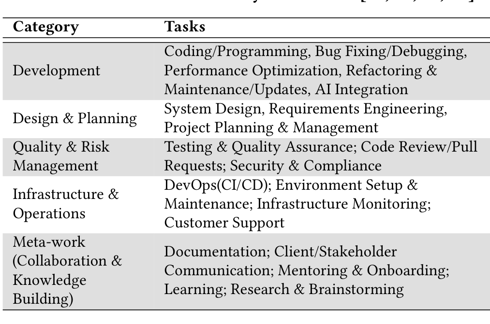
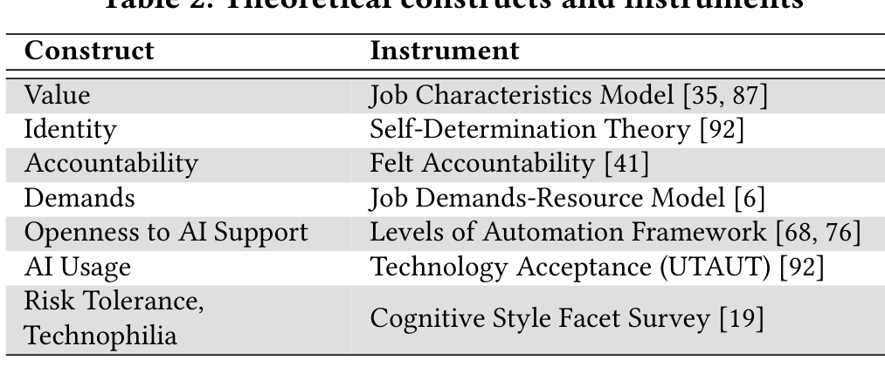

Validating the clarity of category boundaries.

Responsible AI (RAI) principles: To assess developers’ RAI priorities in AI-enabled SE tools (RQ2), we anchored our study in Microsoft’s Responsible AI framework [23]. This framework synthesizes established AI ethics and governance guidelines [21, 27, 31, 37], and includes: Reliability & Safety, Privacy & Security, AI Accountability (provenance), Fairness, Inclusiveness, and Transparency. We extended this set with Steerability (user agency/autonomy) and Goal maintenance (sustained alignment with user goals) principles, both centrally emphasized in recent RAI research [19, 44, 60, 83]. This combined set provided a comprehensive basis for answering RQ2.

Survey design: We followed Kitchenham’s guidelines for conducting surveys [48] and drew on established theoretical frameworks and validated instruments from behavioral sciences and Human–AI Interaction (HAI) research (Table 2). The survey was refined through iterative validation with external researchers, and multiple one-on-one sandbox testing and pilot rounds.

Our final survey comprised three sections:

1. AI experience and dispositions: After obtaining informed consent, we asked participants about their experience with AI tools and their dispositions toward its use in work. We prefaced this section with a standard description of developer-facing AI tools, adapted from the DORA 2025 survey [84]. Participants with no prior AI-tool experience exited the survey at this point.

Table 1: Grounded taxonomy of SE tasks [19, 47, 50, 63]

2. Background & Demographics: Participants reported SE experience and, optionally, gender and country of residence. They then selected 2–3 task categories (in Table 1) that best reflected their current work and answered the subsequent questions for those categories. To reduce fatigue, the meta-work category (applicable to all developers) was excluded from the initial selection and shown only if a participant had selected two categories; thus, no participant completed more than three category blocks.

3. Task Category blocks: Each task category was a separate block. For each selected category (e.g., Development, Design & Planning, Quality & Risk Management; see Table 1), participants answered:

(a) RQ1: Task appraisals and AI use. For each task in a category (e.g., Testing/QA, Security, and Code Review under Quality & Risk Management), participants rated task value, identity, accountability, and demands measured with validated instruments (Table 2). We used single-item measures to reduce participant fatigue, given these items retain psychometric validity for concrete, well-scoped constructs [61]. Participants then reported their openness to AI support and frequency of AI use for each task (dependent variables for RQ1). Finally, we asked two open-ended questions: (a) where they most wanted AI

support, and (b) where they preferred to limit it; within the task category (e.g., in Quality & Risk Management), and why.

Table 2: Theoretical constructs and instruments

### (b) RQ2 — RAI priorities

Participants selected any five RAI principles (from the eight listed earlier) they deemed most important for AI-enabled tooling in that category (with the five-choice format drawn from prior work [44]). This top-N design forces trade-offs and mitigates ceiling effects (“all-high” bias common in Likert importance ratings) [4, 9]. After selecting, participants could optionally describe experiences that made their choices salient for that category. We tested alternative elicitation formats (ranking, point allocation, MaxDiff, importance categorization) [9] and chose this approach based on sandbox feedback.

Because RAI principles can be abstract and participants may not easily connect them to specific AI contexts [18], we provided on-demand, plain-language explanations (adapted from [44]), via information icons next to each principle. Each explanation followed a consistent format: (a) what a system embodying the principle would do, and (b) an example realizing its application, while retaining a degree of generality (see [44]).

The survey concluded with an open-ended question inviting general comments on AI use at work, and an optional field to share an alias for follow-up contact. In the pilot, participants could also suggest tasks missing from the taxonomy (for the categories they answered) and/or provide general survey feedback.

We administered the survey in Qualtrics [71]. All closed-ended questions used a 5-point Likert scale, and a sixth option (“I’m not sure” or “I don’t do this task/N.A.”) to distinguish ignorance from indifference [38]. The survey took 10–15 minutes to complete. To ensure data quality and reduce response bias, we included attention checks, randomized questions and option orders within each block, and randomized the order of task-category blocks. The complete survey instrument is provided in supplemental material [1].

Sandbox and pilot: We sandboxed the survey one-on-one with developers and SE/HCI researchers (n = 11) to assess its clarity, interpretability, and realism. Based on their feedback, we revised ambiguous questions, added safeguards against automated submissions, and contextualized questions to reflect participants’ current work (e.g., a once-valuable task may no longer be relevant in current work). Initially, all participants saw the meta-work block (Table 1), but pilots showed that limiting each respondent to at most three category blocks improved data quality and reduced fatigue, so we updated the design. Additionally, we tested multiple elicitation formats for RAI prioritization [9]. Respondents were comfortable selecting top-N principles and explaining tradeoffs, over ranking ethical values. We adopted this format consistent with prior work in this field [44].

To finalize the survey, we piloted it with (n = 50) developers. This validated the survey’s clarity and task set coverage. Minor wording edits were made, and pilot responses were excluded from the analysis.