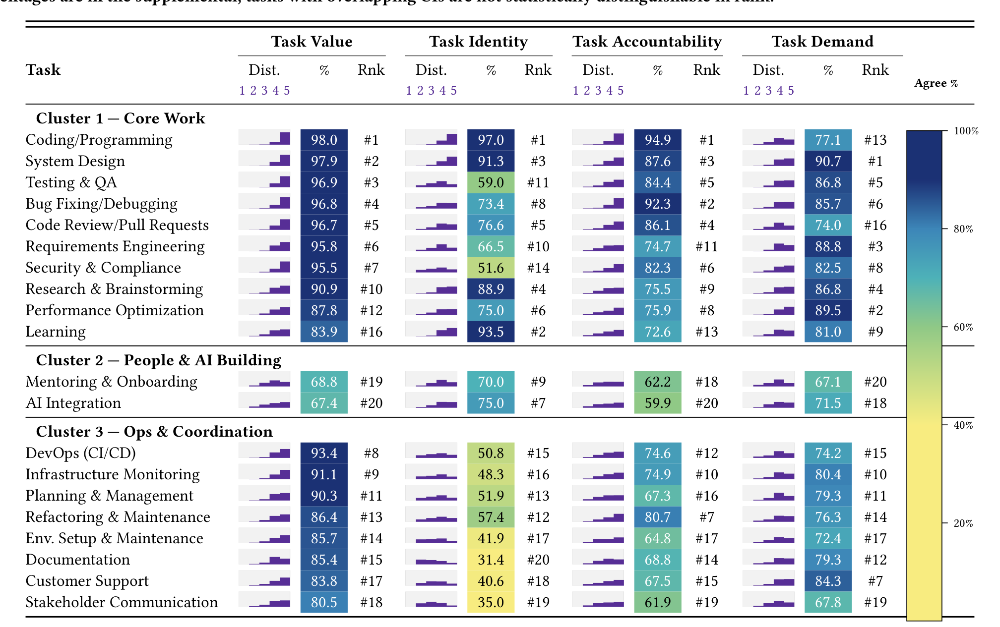

Table 4: Task appraisal profiles across four drivers: Value, Identity, Accountability, and Demand. Tasks are grouped into three clusters derived from driver-response patterns: Core Work, People & AI Building, and Ops & Coordination. Within each cluster, tasks are sorted by Value agreement (% Agree/Strongly Agree). For each driver, we show (i) the full 5-point Likert distribution, (ii) the % Agree/Strongly Agree with a common color gradient for comparison, and (iii) the task’s rank on that driver. The legend spans 0% (yellow) to 100% (dark blue). Confidence intervals for percentages are in the supplemental; tasks with overlapping CIs are not statistically distinguishable in rank.

For learning/research, participants wanted AI as a personalized guide, a tool for information retrieval/synthesis, and a scaffold for ideation and practice. They stressed adaptive help aligned with skills and goals: "it should build my concepts from the ground up... based on my learning styles" (P281); "walk me through tutorials, provide examples, point me to resources" (P169). They wanted AI to surface relevant material across sources: "Researching could be where AI plays a big role... it can easily pick out relevant information from large amounts of data" (P28). At the same time, they cautioned against shortcutting experiential learning: avoiding cases where "AI does all the work and [they] miss a chance to learn by doing" (P66).

### Limit AI:
Participants resisted fully automating core work. They welcomed assistance but insisted on retaining oversight and decision control: "I can't fully delegate the final code review to AI—my approval puts my name on it" (P117). Others echoed, "deciding whether to ship something with limitations or communicate a risk to leadership requires context, experience, and intuition that AI can't fully grasp" (P301). They emphasized that AI should not absolve them of accountability, "I wouldn't want AI to handle final decision-making in high-stakes scenarios; responsibility should remain with experienced professionals" (P9), or reduce their role to passive overseers: "Should not turn the worker into a George Jetson" (P45).

They also resisted AI to preserve professional identity and craft: "I do not want AI to handle writing code for me. That's the part I enjoy and is the core of my work" (P110), and warned that overreliance risks deskilling: "intellectual offloading can result in errors that eventually no one understands" (P409). P16 captured the ethos: "AI should enhance human engineers' learning and development, not replace tasks that allow them to become better engineers" (P16).

Trust and quality concerns reinforced these limits. Respondents cited hallucinations, lack of transparency, and weak contextual reasoning as reasons to keep AI in a supporting role: "AI should not be the determining factor in how to solve quality problems... it frequently hallucinates with absolute certainty" (P17). They were wary of AI handling sensitive data: "I don't want AI to directly handle sensitive information, as I don't trust that information it sees stays truly secure" (P397). They also flagged maintainability risks and AI-induced technical debt: "AI-generated code is often not very readable or maintainable, which reduces long-term sustainability" (P149).

System design & requirements fell in De-prioritize. Participants reported low need/use due to both AI's capability gaps and its contextual misfit with the situational nature of these tasks: "These decisions require deep domain knowledge and long-term vision that only experienced engineers can provide" (P241). They also warned of homogenized, generic outputs as a risk to innovation: "AI's system design solutions bias toward old known solutions rather than a modern solution that solves the problem better" (P188). Here, respondents preferred human judgment and collaboration.

> Takeaway: Developers seek AI as a collaborator on core work to boost efficiency and reduce cognitive load; redirecting focus on higher-order work (H1, H4), while retaining oversight and decision control in high-stakes, identity-laden aspects (H2, H3).