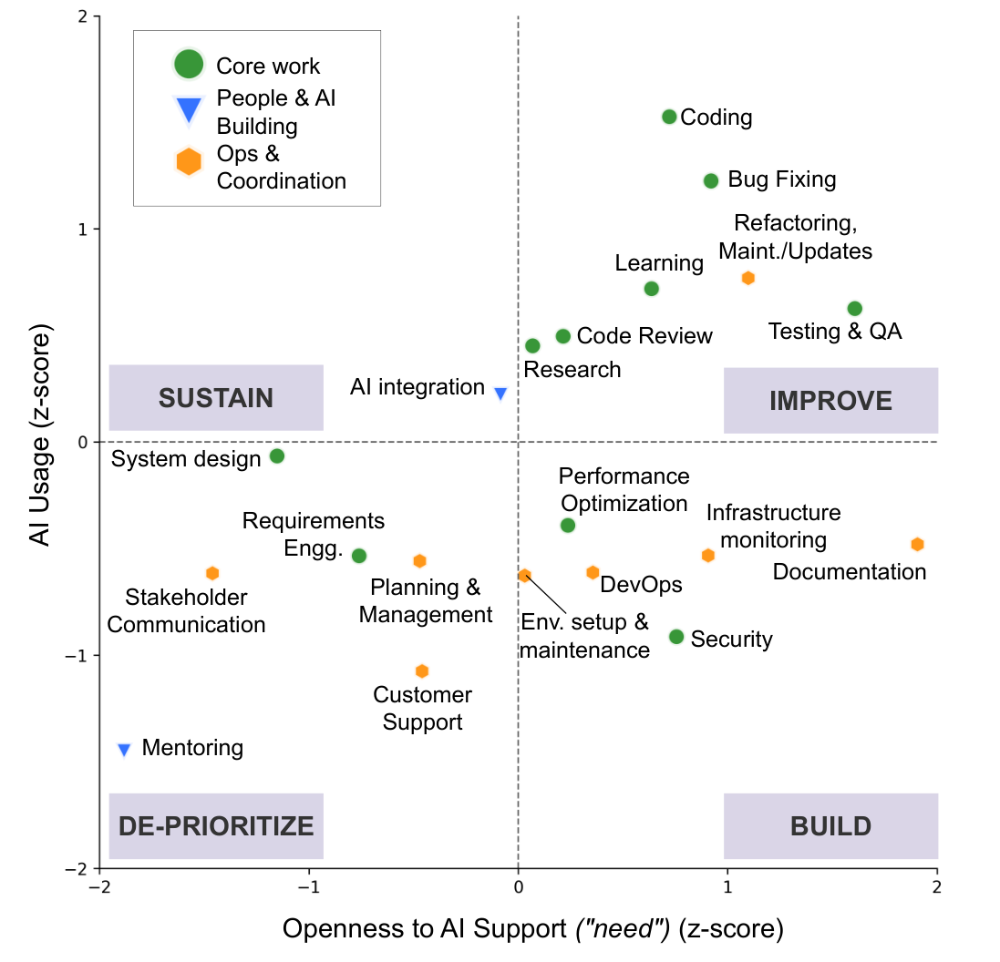

Figure 1: Scatter z-score plot showing relative AI-support needed (z) versus Usage (z) scores for SE tasks. Tasks are grouped into four quadrants representing strategic zones: Build, Improve, Sustain, and De-prioritize.

### 5.2.2 People & AI-Building (C2)

People & AI-Building (C2) covered AI integration (developing/embedding AI features into products) and mentoring. Appraisal-wise, C2 tasks showed strong identity alignment but moderate value, demands, and accountability, placing them in the Sustain/De-prioritize zones (low AI need). Participants preferred to do these themselves, citing intrinsic motivations.

Limit AI: For AI integration, participants largely resisted AI to preserve professional identity and craft: “I don't want AI to handle AI development, as it brings satisfaction to my work and requires craftsmanship” (P285), and favored deterministic workflows over stochastic outputs, citing distrust: “My team is focused on integrating AI into products. I don't feel AI is up to any help for this... using it instead of a predictable workflow will not work out in the end” (P66).

Mentoring drew stronger resistance given its relational nature: “I don't want it to help mentor people. Relationships are important” (P85). Participants cast mentoring as fundamentally interpersonal—building trust, connections, and team culture: “new members need to interact with their team to build relationships. AI can't satisfactorily replace that for many, many years” (P122). They noted that AI might help with “rote onboarding steps” (P70), but AI misguidance can harm mentees: “The cost of it getting it wrong is terrible—and it will get it wrong” (P357). Mentoring is also a growth opportunity for mentors, fostering empathy and learning: “Mentoring teaches the mentor as well... humans need to do it to grow themselves” (P228), reinforcing the need to be kept human-led.

**Takeaway:** For identity-laden and interpersonal work, developers resist AI and retain ownership due to craft, relationships, and personal growth (H2). AI is, at best, peripheral.

### 5.2.3 Ops & Coordination (C3)

Ops & Coordination (C3) covered (a) ops/maintenance toil (“run-the-systems”): DevOps/(CI/CD), environment setup, code maintenance (refactoring/updates), infrastructure monitoring/alerts, documentation; and (b) coordination/support (“relational work”) overhead: project planning/management, stakeholder communications, customer support. Appraisals were moderate–high on value, demands, and accountability but low on identity. Reported need for AI was moderate, yet adoption lagged due to AI limitations, context fit, and trust concerns. In Fig. 1, “run-the-systems” tasks concentrate in Build, while “relational-work” sits in De-prioritize zone.

Seek AI: Participants wanted AI to reduce grunt C3 work (toil), provided it was reliable, deterministic, and context-aware.

For “run-the-systems”, they sought an assistant for well-scoped, effort-heavy tasks (e.g., setup, maintenance, monitoring) that were low in creative value. Current tools were seen as limited: setups remain manual, pipelines fragile, alerts noisy, and documentation stale. Participants desired AI to provision environments and configurations, automate upgrades and migrations, maintain system health, and update documentation from code or design changes. CI/CD was a recurring pain point, with calls for AI to generate and repair pipelines, enforce quality checks, and run unattended deployments. As P261 put it: “AI should help in maintenance of services, making sure that the lights are kept on when the developers move on to new features. Keep systems healthy; where safe, triage and remediate known issues” (P261).

They also emphasized cross-context awareness—linking telemetry and artifacts to infer, triage, and predict failures: “constantly analyze logs, metrics, and system behavior to identify deviations, triage root causes, and predict potential failures before they impact operations or users” (PID309). For large-scale refactoring (situated in the Improve zone), participants wanted architecture-aware changes applied safely across the codebase.

For “relational work”, AI was welcome backstage for handling logistics: drafting updates, summarizing meetings, pulling context across threads, scheduling follow-ups—and for PM support (context-aware plans, dependency tracking, lower coordination overhead), while keeping strategy human-led. “AI should prioritize task by impact/dependencies... free time for creative/strategic thinking... plans must stay adaptive and human-gated” (P403). Net: AI was framed as a peripheral tool and remained largely de-prioritized for relational work, for reasons detailed next:

(Limit AI) Participants de-prioritized AI for “relational work”, arguing that contextual intuition, empathy, and long-term vision aren’t automatable. Strategic calls and ambiguous trade-offs should remain human: “I don't want AI to handle ‘interpretation,’ drive product vision, or make strategic trade-off decisions” (PID3). For stakeholder communications, they emphasized authenticity and relationship-building: “I don't want AI to handle stakeholder comms... these require empathy, trust-building, and nuanced understanding of human dynamics” (PID172); “Client communication needs personal touch. Summarizing meetings is one thing, but replacing real touchpoints is too much” (PID217). Customer support drew similar pushback: “As a customer, being forced to an AI is frustrating” (P41), with accuracy lapses seen as risking support quality and brand damage. These, alongside AI's capability gaps (hallucinations, weak grounding, high prompt overhead), kept it backstage (summarizing, retrieving, scheduling) while “humans hit send” (P47).

By contrast, “run-the-systems” tasks met less resistance in principle, but faced trust, quality, and transparency concerns with (and/or absence of) current tools, that kept them in Build zone. Help was welcome only with determinism, verifiability, and human-gated change control: “Anything that touches prod stays behind human gates—no auto-deploys, no direct live changes, no publishing without”