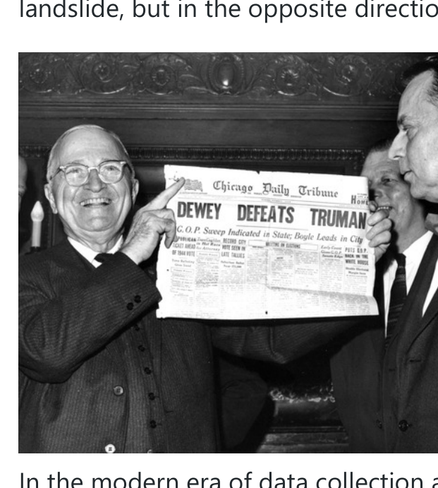

## Don't embarrass yourself: Beware of bias in your data

### Dewey Defeats Truman

The 1948 U.S. presidential election proved to be one of the greatest blunders in applied statistics history.

As is often the case, many polls were conducted in the run up to the election. Gallup, still one of the most trusted polling organizations today, predicted that Republican Thomas Dewey would handily defeat Democrat Harry Truman. In fact, the press was so convinced by the "empirical evidence" that the Chicago Daily Tribune had already printed the first edition of the paper with the headline "Dewey Defeats Truman" before final election results were in. Unfortunately for them, the election results the next morning were anything but expected, as Truman had won the electoral vote with 303 votes to Dewey's 189. A landslide, but in the opposite direction.

In the modern era of data collection and statistics, how could such a thing have happened? The answer lies not in the analysis of the data, but in the hidden biases it contained. Consider just one of many errors in the polling methodology. Like today, polling was conducted by selecting people randomly and contacting people via telephone. However, in 1948 telephones were mostly owned by individuals who were more financially well-off. At that time those with higher income levels tended to lean Republican. While the polling was indeed random, the population sampled (people that had telephones) was biased with respect to the entire voting population. Thus any results drawn from the polling data were similarly biased. The problem has not completely been solved even today as certain demographics may be more likely to answer the phone or less likely to vote.

This is an interesting cautionary tale, but surely such a mistake couldn't happen in the 21st century on data drawn from software engineering...

### Impact of Bias in Software engineering

A biased sample is a sample that is collected in such a way that some members of the intended population are less likely to be included than others. In layman's terms, a sample of data has bias if some characteristic in the population being sampled is significantly over- or under-represented. Bias is usually a result of how the data is created, collected, manipulated, analyzed, or presented. As a trivial example, if you were measuring the height of students at a university and used the basketball team as your sample, the data would be biased and inaccurate because short students are much less likely to make the team. Any analysis and results arising from this data would also be biased and most likely invalid. If bias is not recognized and accounted for, results can be erroneously attributed to the phenomenon under study rather than to the method of sampling.

Unfortunately, bias exists in software engineering data as well. If left unchecked and undetected, such bias in data can lead to misleading conclusions and incorrect predictions.

A few years ago (Bird, 2009), we examined defect data sets to determine if there was bias in the "links" between a defect in the defect database and the corresponding defect-correcting change in the source code repository. Knowing which code changes fix which defects can be quite valuable because this can provide much more context about a code change and also allows us to determine which prior code changes actually introduced a bug. It also allows us to see who is introducing the defects, who is correcting the defects, and what types of defects are corrected in different parts of the code base. Research