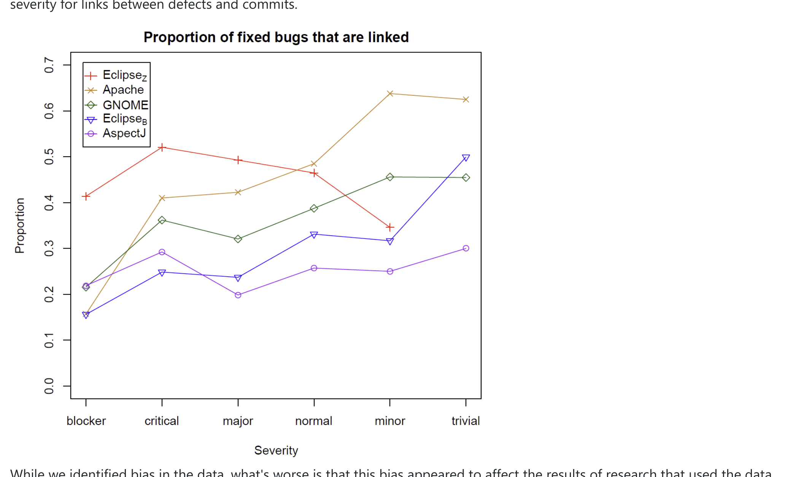

has shown that this information can be used to learn characteristics of code changes that lead to defects (CITE) or to teach machine learning methods to accurately predict where in the source code a defect is based only on the bug report (CITE). Because of the value of these "links", a long line of research exists on techniques to infer these links. See Sliwerski et al. for one of the most well-known examples (Sliwerski, 2005). In our study of these links in five software projects, we found that there was bias in the severity level of defects that could be linked to commits in four of the projects. That is, the lower the severity level for a fixed bug, the higher the likelihood that there was a link between the defect and the commit.

As an extreme example, out of all defects labeled "minor" in the Apache Webserver that were indicated in the defect database to have been fixed, we were able to identify the corresponding fixing commit for 65% of them. In contrast, for those bugs in the category of "blocker" that were fixed, we were only able to find the fixing commit 15% of the time.

The following graph shows the proportions for all projects. Note that AspectJ appears to suffer far less from bias in bug severity for links between defects and commits.

While we identified bias in the data, what's worse is that this bias appeared to affect the results of research that used the data. We used the linked defects and fixing commits to train a defect prediction model (a statistical model that would predict what parts of the code were most likely to contain defects). When we evaluated our prediction model, it was much better at predicting those defects that had lower severity than those that had higher severity. In practice, one would likely prefer a machine learning method that points to likely defective areas in the code to either be agnostic of the severity of the defects or favor indicating locations with higher severity defects. We were getting the opposite due to bias in the data. Inadvertently using biased data can impact the quality of tools or models and the validity of empirical findings.

## Identifying bias

The first step in avoiding the use of biased data is in determining if bias exists in the first place. This can be done via visualization or statistics, but often requires some a priori knowledge or expectations about the data as well. To do this, you first decide what feature you are interested in examining. A feature is any individual measurable property of the data or phenomenon being observed. Concretely, features of defects in a defect tracking system can include (but are certainly not limited to) the severity, how long it took for a defect to be fixed, who fixed the defect, and the textual summary of the defect. Features of a source code commit could include the number of lines in a change, the person that made the change, the type of file or files being changed, and whether a comment was added to the code.

In the best case scenario, you may have information about the distribution of an important feature in the population. In the study of defects, we had the severity levels for all fixed defects in a project. This forms our population distribution. We then compared that to the severity levels for fixed defects that we could find the corresponding commits for, our sample distribution. Generating histograms for the population and sample severity distributions is relatively easy to do in R or Excel.