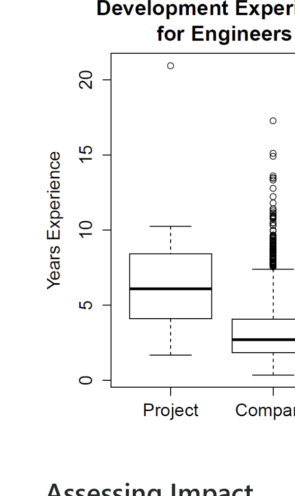

## Assessing Impact

Just because bias exists in a data set does not mean that the bias will have an impact on the results of using the data. In our study above, we found that when defects used to train a model were biased with respect to severity, the predictions from the model were also biased in a similar way. However, consider a defect model trained on defects that were fixed mostly (though not completely) on even days of the month (e.g., January 2nd, October 24th, etc.). While the data is biased with regard to the parity of the fix day, it is unlikely that such a model would do much better when evaluated on defects fixed on even days than on defects fixed on odd days.

How could we assess the impact of the bias?

If we had access to all defects for all days, that would help. We could train one model on the biased sample and another on the larger, less biased sample and look at the difference to assess the impact of the bias. However, usually if we have a biased sample, we don't have access to a larger, less biased sample. In the absence of this less biased sample, one approach is to select subsets of your sample such that they are biased in different ways. In the above example we could remove all of the odd days so that the model is only trained on defects fixed on even days. Does the performance of this second model differ from the original model? What about training the model only on days that are multiples of four or ten? These are "super-biased" data sets. We could go the other way and create a subset from our sample that has the same number of defects fixed on odd and even days. Does a model trained on this data set perform differently? If we see (as I suspect we would) that the amount of "day parity" bias does not affect model results, then we may not need to worry about the bias. If in your investigations you find that there is a feature (such as age of a developer, size of a commit, or date of a defect report) that is biased and that does affect the results of a study, accuracy of a model, or utility of a technique, you are not completely out of luck. This just means that the bias needs to be reported so that others consuming your research have all salient facts they need.

## Which Features Should I Look At?

Having said all of this, an additional key question to ask is what features to examine for bias. Data collected from software repositories have nearly endless dimensions (features). A developer working on a project has an associated age, gender, experience level, education, location, employment history, marital status, etc. A code review has an author, a date, the contents of the changed code, the phase of the development cycle it occurs in, the files that are modified, and the number of lines changed. These are just a few of the features that exist for just a few of the artifacts that may be examined as part of a research endeavor. Exhaustively investigating bias for all possible features will take an inordinate amount of time and most of that time will be wasted.

A better approach is to start by reading related research and brainstorming those features that you hypothesize may be related to the outcome of interest. That is, if you are conducting a study related to collaboration of developers, identify those features whose bias you believe is most likely to impact results and validity. Next, identify those features that you can actually