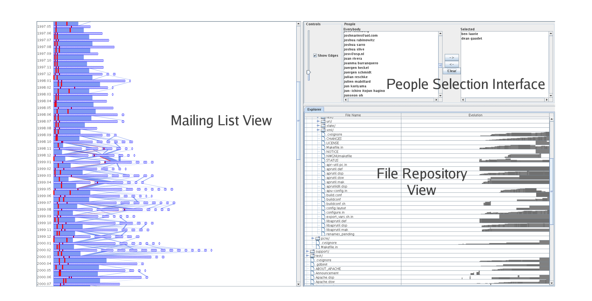

Figure 1: A view of the overall interface.

Of a project's source code, author network, and other development statistics. In their system, the developer network is represented as a standard node-link diagram. Its evolution can be visualized by use of a time slider. This puts it into the “Small Multiples & Animation” category discussed below. In contrast, our system is able to display all timesteps in the network history at once.

### 2.1 Work with Evolving Networks

One of the challenges in our work is to visualize the evolution of the email network. Previous visualization methods relating to evolving networks can be grouped into two categories: 1) Small Multiples & Animation, and 2) Layers.

The Small Multiples technique [16] shows changes in the network by displaying snapshots of the graph at various points in time. Graph snapshots are laid out side-by-side in series, much like frames in a movie, so that viewers can see the differences between snapshots as they move across the page. Naturally, these snapshots may be viewed one after the other in the same space to produce an animation of the changing network.

Chen and Morris use spanning trees with small multiples and animation [5]. Branigan and Cheswick visualize changes in the Yugoslavian communications network during a period of war [4]. Frishman and Tal color and draw bounding boxes around graph clusters to help preserve the mental map between timesteps [11]. Chi et al. arrange disk-tree representations along a timeline. Changes to the trees are highlighted with color while the structure stays the same [6].

The problem with small multiples is that, depending on the temporal resolution of the dataset, there may be large differences between the visual representations of two timesteps. For example, in a dataset with yearly time slices, there may be a major change in the topology which causes the graph layouts before and after the change to appear quite different from each other. A person seeing this jump would lose context and may assume that everything about the network changed. This is apparent in [4]’s animation, where large chunks of the network disappear and reappear spastically. On the other hand, if the graph is moderately large, the differences between timesteps may be imperceptible. A visually displayed large graph is a complex object to behold, and, consequently, small visual changes between two large graphs are difficult to detect.

The second technique, which we call Layers, stacks planes of graph representations at incremental timesteps. The stack is viewed from the top and blended, so that newer planes are in focus and older planes fade into the background. Brandes and Corman use a layering scheme to visualize the dynamic discourse between speakers [3]. Nakazono et al. create a difference layer by comparing two timesteps [14]. The difference layer is then colored and added to the original layer.

The Layers approach has the drawback of only being able to effectively visualize a handful of timesteps simultaneously. As the blended planes pile up, the visibility of each plane is obscured or cluttered and thus the coherence of the visualization is diminished.

Our approach does not fit squarely within either the Small Multiples & Animation or Layers category. As such, we believe it to be a novel representation of evolving networks. It is most akin to Chi et al.'s TimeTube visualization [6], in that we present discrete representations of the network in series along a spatial axis. However, our technique for displaying the information emphasizes the changes that occur between timesteps rather than the individual graphs within the timesteps. It may be thought of as a variation on small multiples, where the graph representations are abstracted and there is linking information displayed between timesteps.

## 3 EXPLANATION OF THE INPUT DATA

The dataset for each software project consists of two parts: the repository and the mailing list.

### 3.1 Repository

Data pertaining to files and authors was gathered from the public CVS repositories of their respective projects. The data contains the entire collection of files and directory structure of the repository. Each file comes with a history of edits made by developers (i.e.