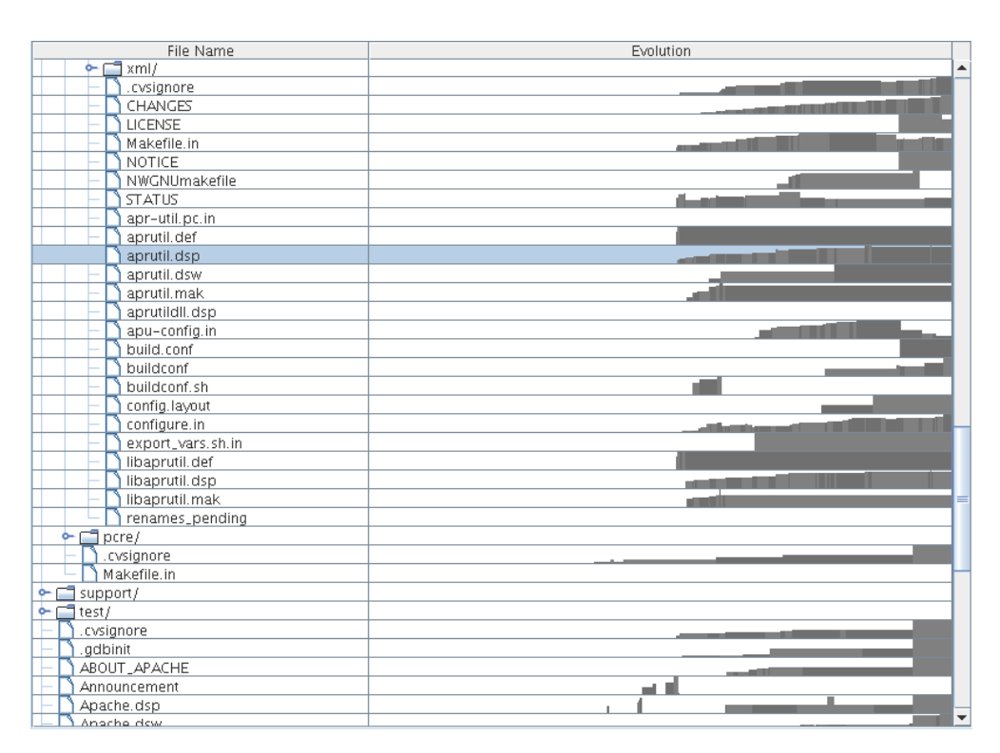
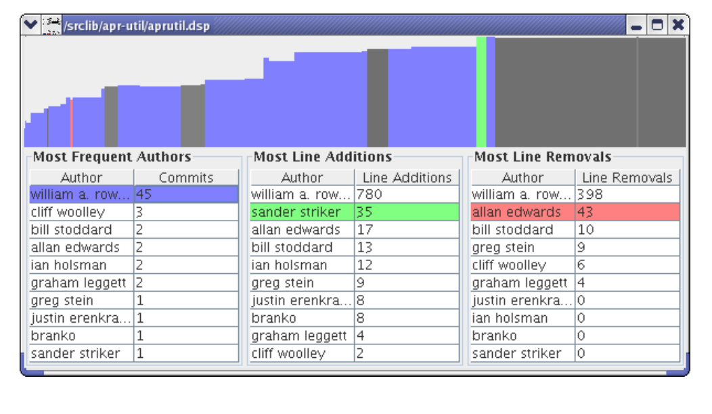

who edited what and at when). Each edit also contains information on the number of lines added and removed.

### 3.2 Mailing List

As described in [2], mailing list data was gathered from the public archives of their respective projects. The format of this data is a list of emails. Emails which contain a reply-to header are considered as relationships between senders and receivers. Emails are grouped by the month in which they were sent. Thus, within each month, the relationships between senders and receivers form a network. An evolving network is formed over the timespan of the email list, with each monthly network being a timestep.

## 4 Visualizing the File Repository

A standard Windows Explorer-type tree visualization is used to represent the file repository (Figure 2). Users are free to expand and collapse the file hierarchy at will to view the directories they are interested in. To the right of each file is a sparkline [17] showing the edit history for that file: its evolution. Time flows to the right, along the x-axis. Bars are drawn representing the relative size of the file at each point in time. Thus, an upwards-growing bar depicts a growing file. Each author’s revision of the file is represented in one bar and the bars are alternately colored to distinguish successive revisions. Hovering over a bar creates a small popup with the revision’s author and date. The time scales for each sparkline are correct with respect to each other so that the user can compare file evolutions.

Figure 2: A view of the file repository. The repository directory hierarchy structure appears on the left and the file evolution sparklines appear on the right. The highlighted file shows typical growth.

If the user wants to see more details about a particular file, double-clicking will bring up a window with more information (Figure 3). This window contains the sparkline as above, but larger, and tables of author statistics for the file. These tables are titled “Most Frequent Authors,” “Most Line Additions,” and “Most Line Removals.” They are sorted so that the user can easily see who, for example, contributed the most lines. The user may click on an author in the table and see the author’s contributions highlighted in the sparkline.

## 5 Visualizing the Mailing List

### 5.1 Clustering

In our implementation we use the MCL algorithm to cluster each mailing list network timestep [18]. MCL works by starting with the entire edge set, then it iteratively removes edges based on their

Figure 3: A file details dialog. The contributions from William A. Rowe, Sander Striker, and Allan Edwards have been highlighted.

weight and topology. For email networks, the edge weights are equal to the number of messages exchanged between two people. When all that is left is a collection of trees, the algorithm stops and considers each tree as a cluster.

### 5.2 Sankey Diagram

Representing an evolving network is challenging due to the additional dimension of time. As discussed in Section 2, the techniques of Layers and Small Multiples & Animation are not ideal for representing the changes occurring between timesteps. To address this issue, we have adapted the well-known Sankey diagram for our purposes.

Sankey diagrams are mainly used to show energy or matter flow through a physical system. Their representation is a continuous one, with the flow being split and combined in arbitrary amounts. We use the diagram to show the flow of people between clusters; therefore it becomes a discrete Sankey diagram.

In our implementation, time flows downwards in monthly stages. At each stage, the people participating in the mailing list conversation are depicted as ovals lined up horizontally, grouped together by their cluster. Each cluster is drawn in order from largest to smallest. This sorting allows the viewer to follow the larger core groups along a straight downwards path. The smaller clusters which represent “side conversations” are then located, appropriately, to the side.

As in a regular Sankey diagram, edges are drawn between two stages if there are people continuing to participate in the mailing list. They connect two clusters in two different time stages, representing the flow of people between the two stages. Each edge has a certain width, proportional to the number of people staying within the two clusters. By observing the edges, the user can achieve insight into the dynamics of the mailing list. For example, a large cluster may fragment into many smaller edges connecting to smaller clusters, indicating a fragmenting of conversation. Consistently thick edges across many stages indicates a strong conversational coherence within the group.

We solved the problem of edge occlusion by simply drawing translucent edges and eliminating exiting edges. Translucent edges allow the user to see the paths of all edges in a crossing. Furthermore, eliminating the exiting edges reduces the number of edge crossings. We are able to do this because we do not care where the exiting flow goes. In this particular application, it is common to have many people leave the mailing list conversation, so drawing the exiting flow will not provide much more meaning. However, the user can still infer the amount of exiting people by visually subtracting the number of people continuing onto the next stage from the number of people in the current stage.