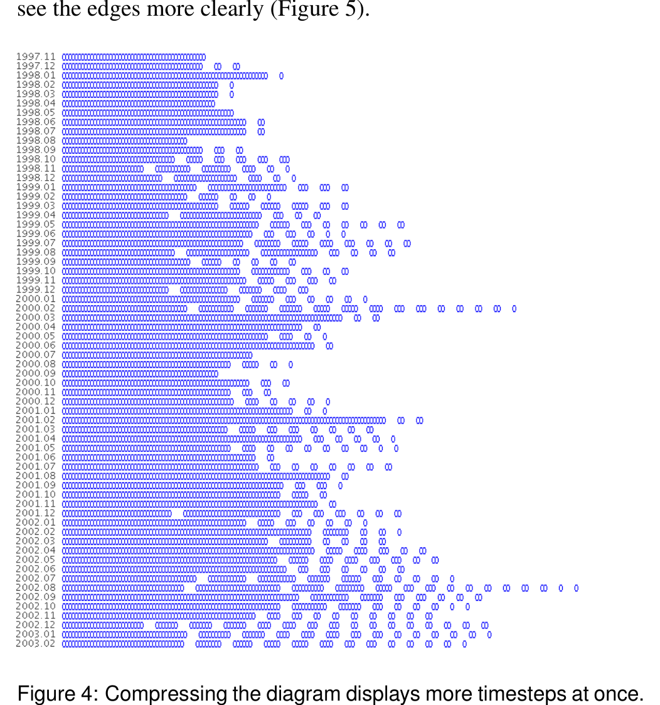
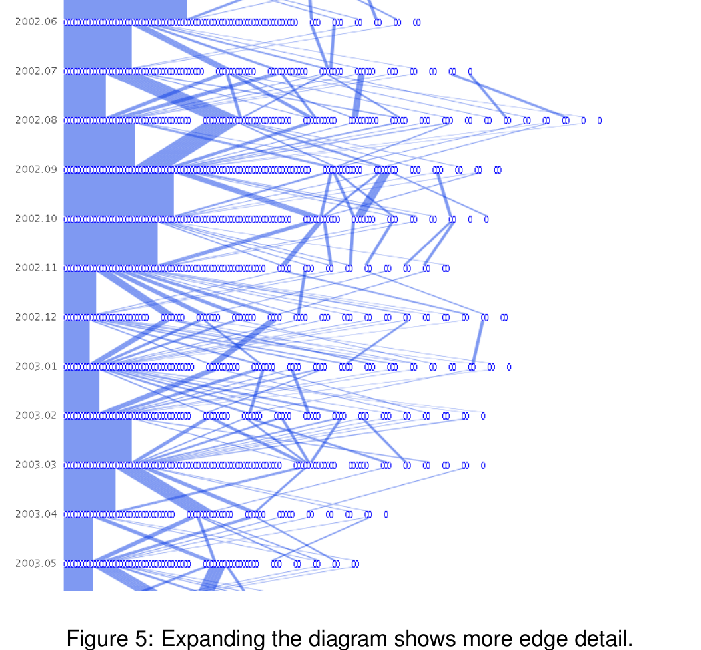

### 5.3 Interaction

We allow users to interact with the Sankey diagram in a number of ways. When the diagram is first presented, the space between timesteps (where the edges exist) is set to a moderate length. Since the length of the entire diagram is proportional to the space between timesteps, it is not possible to view the entire diagram without scrolling. Perhaps the user wants to see an overview of the entire dataset. We provide a slider widget so the user can interactively control the amount of space between timesteps. Setting a small amount of space compresses the diagram and allows the user to see more timesteps at once (Figure 4). The edges may be hidden via a checkbox for a simplified view. Perhaps the user wants to see more detail of what happens between a few timesteps. Then setting a large amount of space expands the diagram and allows the user to see the edges more clearly (Figure 5).

Figure 4: Compressing the diagram displays more timesteps at once. Hiding edges provides a cleaner visualization.

The user will likely want to see which people comprise the nodes and edges. Casual queries about who is participating in the discussion is accomplished by hovering the mouse over a particular node or edge. The corresponding person's name will then appear in a popup next to the cursor. Direct selection of the node and edge components are done through mouse clicks. If the user clicks on a person's node or edge with the left mouse button, the corresponding person is selected. Then, throughout the diagram, the node and edges containing that person are highlighted (Figure 6). If the user is looking to select a specific person by name, we provide a list interface to the side which contains the names of all people appearing in the network.

Multiple selections of people are allowed as well (shown in Figure 7). Using the right mouse button to click on nodes or edges adds each corresponding person to the selected collection (as opposed to replacing it). The user can easily manipulate the selected collection via the list interface. People can be moved back and forth between the unselected and selected groups. The selected list may also be cleared by pressing a button.

The user can choose to see the details of conversations between particular people in a particular month. Double-clicking on a developer or edge will pop up a window containing information on the mail sender, receiver, date, and subject (Figure 8). The subject is

Figure 5: Expanding the diagram shows more edge detail.

especially relevant because it allows the user to see the context of the mailing list clusters.

### 5.4 Combining Views

We combine the two views—the repository view and the mailing list view—in one user interface, shown in Figure 1. In addition to those views, we provide a list interface for selecting and deselecting developers. Linking between the repository view and the mailing list view is accomplished through the people. For example, double-clicking a file in the repository view selects the developers who have worked on that file and highlights them in the mailing list view.

## 6 CASE STUDY: THE APACHE PROJECT

To evaluate our visualization technique, we examined the email archive of the Apache Project [1]. Apache is a well-known open source web server application. The archives are publicly accessible via the web and contain all emails dating back to March, 1995. They were processed into a time-varying graph dataset for use with our system. The nodes of the graph are people who posted to the email list and the edges are replies between two posters. A message is considered a reply if the "reply-to" field is used. Edges are then weighted by the number of replies between two people. Inconsistencies in the dataset arise when individuals use different names or addresses to represent themselves. Bird et al. [2] used both fuzzy string matching and manual post-processing to alias the data. In all, there were 2008 unique people posting to the mailing list. The vast majority are casual posters asking questions and only a fraction are active developers. Our dataset contains over 68,000 email messages.

We begin our study by examining the overview of the network (Figure 9). Immediately we can see the growth of the core group during the early years (1995–1999). The core group remains close-knit during that period, as evidenced by the lack of other clusters besides the largest one. Then two-thirds of the way up, we can see satellite clusters becoming more prevalent. The core group continues to dominate the clusters until about one-third of the way up (2000–2002), where it begins to diminish in size. This continues all the way to the bottom, with the core group shrinking and the smaller clusters becoming more numerous (2003–2005).

We note an unusual period with increased clusters beginning in September, 1998 and ending in March, 2000 (Figure 10). It is un-