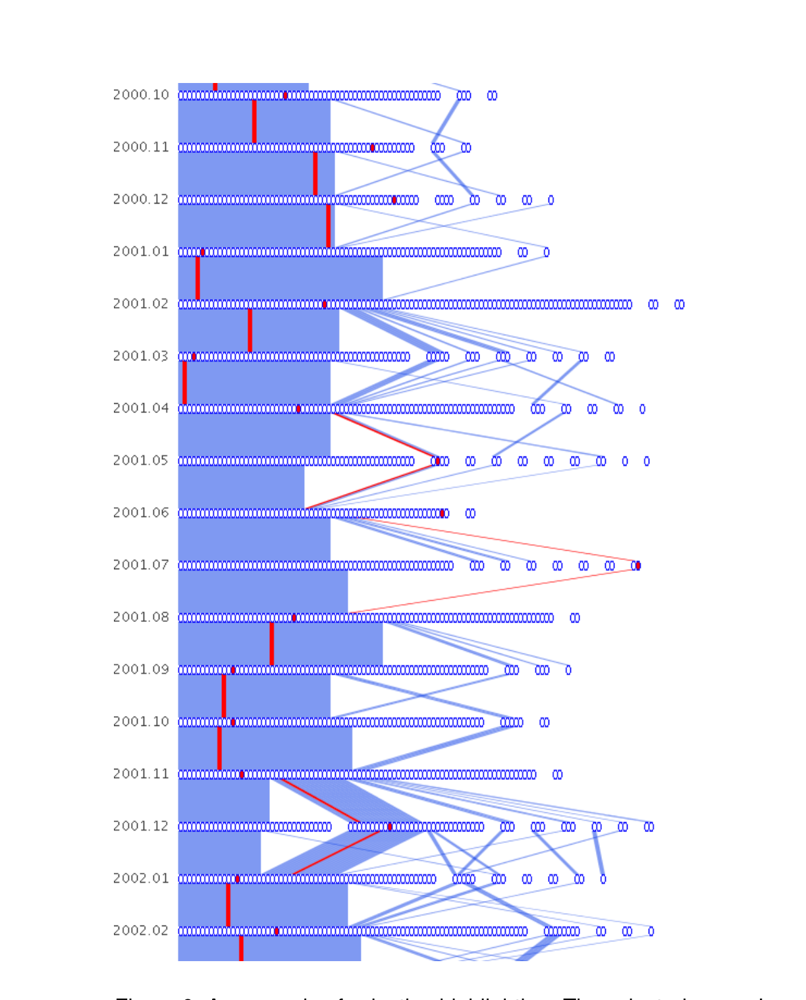
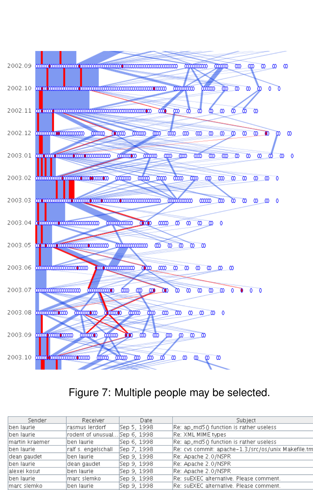
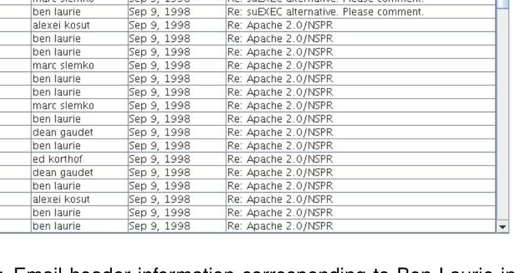

Figure 6: An example of selection highlighting. The selected person's nodes and edges are colored in red.

Figure 7: Multiple people may be selected.

Figure 8: Email header information corresponding to Ben Laurie in September, 1998.

usual because the months preceding and following this period are relatively "calm," with the core group changing very little. In contrast, this period contains many edge crossings and people breaking off from the core group to join satellite conversations. At the very end of the period, there is a sudden merging of many small clusters into the large core cluster. To figure out the cause of this activity, we examined the release history of Apache. It turns out that in 1998, plans were being finalized for the development of Apache 2.0. This version would be written from scratch and was highly anticipated. Using our interface to look at 1998 mail headers, we indeed find many messages related to Apache 2.0 (such as those in Figure 8). In March of 2000, the alpha version (Apache 2.0a1) was released. This coincides exactly with all of the smaller clusters merging into one large cluster. Again, looking at the mail headers for this month, we find much discussion about preparing for the alpha release. It is interesting that, before the alpha release, the participants formed small groups throughout the entire period. Perhaps this is due to the division of labor between developers; each group working on one component of the project. Or perhaps people outside the project were emailing questions and suggestions. We find these smaller clusters to be discussing specific subjects such as "patch to force name virtual hosts," "10x performance increase patch #9," "C compiler for NT," and "XML apache conf." These subjects indicate that the former hypothesis above is more likely: that there was a division of labor between developers. The alpha release then caused the participants to merge into one large cluster. It could be that, once everyone had a point of reference for discussion, the conversation became more organized. It is difficult to tell the nature of this large cluster, as the subject headers are many and varied among technical issues.

It appears that the division of labor seen previously has coalesced into a swarm-like group, with everyone having a hand in the different development sections. It is also interesting to note that, according to the online mailing list archives, there were 586 emails in February (the month before release) and in March there were 1504: a huge difference. Yet despite the large volume, the clusters converged, rather than split off.

We can easily visualize the involvement of notable figures within the Apache Project. For example, Rob McCool, while at NCSA, wrote the original HTTP daemon which Apache was based off of. Figure 11 shows that he contributed to the email list for one year from the beginning of the project, then moved on. Ken Coar (a.k.a. Rodent of Unusual Size) joined the Apache email list at the end of 1996. Figure 12 shows his activity starting from that time. He contributes to the list regularly until 2003, after which there exist some months he does not post at all.

Coar's activity is similar to other large contributors, such as Ben Laurie and William A. Rowe, Jr. Their email postings had been consistent and within the core group until about 2003, when the frequency of emails subsides and they are more often grouped with