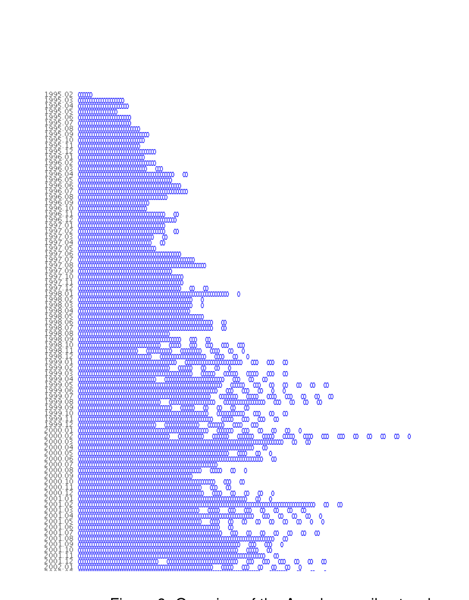
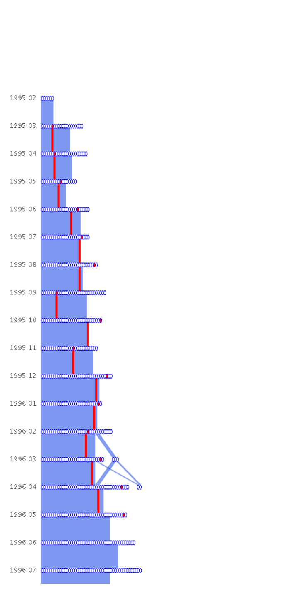
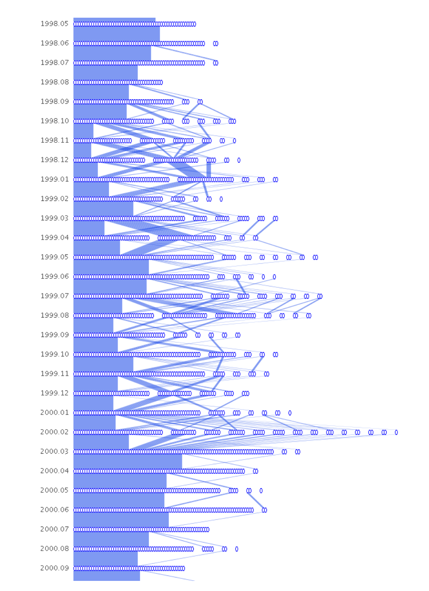
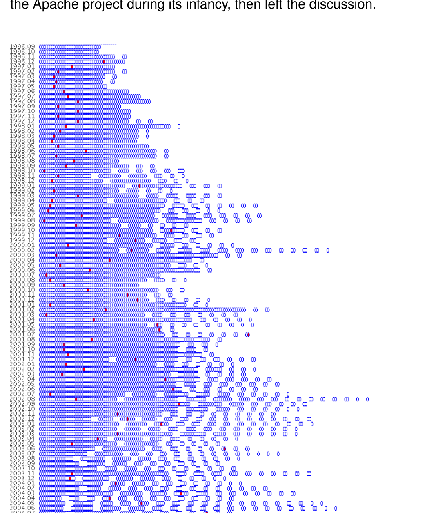

Figure 9: Overview of the Apache email network.

Figure 11: Rob McCool, author of the original HTTP daemon, helped the Apache project during its infancy, then left the discussion.

Figure 10: The period leading up to the alpha release of Apache 2.0 in March, 2000. The graph appears uniform at the top, then more small clusters form as each month passes. There is a dramatic fragmentation of clusters in February, 2000, before finally returning to uniformity.

Figure 12: Ken Coar (highlighted in red) joined the email list in December, 1996. He is still a regular code contributor, though his email list involvement has become more sporadic.