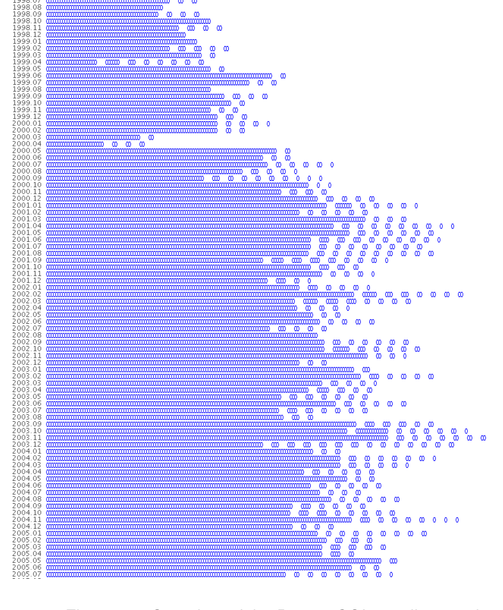
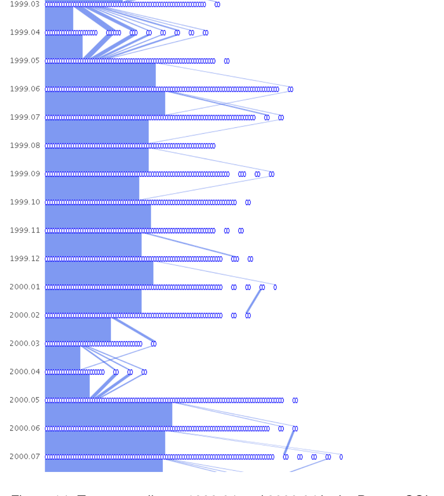

smaller clusters. This is perhaps because the Apache software has become stable enough such that code updates are not needed as frequently.

## 7 Case Study: PostgreSQL

In our second case study, we examine the email network of the PostgreSQL project. PostgreSQL is an open source database management system. Like Apache, their email list archive is publicly accessible. The email network we analyzed contains 3,295 unique people and runs from 1998 to 2006. The dataset contains over 86,000 email messages.

We started with the compressed overview shown in Figure 13. For the most part, the network remains consistent: a large core group with very few smaller clusters in each timestep. There are, however, two anomalies that occur at 1999-04 and 2000-04 (Figure 14). They are characterized by a sudden drop off in the core group population and an increased number of smaller clusters. We are yet unsure of the exact cause of the anomalies. One possible explanation is the fact that the dates coincide with the beta releases of versions 6.5 and 7.0. But the question remains: Why does this pattern not occur at other beta release periods?

It appears that the core group is quite large. On closer inspection, that is not the case. Using the selection tools we determined that most casual emailers (those who only post a few times) were grouped by the clustering algorithm into the largest cluster. What this indicates is that the casual poster’s message was replied to not by a single developer, but by multiple developers. The community aspect of the PostgreSQL project is therefore quite strong.

There is a noticeable difference in appearance between the Apache and PostgreSQL email networks. Whereas the Apache network contains many edge crossings and waxings and wanings of the core developer group, the PostgreSQL network remains relatively constant with few edge crossings and a steady core group. The reason may be summed up in a quote by Jolly Chen, an early PostgreSQL developer: “This project needs a few people with lots of time, not many people with a little time.” In other words, it takes a lot of effort to understand the backend code enough to make a useful contribution. We believe that this is why there is a core group of developers who stay together and why there are few side conversations.

## 8 Discussion and Future Work

Since we run a separate MCL clustering process on each timestep, clustering the graph is essentially a greedy algorithm. That is, it chooses the clusters based on information found only in one timestep. The question is, when taken together as a whole, is the resulting Sankey diagram an accurate representation of the dynamics between developers? To determine the accuracy, experts who have worked within the project or studied the history of the project should evaluate the clusterings. Are major splits, fragmentations and merges of social groups correctly depicted? It may be insightful to see the clusterings that other algorithms, besides MCL, produce.

For now, we use transparency to show how edges cross. It works well for the small datasets we use because there are only about two edges per crossing. We surmise that for larger datasets, there will be more clusters and thus more edge crossings. Thus a way to arrange the nodes within each timestep is needed to minimize the number of edge crossings, in addition to transparency. Riehmann et al.’s paper [15], which uses Mansfield’s technique [13] for drawing edges with circular corners and parallel lines, may be useful for more clearly drawing edges and their crossings. It will also remedy the problem of having narrow edges when their angles are steep.

Our system currently arranges cluster nodes by their size. That is, the largest cluster node in a timestep is on the left and the smallest is on the right. This is likely not the optimal arrangement for a

Figure 13: Overview of the PostgreSQL email network.

Figure 14: Two anomalies at 1999.04 and 2000.04 in the PostgreSQL email network.