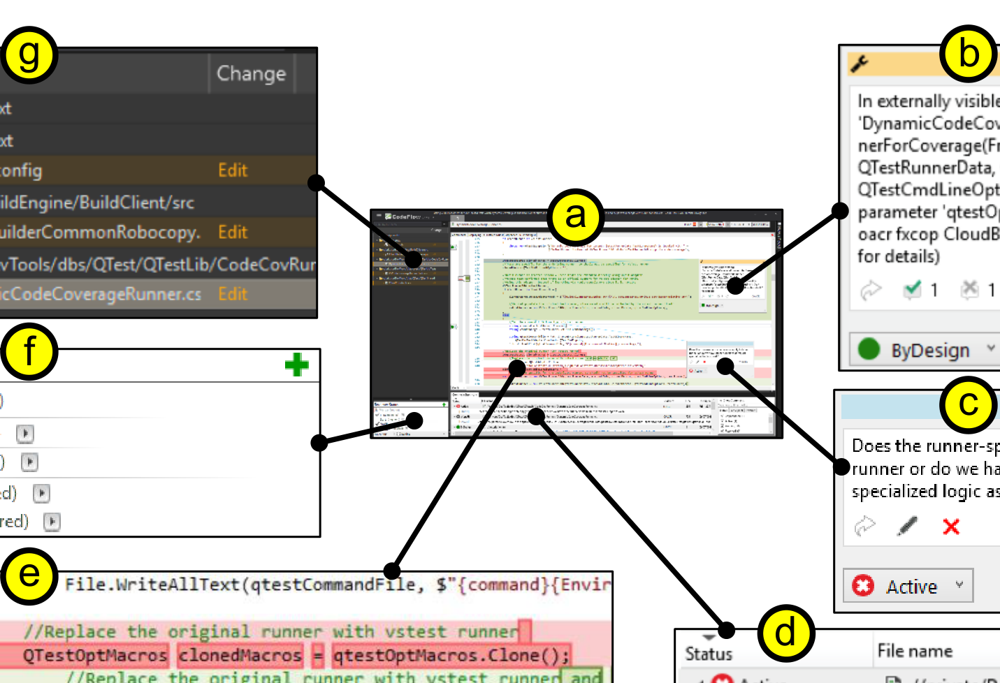

Figure 1. CFar-extended CodeFlow collaborative code review system. Our CFar tool extends the CodeFlow interface (a) with an automated reviewer. In particular, CFar automatically runs program analyses on the review changeset (g), and, based on the results, creates comments (b) that are mapped to relevant lines in the code visualization (e). These are first-class comments very similar to ones left by human users (c). For example, they appear along with the user comments in the comment summary listing (d). The CFar reviewer ("OACR") is also included among the human reviewers in the reviewer-status listing (f), and, for instance, will approve the changeset if all the CFar comments have been addressed.

These tools typically provide features for recording reviewers' statuses and decisions, for example, whether they have begun their review or whether they have accepted or rejected the changeset (e.g., Fig. 1f).

## THE CFar TOOL

To increase programmer communication, enhance programmer productivity, and reveal more defects during code reviews, we designed CFar, an automated-reviewer extension to collaborative code review systems. CFar stands for CodeFlow Automated Reviewer (pronounced see-far). In particular, CFar introduces automated feedback into the code-reviewing process, and does so using many of the same features used by human users. Thus, in many ways, the automated reviewer appears to human users as a first-class participant in the review. A key aim of this design is to use the automated feedback to facilitate collaboration among the human users; however, the automated reviewer is not itself an intelligent conversational agent. Rather, the feedback our automated reviewer provides is based on automated program analyses. Our design was largely motivated by talking to programmers who use CFar each day, as well as the programmers who develop it.

For this work, we implemented our CFar design by extending and harnessing two industrial-strength tools, CodeFlow [11] and CloudBuild [25], respectively. CodeFlow is a collaborative code review system, similar to Gerrit, that is actively used by almost 40,000 programmers, creating more than 6,300 code reviews daily.

The CFar-extended version of CodeFlow incorporates our automated reviewer into the existing interface. To give our automated reviewer its program-analysis capabilities, we leveraged the CloudBuild system. CloudBuild is a cloud-based service providing resource-effective builds, tests, and program analyses. Over 4,000 programmers use CloudBuild actively, requesting more than 20,000 builds daily.

In the remainder of this section, we will first describe the essential features of CFar, using our CodeFlow-based implementation as a running example, and then describe some additional details about our implementation.

### Features of CFar

Perhaps the most central feature of CFar is that it automatically leaves review comments on the changeset code. For example, Fig. 1b depicts a comment left by the CFar reviewer. The CFar comments appear as first-class review comments in that they are inserted into the review using the same basic mechanisms as the normal human-provided comments. However, the automated reviews are visually distinct from the human ones. For example, in our CodeFlow extension, the CFar comments have a yellow border (Fig. 1b), whereas the human comments have a blue one (Fig. 1c). Moreover, the automated reviewer is listed as the reviewer who wrote the comments (e.g., the name of the program-analysis framework our tool used, “OACR”, in Fig. 1b). The content of each CFar comment is produced by an automated program analysis performed by CloudBuild. To further ensure that the CFar comments appear consistent with