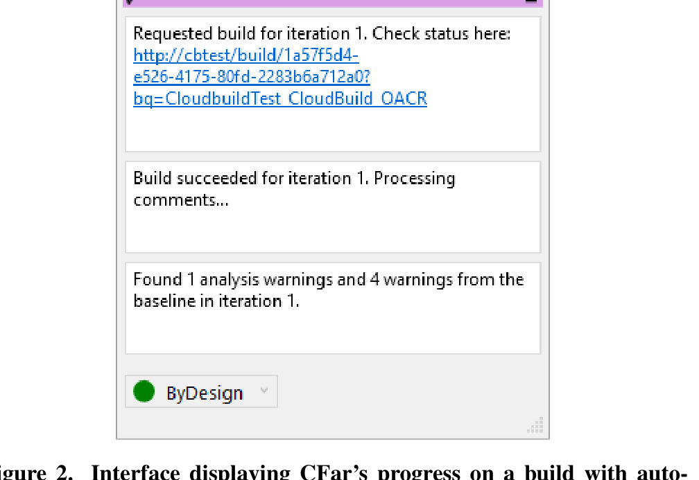
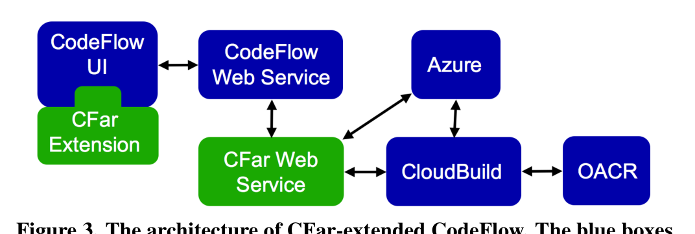

human ones, CFar maps each comment to the relevant section of code to which the analysis output refers (e.g., the Fig. 1b comment maps to line 221 in the code visualization). In the CodeFlow code-diff visualization, each comment is connected to the relevant section of code by a thin line.

By creating CFar’s analysis output as first-class comments, they are fully integrated into the normal human–human review discussion. For example, users can reply to the automated comments (e.g., by clicking the curved-arrow button in Fig. 1b), wherein they might discuss the rationale for the CFar comment, explain a proposed plan for addressing the comment, or debate the best solution for the issue. CFar comments, like user ones, also have a status (“Active”, “Pending”, “ByDesign”, “Wont-Fix”, and “Resolved”). Although users can set the status of a CFar comment in the usual way, CFar will also change the status automatically under certain circumstances. For example, if a CFar analysis discovers that a previous comment has been fixed but the comment status is still Active or Pending, it will automatically change the status to Resolved. This feature was added after initial feedback from programmers, saying that they expected CFar to “follow up” with reviews.

The CFar comments do have one key difference with user comments: they have features for collecting feedback about the comment. In particular, each CFar comment has three buttons (depicted in Fig. 1b)—a check mark to indicate that the comment was “useful”, an x mark to indicate that the comment was “not useful”, and a question mark to indicate that the comment was not understandable. These buttons give users a convenient way to provide feedback on the quality of the generated comments. The system records this user feedback for use, for example, in deciding which analyses should be run or in identifying analyses that need improvement (e.g., clearer messages). For each button, the clicks collected from all users are also summed and displayed as a count next to the button, for example, to give users a convenient way to check if there is a consensus about the comment.

The CFar automated reviewer leaves or updates its comments at the start of every iteration (i.e., every round of changes). For example, when an author submits a new review (Iteration 1), CFar analyzes the codebase and changeset, and creates an initial set of comments. When a user, having made changes to the changeset, advances the code review to a new iteration, CFar will re-analyze the code, will add any new comments its analyses reveal, and will update existing CFar comments based on the changes. When dealing with large, real-world codebases, automated analyses may take a long time to complete, and CFar provides features for alerting users to the status of the automated reviewer. For example, our CodeFlow implementation displayed messages as depicted in Fig. 2. We added this feature after two programmers indicated to us that they were unsure of CFar’s current status.

In addition to leaving review comments, the CFar automated reviewer also takes part in the changeset-acceptance process. For example, the CFar reviewer appears in CodeFlow’s reviewer-status listing as “OACR” (Fig. 1f). If CFar detects that all its analysis comments have been addressed (i.e., neither Active nor Pending), then it will automatically accept the changeset.

Figure 2. Interface displaying CFar’s progress on a build with automated program analyses and generating/updating analysis comments.

Figure 3. The architecture of CFar-extended CodeFlow. The blue boxes denote existing technologies used by our system, whereas the green boxes denote components we built.

CFar will never reject a changeset; however, if Active or Pending comments are present, it will display its decision as pending. The goal of this feature is to make the CFar reviewer act as any other reviewer, and to follow standard practices, such as requiring there to be no rejections before accepting the code changes.

## Implementation of CodeFlow Extension

Fig. 3 illustrates the complete architecture of our CFar extension of CodeFlow. The architecture consists of two main components: (1) a front-end extension to the CodeFlow user interface, which provides the UI features described above, and (2) a back-end web service that invokes a build and processes the analysis warnings.

The CFar web service serves as the communication channel between CodeFlow and CloudBuild. Specifically, the CFar web service listens for events from the CodeFlow web service that indicate the progress of a code review. These events, for instance, indicate when a new code review is created, when a new iteration in an existing review is created, or when a review is completed. By listening to these events, the CFar web service also learns the identities of the review participants such that, for example, the automated code reviewer may be turned on only for particular groups of programmers when selectively ignoring all events about other participants.

When a new code review or iteration is created, the CFar web service first invokes CloudBuild to request a build for the new changeset (i.e., before performing any analyses). We implemented CFar to support the popular distributed version-control system Git. To perform the build for a changeset,