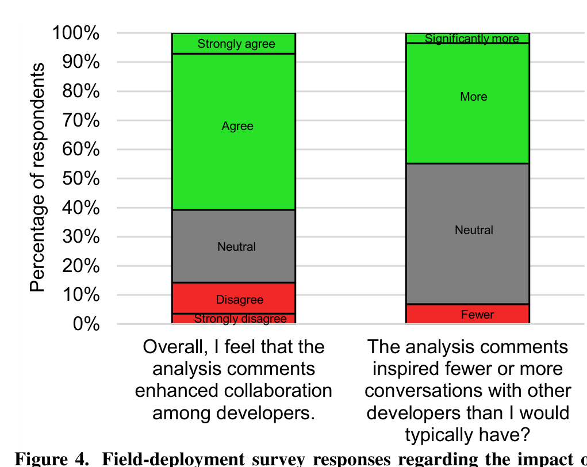

## Lab Study

To gain rich qualitative insights about CFar, we ran a laboratory user study of programmers performing two code reviews, one with and one without our tool. This allowed us to closely observe programmers as they performed code reviews and receive feedback from them regarding our tool.

We emailed 36 programmers from one of the three teams to which we had deployed our tool. This team was selected due to their close proximity to us (within walking distance). These programmers already had experience with CodeFlow, CloudBuild, and OACR. Of them, seven programmers (six male, one female) took part in the lab study. We refer to these participants as LP-X, where LP refers to Lab Participant and X refers to the participant number (e.g., LP-3 refers to lab-study participant #3). All participants held bachelor’s degrees. Additionally, three also held a master’s degree and one a PhD degree. On average, the participants had 15 years of programming experience (SD = 10). They reported performing an average of 25 code reviews per week (SD = 44.8) and requesting an average of three reviews per week (SD = 1.6).

The code we asked participants to review was from an actual project at their company and from commits that had been previously made by other programmers. We selected code from a project with which all of our participants would be familiar. We ensured that none of the participants had previously reviewed the code or committed changes to it by checking the commit logs as well as by asking them at the start of the lab session. Our goal was to enhance validity of our study by choosing actual commits to review and by ensuring the code was not completely foreign to the participants.

The participants took part in individual lab sessions lasting approximately one hour. First, participants were read a summary of the study and then filled out a background questionnaire. Next, they were asked to complete two code reviews, with 25 minutes to complete each. Analysis comments were added to one of the reviews, but not the other. The order of the reviews was the same for all participants, but which review received the analysis comments was chosen randomly. If participants did not complete a review within 25 minutes, they were asked to stop. To better understand the participants’ behaviors, we asked them to “think aloud” [24] as they performed the reviewing tasks. After completing the two code reviews, each participant took part in a semi-structured interview regarding their thoughts on the CFar tool. As data, we collected audio and screen-capture video of each participant’s session.

## RESULTS

To address our research questions, we analyzed the usage logs and survey responses from the field deployment, and the task videos and interview responses from the lab study. We now report the results of our analyses for each research question.

### RQ1 Results: Increased Communication

As Fig. 4 shows (left bar), over half of the survey respondents (61%) reported that CFar enhanced their team’s collaboration. Moreover, as the same figure shows (right bar), nearly half of the programmers (45%) reported that CFar inspired more conversations. In contrast, only a handful of respondents indicated

typically have? Figure 4. Field-deployment survey responses regarding the impact of CFar on programmer communication during code reviews (RQ1). The green portion of each bar denotes responses that support CFar’s effectiveness; red denotes responses against; and gray denotes neutral responses.

that CFar either had no effect or reduced collaboration and that it reduced communication (14% and 7%, respectively).

In the field-deployment survey, we also asked programmers an open-ended question about which analysis comments they discuss with other programmers. 40% of the respondents said that they communicate with other programmers about all of the analysis comments. However, during the field deployment, participants wrote a reply to only 9% of the analysis comments. Although these results at first seem contradictory, they may be explained by the fact that each team in our study worked in an open-plan office, and tended to engage in in-person discussions (as opposed to using CodeFlow). For example, LP-4 described situations in which he will go talk to the review author before even looking at a review:

> LP-4: “If the change is anything above a minor bug fix... if it typically touches more than 5 or 10 files or has some kind of design thing, I go talk to them.”

As Fig. 5 shows, CFar inspired conversation topics that ranged from shallow defects to deep issues. For example, the Coding Style category would have tended toward shallow defects. In contrast, the Refactoring, Code Smells, and High-Level Design categories would have tended toward deeper design issues. The Implementation Details category likely contained a mix of shallow defects (e.g., minor bugs) and deeper issues (e.g., subtle security vulnerabilities and concurrency errors).

Programmers also made statements in their open-ended responses that further indicate that CFar led to additional conversations. As one programmer explained:

> FP-14: “Having some comments helped start the conversations that might be missed until last minute, so their addition is a net positive.”

Another programmer recounted a situation in which CFar caused him to talk to a fellow programmer:

> FP-33: “I followed up with the tool owner to understand whether there was a performance impact or not. I probably would not have if it hadn’t been called out in the review.”