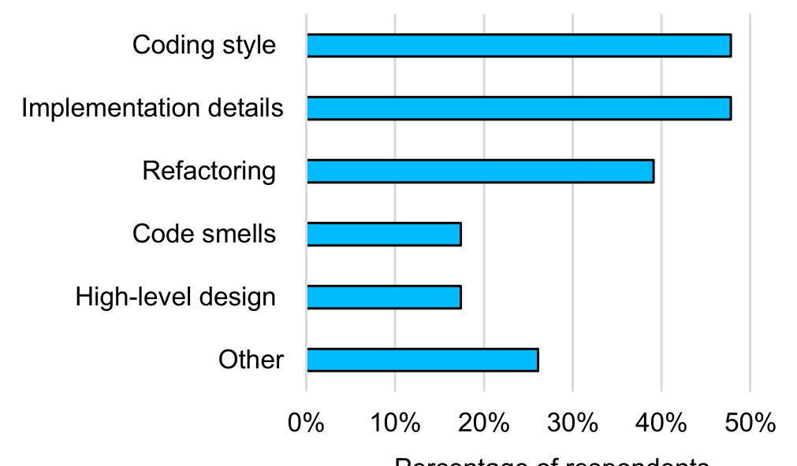

0% 10% 20% 30% 40% 50%  
Percentage of respondents

Figure 5. Field-deployment survey results indicating the programmer-conversation topics inspired by CFar during code reviews. The Other category consisted of “unit tests”, “performance issues”, “educating junior programmers”, and “build-breaking issues” (none received more than two responses).

Additionally, two more programmers provided their thoughts on why the comments enhanced communication:

> FP-6: “Different programmers have different perspectives about the same problem or issue or solution. It's beneficial to talk with others and acquire inspiration.”

> FP-13: “The auto-generated code review comments have prompted me to ask questions of fellow programmers about how best to resolve the problem at a point in development where it still feels productive to do the right thing rather than the expedient thing. As a result, the discussions I've had have been more in depth and just more usefully focused on what the right solution is.”

### RQ2 Results: Increased Productivity

As Fig. 6 shows (left bar), a considerable number of the survey respondents (38%) indicated that CFar increased their productivity. One reason reported by programmers was that it largely freed them from having to provide feedback about shallow bugs. A number of programmers remarked on this fact:

> FP-33: “Anything that can be automated should be. Reviewers should focus on critical thinking and bots should do the mindless clerical work.”

> LP-7: “I wouldn't even have to look for those things. I would just look for higher-level things.”

> LP-1: “When you are thinking the same thing that [the tool] has already pointed out, you don't need to focus so much on that part anymore. I also learn about things I didn't see in the review.”

Interestingly, these remarks also suggest an interrelationship between productivity and code quality. In particular, by freeing the programmers from dealing with shallow defects, they were able to invest more effort into finding and discussing deep defects. One programmer commented on the importance of this benefit:

> LP-4: “Maybe earlier in my career I would have gone right into the code and found logical issues and fine grained stuff. But those are not as interesting. I want to provide design feedback.”

Another productivity benefit that programmers cited was that CFar delivered feedback quickly and early in the code-review process. For example, one programmer elaborated on this productivity benefit:

> FP-6: “The instant feedback — I didn't have to wait for anyone's comments.”

Several others explained that, even though they were already using program-analysis tools in later parts of their workflow, CFar helped them save time by delivering the analysis feedback sooner:

> FP-24: “Saves me time to fix the same issue [now, rather than] very late.”

> FP-13: “I'm glad to have had the warnings pulled earlier in my development loop so I can address them earlier.”

> FP-21: “Many comments are things that I would have to fix anyway, so I like knowing about those things sooner (in Code Review) rather than later (when I'm trying to check-in or after). Having CodeFlow automatically give me extra information and/or an early heads-up about things to fix is a good time saver.”

In contrast to the productivity benefits expressed by these programmers, several (19%) indicated that CFar decreased their productivity. From the lab study, several participants expressed that the analysis comments cause them to want to view relevant code that is not included in the code review, and so they must open a code editor to view it (CodeFlow does not currently support this). Another reason cited for CFar having a negative productivity impact was an overload of CFar comments:

> FP-29: “The comments simply get in the way of someone trying to do a review.”

> FP-28: “Too much noise.”

### RQ3 Results: Improved Code Quality

As Fig. 6 shows (right bar), nearly half of the survey respondents (48%) indicated that CFar helped increase the quality of code. Moreover, only one programmer responded that the use of CFar decreased code quality.

During the field deployment, CFar posted a variety of analysis warnings as comments in code reviews, summarized in Fig. 7. All warnings concerned shallow defects, and in particular, program behavior, code style, and API usage. For example, the most common warning is about parameters that have not been validated or null checked. Other popular warnings include those regarding API usage. Four of the warning types shown in Fig. 7 are about using suitable XML or string libraries.

One reason why these CFar comments improved code quality is that programmers did not simply ignore them, but rather, acted on them. Recall that each review comment in our CFar-extended CodeFlow has a status (i.e., Active, Resolved, By-Design, etc.). At the end of the field deployment, only 3% of the analysis comments remained Active (i.e., unaddressed) in the completed code reviews, whereas 97% had their statuses changed either by a programmer or by CFar itself, which automatically sets the status of an analysis comment to Resolved if the corresponding code issue has been fixed. Furthermore, in the field-deployment survey, 33% of the respondents said that they responded to all analysis comments no matter what code issue they concern.

In addition to responding to CFar comments, the programmers also indicated that they understood the CFar comments. Recall that each CFar comment has buttons (useful, not useful, or do not understand) that users could click to provide feedback on the comment. During the field deployment of CFar to the fourth programmer team, which used the front-end component of our architecture, we collected this user feedback.