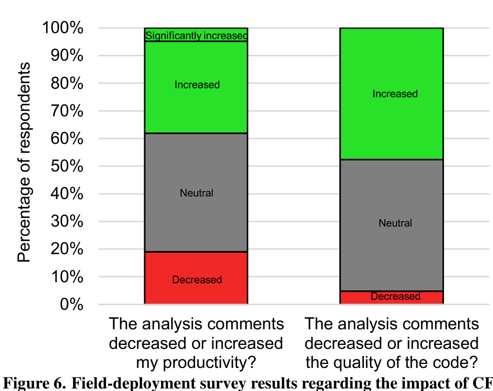
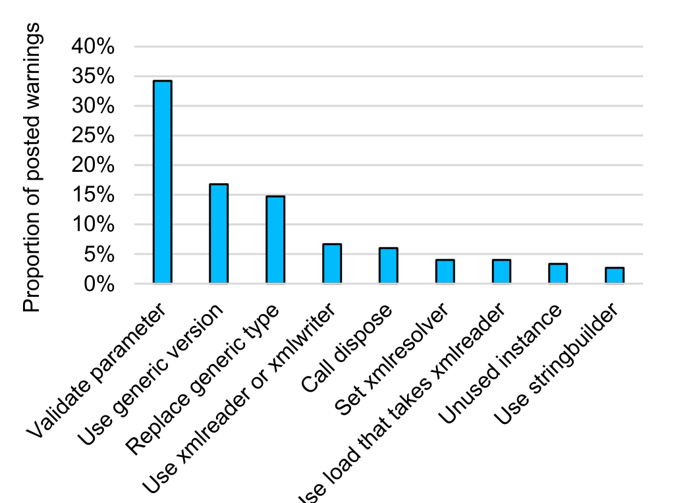
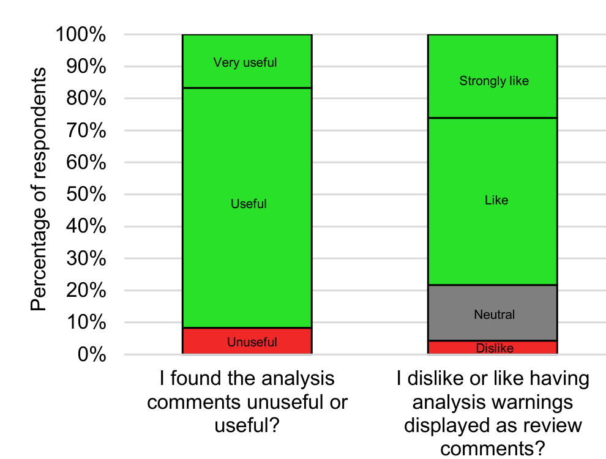

my productivity? the quality of the code?

Figure 6. Field-deployment survey results regarding the impact of CFar on programmer productivity (RQ2) and code quality (RQ3). The green portion of each bar denotes responses that support CFar’s effectiveness; red denotes responses against; and gray denotes neutral responses.

There were 119 votes in total, of which 74 were useful and 45 not useful. No programmer indicated not understanding a comment. This is particularly encouraging given that prior research has found that one of the biggest barriers to adopting program analysis is the difficulty to understand the generated warnings [21]. Displaying the warnings in CFar as comments placed directly on top of the relevant code may have aided programmer understanding and avoided this common barrier.

Many of the programmers offered explanations in the survey as to how CFar assisted them in finding and addressing code issues. For example, one programmer provided his rationale as to why CFar helped him:

LP-6: "...in code reviews you can only do so much. You cannot really go through all the details and go through all the dots to find the bugs. These kinds of comments make it really useful."

Several other participants brought up that CFar uncovered issues that a human reviewer would not have:

FP-24: "Some errors are just too hard for a human to notice."
LP-5: "These are often things people don't catch but are supposed to in code reviews or things you would make a comment on anyway."
FP-18: "Warnings make me think of something that I otherwise wouldn't have."
FP-30: "Things I might have missed earlier would be pointed out, and I'd go look at that piece of code in more detail."

While there was a generally strong consensus that CFar enhanced code quality, some programmers provided neutral or negative responses. A potential reason for the high number of neutral responses is that programmers were required to change their workflow in order to utilize CFar's features. Those that did overcome this barrier expressed issues with the program analyses used by CFar:

FP-13: "So far I've only seen warnings about potential hazards that turned out not to be problems so code quality has been unaffected."
FP-32: "I dislike the comments I see because they're all redundant..."

## RQ4 Results: Found Useful

As Fig. 8 shows (left bar), all but one of the field-deployment survey respondents indicated that they found the CFar com-

Figure 7. Field-deployment log results regarding the types of analysis warnings that CFar posted as review comments. The chart shows only the top-ten most commonly-posted warnings.

comments?

Figure 8. Field-deployment survey results regarding the usefulness of the CFar tool. The green portion of each bar denotes responses that support CFar’s effectiveness; red denotes responses against; and gray denotes neutral responses.

ments useful. Moreover, the figure (right bar) shows that a strong majority of respondents liked the CFar comments (only one participant did not). These sentiments were echoed by the lab-study participants: all seven participants in the lab study indicated that they found the analysis comments useful and held a favorable opinion of CFar.

Beyond the programmer opinions addressed in our other research questions, our participants also provided feedback on a variety of additional aspects that they liked about CFar. Two participants made comments showing their general enthusiasm for the tool’s potential:

FP-13: "It seems like the auto-generated comments I've seen are the tip of the iceberg... I'm optimistic that there's a lot of untapped potential."
LP-3: "I think this is an awesome space that I would love to see even more static analysis done to make my job of code reviewing even easier."

Another participant reported a great example of when CFar can help educate programmers: