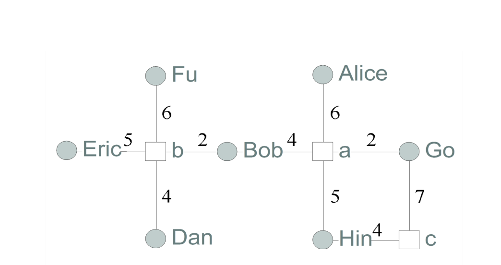
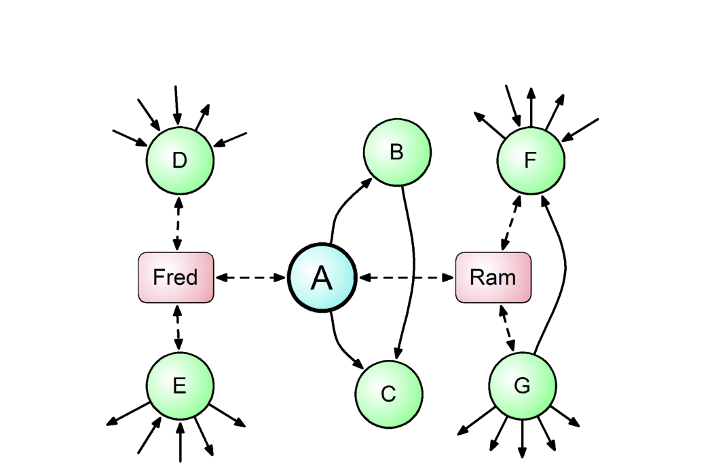

_Figure 1. A developer-module network characterizes the contributions of developers within a system._

of the emphasis placed on understanding how, and under
what circumstances, developers should work together on
projects.

In an effort to aid the development effort at Microsoft and
understand the effect of human factors, we have gathered
data and investigated the relationship of software quality
with developer attributes such as collaboration behavior,
geographic location, position within the organization, and
work assignment. Below, we describe some of our key
results.

## Contribution Behavior and Quality

As a study of collaboration behavior, Nachi, in joint work
with Martin Pinzger, developed a developer-module network,
which characterized the contributions of developers
to modules within a system [3]. Figure 1 shows an example
developer-module network. Gray circles represent developers
and boxes represent modules within a system. Edges
connect developers to the modules that they have contributed
to, with edge weights representing the number of source
code repository commits. Note that the developer-module
network for Windows Vista is quite large, with thousands
of developers and thousands of binaries – executables
(.exe), shared libraries (.dll) and drivers (.sys).

We found that topological properties of this network were
highly related to post-release faults. For instance, modules
that were more central, as defined by traditional social
network analysis centrality measures, tended to have more
faults than other modules. We also found that less complex
measures, such as the number of distinct authors and number
of distinct commits were both significant predictors for
the probability of post-release failures. By using a host of
social network measures (we refer the reader to the original
paper for details and descriptions) in conjunction with principal
component analysis, we were able to train a logistic
regression model for predicting failure-prone modules that
achieved an average precision of 83% and recall of 89%.

We summarize our important results:
- Network centrality measures can predict failure-prone binaries in Windows Vista.
- Network centrality measures can predict the number of post-release failures.

_Figure 2. A socio-technical network between modules (circles) and developers (boxes)._

- Advanced centrality measures can improve the prediction of number of post-release failures.

In summary, we found that a strong relationship exists between the developers’ commit behavior and the software quality of modules within the system.

### Adding Technical Relationships

In later work, Christian and Nachi built upon this result by
adding module dependencies to the developer-module network [4]. In previous work, Tom and Nachi found that
dependencies can predict failures in both modules [5] and
subsystems [6]. A network that incorporates both developer
contributions and dependencies is a socio-technical network
because edges may represent contributions from people to
modules or dependencies between modules within a
system. Figure 2 depicts a portion of a socio-technical network.
Circles represent modules and boxes are developers.
Solid directed edges are dependencies, indicating that one
module may use functions or types defined in another, may
make RPC calls to another, etc. Dashed lines indicate that a
developer contributed to a module (we used weights in our
analysis, but do not depict them in the figure).

By combining both types of relationships into one graph,
we were able to increase the power of fault predicting regression
models. Using principal component analysis, we
found that models based on this network had higher recall
than networks with only contribution edges (developer-
module networks) or only dependency edges to a statistically
significant degree in Vista (recall was similar to previous
models).

To see if such models are specific to Microsoft or if they
are more generally applicable, we also applied the same
techniques to 6 major releases of the Eclipse Java IDE (2.0
through 3.3) and achieved precision and recall rates of failure-prone
plug-ins ranging from 75% to 86%. Further, we
were able to train a regression model on one release of
Eclipse and achieve recall and precision values ranging
from 75% to 93% on the next release, showing that cross
release prediction works well for network based regression
models.