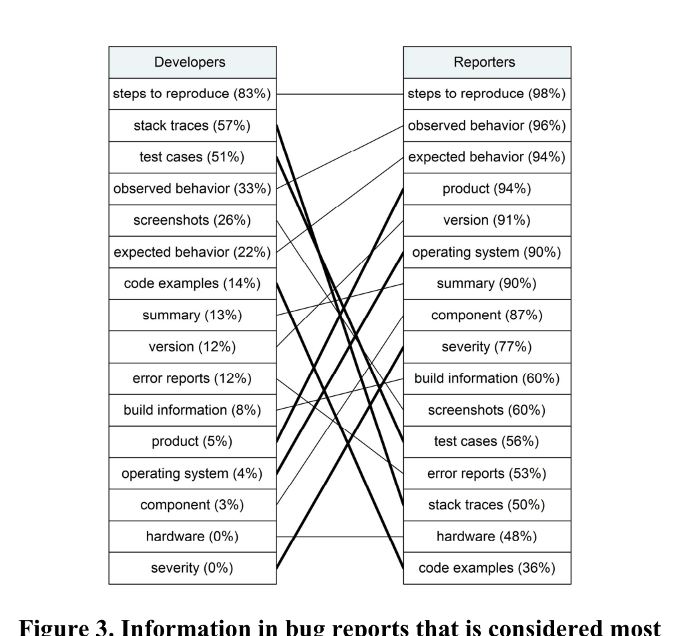
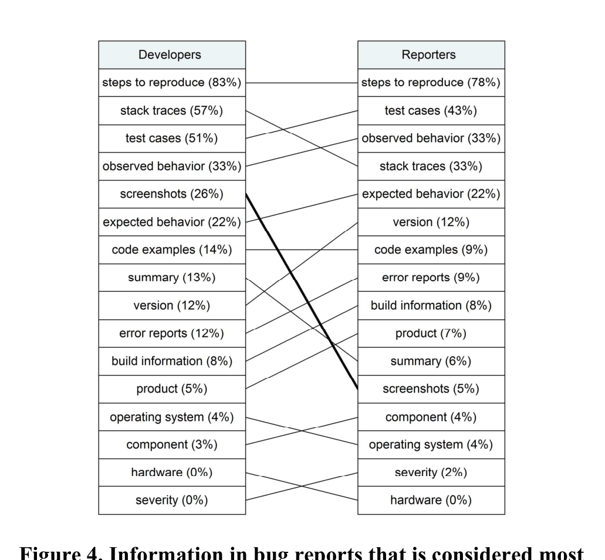

Figure 3. Information in bug reports that is considered most helpful by developers vs. information provided by reporters.

Figure 4. Information in bug reports that is considered most helpful by developers vs. what reporters believe is important.

We mined over 50 measures in categories such as complexity, churn, test coverage, dependencies, and organizational metrics, and determined that there is very little difference between distributed and collocated binaries other than team size. Thus, it appears that within Microsoft, distributed development doesn’t negatively affect quality. There are a number of reasons that we believe this may be (and we invite the reader to examine them in the original paper [8]), but we have yet to empirically verify them.

This result is all the more surprising in light of the findings of our study on organizational metrics, as it may seem to be at odds with those findings. The resolution of it lies in the fact that organizational structure spans geography at low levels within Microsoft. While some companies have an Asian organization, a European organization, etc., within Microsoft, it is not uncommon to have a team with developers in India and others in Beijing who report to a second line manager in Redmond. This approach may be one reason that geography has less of an effect, but we plan to study this further to provide more conclusive evidence.

## BUG REPORTING AND TRIAGING

In the past years, Tom Zimmermann has collaborated with other researchers on studies on bug tracking systems. The advantage of these collaborations is that academic researchers can analyze open-source projects, while we can analyze projects at Microsoft. Thus findings come with a higher generality.

Bug reports are a perfect data source for CSCW research. They capture collaboration, communication, and coordination among people. Especially in open source projects, bug tracking systems directly involve the users of a software and not just the engineers. This leads to communities of several thousand people who discuss and work towards a resolution of software bugs. In our research we studied bug tracking in open source and a closed source environments.

### What Makes a Good Bug Report?

Tom, in joint work with Rahul Premraj, Nicolas Bettenburg, Sascha Just, Adrian Schröter, and Cathrin Weiss, conducted a survey among developers and users of the Apache, Eclipse, and Mozilla projects [10]. The 466 responses revealed several interesting findings on how to improve bug tracking systems.

First, we observed a mismatch between the information considered most useful by developers and the information provided by reporters (see Figure 3). Developers want steps to reproduce, stack traces, and test cases in bug reports; however, this is not the information that reporters provide. Yet, when asked, the reporters’ responses indicated that they know what is most helpful to developers and the rankings matched almost perfectly (see Figure 4). There are two implications for bug tracking systems: (1) Tell users while they are reporting a bug what information is important. (2) At the same time, systems should provide better tools to collect important information automatically, because often this information is difficult to obtain for users.

Next, we analyzed the comments by the survey respondents to identify additional design recommendations:

- Support different levels of users (novice, expert) and provide different user interfaces for each level. Inexperienced users should receive more guidance when reporting bugs.
- Integrate bug report reputation. Several developers pointed out that reporters who are well known, either personally or through well-written past bug reports, will get more attention. Experienced reporters could be marked in their user profiles.