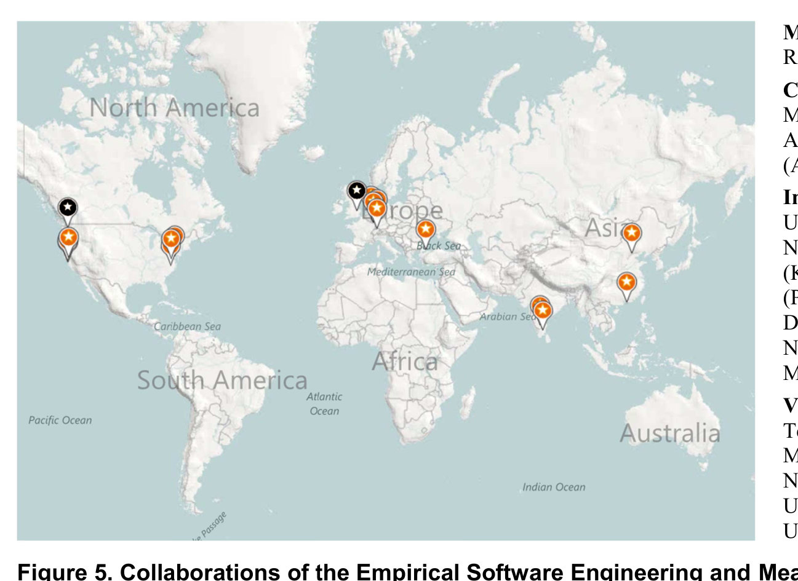

University of Technology (Neeraj Suri).

Figure 5. Collaborations of the Empirical Software Engineering and Measurement (ESM) Group at Microsoft Research.

> Main locations of the ESM group (black pins):  
> Redmond (USA), Cambridge (UK)  
>   
> Collaborations with other Microsoft Research Labs:  
> Microsoft Research India (Bangalore), Microsoft Research Asia (Beijing), European Microsoft Innovation Center (Aachen, Germany)  
>   
> Interns 2007–2010: University of Virginia (Ray Buse); University of California, Santa Cruz (Ken Hulett); National Institute of Technology, Tiruchirappalli, India (Kalaikkumaran Ramamurthy); Stanford University (Philip Guo); Boğaziçi University, Turkey (Ayse Tosun); Darmstadt University of Technology (Andreas Johansson); North Carolina State University (Lucas Layman, Meiyappan Nagappan)  
>   
> Visitors 2007–2010: Hong Kong University of Science and Technology (Sung Kim); University of Zurich (Harald Gall, Martin Pinzger); Saarland University (Andreas Zeller); North Carolina State University (Laurie Williams); University of Maryland (Victor Basili); Darmstadt University of Technology (Neeraj Suri).

be put into practice immediately within the company. This serves to validate the findings and results in higher levels of quality and productivity.

Collaboration with other Microsoft researchers. There are plenty of opportunities to collaborate with other researchers inside Microsoft. At the moment Microsoft Research has more than 800 researchers, working in eight locations around the world. For most areas, experts are easily accessible and allow for multidisciplinary research when needed.

Collaboration with external researchers. There are many opportunities for our group to collaborate with researchers outside Microsoft. Often we conduct research in tandem: we analyze data from Microsoft projects, while an academic researcher analyzes open-source projects. This increases the generality of our empirical findings. Selected academic researchers also get the opportunity to access Microsoft data either as interns (typically PhD students) or visiting researchers (for example, professors during a sabbatical).

Figure 5 shows a Bing map with the locations of the Empirical Software Engineering Group and the collaborators’ locations. In the past years we have worked with 8 interns and 7 professors from all over the world. We are always looking for outstanding visitors and interns. To learn more about visits or internships visit our web-site and/or contact one of the authors of this paper. In fact, three ESE group members interned before they joined Microsoft full-time (Nachi Nagappan in 2005, Tom Zimmermann in 2006, and Christian Bird in 2008 and 2009).

## CONCLUSION

In this paper, we presented three main themes that showcase the research of the ESE group at Microsoft: the analysis of socio-technical congruence and bug tracking systems allows us to understand how development teams collaborate and to build tools that help them collaborate with each other. With data-driven software engineering, we want to take this one step further: development teams should have the knowledge and tools to analyze their collaboration patterns themselves and monitor their improvement over time.

Being located inside Microsoft offers us many unique opportunities to pursue our goals. Microsoft has many large software projects and the “cooperative” aspect is omnipresent. Rather than just coming in after the fact and investigating (like many studies in the mining software repositories field do), we can watch software development while it happens. We can also test tools related to helping to support cooperative work and understand when cooperation is needed and when engineers can work on their own.

For more information about the ESE group at Microsoft and/or to apply for an internship, log on to http://research.microsoft.com/en-us/projects/esm/

## ACKNOWLEDGMENTS

We thank Tom Ball, Robin Moeur, Wolfram Schulte; our visitors Sung Kim (2010), Harald Gall (2008, 2009), Laurie Williams (2009), Andreas Zeller (2005, 2009), Victor R. Basili (2007), Neeraj Suri (2007), Martin Pinzger (2007); our interns Ray Busse, Ken Hulett, Meiyappan Nagappan, Kalaikkumaran Ramamurthy (all 2010), Philip Guo, Ayse Tosun (both 2009), Lucas Layman, Andreas Johansson (both 2007); and we thank our collaborators. Thanks for the great work!

We also thank our colleagues at Microsoft Research and the many product groups at Microsoft who have worked with us and helped with studies. You rock!

## REFERENCES

1. Brooks Jr., F.P. The mythical man-month. Addison-Wesley, 1975.  
2. Conway, M.E. How do committees invent. Datamation, 14, 4 (1968), 28-31.