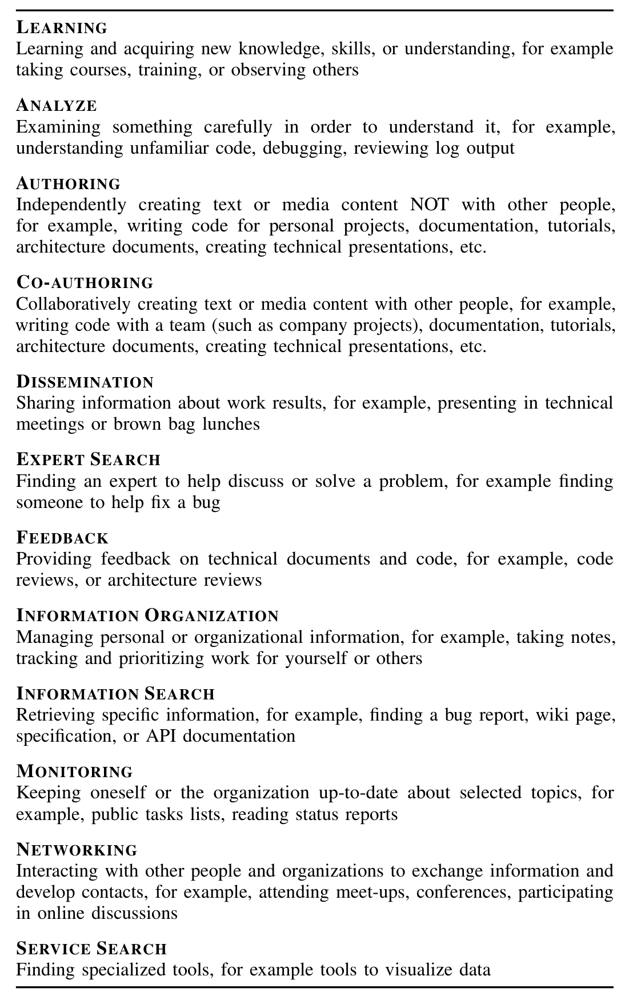

2) Multi-faceted personas derived from statistical analysis and qualitative descriptions of software engineering tasks (Section VI)  
3) Recommendations for how practitioners can use these personas in software engineering (Section VII)

## II. PERSONAS IN SOFTWARE DEVELOPMENT

In software development it is common to use personas in order to better understand users [5]. More formally, personas are behavioral specifications that embody the goals and needs of archetypical users introduced several years ago [5]. Personas were introduced to help developers understand and relate better to the users of a system. Personas are widely used in different software engineering domains ranging from requirements engineering [6] to tool development [7] and security and privacy [8].

Software companies use a variety of personas in varying stages of their development cycle though very rarely are they supported by data. One example of this is when Microsoft used the personas Mort, Elvis, and Einstein to define developer profiles for tool features [9].

Personas can also be used to understand the overall usability and aid early in the design process. As stated by Pruitt and Grudin [10], personas can provide, “a broad range of qualitative and quantitative data, and focus attention on aspects of design and use that other methods do not.” Pruitt and Grudin found that once personas are generated, it is easier to craft them into new situations rather than recreate a user scenario. Identifying users provides more information on how they can interact with a system.

In addition, Freiss found that though persona descriptions may not be explicit, they can help keep the design direction user-focused [11]. One example of personas that follow this pattern is GenderMag. GenderMag uses concrete facets of gender differences, such as processing style and motivations, to describe ways to encourage inclusive software development [12]. Though genders were not concrete identifiers of each declared persona, Marsden et al. performed experiments that confirm perceptions of persona attributes with particular genders [13]. This evaluation using GenderMag personas is not only an example of how helpful personas can be in explaining concepts, but also a building block for further experiments to confirm how personas can be adapted.

## III. RESEARCH QUESTIONS

We frame our study in the context of how software engineers work. Our approach for determining how software engineers work is grounded in knowledge worker actions as described by Reinhardt and colleagues [4]. This study is guided by three research questions.

### RQ1 How do software engineers spend their time in knowledge worker actions?

Previous work defines distinction between knowledge workers based on the actions taken to complete a task. Reinhardt et al. surveyed individuals at a large organization about their tasks [4]. In this work, Reinhardt et al. identified a typology

### TABLE I
ADAPTED KNOWLEDGE WORKER ACTIONS FOR SOFTWARE ENGINEERS

of how knowledge worker actions further define the task execution processes of knowledge workers. Reinhardt et al. also present each knowledge worker action in terms of guiding roles. We adapt knowledge worker actions to tasks as they apply to what software engineers encounter in their domain as shown in Table I. We keep Reinhardt et al. knowledge worker action names to support qualitative research transferability.

### RQ2 How do software engineers decide on their task, task inputs, and task outputs?

Davenport describes a factor to understand knowledge workers through complexity of work based on routine-repeatable work and judgment-improvisational work [14]. There are common tasks for which systematic and highly reliant on formal rules and procedures are required and some that do not. To apply this to software engineers, we are interested in the range of autonomy for software engineers to select tasks, determine tasks that need to be done based on ongoing work, and deciding when