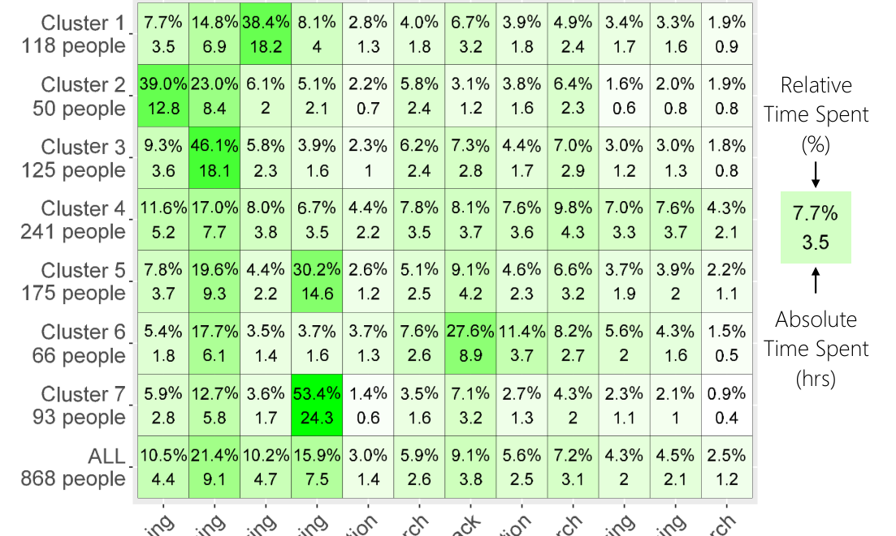

## TABLE II
### OVERVIEW OF SURVEY QUESTIONS

### DEMOGRAPHICS
Questions about → experience, gender, team size, other demographics (works on open source, internal projects, autonomy, decision maker, expert), self perceptions (thinker, doer, innovator, planner, etc.)

### TIME SPENT
Please enter roughly how many hours per week you typically spend on each of the activities. → the list of 11 knowledge worker actions adapted from Reinhardt and colleagues [4] instantiated to the software engineering domain.

How many hours in a week are spent → debugging code, writing code/creating text/media for personal projects, writing code/creating text/media collaboratively, in code reviews, testing code, with emails, in meetings?

### TASKS
- What are the inputs for your various tasks?
- What are the outputs for your various tasks?
- Who selects the tasks you work on?
- How do you know you are done working on a task?

### COLLABORATIONS
Select the job titles of the people you regularly interact with in your team, outside your team, or both.  
How many reviewers are included in code reviews of one of your changes?  
Have you ever been brought on a different team to put out fires?

Fig. 1. The seven clusters of how software engineers spend their time. Each row corresponds to a cluster and each column to a knowledge worker action. The top number in each cell indicates the average relative time spent (as a fraction) and the bottom number the absolute time spent (in hours). The average relative time spent for each cluster sums to 1.

identify whether the collaboration with that role is within their team, outside their team, or a combination of both. We also asked about code reviews and whether respondents have been brought on teams to help with emergencies as we found this to be a common event participants mentioned in interviews.

Participants. We invited 4,594 employees with Software Engineer listed as their job title at a large software company and received responses from 891 respondents (response rate 19.4%). We offered respondents the option to enter a raffle for four $75 Amazon.com gift certificates. The median years of professional experience as a software engineer is 7 years and the median years of reported experience at their current company is 3 years.

Data Analysis. We analyzed the survey data in three phases. First, we applied clustering on the time spent on knowledge worker actions and resulted in seven clusters. Next, in the descriptive analysis, we used the responses from the entire survey to characterize each cluster. In the final phase, we used the cluster descriptions to develop personas.

Clusters → Cluster Descriptions → Personas

Clustering. To answer RQ1, we used the responses to the number of hours a week listed for each knowledge worker action to cluster the survey participants in three steps:

**Step 1:** We included only participants who responded to the time spent question, i.e., the sum of time spent in all knowledge worker action was greater than zero hours. We only wanted to include participants that explained how their time was spent. Of the 891 survey respondents, 868 entered hours for each knowledge worker section.

**Step 2:** We normalized the time each person spends across knowledge worker actions by computing the percentage a person spends in each action.

**Step 3:** We used k-means clustering [21] to iteratively group respondents who reported similar relative time spent for each knowledge worker action into groups. To determine the appropriate number of clusters we plotted the within-groups sum of squares by the number of clusters and identified a bend in the plot. We observed the bend at k = 7 and manually inspected the clusterings for 7 to 10 clusters. We chose the clustering with 7 clusters because the cluster sizes were more balanced, i.e., no cluster represented only a small set of people.

The result of the clustering is shown in the heat map in Figure 1. The top row corresponds to the population of 868 developers who responded to the time spent question. Each subsequent row corresponds to a cluster. For example, the second row corresponds to Cluster 1 which represents 118 people. Each column corresponds to a knowledge worker action. A cell (x, y) indicates the average time that developers in a cluster x spend on action y. For example, developers in Cluster 1 spend on average 7.7% of their time on Learning; the 7.7% correspond to 3.5 hours.

Cluster Descriptions. To answer RQ2, we used statistical differences between tasks, task inputs, and task outputs reported as cluster descriptions. The results are summarized in Table III. We used a decision tree to explain how the clustering algorithm built the clusters and to characterize the clusters with respect to the time spent question. The results are in the left column of Table III. For example, most developers in Cluster 3 spent less than 19.29% Co-authoring and at least 31.41% Analyzing. In Cluster 7, most developers spent at least 42.18% of their time Co-authoring.