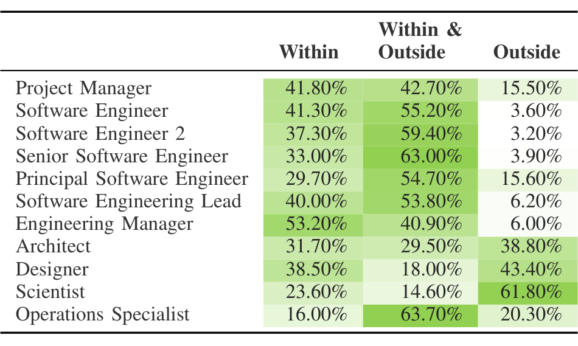

### TABLE IV
BREAKDOWN OF ROLES SOFTWARE ENGINEERS COLLABORATE WITHIN / WITHIN & OUTSIDE / OUTSIDE THEIR TEAM

component often must consult with owners of related or dependent components (Expert Search). Interview participants often sought out expertise and ideas from team members prior to undertaking a coding task. Some teams practice pair programming, which is a nearly constant collaborative process. We therefore asked survey respondents how much time they spend writing code for the company (presumably in collaboration with other company engineers); the average time reported was 9.4 hours.

### V.C. Time Spent in Meetings

Prior work acknowledges many organizational tasks that as a collaborative part of the software engineering workflow [26]. These tasks require some method of communication between a software engineer and other team members. Thus, we also asked participants about the amount of time participants spend in meetings, emails, and interruptions. Participants revealed that they spent approximately 5 hours of their time in meetings, 6 hours in emails, and 6 hours of their time being generally interrupted on average over the course of a week.

## VI. SOFTWARE ENGINEERING PERSONAS

To interpret our findings from RQ1, RQ2, and RQ3, we give a face to clusters through seven personas to describe software engineers: Acantha, Lilo, Isabelle, Cameron, Iman, Ava, and Ciara. We used time spent clusters and cluster descriptions to inform our personas. In addition, we support each persona with quotes from an interview participant, labeled S#, who identified with the persona. We selected quotes from interview participants that demonstrate depth of distinct personas.

### VI.A. Acantha, the Autonomist Acumen ← Cluster 1

Acantha is known for her autonomy and keen abilities to make good judgments when writing code. Her long tenure as a software engineer has supported her decision making abilities. She spends the majority of her time writing code independently on personal projects and also spends a significant amount of time working on internal projects. On average, more than 20% of her time is spent in the Authoring knowledge worker action.

Interview participants who identified with this persona also talked about how their professional experience has affected their success. S8 mentions how their autonomy and experience have greatly influenced their risk taking abilities:

> You know, I’m very much a risk-taker and I’d much rather ask for forgiveness. I’d much rather cross the line and wait for somebody to catch me. I’m willing to cross the line, and I do, and occasionally I get my hand slapped. I’m in this wonderful position.

### VI.B. Lilo, the Continuous Learner ← Cluster 2

Lilo is known for her interest in learning and getting adapted to a new team early in her career. She spends, on average, more than 23% of her time in the Learning knowledge worker action. She takes a great interest in watching online lectures to brush up on the latest frameworks and technologies that she may be able to add to a new project. At this stage in her career she is often assigned tasks rather than choosing tasks to work on. Though she may be an entry-level engineer with little professional experience at the large company, she takes an initiative to get caught up quickly on team projects.

Interview participants who identified with this persona reflected on being relatively new to their organization. The individuals who identified with this persona also do not claim to be an expert on the team. S7 talks about how their lack of experience encourage them to find someone who did:

> I mean it’s usually scoped but we don’t know the A, B, C’s of it, like where to start, how to start and any such things. But it usually starts with talking to different people. We know at least one contact who would then redirect us to multiple other contacts or they redirect us to some other people.

### VI.C. Isabelle, the Investigator ← Cluster 3

Isabelle is best known for being the top investigator on her team. She spends the most time, over 30% on average, in the Analyzing knowledge worker action. She spends much time in the trenches of projects debugging and making sense of code. Isabelle recently changed from being one of the top experts on her team to being a novice in her new team. However, this has not impeded her success as she was able transition smoothly and adapt the same techniques of connecting with peer developers to ensure success on her new team.

Interview participants who identified with this persona also spent a significant amount of time debugging code. S1 describes the process for debugging:

> It depends on what kind of task. For example, to fix bugs in theory you need to reproduce the problem and to just do a debug step-by-step, going into the very developed source code to figure it out. That takes a long, long time sometimes.

### VI.D. Cameron, the Communicator ← Cluster 4

Cameron is considered to be a communicator because of her ability to distribute her time evenly and early in her career while securing the logistics of her work environment. She is able to spread her time across all knowledge worker actions well. However, since she is so early in her career she also seeks