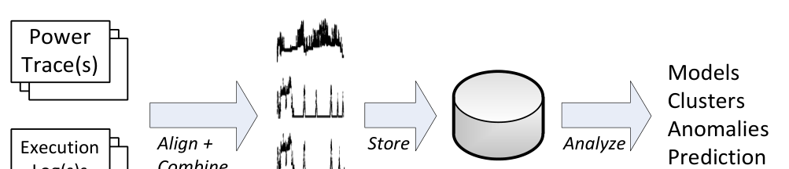
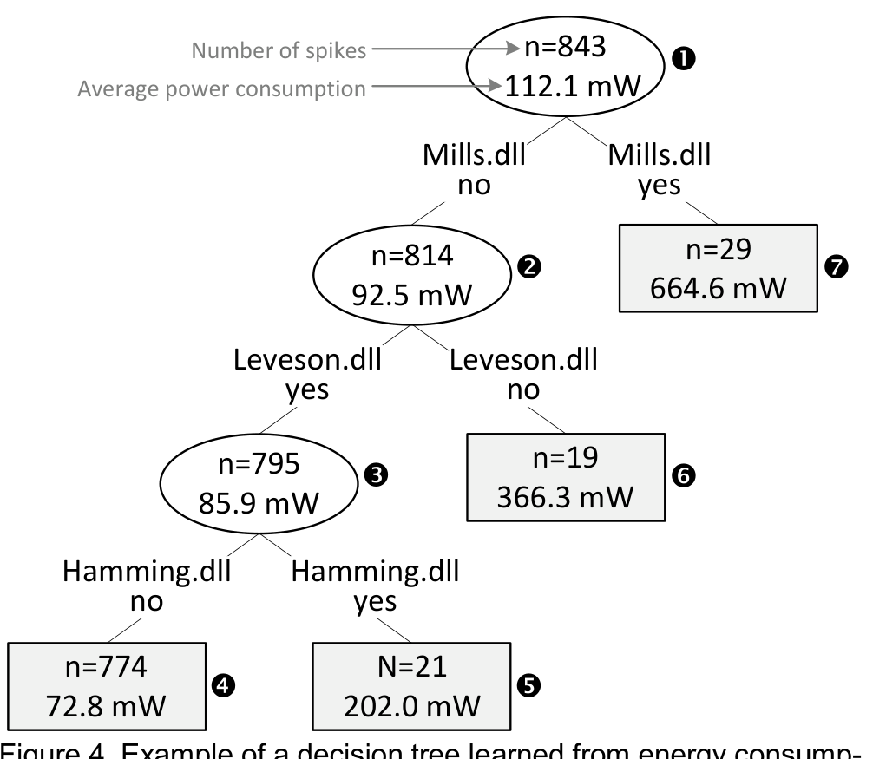
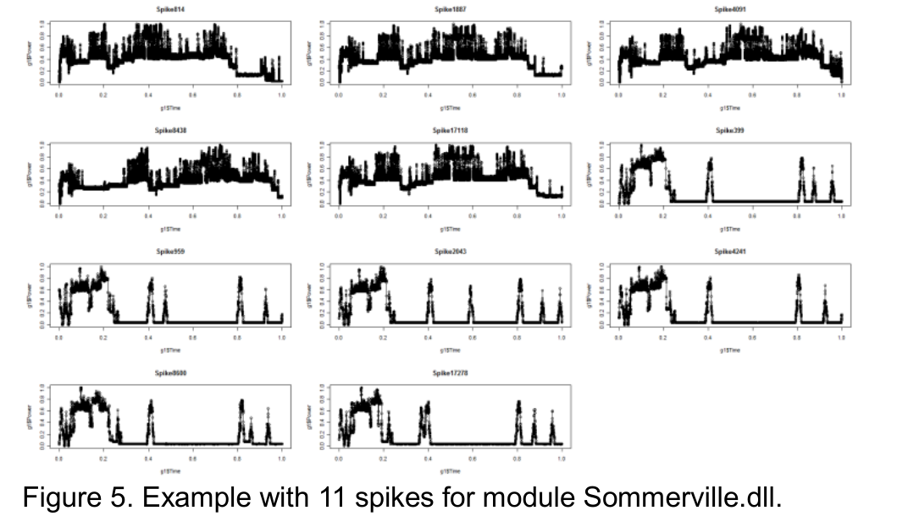
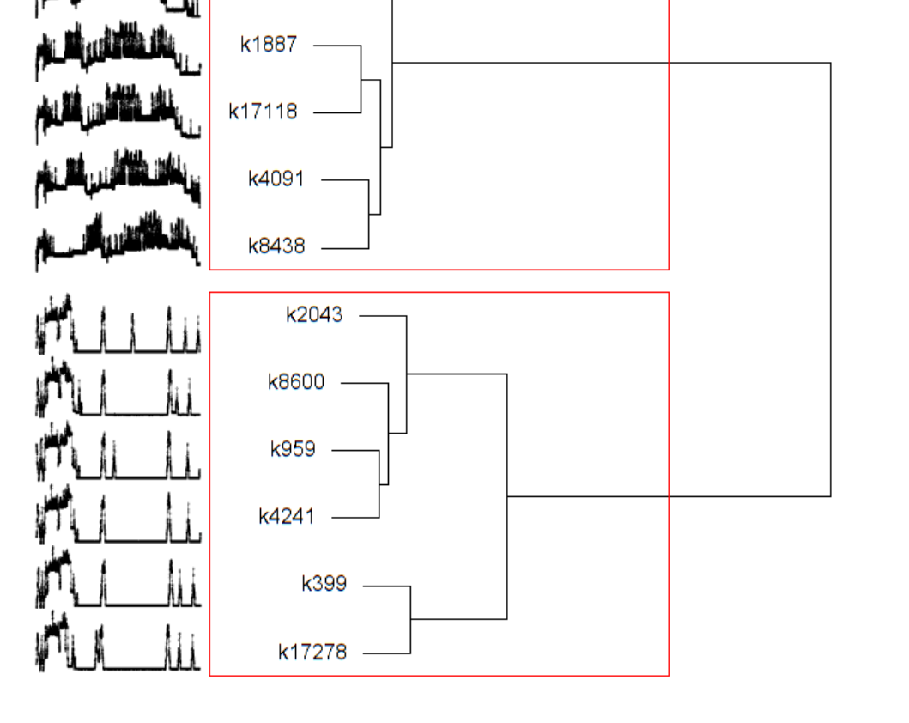

## Mining Energy Traces to Aid in Software Development:  
An Empirical Case Study

Ashish Gupta1, Thomas Zimmermann2, Christian Bird2,  
Nachiappan Nagappan2, Thirumalesh Bhat3, Syed Emran3  
1 Stanford University, Stanford, CA, USA  
2 Microsoft Research, Redmond, WA, USA  
3 Windows Phone, Microsoft Corporation, Redmond, WA, USA  
ashgup@stanford.edu {tzimmer, cbird, nachin, thirub, semran}@microsoft.com

### ABSTRACT
With the advent of increased computing on mobile devices such as phones and tablets, it has become crucial to pay attention to the energy consumption of mobile applications. The software engineering field is now faced with a whole new spectrum of energy-related challenges, ranging from power budgeting to testing and debugging the energy consumption. In this paper, we present our work on analyzing energy patterns for the Windows Phone platform. We first describe the data that is collected for testing (power traces and execution logs). We then present several approaches for describing power consumption and detecting anomalous energy patterns and potential energy defects. Finally we show prediction models based on usage of individual modules that can estimate the overall energy consumption with high accuracy. The techniques presented in the paper allow assessing the individual impact of modules on the overall energy consumption and support overall energy planning.

Categories and Subject Descriptors  
D.2.5 [Software Engineering]: Testing and Debugging.

General Terms  
Measurement, Experimentation.

1. INTRODUCTION
For several decades, power consumption has been a secondary concern (if a concern at all) in software engineering.1 Most software has been developed for desktop computers, which have a continuous power supply. While industries like satellite sciences and healthcare have been traditionally more power-aware, the general software engineering community did not have the need to research power consumption. This is about to change—or depending on the viewpoint has changed now. With mobile phones and tablets gaining wide usage in everyday life, new challenges are brought to software development. There are many stakeholders that now care about power: end-users realize that certain applications can reduce battery life dramatically and consider energy consumption as an important quality attribute.

Permission to make digital or hard copies of all or part of this work for personal or classroom use is granted without fee provided that copies are not made or distributed for profit or commercial advantage and that copies bear this notice and the full citation on the first page. To copy otherwise, or republish, to post on servers or to redistribute to lists, requires prior specific permission and/or a fee.  
ESEM’14, September 18–19, 2014, Torino, Italy.  
Copyright 2014 ACM 978-1-4503-2774-9/14/09...$15.00

> “I have researched all the many ways to save battery life. I have apps that kill other apps. I turn off Wi-Fi and 4G and Bluetooth until I need them.”  
> —Scott Adams, creator of Dilbert [1]
>
> As a consequence building energy-efficient applications becomes important for developers, both application and operating system (OS) developers. There are many ways that a developer can influence the power consumption of a mobile app, for example, the decision to use TCP vs. UDP, or keeping sockets and connections open longer than needed. Another example is making a lot of requests to a server instead of batching up requests so that they utilize wireless connectivity (a high energy component) effectively. Ultimately power consumption comes down to how the hardware components are used, but these are driven by software design decisions. In this paper, we introduce a methodology for collecting and analyzing power data on mobile devices running Windows Phone 7. Our methodology focuses on three parts: (1) describe and quantify power consumption, (2) detect anomalies in power consumption, and (3) predict power consumption. Anomalies identified by our approach have been confirmed as true defects by developers who used the anomalies to perform root-cause-analysis to detect defects in phone software. More specifically, we focus on the following questions:

questions:
- What modules consume the most power?2 (Section 5)  
- What are characteristic energy shape patterns of certain modules? Can we find anomalous energy patterns? (Section 6)  
- Can we predict power consumption? (Section 7)

These results hold value for major stakeholders in mobile devices. The OS platform developers and application developers specifically need to be aware of individual energy consumption patterns and can use overall prediction models to determine the energy usage in a particular scenario to decide on the need for energy optimizations or rethink the design aspects of the scenario. End-users need to be aware of the energy consumption levels to plan better for the battery life under different load conditions. These are two simple situations where knowing about energy patterns is of value.

1 Throughout the rest of this paper we use the term energy and power interchangeably.  
2 We use the term modules (or components) for executable files and shared libraries.

---

One of the goals of this paper is to expose the need of more software engineering research on energy awareness, utilization as well as optimization.

In the remainder of the paper, we discuss the underlying analysis and methodology (Section 3) from the viewpoint of OS platform developers. More specifically, we focus on idle tests, i.e., one scenario (e.g., checking mail, browsing to web pages, or opening a map) is tested repeatedly on the phone for a 12 hour period. Between each test run is an idle period to simplify the alignment between power consumption and actual activity on the phone. For each idle test, we collect and align execution logs and power logs (Section 4). This data is then used to address questions that Windows Phone developers often ask when testing and debugging the mobile operating system for energy consumption (Section 5–7).

The techniques discussed in this paper can be used in a similar fashion by application developers or even end-users. Application developers can programmatically collect battery usage statistics and correlate this information with execution data of their app. Similarly, end-users can observe battery levels (possibly with the help of a battery monitor) and correlate this information with the apps that they have used. While the techniques discussed in this paper have some limitations, they are also largely independent of the operating system and can also be applied to iPhone or Android platforms.

## 2. RELEVANCE TO SOFTWARE ENGINEERING

In this section we wish to emphasize why software engineering researchers and practitioners should care about energy, as the importance might not be immediately clear. The events of the last few years have significantly changed the face of computing.

### Observation #1: Energy awareness is relevant now

The main reason for the increased importance of energy analysis is because of the advent of smart phones and tablets. With the explosive growth of smartphones (for example, Windows Phone, Android, iPhone, and Blackberry), Nielsen Media Research expects more smartphones in the U.S. market than feature phones in 2011 [2]. The market analysis company IDC reported total shipments in 2011 were 491.4 million units up 61.3 percent from 2010 [3]. According to IDC smartphones started outselling PCs in the fourth quarter of 2010 with 100.9 million shipped devices vs. 92.1 million and there will be more mobile Internet users than wire line users in the U.S. by 2015 [4].

With the growth of tablets and smartphones the problems related to energy consumption are increasing. Both end-users and developers are sensitive to the energy consumed by individual components of the phone (such as Wi-Fi, 3G) as well as applications downloaded and running on the phone. Lower than expected battery life on mobile devices can lead to frustrated customers and negative publicity for a company (for example, the recent iOS launch [5]); several technology blogs discuss ways to improve battery consumption. The Computer World magazine presents “More tips for boosting Android battery life” where they discuss ways to increase battery life, including turning off Wi-Fi, turning off Bluetooth, dimming the background, and running an energy monitoring app [6].

### Observation #2: Energy awareness is relevant for the software engineering community

The rapid growth of the market for mobile devices brings a need for understanding various aspects of energy consumption. Simply put: how do we test for energy? We have an extensive body of



Figure 1. Overview of our approach. We use two data sources: power traces and execution logs. The data is then aligned and combined and we extract power spikes from the traces, which are stored in database and serve as input for the analysis throughout this paper.

knowledge on testing and test prioritization but we need to start designing new methods for testing applications, features, and components for energy-awareness, both to determine the amount of energy they consume and to ensure they are not consuming more than their allotted energy from a power budget. Testing will evolve into connecting devices into applications to monitor power spikes, outliers, etc. The work in this paper is a first step in this direction.

## 3. THE APPROACH

For the analysis in this paper, we use power traces and execution logs, typically taken from 12-hour idle tests (see overview in Figure 1). The two sources of data are subsequently aligned and split into power spikes based on idle periods. Each power spike has duration, average power consumption, and a list of associated modules.

After the completion of an idle test, the power trace and execution logs are analyzed by engineers of the Windows Phone platform. For one or more given power traces, engineers want to understand the energy consumed by different modules and if there are any patterns (anomalies) that they should pay special attention to. They typically ask questions such as:

- What modules consume the most power?
- What are characteristic energy shape patterns of certain modules?
- Are there anomalous energy patterns?

To answer these questions, we implemented several tools based on supervised (decision trees) and unsupervised learning techniques (clustering). All our analysis is done in an automatic fashion requiring little involvement and statistical knowledge on the user side. Engineers can choose one or more of the above questions and get the results in reports. We discuss the details of the above questions in Sections 5 and 6.

Another frequent problem that engineers face is to estimate the power that will be consumed by an application. The reason is that many mobile apps are developed within a power budget. That is, on average the application is only allowed to consume a certain amount of energy.

- Can we predict power consumption?

To estimate the power consumption of power spikes, we built and evaluated prediction models based on linear regression. The output of these models can be used by engineers to make informed decisions regarding power budgeting. The results are promising: our models can estimate power with high accuracy. Details are discussed in Section 7.

## 4. DATA COLLECTION

We use two sources of data for the power analysis in this paper (recall Figure 1). First we collect logs of the executable files and shared libraries, hereafter referred to as modules, which are active

---


Time

Figure 2. Examples of a power trace (usually taken from a 12 hour test session on a mobile device) and a power spike. Spikes are isolated based on longer periods of inactivity in the power trace. Each such spike is normalized in time to range from 0 to 1.

at certain points in time. Next we collect traces of power consumption over time. Finally we align and combine both sources into the data that we use throughout this paper.

The data collection is briefly summarized below; for the details we refer to a technical report [7].

When a mobile device is tested for power usage, a recent build is loaded onto the phone. Based on the operations that are being tested, a number of tests (for example checking mail, browsing to web pages, or opening a map) are run repeatedly on the phone for a 12 hour period. The record of power usage is measured by a power meter (5,000 samples per second) and called a power trace.

As mobile devices optimize for power consumption, power traces show periods of inactivity (low power use), punctuated by brief periods of high activity (high power use). We term each of these high power intervals a power spike or just spike. Note that within a spike, there may also be fluctuations in power consumption. The duration of spikes ranges from one tenth of a second to several seconds. In order to isolate individual power spikes in a power trace, we use the periods of inactivity as shown in Figure 2. In some cases a manual approach may also be used depending on the nature of the test cases, for example, when there are not enough idle periods in the data. For the analyses presented in this paper, we used so-called idle tests, which on purpose leave enough idle time between test activities.

After identifying spikes and aligning power traces with execution logs, we have the following information available for each spike (example is depicted in Figure 3):
- Spike ID, a unique identifier for the spike
- Start time and end time
- Duration
- Floor power (milliwatt)
- Average power (milliwatt)
- Peak power (milliwatt)
- Total energy consumed (milliwatt hours)
- Active modules, i.e. the modules which had code executed during the spike.

This data allows us to perform a number of analyses on energy use as discussed in Section 5–7. To facilitate access, we store the spike information in a database.


Active modules: module1.dll, module2.dll, module3.dll

Figure 3. A spike from a trace log and the associated data that is computed and stored in a database for further analysis.

In addition to the above information, each spike is linked to the power trace that it originated from. For power traces we record in the database:
- Build ID, which allows finding the associated state of the source code.
- Model of the mobile device that was used to collect the trace.

Note that for the analysis presented in this paper we do not aggregate spikes across different mobile device models because they may have slightly different power utilization characteristics due to varying specifications (such as display type, processor speed, existence of specific sensors).

## 5. WHAT MODULES CONSUME THE MOST POWER?

It is not trivial to identify the energy consumption of a single module because energy consumption can only be directly linked to a set of modules and not individual modules in the data. Spikes often have tail-end energy which cannot be attributed to any single module in the spike. Granularity limitations are another reason. In order to isolate the energy consumption for different modules we use decision trees [8], a supervised learning technique. For this analysis, we use data of the following format (for space reasons, we show only three lines of input data):

```
Spike ID  Adrion.dll Allen.dll Bachman.dll Backus.exe  …  Zweben.exe  Avg. Power (mW)
123338   1         0        0          1            …   1           254.76
123563   0         0        1          0            …   1           680.23
123789   0         1        1          0            …   0           110.56
…        …         …        …          …            …   …           …
```

Each observation has a unique spike identifier, followed by flags to indicate the presence of modules in the spike (0 for absence, 1 for present), and the average power consumption. For legal reasons, we anonymized module names throughout the paper with the last names of laureates of ACM Turing Awards as well as ACM SIGSOFT Distinguished Service Awards, Outstanding Research Awards, and Influential Educator Awards.

We use decision trees [8] to model the influence of modules on average energy consumption because they can capture non-linear interactions and are descriptive models that are easier to understand. In our case, the inner nodes indicate the presence of certain modules (yes/no). Each node holds the average energy consumption for several spikes (as described by the path to the root node). For example in Figure 4, node 3 lists an average energy consumption of 85.9 mW for the 795 power spikes for which Mills.dll is absent and Leveson.dll is present.

The decision trees can help developers to better understand how power consumption and modules are related in one or more traces.

---



72.8 mW 202.0 mW

Figure 4. Example of a decision tree learned from energy consumption data. On the first level the spikes are split based on the presence of module Mills.dll—spikes that contain Mills.dll consume on average six times the power than spikes that do not contain the module.

In Figure 4, the tree describes 843 spikes within a trace. The average energy consumption for all spikes is 112.1 mW as indicated in the root node (1) of the tree. On the first level the spikes are split based on the presence of module Mills.dll: for the 814 spikes that do not contain Mills.dll, the average energy consumption is 92.5 mW (2); however, for the 29 spikes that contain Mills.dll the average increases by six times to 664.6 mW (3). On the second level, the absence of Leveson.dll increases energy consumption by a factor of four (compare nodes (4) and (5)), and on the third level the presence of Hamming.dll increases energy consumption by a factor of three (nodes (6) and (7)).

We informally validated the decision trees for several traces with Windows Phone engineers. They confirmed the correctness of the results based on their previous experience, i.e., the modules identified by decision trees as power-consuming were indeed power-consuming.

A limitation of our current data (not the approach) is that we only have information about the presence of modules (0 or 1), but not the actual usage (numerical). Decision trees do support numerical input data and we are currently exploring other lightweight tracing techniques for collecting more fine-grained data without altering power usage. We have also experimented with linear regression to estimate power consumption; preliminary results are summarized in a technical report [7].

## 6. WHAT ARE THE CHARACTERISTIC ENERGY SHAPE PATTERNS?

Power traces consist of hundreds, often thousands of spikes, which all can have very similar shapes. By clustering spikes based on their shapes, we can identify characteristic shape patterns and reduce the number of spikes that need to be investigated by developers for a power trace. Rather than looking at all spikes, developers instead can focus on a small number of clusters (typically 10–20), each corresponding to a characteristic shape pattern with a list of associated spikes. Developers can also roll up the meta-information for each spike (such as length, modules, etc.) to the cluster level.

Developers can choose different input data for clustering. They can cluster all spikes in a power trace or only subsets, for example all spikes related to a module.



Figure 5. Example with 11 spikes for module Sommerville.dll.

Figure 5 shows a small example with 11 spikes for module Sommerville.dll. While the human eye can easily spot two clusters, detecting the clusters in an automated fashion is slightly more complicated. For automatic clustering of elements, one typically uses a distance function (to compare spikes) and a clustering algorithm (to group spikes):



Figure 6. Dendrogram of the hierarchical clustering of the 11 spikes for module Sommerville.dll. Initially each spike is assigned to its own cluster and then iteratively at each stage the two most similar clusters are joined.

### 6.1 Distance function

To compute the distance between two spikes, we use the Kullback-Leibler divergence [9]. To reduce the computational cost of comparing spikes, we divide each spike into 100 buckets, calculate the average energy consumption for each bucket, and compute Kullback-Leibler across these 100 buckets for each pair of spikes. The result of this step is a distance matrix D, where a cell value dxy corresponds to the distance between spike x and y.

### 6.2 Clustering

For clustering spikes we use the Ward hierarchical clustering method [10]. Initially, each spike is assigned to its own cluster; for

---


Figure 7. Several of the anomalous spikes identified by our approach. They were marked as anomalies because of their high energy consumption over a long period of time.

An example see the spikes k814 to k17278 for module Sommerville.dll in Figure 6. Then iteratively at each stage the two most similar clusters are joined until there is just a single cluster. For example k1887 and k17118 are joined first and later combined with the cluster of k4091 and k8438. The result of hierarchical clustering is a tree-diagram of clusters (called dendrogram) that indicates the join order. The tree can then be cut into a certain number of clusters; in Figure 6 we cut the tree in two clusters as indicated by the red boxes. The number of clusters can either be provided by the developer or automatically be inferred based on the similarity across clusters.

To evaluate the automated clustering approach we built a gold set by manually clustering 588 spikes based on similarity of the shapes. The first four authors sorted 147 spikes each, resulting in four separate clusterings. Then clusters were discussed and the four authors agreed on one clustering with 9 clusters for all 588 spikes.

Next we automatically clustered the 588 spikes with Ward and Kullback-Leibler. To quantify the quality of the automated clustering, we compared it to the gold set by (1) computing the Variation of Information (VI) index, which is typically used to quantify the similarity between clusterings [11], and by (2) manually inspecting the two clusterings. The VI index and manual inspection showed a high agreement between the automated clustering and the gold set; for details we refer to a technical report [7].

Automated clustering of spikes can also help with the identification of inconsistencies and anomalies. In our analysis of power traces, several individual spikes did not fit any cluster well. We considered those spikes to be outliers and reported them to developers. The developers confirmed the anomalies and were able to find bugs associated with modules Mills.dll, Ritchie.dll, Holzmann.dll, and Wirth.dll. The reason for the bug was a communication client (Wirth.dll), which was waking up every 30 minutes, but was not closing the network socket (Mills.dll) properly. The anomaly showed up as several spikes that were either running longer (several minutes) than other spikes within their clusters or as spikes that did not fit any cluster. Several anomalous spikes are displayed in Figure 7; they stand out by their high average power consumption over a longer period of time.


Figure 8. The Spearman correlation values for the prediction experiments. The median Spearman correlation ranges from 0.7495 to 0.8596, which is considered to be a strong correlation.

## 7. CAN WE PREDICT OVERALL POWER CONSUMPTION?

Mobile applications are often developed within a power budget, i.e., on average the application is only allowed to consume a certain amount of energy. Models that estimate power usage prior to development help developers in planning and allow them to stay within a power budget.

### 7.1 Predicting power consumption

To predict power consumption, we use linear regression models, i.e., predict the spikes that consume most power on average based on the modules used. To test the hypothesis that power consumption can be predicted with modules used by an app, we built and tested prediction models for five different datasets:

- T1, T2, T3, and T4 are power traces (with 843, 912, 828, and 634 spikes respectively) and
- T1234, which is the combined dataset of T1–T4 (with 3215 spikes)

The datasets contain for each spike, a list of associated modules (input variables) and the average power consumption during the spike (output variable).

### 7.2 Evaluation of the predictions

To assess the predictive power of the linear regression models we used a standard evaluation technique for prediction experiments called data splitting [12]: for each dataset, we randomly selected two thirds as training and one third as testing set and repeated this step 50 times. To evaluate the quality of predictions, we compute Spearman rank correlation between the predicted and observed ranking. Spearman correlation is a commonly-used robust correlation technique because it can be applied even when the association between elements is non-linear [13] and is frequently used to assess prediction experiments. Positive correlations result in a value of 1 and negative correlations in -1. For no correlation between elements, the correlation value is 0. In particular, a high positive value for Spearman means that two rankings are similar (or identical for a value of 1). For the purpose of our experiments, values close to 1 are desirable because they indicate that the predicted ranking does (closely) match the actual ranking.

---

## 8. DISCUSSION

### 8.1 The Heisenberg uncertainty principle

The Heisenberg principle states that the more precisely one property is measured, the less precisely the others can be controlled, determined, or known.

Applied to our research, the question is to what extent profiling influences the power measurements and the analysis in this paper. While profiling certainly has some influence on the measured power, we do our best to minimize it. For example, to reduce the energy cost of profiling, we only collect coarse-grained execution data on the phone (modules at the time of context switch) rather than fine-grained data, say at the method level. This reduces the energy cost of profiling substantially. Furthermore, we exclude the profiling module from our analysis because it will not be shipped to customers as its sole purpose is to collect execution data during testing.

### 8.2 Generality of the approach

We discussed the techniques in this paper with a special focus on OS developers and the Windows Phone 7 platform. We are confident that our techniques generalize to other mobile platforms such as Android or iOS. Several phones and platforms now have multiple cores and allow multiple user-level applications to be active. In these situations, some of the activity of multiple applications will overlap and be combined in power spikes. We expect that given a large number of samples the noise introduced by the simultaneous apps will be mitigated. As an analogy, data mining has been used successfully in the past to isolate patterns in large intermingled datasets (e.g., purchase data). Another alternative is testing in controlled environments that have only one active user-level app.

As discussed in the introduction, the techniques presented in this paper can be used in a similar fashion by application developers to test power consumption on their phones or tablets.

## 9. RELATED WORK

To the best of our knowledge there has been little research on energy testing and debugging. The closest in spirit is the work by Shye et al. [15] who observed that the screen and CPU consume the most power in mobile devices. They modeled total energy consumed with regression and identified patterns in user behavior in order to drive optimizations. Compared to Shye et al. [15], the advantage of our approach is the granularity level. The observation that screen and CPU consume most power is only of limited value to developers and users. Similarly, without any fine-grained level of information, the regression models do not help in optimizing usage patterns in an operational way. Instead of the hardware component level (CPU, screen), our work is based on module level, which is more actionable for developers.

We now briefly discuss other work on energy-efficient software with respect to reduction as well as measurement and estimation of energy consumption. For a more detailed discussion of this work, we refer to our technical report [7]. For a complete list of papers in the area of resource-efficient (such as resource optimization and perforated programs), we refer to the bibliography maintained by the Automated Software Engineering Research Group at North Carolina State University [16].

### 9.1 Reduction of Energy Consumption

While not directly related to energy awareness on mobile devices, energy optimization is an increasingly important topic in datacenter operations in the systems and networking research community. A lot of research has focused on specialized energy-efficient algorithms as well as applications; popular examples are malware detection [17] [18] [19] and sorting [20] [21] [22].

### 9.2 Measurement and Estimation of Energy Consumption

The Networking and Systems communities have focused on monitoring and modeling energy consumption in real world situations. Balasubramanian et al. [23] measured energy consumption of three mobile networking technologies: 3G, GSM, and Wi‑Fi. They observed that 3G and GSM have high tail energy consumption and developed a protocol to reduce the energy consumption of common mobile applications by modeling the network activity for each technology.

Pathak et al. [24] observed that capturing power consumption data based on utilization of a hardware component is insufficient because power behavior is not always directly related to smartphone component utilization (low level power optimizations in device drivers are missed). The authors present an energy model based on utilization and non-utilization on the Android and Windows Mobile platforms.

PowerScope [25] is another energy profiling tool and combines hardware instrumentation with kernel software support to measure the system activity. Muttreja et al. [26] introduced a hybrid simulation approach to estimate energy in embedded software. Brandolese [27] introduced another hybrid approach, which combined execution data with static source instrumentation. Li et al. predicted power and performance of storage servers with Multiple-Inputs-Multiple-Outputs (MIMO) models [28]. Kan et al. computed energy-efficient processor frequencies for real-time tasks with a heuristic based on convex optimization techniques; the heuristic was evaluated with simulated energy data rather than actual energy data [29].

The main difference to most of this work is that for the measurements in this paper, we use the actual power consumption in mobile devices rather than relying on models based on simulation and/or utilization of components.

Zhao et al. [30] built a system to predict the battery lifetime of mobile devices. In contrast our approach predicts which parts will consume the most power rather than the lifetime of the battery. Green-Tracker is a tool that estimates the energy consumption of software based on CPU data in order to help concerned users make informed decisions about the software they use [31]. In their work-in-progress report, the authors presented preliminary experiences from

The prediction results are displayed in Figure 8 as box plots, which show the smallest value, lower quartile, median, upper quartile, and largest value of the Spearman correlation. The results show that our models reliably identify high-power consuming spikes. The lowest correlation for all 250 runs is 0.6416. The median Spearman correlation in the experiments ranges from 0.7495 (T1) to 0.8596 (T1234), which is considered to be a strong correlation [14]. It is noteworthy that the Spearman correlations are the highest for the T1234 dataset, which is the composition of T1–T4. This suggests that traces from different applications can lead to better predictive performance.

In summary, the presence of modules can produce a good ranking of power-consuming spikes, as shown by very high correlation values between the predicted and observed values. Such predictions can help developers to optimize the power budget at an early stage of their project. By just knowing the modules that they plan to use, developers can obtain a fairly reliable estimate of the power consumption.

---

using the tool, but no evaluation of the accuracy of energy estimates. Hoffman et al. introduced PowerDial, a system for dynamically adapting application behavior to execute successfully in the face of load and power fluctuations [32].

Other model-based techniques for the estimation of software power consumption include the model described by Thompson et al. [33], which can be used to estimate power consumption during the design instead of the testing stage as well as the work by Hao et al. [34], which combines program analysis and per-instruction energy modelling in order to estimate energy consumption at up to the granularity of individual source code lines.

For more related work, please also see conferences and workshops such as International Conference on ICT for Sustainability (ICT4S 2013-2014), International Workshop on Green and Sustainable Software (GREENS 2012-2014 at ICSE), and Workshop on Energy Aware Software-Engineering and Development (EASED 2011-2014).

## 10. CONCLUSION AND CONSEQUENCES

With the increasing popularity of mobile devices such as smartphones and tablets, energy awareness has become an important issue that all software engineers should care about. In this paper, we have presented a data analysis on Windows Phone 7 usage data. We addressed several independent questions related to identifying modules with most power consumption, finding characteristic energy shape patterns, detecting anomalies, and predicting power consumption based on module usage.

Understanding which modules consume more energy is useful information to both application and platform developers and helps them to drive better design, test efforts and influence new user scenarios. These results also enable users to understand how to conserve battery power; for example there are several public discussions on how to conserve energy for the phone by using various combinations of hardware components [6]. Given appropriate tool support, the described methodology could be applied by developers and end-users on any mobile device to better understand how to improve battery life by using certain combinations of components and applications.

In our future work, we plan to collaborate with researchers in the testing community to leverage our techniques for optimizing testing for energy awareness. We have merely scratched the surface of this area and plan to expand our research in this area spanning user testing and reliability. Finally, we hope that others in the software engineering community will begin to work on problems related to energy awareness.

## ACKNOWLEDGMENTS

We would like to thank the Microsoft Windows Phone team. Ashish Gupta performed this work during a summer internship at Microsoft Research. We would like to thank the anonymous ESEM reviewers for their valuable feedback on this work.

## REFERENCES

[1] Adams, S. Uncommunication Devices. http://dilbert.com/blog/entry/uncommunication_devices. 2011.

[2] Entner, R. Smartphones to Overtake Feature Phones in U.S. by 2011. http://blog.nielsen.com/nielsenwire/consumer/smartphones-to-overtake-feature-phones-in-u-s-by-2011/. 2010.

[3] IDC. IDC - Press Release. http://www.idc.com/getdoc.jsp?containerId=prUS23299912. 2012.

[4] IDC. IDC: More Mobile Internet Users Than Wireline Users in the U.S. by 2015. http://www.idc.com/getdoc.jsp?containerId=prUS23028711. 2011.

[5] Fried, I. Apple Confirms iOS 5 Bugs Causing Battery Issues for Some iPhones. http://allthingsd.com/20111102/apple-some-ios5-bugs-prompting-iphone-battery-issues/. 2011.

[6] Raphael, J. Android battery life: 10 ways to make your phone last longer. http://blogs.computerworld.com/16965/improve_android_battery_life. 2010.

[7] Gupta, A., Zimmermann, T., Bird, C., Nagappan, N., Bhat, T., and Emran, S. Detecting Energy Patterns in Software Development. Technical Report MSR-TR-2011-106, Microsoft Research, 2011.

[8] Han, J., Kamber, M., and Pei, J. Data Mining: Concepts and Techniques. Morgan Kaufmann, 2011.

[9] Kullback, S. and Leibler, R.A. On Information and Sufficiency. Annals of Mathematical Statistics, 22, 1 (1951), 79–86.

[10] Hastie, T., Tibshirani, R., and Friedman, J. The Elements of Statistical Learning. Springer, 2009.

[11] Meila, M. Comparing clusterings -- an information based distance. Journal of Multivariate Analysis, 98 (2007), 873-895.

[12] Munson, J. and Khoshgoftaar, T. The Detection of Fault-Prone Programs. IEEE Transactions on Software Engineering, 18 (1992), 423-433.

[13] Waserman, L. All of Statistics: A Concise Course in Statistical Inference. Springer, 2010.

[14] Cohen, J. Statistical power analysis for the behavioral sciences. Routledge Academic, 1988.

[15] Shye, A., Scholbrock, B., and Memik, G. Into the Wild: Studying Real User Activity Patterns to Guide Power Optimizations for Mobile Architectures. In MICRO '09: 42nd Annual IEEE/ACM International Symposium on Microarchitecture (2009), 168-178.

[16] Group, A.S.E.R. Resource/Energy-Efficient Software. https://sites.google.com/site/asergrp/bibli/energy-efficient. 2012.

[17] Bickford, J., Lagar-Cavilla, H.A., Varshavsky, A., Ganapathy, V., and Iftode, L. Security versus Energy Tradeoffs in Host-based Mobile Malware Detection. In Proceedings of the 9th International Conference on Mobile Systems, Applications, and Services (MobiSys 2011) (2011), 225-238.

[18] Cheng, J., Wong, S., Yang, H., and Lu, S. Smartsiren: Virus detection and alert for Smartphones. In MobiSys '07: Proceedings of the 5th International Conference on Mobile Systems, Applications, and Services (2007), 258-271.

[19] Kim, H., Smith, J., and Shin, K.G. Detecting Energy-Greedy Anomalies and Mobile Malware Variants. In MobiSys '08: Proceedings of the 6th International Conference on Mobile Systems, Applications, and Services (2008), 239-252.

[20] Bunse, C., Höpfner, H., Roychoudhury, S., and Mansour, E. Energy Efficient Data Sorting Using Standard Sorting Algorithms. Software and Data Technologies (2011).

[21] Bunse, C., Hoepfner, H., Roychoudhury, S., and Mansour, E. Choosing the "best" sorting algorithm for optimal energy consumption. In Proceedings of the International Conference on Software and Data Technologies (ICSOFT) (2009), 199–206.

[22] Bunse, C., Höpfner, H., Mansour, E., and Roychoudhury, S. Exploring the Energy Consumption of Data Sorting Algorithms in Embedded and Mobile Environments. In Tenth International Conference on Mobile Data Management: Systems, Services and Middleware (2009).

[23] Balasubramanian, N., Balasubramanian, A., and Venkataramani, A. Energy Consumption in Mobile Phones: A Measurement Study and Implications for Network Applications. In Internet Measurement Conference (2009), 280-293.

---

[24] Pathak, A., Hu, Y.C., Zhang, M., Bahl, P., and Wang, Y.-M. Fine-Grained Power Modeling for Smartphones Using System Call Tracing. In EuroSys '11: Proceedings of the Sixth European Conference on Computer Systems (2011), 153-168.

[25] Flinn, J. and Satyanarayanan, M. PowerScope: A Tool for Profiling the Energy Usage of Mobile Applications. In WMCSA '99: Workshop on Mobile Computing Systems and Applications (1999), 2-10.

[26] Muttreja, A., Raghunathan, A., Ravi, S., and Jha, N.K. Hybrid simulation for embedded software energy estimation. In Proceedings of the 42nd Design Automation Conference (2005), 23-26.

[27] Brandolese, C. Source-Level Estimation of Energy Consumption and Execution Time of Embedded Software. In 11th EUROMICRO Conference on Digital System Design: Architectures, Methods and Tools (2008).

[28] Li, Z., Grosu, R., Muppalla, K., Smolka, S.A., Stoller, S.D., and Zadok, E. Model Discovery for Energy-Aware Computing Systems: An Experimental Evaluation. In Workshop on Energy Consumption and Reliability of Storage Systems (ERSS 2011) (2011), 1-6.

[29] Kan, E.Y.Y., Chan, W.K., and Tse, T.H. Leveraging Performance and Power Savings for Embedded Systems using Multiple Target Deadlines. In First International Workshop on Embedded System Software Development and Quality Assurance (WESQA) (2010).

[30] Zhao, X., Guo, Y., Feng, Q., and Chen, X. A System Context-Aware Approach for Battery Lifetime Prediction in Smartphones. In Proceedings of the 2011 ACM Symposium on Applied Computing (SAC) (2011).

[31] Amsel, N. and Tomlinson, B. Green tracker: a tool for estimating the energy consumption of software. In Proceedings of the 28th international conference extended abstracts on Human factors in computing systems (CHI EA '10) (2010).

[32] Hoffman, H., Sidiroglou, S., Carbin, M., Misailovic, S., Agarwal, A., and Rinard, M. Dynamic Knobs for Responsive Power-Aware Computation. In Proceedings of the 16th International Conference on Architectural Support for Programming Languages and Operating Systems (ASPLOS) (2011), 199-212.

[33] Thompson, C., Schmidt, D.C., Turner, H.A., and White, J. Analyzing Mobile Application Software Power Consumption via Model-driven Engineering. In PECCS'11: Proc. of the 1st Intl. Conference on Pervasive and Embedded Computing and Communication Systems (2011), 101-113.

[34] Hao, S., Li, D., Halfond, W.G.J., and Govindan, R. Estimating mobile application energy consumption using program analysis. In ICSE'13: Proceedings of the 35th International Conference on Software Engineering (2013), 92-101.