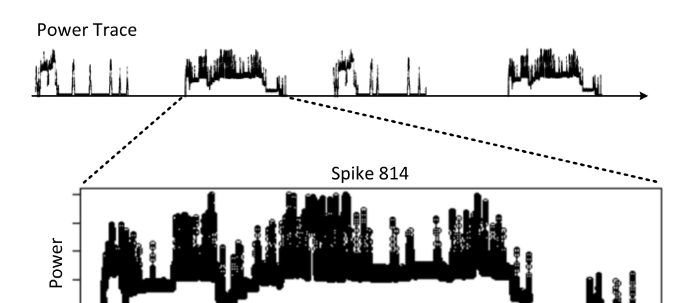
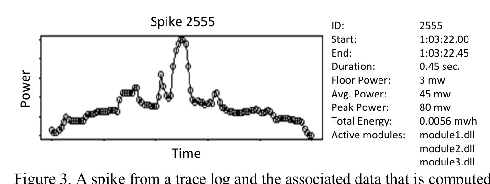

Time

Figure 2. Examples of a power trace (usually taken from a 12 hour test session on a mobile device) and a power spike. Spikes are isolated based on longer periods of inactivity in the power trace. Each such spike is normalized in time to range from 0 to 1.

at certain points in time. Next we collect traces of power consumption over time. Finally we align and combine both sources into the data that we use throughout this paper.

The data collection is briefly summarized below; for the details we refer to a technical report [7].

When a mobile device is tested for power usage, a recent build is loaded onto the phone. Based on the operations that are being tested, a number of tests (for example checking mail, browsing to web pages, or opening a map) are run repeatedly on the phone for a 12 hour period. The record of power usage is measured by a power meter (5,000 samples per second) and called a power trace.

As mobile devices optimize for power consumption, power traces show periods of inactivity (low power use), punctuated by brief periods of high activity (high power use). We term each of these high power intervals a power spike or just spike. Note that within a spike, there may also be fluctuations in power consumption. The duration of spikes ranges from one tenth of a second to several seconds. In order to isolate individual power spikes in a power trace, we use the periods of inactivity as shown in Figure 2. In some cases a manual approach may also be used depending on the nature of the test cases, for example, when there are not enough idle periods in the data. For the analyses presented in this paper, we used so-called idle tests, which on purpose leave enough idle time between test activities.

After identifying spikes and aligning power traces with execution logs, we have the following information available for each spike (example is depicted in Figure 3):
- Spike ID, a unique identifier for the spike
- Start time and end time
- Duration
- Floor power (milliwatt)
- Average power (milliwatt)
- Peak power (milliwatt)
- Total energy consumed (milliwatt hours)
- Active modules, i.e. the modules which had code executed during the spike.

This data allows us to perform a number of analyses on energy use as discussed in Section 5–7. To facilitate access, we store the spike information in a database.



Active modules: module1.dll, module2.dll, module3.dll

Figure 3. A spike from a trace log and the associated data that is computed and stored in a database for further analysis.

In addition to the above information, each spike is linked to the power trace that it originated from. For power traces we record in the database:
- Build ID, which allows finding the associated state of the source code.
- Model of the mobile device that was used to collect the trace.

Note that for the analysis presented in this paper we do not aggregate spikes across different mobile device models because they may have slightly different power utilization characteristics due to varying specifications (such as display type, processor speed, existence of specific sensors).

## 5. WHAT MODULES CONSUME THE MOST POWER?

It is not trivial to identify the energy consumption of a single module because energy consumption can only be directly linked to a set of modules and not individual modules in the data. Spikes often have tail-end energy which cannot be attributed to any single module in the spike. Granularity limitations are another reason. In order to isolate the energy consumption for different modules we use decision trees [8], a supervised learning technique. For this analysis, we use data of the following format (for space reasons, we show only three lines of input data):

```
Spike ID  Adrion.dll Allen.dll Bachman.dll Backus.exe  …  Zweben.exe  Avg. Power (mW)
123338   1         0        0          1            …   1           254.76
123563   0         0        1          0            …   1           680.23
123789   0         1        1          0            …   0           110.56
…        …         …        …          …            …   …           …
```

Each observation has a unique spike identifier, followed by flags to indicate the presence of modules in the spike (0 for absence, 1 for present), and the average power consumption. For legal reasons, we anonymized module names throughout the paper with the last names of laureates of ACM Turing Awards as well as ACM SIGSOFT Distinguished Service Awards, Outstanding Research Awards, and Influential Educator Awards.

We use decision trees [8] to model the influence of modules on average energy consumption because they can capture non-linear interactions and are descriptive models that are easier to understand. In our case, the inner nodes indicate the presence of certain modules (yes/no). Each node holds the average energy consumption for several spikes (as described by the path to the root node). For example in Figure 4, node 3 lists an average energy consumption of 85.9 mW for the 795 power spikes for which Mills.dll is absent and Leveson.dll is present.

The decision trees can help developers to better understand how power consumption and modules are related in one or more traces.