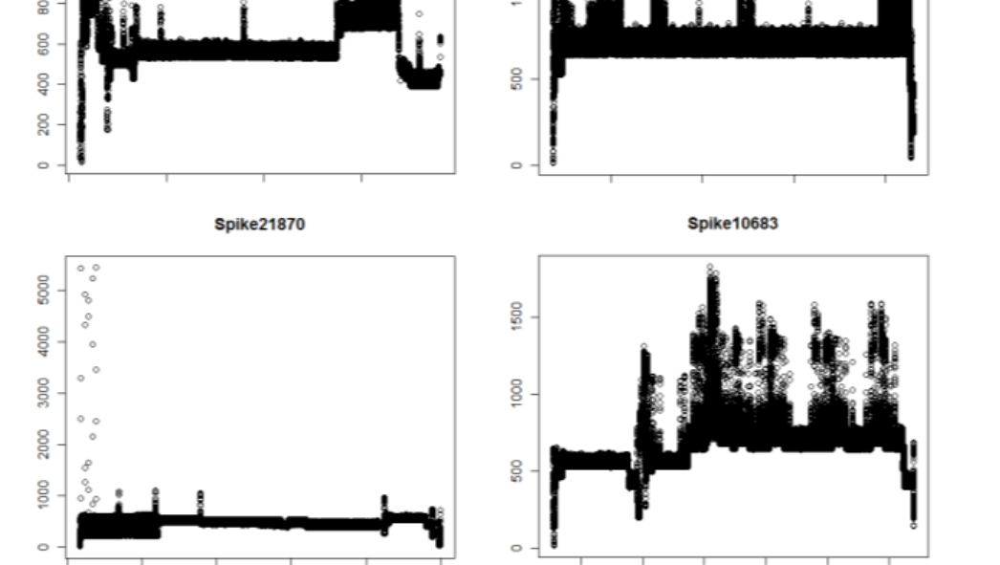
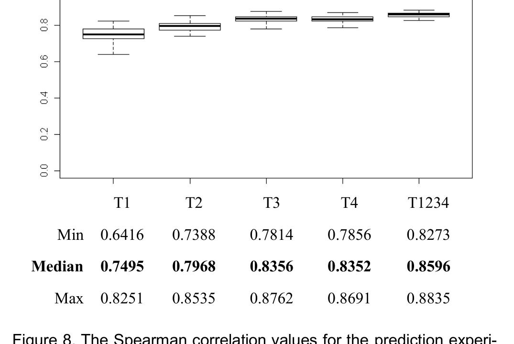

Figure 7. Several of the anomalous spikes identified by our approach. They were marked as anomalies because of their high energy consumption over a long period of time.

An example see the spikes k814 to k17278 for module Sommerville.dll in Figure 6. Then iteratively at each stage the two most similar clusters are joined until there is just a single cluster. For example k1887 and k17118 are joined first and later combined with the cluster of k4091 and k8438. The result of hierarchical clustering is a tree-diagram of clusters (called dendrogram) that indicates the join order. The tree can then be cut into a certain number of clusters; in Figure 6 we cut the tree in two clusters as indicated by the red boxes. The number of clusters can either be provided by the developer or automatically be inferred based on the similarity across clusters.

To evaluate the automated clustering approach we built a gold set by manually clustering 588 spikes based on similarity of the shapes. The first four authors sorted 147 spikes each, resulting in four separate clusterings. Then clusters were discussed and the four authors agreed on one clustering with 9 clusters for all 588 spikes.

Next we automatically clustered the 588 spikes with Ward and Kullback-Leibler. To quantify the quality of the automated clustering, we compared it to the gold set by (1) computing the Variation of Information (VI) index, which is typically used to quantify the similarity between clusterings [11], and by (2) manually inspecting the two clusterings. The VI index and manual inspection showed a high agreement between the automated clustering and the gold set; for details we refer to a technical report [7].

Automated clustering of spikes can also help with the identification of inconsistencies and anomalies. In our analysis of power traces, several individual spikes did not fit any cluster well. We considered those spikes to be outliers and reported them to developers. The developers confirmed the anomalies and were able to find bugs associated with modules Mills.dll, Ritchie.dll, Holzmann.dll, and Wirth.dll. The reason for the bug was a communication client (Wirth.dll), which was waking up every 30 minutes, but was not closing the network socket (Mills.dll) properly. The anomaly showed up as several spikes that were either running longer (several minutes) than other spikes within their clusters or as spikes that did not fit any cluster. Several anomalous spikes are displayed in Figure 7; they stand out by their high average power consumption over a longer period of time.

Figure 8. The Spearman correlation values for the prediction experiments. The median Spearman correlation ranges from 0.7495 to 0.8596, which is considered to be a strong correlation.

## 7. CAN WE PREDICT OVERALL POWER CONSUMPTION?

Mobile applications are often developed within a power budget, i.e., on average the application is only allowed to consume a certain amount of energy. Models that estimate power usage prior to development help developers in planning and allow them to stay within a power budget.

### 7.1 Predicting power consumption

To predict power consumption, we use linear regression models, i.e., predict the spikes that consume most power on average based on the modules used. To test the hypothesis that power consumption can be predicted with modules used by an app, we built and tested prediction models for five different datasets:

- T1, T2, T3, and T4 are power traces (with 843, 912, 828, and 634 spikes respectively) and
- T1234, which is the combined dataset of T1–T4 (with 3215 spikes)

The datasets contain for each spike, a list of associated modules (input variables) and the average power consumption during the spike (output variable).

### 7.2 Evaluation of the predictions

To assess the predictive power of the linear regression models we used a standard evaluation technique for prediction experiments called data splitting [12]: for each dataset, we randomly selected two thirds as training and one third as testing set and repeated this step 50 times. To evaluate the quality of predictions, we compute Spearman rank correlation between the predicted and observed ranking. Spearman correlation is a commonly-used robust correlation technique because it can be applied even when the association between elements is non-linear [13] and is frequently used to assess prediction experiments. Positive correlations result in a value of 1 and negative correlations in -1. For no correlation between elements, the correlation value is 0. In particular, a high positive value for Spearman means that two rankings are similar (or identical for a value of 1). For the purpose of our experiments, values close to 1 are desirable because they indicate that the predicted ranking does (closely) match the actual ranking.