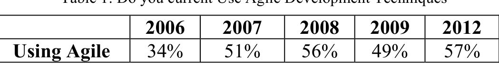
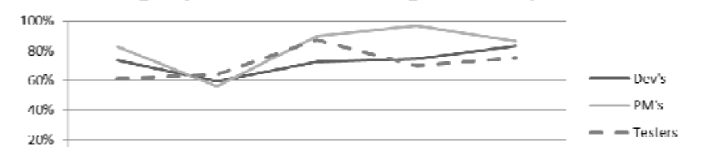
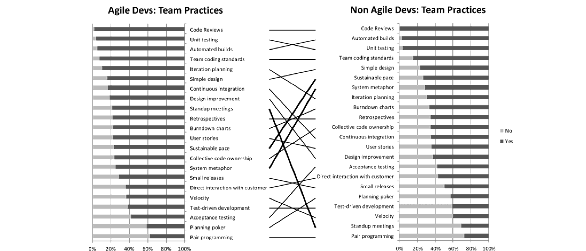
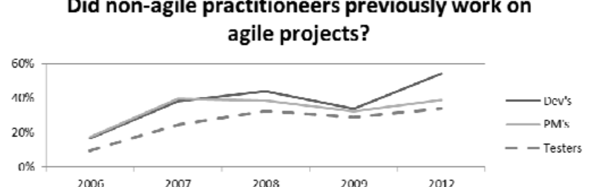
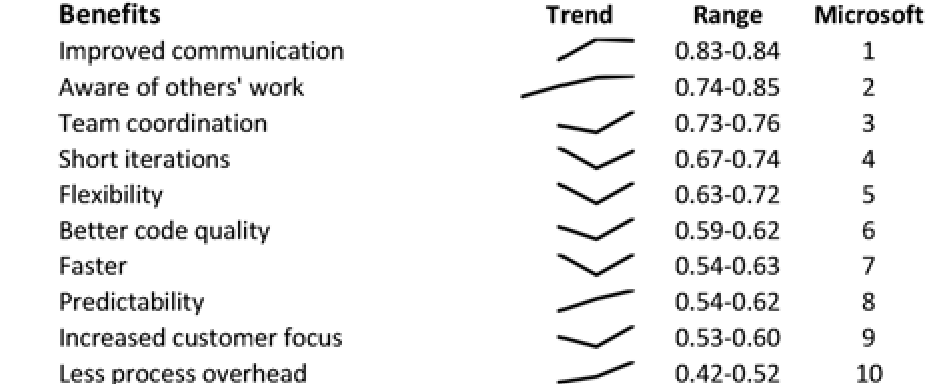
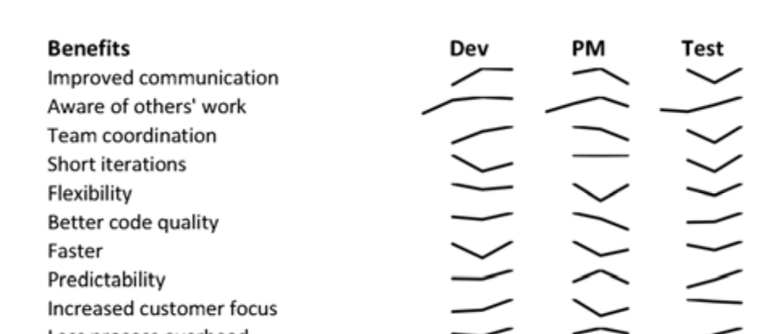
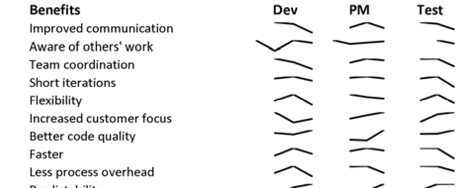
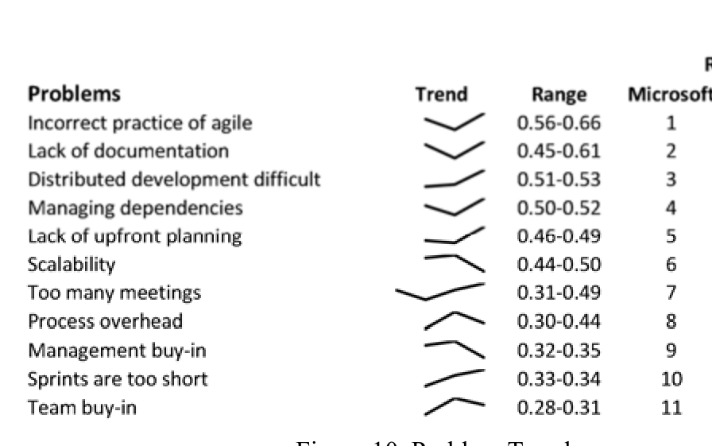
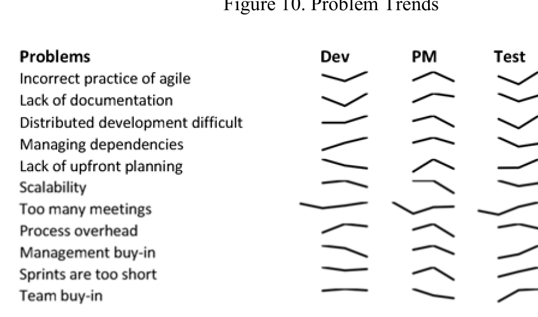
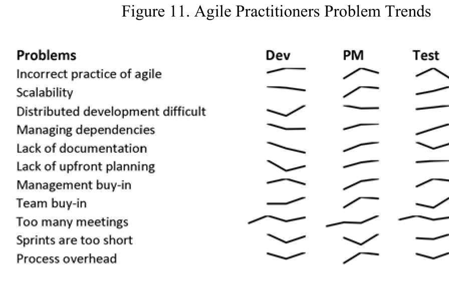

# Have Agile Techniques been the Silver Bullet for Software Development at Microsoft?

Brendan Murphy — Microsoft Research, Cambridge, UK — bmurphy@microsoft.com  
Christian Bird — Microsoft Research, Redmond, USA — cbird@microsoft.com  
Thomas Zimmermann — Microsoft Research, Redmond, USA — tzimmer@microsoft.com  
Laurie Williams — NCSU, Raleigh, USA — williams@csc.ncsu.edu  
Nachiappan Nagappan — Microsoft Research, Redmond, USA — nachin@microsoft.com  
Andrew Begel — Microsoft Research, Redmond, USA — andrew.begel@microsoft.com

## Abstract—Background

The pressure to release high-quality, valuable software products at an increasingly faster rate is forcing software development organizations to adapt their development practices. Agile techniques began emerging in the mid-1990s in response to this pressure and to increased volatility of customer requirements and technical change. Theoretically, agile techniques seem to be the silver bullet for responding to these pressures on the software industry.

Aims. This paper tracks the changing attitudes to agile adoption and techniques, within Microsoft, in one of the largest longitudinal surveys of its kind (2006–2012).

Method. We collected the opinions of 1,969 agile and non-agile practitioners in five surveys over a six-year period.

Results. The survey results reveal that despite intense market pressure, the growth of agile adoption at Microsoft is slower than would be expected. Additionally, no individual agile practice exhibited strong growth trends. We also found that while development practices of teams may be similar, some perceive and declare themselves to be following an agile methodology while others do not. Both agile and non-agile practitioners agree on the relative benefits and problem areas of agile techniques.

Conclusions. We found no clear trends in practice adoption. Non-agile practitioners are less enamored of the benefits and more strongly in agreement with the problem areas. The ability for agile practices to be used by large-scale teams generally concerned all respondents, which may limit its future adoption.

Index Terms—Agile, agile development, survey, interviews

## I. INTRODUCTION

The needs of customers, distribution mechanisms, and market pressures often drive the release cycle of software products. For Microsoft and other large companies, the principal software customers had historically been businesses that went through costly acceptance testing before installing the software on their internal computers. Frequent releases of software place a strain on this type of customer and, therefore, were not desirable. Additionally, software was often delivered to the customers in a physical form, such as a box set, whose production and distribution caused considerable cost and time delay. In theory, "traditional" formal or waterfall methods development methodology was used to develop these large software products. In reality, many large software companies did not religiously follow any specific development methodology and adapted methods and tools to suit the products they were producing.

Over time, consumers of software and software-intensive products increasingly welcomed more frequent software releases. Simultaneously, software began to be distributed electronically, and software-as-a-service (SaaS) increased in popularity. Traditional methodologies were viewed as too slow, not customer focused, not adaptable and too bureaucratic to handle the new software reality. In response, agile methods emerged in the mid-1990s, and the Agile Manifesto1 was published in 2001 to propose methods to allow faster software development and release. The techniques proposed by the Manifesto authors were not new but were adaptations of method already in operation packaged to address a growing problem of releasing high-quality, valuable software frequently.

Many companies have adopted agile methods, especially in the area of SaaS (e.g. Google), where releasing and distributing software is cheap and fast. These companies are feature driven and, therefore, need a rapid software development and release model. Software defects can be quickly corrected and made available to their customer base.

Software companies are now releasing products more frequently, which challenges traditional software development methodologies and makes agile methodologies seem a better fit. The question is whether companies are moving towards agile methods and if not, why not.

The empirical strategy applied in this paper is to track the usage, practices and perception of agile within Microsoft based on the results of interviews and five annual surveys taken between 2006–2012. (We previously reported results for the first survey [4, 3]). To improve interpretation, respondents were asked to categorize themselves as either agile practitioners or not and also to specify their job roles. The survey assumed that respondents correctly categorized themselves as either agile or non-agile practitioners. The survey results within Microsoft were benchmarked against the software industry as a whole, by comparing the results against the equivalent industry-wide re-

1 http://www.agilemanifesto.org

---

Results from an annual survey from software tool manufacturer, VersionOne (http://www.versionone.com/).

The rest of this paper is organized as follows. In Section 2, we provide information on related work. Sections 3-5 present our data collection and analysis methods, research questions, and results, respectively. In Section 6 we reflect on our findings, Section 7 discusses threats to validation, and we conclude in Section 7.

## RELATED WORK

While many reports of individual teams have been published, generally little empirical data exists to support the growth of agile software development methodologies or individual practices in the software development industry. Forrester analyst Dave West presented in 2009 that agile software development presented a means for dealing with the problem of increasing software development complexity [8]. At this time, Forrester also announced that 30% of the organizations they surveyed reported using agile practices. A survey conducted two years prior with a different sample group found that only between 8–10% were using agile practices [8].

A survey of 399 project managers and ten post-hoc case studies [9] indicated that the agility dimensions response extensiveness and response efficiency are traded off. Response efficiency positively affects on-time completion, on-budget completion, and software functionality. Response extensiveness positively affects only software functionality. The results also suggest that team autonomy, as espoused in agile methodologies, has a positive effect on response efficiency and a negative effect on response extensiveness.

A case study in large-scale development [10] at Ericsson AB identified issues and advantages with agile software development. Ericsson used a hybrid agile methodology consisting of Scrum and Extreme Programming as well as other incremental and iterative development practices. The principal results of the case study are that issues arise when using agile in large-scale software development. For example, using small and coherent sub-teams increases control over the project, but leads to new issues on the management level where the coordination of the sub-teams has to take place.

## DATA COLLECTION AND ANALYSIS

### III.A. Data Collection

Over the course of six years, five annual surveys, internal to Microsoft, were administered. The years that the survey was collected were 2006, 2007, 2008, 2009 and 2012. The questions contained in the survey expanded to reflect changes in agile practices and also the lessons learned from running prior surveys. Additionally, interviews were conducted with five engineers and managers in 2012 to explore in more depth survey responses.

### III.B. Survey Audience

The target audiences for the survey are people in a variety of product groups within Microsoft. Any person who filled in the survey in a previous year were excluded from the target audience for future surveys, ensuring people with strong views on the subject did not bias the results. The survey was sent out to a large target audience and traditionally about a third of people responded to the survey.

As part of the survey the respondents filled in their job role with 97% of the people fitted into one of the following roles:
- Developers (46%). Engineers whose primary focus is in software development.
- Testers (32%). Engineers whose primary responsibility is component or system testing of products.
- Project Managers (PM) (19%). Engineers or Business Managers whose primary focus is to manage the interface between the developers and other internal product groups and external customers.

Within Microsoft, these three positions form what is often referred to as the “triad organization.” The remaining 3% of job roles could not be categorized into one of the above roles (e.g., director), so their responses were ignored in the analysis. A total of 1,969 people fitted into these categories, 427 in 2006, 369 in 2007, 330 in 2008, 451 in 2009 and 392 in 2012. Table 1 provides the breakout of respondents who say they use agile techniques versus those that use non-agile techniques.

### III.C. Analysis

While the design of the survey did attempt to maintain consistency in the format of the question and response type, variations did still exist. Respondents always had the option to not answer a question. For some questions, the response choice included: Yes; No; Not Applicable (N/A). For questions probing sentiment, respondents could answer Strongly Agree; Agree; Neutral; Disagree; Strongly Disagree; and N/A.

The Likert scale allows the option of a number of different ordered responses. No agreed standard exists on whether to use a balanced scale (an even number of positive or negative responses and include a neutral response) or a forced scale which removes the neutral response [1]. Not allowing a neutral response simplifies analysis. However, not providing the neutral response on the survey precludes the survey respondent from legitimately indicating he or she had no opinion.

In our analysis, all responses were grouped into four categories
1. Agree: includes Strongly Agree, Agree and Yes responses.
2. Disagree: includes Strongly Disagree, Disagree and No responses.
3. Neutral
4. N/A and no responses

For the analysis, no assumptions were made when a person responded in the last category of N/A or did not answer the question. The paper includes the first three categories of Agree, Disagree and Neutral in all analysis.

### III.D. VersionOne Survey

VersionOne, an agile project management tool producer, has conducted an annual global survey of agile adoption and practices since 2006. VersionOne aggressively publicizes this survey at conferences and via email campaigns asking people to participate. In this paper, we compare with survey results

---

from 2006–2011 [18, 14, 16, 17, 13, 15]. Each year the survey has provided a report on the status of organizations currently implementing or practicing agile methods. Respondents come from every industry vertical from financial services, healthcare, and education to video games, government, and defense. The number of respondents grew annually from 722 in 2006 to 6,042 in 2011, with respondents from up to 91 countries around the globe. The job role distribution of respondents is similar to the Microsoft respondents, as outlined in Section 3.2.

In Section 5, when possible we compare Microsoft’s agile trends with general industry agile trends per the VersionOne survey. The Microsoft survey results could be divided into agile and non-agile practitioners and into role of the respondent. These divisions were not provided with the VersionOne results. We assume all VersionOne respondents were agile practitioners. Comparisons by role are not possible.

## IV. Research Questions

This paper addresses the high-level research question “Is the current focus on increasing the frequency of releasing software products resulting in a movement towards agile design methodologies at Microsoft?”

This paper breaks down that high level question to 12 questions that can be subjectively answered, based on the survey responses, specifically:

### IV.A. What are the characteristics of agile usage?

To understand the characteristics of agile usage, we analyze the following questions:
- Is the usage of agile techniques increasing?
- Do practitioners enjoy using agile techniques?
- What percentage of people who developed products using agile techniques no longer uses the techniques?

### IV.B. Which agile practices are used by developers?

Team practices have evolved since the Agile Manifesto was authored. Additionally, practices often associated with agile may be used by engineers who do not claim to be agile practitioners. We examine and contrast the practices adopted by both agile and non-agile practitioners. The following questions address this issue.
- Do software development practices vary by job role?
- Do practices used by agile practitioners differ from non-agile practitioners?
- Are the adopted practices changing over time?

### IV.C. What are the perceived benefits of agile techniques?

The perception of agile benefits may increase or decrease adoption rates. Therefore, we analyzed if the perception of the benefits of agile techniques differs between agile and non-agile practitioners.
- Do the perceived benefits of agile vary by job role?
- Do the perceived benefits of agile differ between agile and non-agile practitioners?
- Are the perceived agile benefits changing over time?

### IV.D. What are the perceived problems of agile techniques?

Similarly, the perception of the problems associated with agile may affect adoption rates. Therefore, we analyzed if the perceived problems associated with applying agile techniques differ between agile and non-agile practitioners.
- Do the perceived problems of agile vary by job role?
- Do the perceived problems of agile differ between agile and non-agile practitioners?
- Are the perceived agile problems changing over time?

The next section addressed these questions.

## V. Survey Analysis Results

### V.A. Agile Usage

As discussed, the analysis in this paper only includes the people who responded to the survey with job roles of developer, tester, or PM. In this section, we provide quantitative data on survey responses. In Section VI, we provide more qualitative analysis of these results based upon the experience of the authors and upon five interviews.

#### V.A.1) Is the usage of agile techniques increasing?

The results of asking the question of whether people currently use agile development techniques are shown in Table 1. The table indicates that between 2006 and 2007 agile usage increased sharply. Subsequently, the general usage trend has been slowly increasing or stabilizing.

Table 1: Do you currently Use Agile Development Techniques

|  | 2006 | 2007 | 2008 | 2009 | 2012 |
|---|---:|---:|---:|---:|---:|
| Using Agile | 34% | 51% | 56% | 49% | 57% |

> **Image description:** A one‑row table reporting the share of survey respondents who self‑identified as using agile development techniques in five Microsoft internal surveys (2006, 2007, 2008, 2009, 2012). The reported percentages are: 34% (2006), 51% (2007), 56% (2008), 49% (2009), and 57% (2012). The pattern shows a large jump between 2006 and 2007, a rise to a 2008 peak, a dip in 2009, and a rebound by 2012, indicating overall modest growth and then stabilization of agile adoption around the mid‑50% range. These figures come from the paper’s longitudinal surveys of Microsoft engineers (total N=1,969 across years; roughly 330–450 respondents per year).

#### V.A.2) Do practitioners enjoy using agile techniques?

As shown in Figure 1, the respondents who use agile techniques indicated that they like using the techniques. The general trend is an increase in the percentage of practitioners who like using the technique. Attitudes were similar among the three job roles.

> **Image description:** Line chart (Figure 1) showing the percent of respondents who report that they like using agile techniques, plotted for Developers (solid dark line), PMs (light line) and Testers (dashed line) across the surveyed years. The vertical axis is percent (20%–100%) and the three role-based traces follow a similar pattern: a modest decline in the middle survey years followed by a pronounced rebound to a peak and then a slight settling. PMs generally report the highest positive attitudes, but by the final survey all three roles converge with a high majority expressing that they like using agile techniques. This supports the paper’s finding that practitioners who use agile tend to enjoy it and that attitudes have increased overall over the study period.

Figure 1. Attitude to Using Agile Techniques

#### V.A.3) What percentage of people who developed products using agile techniques no longer uses the techniques?

The data portrayed in Figure 1 would indicate that when people use agile methodologies, they like the technique. However, Figure 3 indicates that some respondents no longer use agile development techniques.

These results indicate that a respondent that had been using agile techniques willingly moves to a team that does not agile

---

> **Image description:** Two side-by-side horizontal stacked bar charts compare the percentage of agile and non‑agile developers who report using 22 team practices (dark bars = Yes, light = No) with a central spider of connecting lines showing rank order differences between the groups. For both cohorts the most commonly used practices are Code Reviews, Unit Testing and Automated Builds (near the top of each list and high percent Yes), and the least-used practices include Pair Programming and Planning Poker (near the bottom). The overall ranking of practices is similar between groups, but some practices differ strongly — for example, Stand‑up meetings are used far more by self‑identified agile teams (the paper reports a ~48% difference), while a few ostensibly “agile” practices (System Metaphor, Sustainable Pace) appear relatively more common among non‑agile respondents. The figure supports the paper’s point that many standard, tool‑driven practices are widely adopted across Microsoft regardless of whether teams label themselves agile.

Figure 2. Differences in Practices between Agile and non-agile practitioners

practices, or does not classify themselves as an agile team. Additionally, the respondents do not try to convert their new team to the technique.

> **Image description:** A three‑line time series showing the percent of non‑agile respondents who had previously worked on agile projects, reported for Developers (dark solid line), Project Managers (lighter solid line) and Testers (dashed line) for survey years 2006, 2007, 2008, 2009 and 2012. All three roles rise from low levels in 2006 (~10–20%) to roughly 35–40% in 2007–2008, dip to about 30–35% in 2009, then diverge by 2012: Developers increase sharply to around 50–60%, PMs to roughly 35–45%, and Testers to about 30–35%. The chart indicates that a substantial minority of people who currently identify as non‑agile have prior agile experience, with developers showing the largest increase by 2012.

Figure 3. Experience of Non-Agile Practitioners

Currently implementing or practicing agile methods.

## V.B. Team practices

In all surveys, questions were asked regarding the development practices, primarily focusing on the most popular agile practices. The same 14 questions were asked in each of the different surveys, but over time an additional eight questions were added, reflecting the continuous evolution of agile techniques.

The same questions were asked of all respondents, irrespective of their job role and whether they are agile practitioners or not. While the questions were focused on agile practitioners, the practices are often generic and a number of non-agile developers also responded to these questions, which allows comparisons to be made between the practices of agile and non-agile practitioners.

Each respondent was asked if he or she used a practice and could provide a Yes response, a No response or could skip the question.

### V.B.1) Do practices vary by job role?

The agile practitioners, irrespective of their job titles, responded to the questions on team practices. We analyzed the practice for all responses and by job role by averaging the results for all years.

The team practices applied by the agile practitioners did not vary greatly between the three roles of developers, testers and PMs. The PMs had the greatest number of positive responses to performing agile practices with 78.3% average positive response to the questions. Testers had an average positive response of 75.7%, and developers had a 75.2% average positive response.

Some differences by role are worth highlighting. In only one practice, Acceptance testing, was there a greater than 10% difference in behavior between testers and developers. Testers were 14.4% more likely to perform Acceptance testing than developers. PMs were more than 10% more likely to perform the practices of Retrospectives, Burndown Charts, User Stories, Direct Interaction with Customers and Acceptance Testing than developers. Developers were more than 10% more likely to perform the practice of Collective Code Ownership.

### V.B.2) Do team practices vary between agile and non-agile practitioners?

In general, the non-agile practitioners were less likely to follow the practices than agile practitioners. On average 75.2% of agile practitioners were likely to perform a practice as compared to 63.5% of non-agile practitioners. In 12 practices, agile practitioners were 10% more likely to perform a practice than non-agile practitioners. For four practices (Test-driven development [2], Velocity, System Metaphor and Iteration planning) agile practitioners were 20% more likely to follow these practices, and for Stand up meetings the difference was 48%.

Figure 2 presents a ranked comparison of the use of agile practices by agile and non-agile developers. The lines between

---

The two sides join the use of the practices between the two groups. We observe that the ranking of the practices between the two groups is not that different, implying the practices used by each group is relatively similar. The largest difference in the relative order of the practices are Stand-up meetings which are done more by agile practitioners; and System metaphor and Sustainable pace which are done more by non-agile practitioners despite the identification of these two practices as distinctly agile practices.

The top three practices that are followed by both agile and non-agile practitioners (Code Reviews, Unit Testing and Automatic Builds) are standard practices within Microsoft. A greater percentage of non-agile practitioners follow these practices than agile practitioners. Tools are available to simplify the use of these practices, which aids in their adoption. This observation drives the interesting question of whether practice adoption in large teams, such as Microsoft, is driven by tool support or by methodology.

### V.B.3) Are the adopted practices changing over time?

None of the practices showed a consistent trend for all of the job roles, negatively or positively, across all surveys. Figure 4 shows the Sparkline trends for 22 practices for all respondents, ranked by the annual average response range. A Sparkline is a very small line chart, typically drawn without axes or coordinates. The line presents the general shape of the variation (typically over time) in some measurement in a simple and highly condensed way. Not all practices appeared in all surveys, as indicated by a shorter Sparkline. In general, the Sparklines show that few of the practices show a strong movement in acceptance or rejection over the past six years.

> **Image description:** A ranked table of 22 team practices showing a small sparkline trend for each practice, the annual range of respondent adoption (as proportions), and rank positions for Microsoft and for the VersionOne industry survey. The top three practices at Microsoft are Code Reviews (0.98–0.99), Unit testing (0.94–0.97) and Automated builds (0.93–0.96); low-adoption practices include Pair programming (0.36–0.42) and Planning poker (0.28–0.67). The sparklines indicate most practices are fairly stable over the monitored years (few consistent upward or downward trends), and the Microsoft vs VersionOne ranks show differences — for example Standup meetings and Iteration planning rank higher in the VersionOne industry results while Microsoft ranks tool-driven engineering practices highest. These numeric ranges correspond to the fraction of survey respondents reporting they use each practice across the years covered.

Figure 4. Trends in Agile Practices

The range provides the percentage of respondents that indicate use of the practice, and indicates movement in acceptance/rejection over time. The average size of the variation in responses across all questions and all job roles is 23% (i.e. the min value of Yes respondents is on average 23% different to the max value). Analysis of the respondents in each individual job role shows a much smaller fluctuation. Over the six-year period, the average range in responses from developers is 23% (in 11 questions the ranges is less than 10%), for PM the average range is 15% (in seven questions the range is less than 15%) and for testers the average range is 12% (with nine practices having a range of less than 10%). These results indicate relative stability in the use of the practices during the six years.

The team practice that showed the greatest range is Planning poker [7] which has a total range of 48%. While the Planning poker practice has been around since 2002, the use of this practice has only become popular in recent years. The practice that has been monitored across all surveys which is showing a strong increase in usage is User Stories. The large range on response is mainly driven by responses from developers where the acceptance of this practice has gone from 64% to 84%.

The practice with the second highest range is Test-driven development (17%). This high range is driven by the responses from Developers. The use of the practice is dropping over time.

To compare Microsoft’s use of agile practices with industry use, Figure 4 also provides the ranking of the average use of the practice on the six years of VersionOne surveys. The Microsoft surveys and the VersionOne surveys did not always ask about the same set of practices. As a result, the VersionOne ranking has some gaps in the ranking, and only 14 of the 22 practices can be compared. Ten of the 14 practices had very similar rankings: six practices had the same ranking or a ranking within two positions of each other; and four practices had rankings within 3–4 positions of each other. Microsoft had a higher ranking for Team coding standards. The industry, as portrayed by the VersionOne survey, uses Standup meetings, Velocity, and Test-driven development significantly more often than Microsoft.

### V.C. Perceived Benefits of Agile

A set of generic benefits were chosen that are often claimed by teams that adopt agile practices. Only the surveys from 2008 onwards contained questions regarding the benefits of agile methods, with the exception of the question regarding the awareness of other people’s work was also asked in 2007 survey. In this section, the average perception is calculated by dividing the number of agree/disagree/neutral (see Section 3.3) responses divided by the total number of responses for all users across all the years the question was asked.

#### V.C.1) Do the perceived benefits of agile vary by job role?

For agile practitioners, the PMs have the highest perception of agile benefits across the different job roles. The PMs also have the lowest Neutral perception of the benefits of agile and the lowest negative response to the question of benefits. The average response for PMs was 71.8% positive responses, 19.3% Neutral response and 8.9% negative responses. This distribution compares to developers who, on average, have a 64.5% positive response, 22.4% Neutral response and 13% Negative response. Testers have a 65.7% positive response, 21.8% neutral response and 12.5% negative response.

For agile practitioners, all job roles believe that Improved communications is the highest perceived benefits of Agile fol-

---

> **Image description:** A ranked list of ten perceived benefits of agile practices showing a small trend sparkline and the range of yearly agreement (proportion of respondents) for each benefit. The top three benefits by Microsoft respondents are Improved communication (0.83–0.84, rank 1), Awareness of others’ work (0.74–0.85, rank 2), and Team coordination (0.73–0.76, rank 3). Middle-ranked items include Short iterations, Flexibility, and Better code quality (ranges ~0.59–0.74), while the lowest agreement is for Less process overhead (0.42–0.52, rank 10). The tiny sparklines indicate mostly stable perceptions over the surveyed years with only modest upward or downward movement for specific items.

Figure 7. Benefits Trends

> **Image description:** A vertical list of ten claimed agile benefits (e.g., Improved communication; Aware of others’ work; Team coordination; Short iterations; Flexibility; Better code quality; Faster; Predictability; Increased customer focus; Less process overhead) is shown at left, and three narrow sparklines columns at right give year-by-year agreement trends for Developers (Dev), Project Managers (PM) and Testers (Test). Each sparkline summarizes the fraction of agile practitioners who agreed a benefit applied over the annual surveys (benefits questions were asked from 2008 onward, with one item in 2007), showing modest year-to-year variation but no dramatic, consistent rises or falls. Consistent with the paper’s analysis, the PM sparklines tend to be higher than Developers’ and Testers’ (PM average positive response ≈71.8%, Dev ≈64.5%, Test ≈65.7%), and ‘‘Improved communication’’ is the most strongly endorsed benefit across all three roles.

Figure 8. Agile Practitioners Perceived Benefits

> **Image description:** A column of listed agile benefits (e.g., Improved communication; Aware of others’ work; Team coordination; Short iterations; Flexibility; Increased customer focus; Better code quality; Faster; Less process overhead; Predictability) is shown at left, with three narrow sparkline columns to the right labeled Dev, PM, and Test. Each sparkline encodes the time series (annual survey responses) of percent of non‑agile respondents in that role who agreed the item was a benefit; visually, PM lines are generally higher and flatter, developers show larger year‑to‑year swings, and testers fall between the two. The figure therefore highlights that non‑agile practitioners broadly recognize communication and coordination benefits consistently, while perceived benefits such as reduced process overhead or predictability are weaker or more variable across roles; the paper notes overall variation across years/roles is about 32%, with developers showing the largest role variation (~22%).

Figure 9. Non-Agile Practitioners Perceived Benefits

For non-agile practitioners, the range by year of positive response is larger, as shown in Figure 9 with the total variation across all years and across all roles is 32% with developers having the greatest variation in roles of 22%.

## V.D. Perceived Problems of Agile

A set of generic problems were chosen that are often claimed by teams that do not adopt agile practices. The surveys from 2008 onwards contain questions regarding the perceived problems of agile methods, with the exception of the question regarding too many meetings which was asked in the 2007 survey. In this section, the average perception is calculated by dividing the number of agree/disagree/neutral (see Section 3.3) responses by the total number of responses for all users across all the years the question was asked. If a respondent provides a positive answer they indicate they agree that the area is a problem.

### V.D.1) Do the perceived problems of agile vary by job role?

For agile practitioners, all three job roles have similar perception of problems regarding agile usage. The average response for developers was 44.4% positive responses, 29.5% neutral response and 26.0% negative responses. PMs have a 42.6% average positive response, 26.6% neutral response and 30.8% negative response. Testers have a 45.6% positive response, 30.1% neutral response and 24.3% negative response.

Agile developers and testers perceive that Incorrect practices of agile is the highest perceived problem, whereas PMs believe this to be the second highest perceived problem with Distributed development being the highest perceived problem. Developers think Distributed development is the second highest perceived problem, whereas testers believe this to be the fifth highest perceived problem. The relative order of perceived problems occurring across all job roles varied considerably.

Non-agile practitioners exhibited similarities in the relative perceived problems across the job roles. The average response for developers was 51.7% positive responses, 29.8% neutral response and 18.4% negative responses. PMs have a 54.0% average positive response, 30.7% neutral response and 15.2% negative response. Testers have a 51.3% positive response, 35.2% neutral response and 13.5% negative response.

All job roles felt that Incorrect practices and Scalability were the largest problems associated with agile usage. All job roles also agreed that Process overhead and Sprints are too short are the least problematic areas associated. Non-agile practitioners agreed more on the relative order of problem areas between job roles as compared to agile practitioners.

### V.D.2) Do the perceived problems of agile differ between agile and non-agile practitioners?

As described in Section V.D.1, the average non-agile practitioner perception of the problems of agile is greater than the average agile practitioners. On average a non-agile developer perceives the problem area to be 7.2% greater than agile developers. For PMs, the percentage is 11.4%, and for testers, the difference is 5.7%.

These results differ from analysis of agile benefits with larger differences in the perceptions of agile problems between agile and non-agile practitioners. A higher percentage of non-agile practitioners believe that agile practices are problematic and a smaller percentage disagree with the statement that the practices was non-problematic. Specifically, the non-agile practitioner had stronger opinions in the negativity of agile problems than they had with disagreeing with agile benefits.

Comparison between agile developers and non-agile developers are depicted in Figure 6. The relative ordering of the perceived problems is different between agile and non-agile practitioners, for all job roles. The non-agile practitioners perceive the problems associated with large software development (Distributed development and Scalability) to be far greater than the agile practitioners. The non-agile practitioners perceive Management buy-in to be more of a problem than agile practitioners, perhaps because the agile practitioners’ manager(s) have already bought in to the use of agile techniques. Agile practitioners perceive Lack of documentation to be a bigger problem than non-agile practitioners, perhaps because they have suffered from this lack of documentation.

### V.D.3) Are the perceived agile problems changing over time?

For all respondents, none of the perceived problems have shown a consistent trend across the three monitored years across all job roles, as shown in Figure 10.

Figure 10 also provides a comparison of problem benefit ranking for the VersionOne survey. The problems on the Ver-

---

> **Image description:** A ranked list of eleven perceived problems with Agile as reported by Microsoft survey respondents, showing a small trend sparkline and the range of positive-response proportions across survey years for each problem. The top concerns are “Incorrect practice of agile” (rank 1, 0.56–0.66 proportion agreeing) and “Lack of documentation” (rank 2, 0.45–0.61), followed by “Distributed development difficult” (rank 3, 0.51–0.53) and “Managing dependencies” (rank 4, 0.50–0.52). Lower-ranked items include “Management buy-in” (rank 9, 0.32–0.35), “Sprints are too short” (rank 10, 0.33–0.34) and “Team buy-in” (rank 11, 0.28–0.31). The small sparklines indicate varying year-to-year movement but no consistent directional trend, matching the paper’s finding that perceived problems did not show a consistent change over time.

Figure 10. Problem Trends

> **Image description:** A compact matrix of sparklines: the left column lists eleven problem areas (Incorrect practice of agile; Lack of documentation; Distributed development difficult; Managing dependencies; Lack of upfront planning; Scalability; Too many meetings; Process overhead; Management buy‑in; Sprints are too short; Team buy‑in), and each row shows three tiny line charts for Dev, PM and Test illustrating how the percentage of agile practitioners who agree each item is a problem changed across the annual surveys. The small lines show variation rather than consistent upward or downward trends (the paper reports no consistent trend across years), with PM traces generally exhibiting larger year‑to‑year swings. The figure supports the text’s finding that “incorrect practices,” lack of documentation, distributed development and scalability are among the most commonly cited problem areas, while overall perceptions vary by role and year rather than moving uniformly in one direction.

Figure 11. Agile Practitioners Problem Trends

> **Image description:** A matrix of small sparklines showing year-to-year trends (across the surveys) in the fraction of agile practitioners who agreed each item was a problem, with one column per job role (Dev, PM, Test) and a vertical list of 11 problems on the left (e.g., Incorrect practice of agile; Scalability; Distributed development difficult; Managing dependencies; Lack of documentation; Lack of upfront planning; Management buy‑in; Team buy‑in; Too many meetings; Sprints are too short; Process overhead). The tiny line charts indicate moderate variation over time for many problems and different shapes by role; PMs show the largest year-to-year swings while Developers and Testers are somewhat more stable. Consistent with the paper’s text, “Incorrect practices” and “Scalability” appear as prominent concerns for agile practitioners, whereas “Sprints are too short” and “Process overhead” show relatively flat (less problematic) trends.

Figure 12. Non-Agile Practitioners Problem Trends

VersionOne survey do not always coincide with those in the Microsoft survey. The comparison indicates a difference in perceived problems. Lack of documentation was a top problem in both surveys. VersionOne’s problems also include Loss of management control (#2), Lack of predictability (#5), and Lack of engineering discipline (#6).

Breaking down the data for agile practitioners per job role is shown in Figure 11. For agile practitioners, the range of positive respondents for each question across all job roles across all years varies on average of 26%. The greatest variation in positive response is from PMs, where the average variation across the years is 15%.

For non-agile practitioners, the range of positive response is larger; the total variation across all years and across all roles is 30%. PMs have the greatest variation in roles of 22%. This is depicted in Figure 12.

## VI. REFLECTIONS

We have thus far reported quantitative results of a longitudinal survey on agile use at Microsoft. These results provide a view into how different project members use and feel about agile, their perceived problems, and opinions.

To qualitatively investigate agile at Microsoft, we interviewed five employees who have experience with agile and have taken on roles related to software process at Microsoft. Based on their responses to our questions regarding adoption of agile at Microsoft, we provide insights and reflections.

### VI.A. Scale

Multiple employees indicated that scale can become an issue when trying to practice agile. As an example, agile teams take direction from the product owner. The product owner should lead development by conveying their vision of the product and, as the manager of the product backlog, should negotiate the work to be performed with their team at the beginning of each coding phase. Perhaps most importantly, the product owner should always remain available to the team, meeting with them on a daily basis to answer questions and deliver direction. This seems reasonable for "two-pizza teams" and perhaps even projects with upwards of one hundred developers, but for projects like Microsoft Windows or Office, with thousands of developers, multiple owners in a "Product Owner Team" [12] are warranted. This "solution" may bring additional problems, as having a team fill the responsibilities required of a product owner in a consistent and cohesive way requires constant communication and coordination.

Project planning is another area that suffers from the issue of scale. One of the tenets of agile development is to be prepared for change. While managing dynamic plans for even small teams can be difficult, coordinating the change that is allowed in agile teams is greatly complicated in a large team.

The standard method of dealing with large development efforts is through modularity, dividing work into pieces and then allocating them into individual teams. Indeed, this method is used in hierarchical fashion to organize the people and work in large products at Microsoft. Maintaining uniform practices and processes across many levels of many teams is difficult, and in the face of different challenges, we have observed that teams develop their own culture and processes for completely valid reasons. Some teams decide to adopt agile and some do not. However, even if all made the choice to follow agile, inevitably heterogeneity in practices would ensue.

With large teams often comes geographically distributed development. Many of Microsoft’s projects have teams on multiple continents [5]. Co-located teams ease practices that are typically performed in person (e.g., pair programming). The added challenges of distributed teams may discourage teams from adopting agile practices or lead to failure when they do.

### VI.B. Tools

We found that the use of tools was a controversial topic when discussing practices. The Agile Manifesto itself eschews tools in favor of individuals and interactions. However, team size can reach into the thousands and are scattered around the globe; potential interactions can number in the millions. Tools can manage these interactions. Such management of interactions can have positive and negative effects.

---

As a positive example, the use of a code review tool within Microsoft allows developers to easily annotate changed code, enables developers to interact asynchronously and across vast distances, and recording results of code reviews for anyone to see has led to a marked increase in code reviews at Microsoft. Interviews with developers practicing code review have shown that they use the tool for review even when they conduct code reviews in person because the tool enables faster and more consistent review. This code review tool has served to increase collaboration and awareness between developers.

Other tools may actually inhibit personal interaction and collaboration. For example, many teams at Microsoft use Team Foundation Server (TFS) to manage planning and tasks because they are easy for people to use asynchronously and thus record and track all of their changes. However, one interviewee saw a problem, mentioning, “any tool that is designed to replace collaboration and trust has no role in an agile development organization, and a lot of the planning tools do that.” Another interviewee said, “until we’re able to collaborate with six and eight people at a time, I don’t see much point in tools to help us collaborate [with] four thousand people at a time.”

### VI.C. Agile Practice Interdependencies

Not all agile practices are created equal and some require more from a team than others. One interviewee indicated that practices that can be “isolated” and not require buy-in from a whole team or project may be easier to adopt. Examples of such practices include pair programming [19], code review, and unit testing. A few developers can decide to start doing these with little impact on or from the rest of the team or project. In contrast, smaller releases, collective code ownership, and stand up meetings require buy in from an entire team.

One interviewee indicated that a common problem when attempting to adopt agile practices was adopting them in the correct order. He said that test-driven development, pair programming, refactoring, and retrospectives form the technical core of an agile development team. These practices seem to reinforce themselves and are also mostly limited to the development role so the other roles “only need to be marginally supportive and willing to wait and see” for it to succeed. He indicated, “Once that’s in place then a lot of the other practices suddenly start making sense and they come in fairly naturally. But if I try to just roll in scrum planning or something, everyone asks for that […] but they all run into the same problems at three months and six months […] and there are a good number that kick out at that point” and that for other practices such as sprints and iteration planning, to be successful, the development team must already be competent at the technical core.

### VI.D. Empowerment and Incentives

Agile teams need to be given the ability to make their own decisions. As one interviewee told us, “going to iterative planning is a decentralization of decision making and if not everyone is on board for that cultural change then upper management [is afraid that they don’t] have control and they pull the plug.” To some degree, management must trust that a team can manage itself well and that level of trust may be hard to come by, especially in critical parts of a project or for teams that do not have a stellar track record. Teams that attempt to put into place a practice such as smaller releases or modify how the product backlog is managed may give up when faced with management pushback.

Some developers also indicated that they perceived a mismatch between the incentive structure and the behaviors that agile depends on. As an example, one respondent complained, “We’ve got some issues like [stack ranking] that prevent collaboration. There isn’t that much collaboration in the small.” A key ingredient in successful agile teams is collaboration (“agile favors people and interactions”). However, developers whom we interviewed told us that they are evaluated based on their own accomplishments and that they are directly compared to coworkers in their own team [6]. Engaging in agile practices, such as pair programming or reviewing another’s code, takes time away from one’s own contributions while increasing the value of another’s. Just as grading on a curve inhibits collaboration in the classroom [11], and we expect little difference when it is used in the work place. Project members are less likely to be successful in adopting practices if there is a perceived disincentive to their adoption.

### VI.E. Agile a Victim of its Own Popularity

Lastly, we hypothesize that agile may be a victim of its own popularity. During this study, every developer whom we talked to had heard the term “agile” and had some idea of what it was. However, we noticed a mismatch between the terms that developers used and the practices that they thought those terms represented. As an example, some developers interested in using “Testing in Production” thought that it meant shipping software without testing it ahead of time and looking at results after deployment to identify bugs. In fact, this doesn’t imply lack of pre-production testing, but rather active monitoring of deployed code for errors or anomalies that occur during usage that were not uncovered by standard testing. Developers may hear of terms or phrases, think they know what they mean, and decide they should start using them without enough research. Educating potential users of agile may go a long way toward making informed decisions about what agile practices will most benefit a team.

In addition, some proponents of agile (both at Microsoft and elsewhere) appear to become almost religious about its use. These proponents emphasize the potential benefits of using agile while often downplaying the cost or the learning curve. We observed in some the attitude of “if agile doesn’t work for you, then you’re doing it wrong.” Whether this is true or not (we do not claim either) is immaterial. In either case, teams have attempted to adopt an agile practice and have run into problems. Portraying agile as a nearly universal solution, downplaying its difficulties, or blaming the team when they do not reap the expected benefits, all serve to drive potential adopters away from agile practices. For example, in an interview of one non-agile practitioner, this practitioner had an abrupt “We are not an agile team” response. He later agreed that the team “strived for agility.” The religious fervor has seemed to drive some engineers and teams away from agile methodologies.

---

## VII. THREATS TO VALIDITY

The main threats to the validity of the findings of this paper are that the surveys only collected responses from within Microsoft. As we describe, when compared against equivalent VersionOne surveys, the results were similar, implying that our results are valid. Another possible threat is that only 1 in 3 engineers responded to the survey, which may result in the survey being completed by people who have strong opinions (positive and negative) in regard to agile. This threat is not unique to this study and is an inherent problem with surveys.

## VIII. CONCLUSION

This paper has analyzed the adoption and perception of agile practices within Microsoft over a six year period. During this time the pressures on software producers to increase the agility of their software development cycles have been considerable, whereas the adoption of agile practices within Microsoft has only shown a slow increase. Our results show that practitioners who follow agile have a high satisfaction level with the practice. However, the results also show that practitioners are content to move to projects that do not follow agile practices.

All job roles of both agile and non-agile practitioners agree on the relative order of the problems and benefits of agile practices. Agile practitioners, on average, view the benefits of agile usage more strongly than non-agile practitioners. However, the agile practitioners have a higher acceptance of the problems of agile. All groups of people agree that agile practices are problematic in areas relating to large scale software development. As a result, for adoption to increase techniques and tools need to be developed to address the concerns regarding agile practices for large software development projects. Non-agile practitioners already seem to appreciate the benefits of agile, therefore arguing the benefits of agile will not improve adoption.

We found no clear trends in practice adoption. The practices that are tool-driven have the greatest number of users by both agile and non-agile practitioners, which indicates that tool availability may be a greater driver of practice adoption than methodology, despite the de-emphasis of tools in the Agile Manifesto.

## IX. REFERENCES

[1] E. Allen and C. Seaman, "Likert Scales and Data Analyses," Quality Progress, no. pp. 64-65, 2007.  
[2] K. Beck, Test Driven Development -- by Example. Boston: Addison Wesley, 2003.  
[3] A. Begel and N. Nagappan, "Usage and Perceptions of Agile Software Development in an Industrial Context: An Exploratory Study," in Empirical Software Engineering and Measurement Conference (ESEM), Madrid, Spain, 2007, pp. 255-264.  
[4] A. Begel and N. Nagappan, "Pair programming: what's in it for me?," in ACM-IEEE International Symposium on Empirical Software Engineering and Measurement, Kaiserslautern, Germany, 2008, pp. 120-128.  
[5] C. Bird, N. Nagappan, P. Devanbu, H. Gall, and B. Murphy, "Does Distributed Development Affect Software Quality? An Empirical Case Study of Windows Vista," in International Conference on Software Engineering (ICSE 2009) Vancouver, Canada, 2009, pp. 518-528.  
[6] K. Eichenwald, "Microsoft's Lost Decade," Vanity Fair, no. August 2012.  
[7] J. Grenning, "Planning Poker or How to avoid analysis paralysis while release planning," 2002, https://segueuserfiles.middlebury.edu/xp/PlanningPoker-v1.pdf.  
[8] S. M. Kerner, "Agile Development Method Growing in Popularity," InternetNews.com, September 30, 2009, http://www.internetnews.com/dev-news/article.php/3841571/Agile+Development+Method+Growing+in+Popularity.htm.  
[9] G. Lee and W. Xia, "Toward agile: An integrated analysis of quantitative and qualitative field data on software development," MIS Quarterly, vol. 34, no. 1, p. 87, 2010.  
[10] K. Petersen and C. Wohlin, "A comparison of issues and advantages in agile and incremental development between state of the art and an industrial case," Journal of Systems and Software, vol. 82, no. 9, pp. 1479-1490, Sept. 2009.  
[11] B. L. Smith and J. MacGregor, "What is Collaborative Learning?," in Collaborative Learning: A Sourcebook for Higher Education, A. Goodsell, Ed. University Park, PA: Education Resources Information Center (ERIC), 1992.  
[12] J. Sutherland, A. Viktorov, J. Blount, and N. Puntikov, "Distributed scrum: Agile project management with outsourced development teams," in Hawaii International System Sciences (HICSS) 2007 Hawaii, 2007, p. 274.  
[13] VersionOne, "Survey of Agile Software Dev.," 2006, http://www.versionone.com/pdf/StateofAgileDevelopmentSurvey.pdf.  
[14] VersionOne, "Second Annual Survey 2007 The State of Agile Development," 2007, http://www.versionone.com/pdf/StateOfAgileDevelopment_2_FullDataReport.pdf.  
[15] VersionOne, "Third Annual Survey 2008 The State of Agile Development," 2008, http://www.versionone.com/pdf/3rdAnnualStateOfAgile_FullDataReport.pdf.  
[16] VersionOne, "State of Agile Development Survey 2009," http://www.versionone.com/.../2009_state_of_agile_development_survey_results.pdf.  
[17] VersionOne, "State of Agile Survey 2010," 2010, http://www.versionone.com/.../2010_State_of_Agile_Development_Survey_Results.pdf.  
[18] VersionOne, "2011 State of Agile Development," 2011, http://www.versionone.com/.../2011_State_of_Agile_Development_Survey_Results.pdf.  
[19] L. Williams and R. Kessler, Pair Programming Illuminated. Reading, Massachusetts: Addison Wesley, 2003.