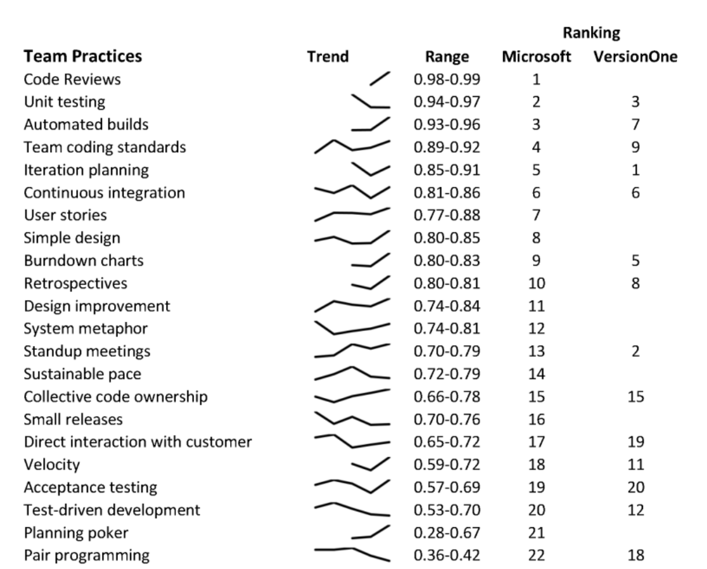

The two sides join the use of the practices between the two groups. We observe that the ranking of the practices between the two groups is not that different, implying the practices used by each group is relatively similar. The largest difference in the relative order of the practices are Stand-up meetings which are done more by agile practitioners; and System metaphor and Sustainable pace which are done more by non-agile practitioners despite the identification of these two practices as distinctly agile practices.

The top three practices that are followed by both agile and non-agile practitioners (Code Reviews, Unit Testing and Automatic Builds) are standard practices within Microsoft. A greater percentage of non-agile practitioners follow these practices than agile practitioners. Tools are available to simplify the use of these practices, which aids in their adoption. This observation drives the interesting question of whether practice adoption in large teams, such as Microsoft, is driven by tool support or by methodology.

### V.B.3) Are the adopted practices changing over time?

None of the practices showed a consistent trend for all of the job roles, negatively or positively, across all surveys. Figure 4 shows the Sparkline trends for 22 practices for all respondents, ranked by the annual average response range. A Sparkline is a very small line chart, typically drawn without axes or coordinates. The line presents the general shape of the variation (typically over time) in some measurement in a simple and highly condensed way. Not all practices appeared in all surveys, as indicated by a shorter Sparkline. In general, the Sparklines show that few of the practices show a strong movement in acceptance or rejection over the past six years.

Figure 4. Trends in Agile Practices

The range provides the percentage of respondents that indicate use of the practice, and indicates movement in acceptance/rejection over time. The average size of the variation in responses across all questions and all job roles is 23% (i.e. the min value of Yes respondents is on average 23% different to the max value). Analysis of the respondents in each individual job role shows a much smaller fluctuation. Over the six-year period, the average range in responses from developers is 23% (in 11 questions the ranges is less than 10%), for PM the average range is 15% (in seven questions the range is less than 15%) and for testers the average range is 12% (with nine practices having a range of less than 10%). These results indicate relative stability in the use of the practices during the six years.

The team practice that showed the greatest range is Planning poker [7] which has a total range of 48%. While the Planning poker practice has been around since 2002, the use of this practice has only become popular in recent years. The practice that has been monitored across all surveys which is showing a strong increase in usage is User Stories. The large range on response is mainly driven by responses from developers where the acceptance of this practice has gone from 64% to 84%.

The practice with the second highest range is Test-driven development (17%). This high range is driven by the responses from Developers. The use of the practice is dropping over time.

To compare Microsoft’s use of agile practices with industry use, Figure 4 also provides the ranking of the average use of the practice on the six years of VersionOne surveys. The Microsoft surveys and the VersionOne surveys did not always ask about the same set of practices. As a result, the VersionOne ranking has some gaps in the ranking, and only 14 of the 22 practices can be compared. Ten of the 14 practices had very similar rankings: six practices had the same ranking or a ranking within two positions of each other; and four practices had rankings within 3–4 positions of each other. Microsoft had a higher ranking for Team coding standards. The industry, as portrayed by the VersionOne survey, uses Standup meetings, Velocity, and Test-driven development significantly more often than Microsoft.

### V.C. Perceived Benefits of Agile

A set of generic benefits were chosen that are often claimed by teams that adopt agile practices. Only the surveys from 2008 onwards contained questions regarding the benefits of agile methods, with the exception of the question regarding the awareness of other people’s work was also asked in 2007 survey. In this section, the average perception is calculated by dividing the number of agree/disagree/neutral (see Section 3.3) responses divided by the total number of responses for all users across all the years the question was asked.

#### V.C.1) Do the perceived benefits of agile vary by job role?

For agile practitioners, the PMs have the highest perception of agile benefits across the different job roles. The PMs also have the lowest Neutral perception of the benefits of agile and the lowest negative response to the question of benefits. The average response for PMs was 71.8% positive responses, 19.3% Neutral response and 8.9% negative responses. This distribution compares to developers who, on average, have a 64.5% positive response, 22.4% Neutral response and 13% Negative response. Testers have a 65.7% positive response, 21.8% neutral response and 12.5% negative response.

For agile practitioners, all job roles believe that Improved communications is the highest perceived benefits of Agile fol-