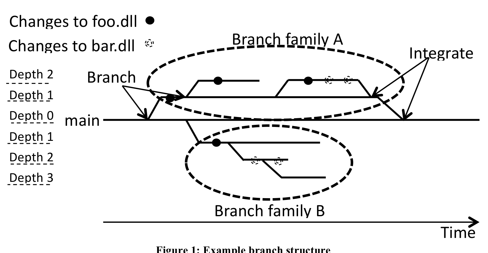
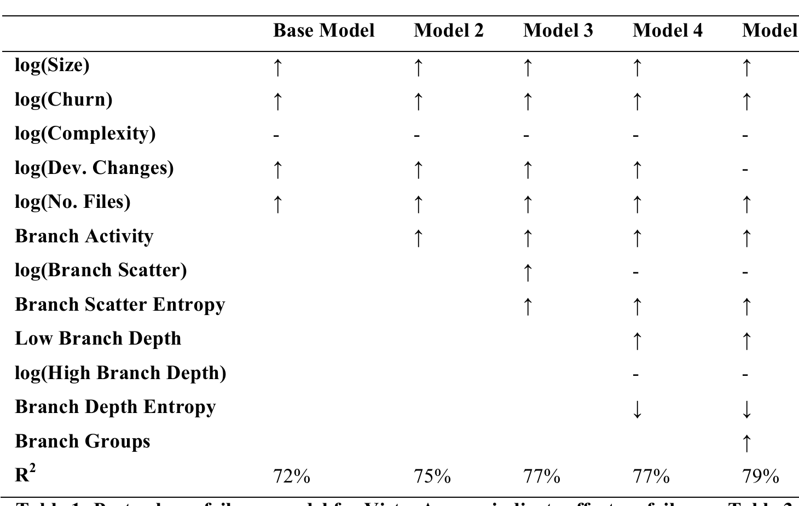
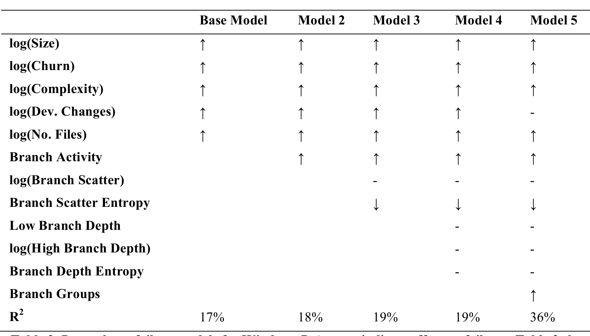
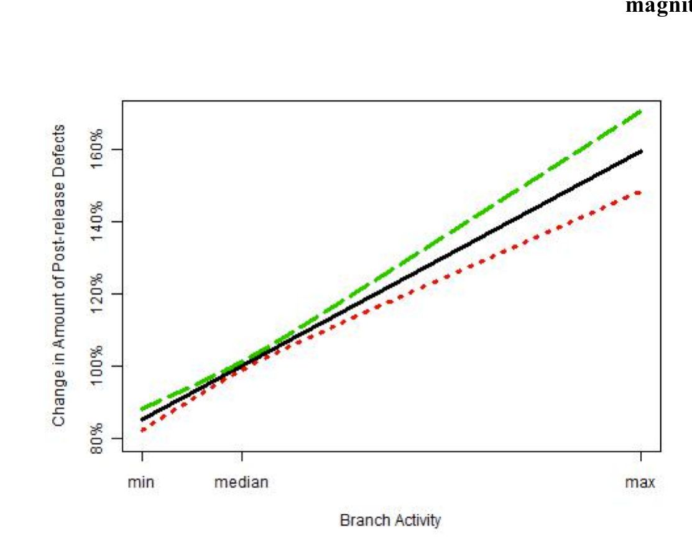
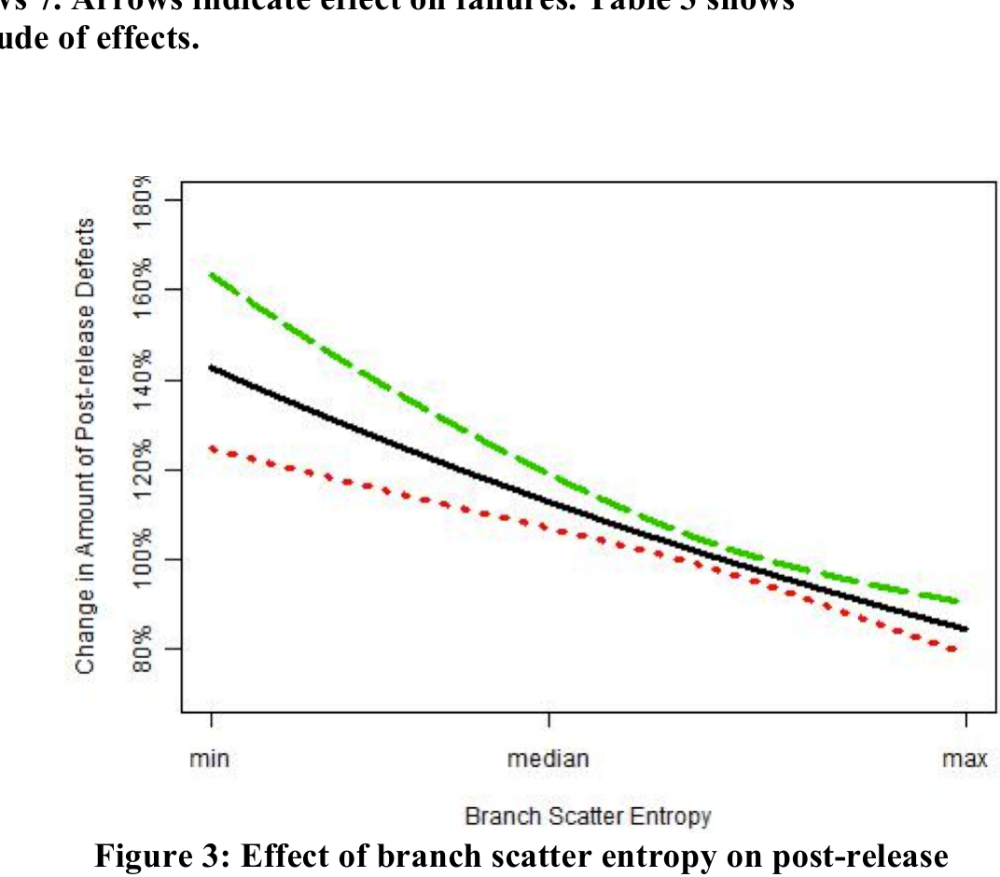
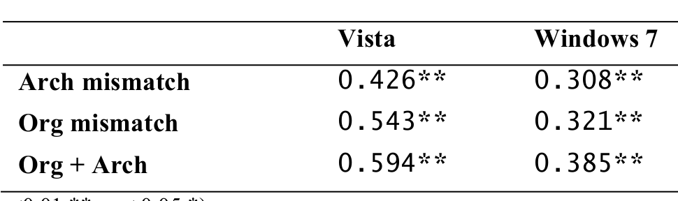
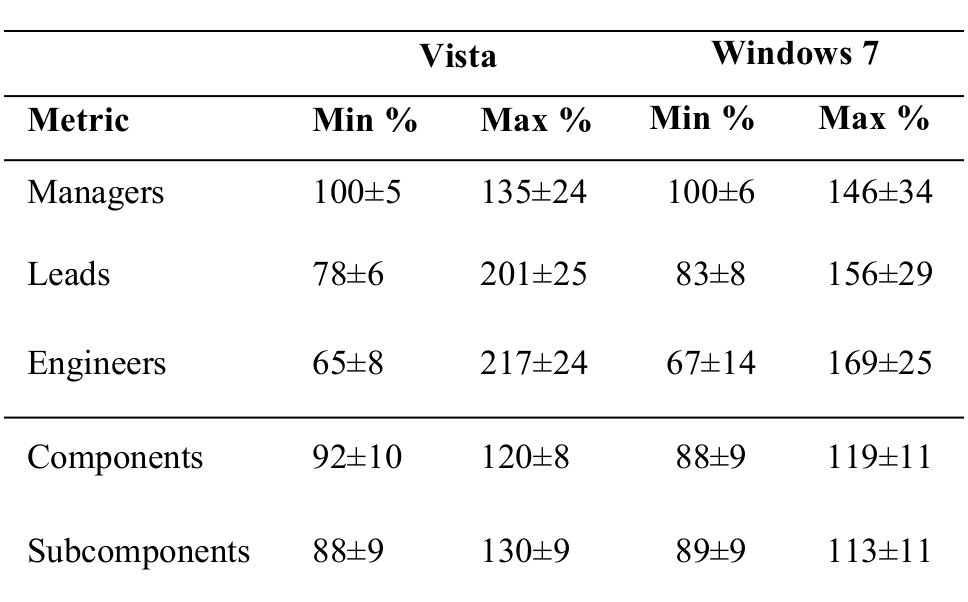

# The Effect of Branching Strategies on Software Quality

Emad Shihab · Christian Bird · Thomas Zimmermann  
Software Analysis and Intelligence Lab (SAIL), Queen's University, Canada · Microsoft Research, Redmond, WA, USA  
emads@cs.queensu.ca · {cbird, tzimmer}@microsoft.com

## ABSTRACT

Branching plays a major role in the development process of software. Branches provide isolation so that multiple pieces of a software system can be modified in parallel without affecting others during times of instability. However, branching has its issues. The need to move code across branches introduces additional overhead and branch use can lead to integration failures due to conflicts or unseen dependencies. Although branches are used extensively in commercial and open source development projects, the effects that different branch strategies have on software quality are not yet well understood. In this paper, we present the first empirical study that evaluates and quantifies the relationship between software quality and various aspects of the branch structure used in a software project. We examine Windows Vista and Windows 7 and compare components that have different branch characteristics to quantify differences in quality. We also examine the effectiveness of two branching strategies — branching according to the software architecture versus branching according to organizational structure. We find that, indeed, branching does have an effect on software quality and that misalignment of branching structure and organizational structure is associated with higher post-release failure rates.

One challenge is that finding the change that causes a test to fail can almost be impossible, especially for long-running test suites. While some of these effects are present in smaller projects too, the impact is intensified in large projects; a build break that affects a team of five developers is not as serious as a break that affects thousands of developers.

One of the key features of modern SCMs that helps to mitigate these problems associated with the complexity of software projects is the support of parallel lines of development known as branches [1]. A branch is a virtual workspace created from a particular state of the source code that a developer or team of developers can make changes to without affecting others working outside the branch. Branches provide isolation from other changes; for example, a build break on a branch affects only the teams working on that branch and not the entire development team. The use of branches within a project has a profound effect on the processes used during development, from the build processes to release management [1].

However, like any development tool, branching needs to be leveraged correctly in order to be most effective [2]. Teams may choose to work in branches to avoid dealing with the work of other teams, but some coordination is required. Branches may introduce a false sense of safety, as changes made in different branches will eventually be merged together (either manually or automatically), and bugs may arise if these changes are syntactically or semantically incompatible. The process of moving code between branches represents additional error-prone work for developers. A complex branching structure may hinder the development process, making it hard to track code changes, causing build failures (due to unexpected dependencies), increasing the chances of introducing regression failures and making it difficult to maintain the code base [3]. In fact, some claim that branching is the most problematic area of SCM [4]. Therefore, it is important to understand how branching structures affect software systems and impact their quality. We note that these outcomes are not caused by the branches themselves, but rather by the processes and coordination required when employing the use of branches.

However, the relationship between branching structure and quality remains an important open question. With more projects in open source [5] and commercial contexts [6] employing branches in their development, understanding the impact of branching is increasingly relevant. To address this, we perform an empirical study to examine the effect of branch structure on software quality in Windows. We find that many aspects of branch use do indeed affect software quality.

As a prescriptive step, we also examine how to best align branching structures with other aspects of a software project. Specifically, we compare the branch structure with the organization of the teams within the project and also with the architecture of the software itself to determine which is the better branching strategy.

### Categories and Subject Descriptors

D.2.8 [Software Engineering]: Metrics — Process Metrics

### Keywords

Branching, Quality

## 1. INTRODUCTION

Coordination is key as software development becomes a more and more complex enterprise. Software projects today range in size up to tens of millions of lines of code, are developed by teams of thousands of developers, and may support multiple releases at different stages of development. Managing all of the changes being made to a codebase is an increasingly difficult task. Software Configuration Management Systems (SCMs, also known as version control systems) are important tools, as they are the primary mechanism used to coordinate the sharing of actual code artifacts, the key output in software products. In large-scale software projects where all changes are immediately seen by all developers (i.e. one “line” of development), changes can lead to a number of significant problems: single changes can cause build breaks and halt the progress of the entire project; piecemeal changes to interoperating components can lead to incompatibility,

---

Figure 1: Example branch structure

Figure 1: Example

To the best of our knowledge, this is the first study to empirically examine the effect of branching on software quality. We make the following contributions in this study:

1. We define metrics to capture the effects of branching on software quality.
2. We perform an empirical study and quantify the effects of branching on software quality in two releases of a large industrial project.
3. We examine the effect of mismatch between the branching structure and organizational and architectural structures.
4. We provide recommendations of branch use for projects that heavily utilize branching.

The rest of the paper is organized as follows. We first survey prior work in the area of SCM branching. We then provide terminology and describe our data collection process. Next, we discuss our hypotheses regarding branching strategies and define the metrics used to evaluate these hypotheses. Finally, we present the results of our analysis, discuss implications of these results, and make recommendations based on our findings.

## 2. RELATED WORK

A number of researchers have studied the role of branching within SCMs. Midha [7] outlined key characteristics of SCMs and their use at Lucent Technologies and iterated the need of future SCMs to facilitate the creation and support of multiple branches (referred to in the paper as streams). Walrad and Strom [1] investigated tradeoffs between several branching models and suggested the use of a branch-by-purpose model which calls for branches to be created only when there is a specific purpose (e.g. when software is released). Wingerd and Seiwald [4] provided best practices for SCMs and suggested branching only when necessary, such as when incompatible policies arise (e.g. when developers have different commit privileges), branching late to make sure as many changes as possible are propagated, and using branching instead of code freezing to allow parallel development. Appleton et al. [2] and Buffenbarger and Gruell [8] studied and proposed branching patterns and best practices to use in order to achieve efficient parallel development.

Perry et al. [9] perform an empirical study to investigate and understand the nature of large scale parallel development and find that multiple levels of parallelism exist (i.e., at the release, MR and IRM levels), that as much as 12.5% of all deltas may be in conflict and up to 50% of files are changed by multiple developers in the same release. Premraj et al. [3] examined the branching and merging in an industrial agile development setting and found that the roles of branchers (e.g. architects, developers, or testers) and the type of files (e.g. header files or configuration files) they work on dictates the cost of merging. They also presented findings that suggested that programs should be structured not only by the software architecture, but also by the team structure, so that communication about prevention and unnecessary branching could be possible. Bird et al. [6] examined a theory that branches are created to accomplish a goal and groups of developers making changes on a branch represent virtual teams with a common goal. Then, they examined the relationships between files changed in a branch and the people who make changes to the branch and found support for their theory in Windows Vista and Windows 7.

The prior work has focused primarily on providing best practices for branching or studying the role of branching in large teams. It is important to note that most of these best practices suggested are based on experience and theoretical scenarios. In this work, we complement the previous work by empirically studying and evaluating the effects of branching on software quality. In addition, our study proposes and validates metrics that capture general characteristics of branches (i.e. we do not constrain ourselves to one branching model). For example, our findings regarding branch depth can be used to compare two different branching models based on their depth characteristics.

## 3. TERMINOLOGY AND METRICS

### 3.1 Terminology

We start by introducing relevant terminology used in this paper. The Windows Vista and Windows 7 teams heavily relied on branching to manage their large code base. Generally speaking, branches are created based on a specific structure that is agreed upon within the development teams. As the project evolves, more branches are created to support development.

To maintain order in the branching structure, related branches are grouped into branch families. A branch family is a subtree rooted off of the trunk (a.k.a. main, the release branch). For example, all of the branches used to build tools are grouped into one ‘tools’ branch family. In some cases, a branch may be added to a branch family in order to provide further isolation. In such cases, the new branch is said to be one level “deeper” in the branch tree. Figure 1 shows an example of two branch families and the different branch depths. In our study, we use the notion of branch depth as the measure of how deep a branch is from the main branch. Once a change is checked in on a branch at depth n, it is merged into the

---

parent branch at depth n-1, and eventually is merged into the trunk (level 0).

To differentiate between development and branching activity, we classify changes into two types: changes to the actual code, which we call development changes (add, edit and delete operations) and changes which move and merge code between branches, which we call branching changes. In our context, a branch change is a change that copies or integrates (also known as merges) a file change from one branch to another. These two categories of changes are fundamentally different, as modifying code and moving code require different skillsets and pose different types of risk (e.g. implementation errors vs. integration errors). In practice, these two types of changes are performed by contributors that have different roles and even different job titles within the project.

### 3.2 Data Collection

To conduct our study, we leveraged data from two releases of one of the largest projects at Microsoft, Windows. Windows is composed of thousands of executable files (.exe), shared libraries (.dll) and drivers (.sys), which we refer to as binaries. We collected historical development data for each binary in Windows Vista and Windows 7 from the release of Windows Server 2003 to the release of Windows 7. We chose to perform our analysis at the binary level because failure data is collected and reported at this level at Microsoft and we have observed cases where a failure caused by a change to one source file for a binary was fixed in a different source file for the same binary. We decided to perform our case study on Windows Vista and 7 because they are two large releases that have a rich development history and heavily use branches. We collected a number of different metrics for each component.

To gather the metrics for each component, we leveraged the commit histories and software failure data of Windows Vista and Windows 7. Each change in the repository contains the change author, the change date, a change log message, the source files modified by the change, the branch and branch family of each source file, the type of change (e.g. development or branching) and the purpose of the change (e.g. bug fix or enhancement). We used a mapping of source files to binaries in order to collect the different metrics at the component level.

As an indicator of software quality, we used the number of post-release failures per binary. Both versions of Windows have been released for multiple years and have an installation base in the hundreds of millions. Most defects are found quickly and the report rate falls off dramatically after the first year, indicating that our results are unlikely to change with time. Various code metrics, such as churn, complexity and size metrics were also gathered from the source code repositories and build process for each component. We use the code metrics in our models as control variables since they are known to also relate to failures [10]. We detail all of the metrics calculated from our data in the next section. Prior research has shown that when characteristics such as size and complexity are not considered, they may affect the validity of other software metrics [11].

As part of our study, we examined the relationship between branching structure and organizational structure; we gathered snapshots of the Windows organizational hierarchy (who reports to whom as well as job titles) over the course of Windows Vista and 7 development.

Lastly, the binaries within Windows are logically partitioned into systems, subsystems, areas, and (in some cases) subareas. For instance, an mp3 decoding library may be in the audio codec area of the audio subsystem within the multimedia system. We use this hierarchical breakdown for both releases of Windows as the system architecture and use it to determine how well branches span architectural boundaries.

## 4. RESEARCH QUESTIONS

Our high level research question is “How much and in what ways does branching affect software quality?” To answer this question, we evaluate quality at the component level and the branch level through the use of a number of measures of branch use. In this section we present the testable hypotheses that we evaluate as well as the rationale that underlies each of these hypotheses and the metrics that we use to quantify different aspects of branch use. Each hypothesis is related to the research question in a different way and has different implications for software teams.

Our hypotheses come from discussions with developers, managers, and other stakeholders in Windows and other projects at Microsoft. They have indicated that it is just as valuable to know which branching characteristics (i.e. metrics) do not have a relationship with software failures as those that do; both inform stakeholders’ decisions and practices.

### 4.1 Effects on Component Quality

One goal of our research is to examine the effects of branching on software quality. Based on discussions with developers we expect that overly complex branching structures negatively impact the quality of a software system. Since software components that are developed in more complex branching structures require more process overhead in terms of branching and integrating activity as well as more coordination, we expect more opportunities for error and that these components will have more post-release failures. Therefore, we focus our study on three factors that we believe measure the complexity of a branching structure, namely – branch activity, branch scatter and branch depth.

#### H1. Branch Activity: Software components with high branching activity have more failures.

Branches are meant to provide a level of isolation for development teams to work on parts of the code base without having to worry about affecting others. However, this level of isolation comes at the cost of having to resolve integration conflicts when changes on these branches are finally merged back. Integration changes are risk-prone because a) the developer merging the code may not be the developer that made the code changes (and thus may lack key knowledge), b) the changes represented in a merge are often aggregated and are therefore large and widespread, c) the integration is often temporally distant from the development changes themselves, and d) developers may rely on the invalid assumption that lack of syntactic conflicts implies a lack of semantic conflicts or issues [12]. Therefore, we expect higher levels of branching activity to lead to more post-release failures since higher activity requires more integration. We use the branching activity metric to evaluate this hypothesis.

Branching Activity is defined as a ratio, the number of branching changes divided by the number of development changes, per component. We use the ratio instead of simply using the number of branching changes since components that have many development changes are more likely to have more branching changes as well (we control for total number of changes by using a churn metric in our models). We use the branching activity metric to evaluate our first hypothesis (H1) that more branching activity reduces software quality.

#### H2a. Branch Scatter: Software components spread across many branch families have more failures.

---

In addition to the hypothesis that higher levels of branching activity may lead to more failures, we also hypothesize based on discussions with developers, that components that have changes scattered across different branch families will experience more integration failures. The intuition is that software components that are spread across many branch families have changes that will not integrate until they reach the main branch and will thus happen in larger batches and later in the development cycle. Furthermore, teams working in different branch families are typically organizationally farther apart and have disparate tasks. Prior research has shown that in such cases, awareness is lowered, coordination breakdowns occur more often, and failures result [13] [14]. This measure is different from the branching activity metric. A software component may have high branching activity but only be modified in two branches that are in a single branch family (i.e., it keeps going back and forth). In this case, the branch scatter would be low. We use the branch scatter metric to evaluate this hypothesis.

### Branching Scatter
Branching Scatter – is defined as the ratio of unique branch families that a component is in divided by the number of development changes. Again, we use the ratio instead of using the number of branch families that a component touches, to control for the fact that components that have more development changes are more likely to be scattered across branch families. We use the branching scatter metrics to evaluate our hypothesis (H2a) that higher levels of branch scatter reduce software quality.

#### H2b. Branch Scatter
H2b. Branch Scatter: Software components that are equally developed across multiple branch families have more failures.

In addition to simple branch scatter, we examine the effect of the proportion of scatter across branch families. The intuition is that a component may need to be changed in different branch families; however the majority of the changes to the component should be made mainly within a single branch family. If a component is developed equally across many branch families, then there is more room for missed dependencies and conflicts. We use the branch scatter entropy metric to validate this hypothesis.

#### Branch Scatter Entropy
Branch Scatter Entropy – is defined as the entropy of the scatter of the changes to a component across branch families. In certain cases, a component may need to be shared across different families. The intuition is that if a component is changed equally across the different branch families, this is worse than having a component change mainly in one branch family and lightly changed in the others. For example, a component may need to be modified in two branch families, however, if 95% of its changes happen in one branch family and only 5% in the other that is much better than having 50% of its changes in each branch family. We use Shannon Entropy [15] to capture this effect of distribution (e.g. [16], [17]). Entropy is defined as:

H(P) = - Σ_{k=1}^m p_k * log_2(p_k),

where p_k ≥ 0, ∀ k ∈ {1,2,...,m} and Σ_{k=1}^m p_k = 1. Maximal entropy is achieved when all elements in a distribution, P, have the same probability of occurrence (i.e. p_k = 1/m, ∀ k ∈ {1,2,...,m}). In contrast, minimal entropy is achieved if one element p_i in the distribution, P has probability of occurrence 1 (i.e. p_i = 1) and all remaining elements in P have a probability of occurrence 0 (i.e. ∀ k ≠ i, p_k = 0). Since some components are changed in a different number of branch families compared to others, we normalize by dividing the entropy value by log_2(m), where m is the number of branch families containing changes to that component.

To illustrate our intuition, we use the example shown in Figure 1. Foo.dll and bar.dll both have equal number of changes (depicted by the solid and hollow dots on the branches). Three of the four changes to foo.dll are in branch family A. Therefore, developers working on the branches in branch family A are more likely to be aware of the other changes to foo.dll. On the other hand, bar.dll has two changes in branch family A and another two changes in branch family B. Therefore, it is more difficult for the developers working on the branches in the two branch families to be aware of all the changes to bar.dll, possibly causing incompatible changes, leading to a higher number of failures. In this example, foo.dll has lower branch scatter entropy value than bar.dll.

#### H3a. Branch depth
H3a. Branch depth: Software components developed primarily in deeper branches have more failures.

In addition to measuring the branching activity and frequency, software components that are developed in deeper branches are more isolated and must “travel” further to a release branch. Thus, they have a higher likelihood of conflicts upon integration to the release branches. To evaluate these claims, we use the branch depth metrics to examine whether branch depth has an effect on the quality of a component. We use the low and high branch depth metrics to validate this hypothesis.

### Branching Depth (Low, Medium, High)
Branching Depth (Low, Medium, High) – is defined as the ratio of development changes to a component in low depth branches, medium depth branches and high depth branches. The choice for using three categories rather than using a continuous measure maintains confidentiality at Microsoft and also allows for generality; a branch structure of any depth can be easily binned into these categories. Furthermore, this allows for a non-monotonic relationship between depth and failure rates. We use the branch depth metrics to evaluate our hypothesis (H3a) that development at deeper branches reduces software quality. In the example, Figure 1, foo.dll has 50% of its changes at low depth branches (i.e. branches in depth 1) and 50% of its changes at medium depth branches (i.e. branch at depth 2).

#### H3b. Branch depth
H3b. Branch depth: Software components that are developed evenly across low, medium and high depth branches have more failures.

Similar to the proportion of branch scatter across multiple branch families hypothesis, we also examine whether components that are mainly developed in one depth level have better quality than components that are equally developed at all depth levels. We use the branch depth entropy metric to validate this hypothesis.

#### Branch Depth Entropy
Branch Depth Entropy – is defined as the entropy of the changes at each depth level (low, medium, and high). This is in an effort to determine whether changing components evenly at different depth levels (high depth entropy) is better or worse (in terms of software quality) than a component that changes primarily in one depth level (low depth entropy).

Since the depth of the branch reflects its purpose (e.g. core functionality is often developed at lower levels), being distributed across different depth levels may lead to confusion in the purpose of the component. Using the example in Figure 1, foo.dll has 50% of its changes at low branch depth and 50% of its changes at medium branch depth, whereas bar.dll has all of its changes in medium depth branches. In this example, foo.dll may be harder to work with since it does not clearly reside in any one depth level. We use the branch depth entropy metric to evaluate our hypothesis (H3b) that even distribution across branch depths reduces software quality. Since different components are changed in a different number of branch depths compared to others, we normalize by dividing the entropy value by log_2(m), where m is the number of branch depths containing changes to that component.

---

## 4.2 Architectural and Organizational Congruence

In the previous section, we examined topological characteristics of the relationships between changes to components on branches and post-release failures. An equally important question is how the branching structure should align with the architecture of the system being developed and the organization of the teams developing the system. According to Conway’s Law [18], in an ideal setting the decomposition of the system into subsystems and subsystems into components would match the division of the developers into teams. In practice, due to cross-cutting concerns, architectural coupling, and external organizational factors such as geography [19], pre-existing organizational structures, and organizational churn [20], there is rarely perfect congruence between system architecture and organizational structure. Thus, a branching structure can match organizational structure at the cost of spanning subsystem and component boundaries, or it may closely align with the system architecture and cross-cut the organization.

The decision is not clear. Prior work suggests that components with changes spanning organizations increase failures [13]. However, cross-cutting concerns – functionality requiring changes that span system architecture – also lead to failures [21].

Therefore, in an effort to provide actionable results to software teams to assist them to decide on effective branching strategies, we examine the effect of aligning the branching structure to architectural or organizational structure on branch quality. This leads to two competing hypotheses:

### H4a. Branching according to architectural structure: Branches with higher architectural mismatch have more failures.

One strategy to follow when creating branches is to dedicate one branch per component. Doing so allows software components to be developed in isolation. However, in certain cases multiple components are modified in a single branch, causing branches to cross-cut the architecture (i.e., architectural mismatch). We expect branches that include work on multiple components to have more failures.

Architectural Mismatch – is the number of individual systems, subsystems, areas, components and subcomponents (forming a hierarchy) that are affected by the changes on a branch. We expect that a branch that contains only changes to one subsystem has fewer failures than a branch that changes many.

### H4b. Branching according to organizational structure: Branches with higher organizational mismatch have more failures.

In many cases multiple teams need to coordinate when developing a software component. Therefore, having the branching structure match the organizational structure may be ideal. We expect that branches that are contributed to from multiple organizations (i.e., organizational mismatch) have more failures.

To answer the aforementioned question, we measure the effect that architectural and organization mismatch has on branch quality. To measure architectural and organizational mismatch of the branch, we define the following metrics:

Organizational Mismatch – includes the number of managers, development leads, and engineers (counted and used in our models separately) that make changes to files on the branch. The number of engineers that work in a branch serve to represent the size of the group working in a branch. However, each team has one development lead and a number of leads report to one development manager. Thus, each lead and each manager is indicative of

additional teams working in a branch. We expect a branch with twenty engineers, six leads, and two managers to have more failures than a branch with twenty engineers, one lead, and one manager because the former spans organizational structure.

We quantify branch quality by mapping components (and their post-release failures) to the branches they were changed on. Using a technique similar to the approach used by Ostrand et al. to calculate the failure ratios of developers [22], we use the ratio of a component’s changes on a branch (analogous to changes made by a developer in Ostrand’s approach) to map post-release failures to that specific branch. For example, assume that a component A had 8 post-release failures and that A had a total of 20 development changes, 15 changes on branch B1 and 5 changes on branch B2. We map 6 (15/20 * 8 = 6) failures to branch B1 and 2 (5/20 * 8 = 2) failures to B2.

These metrics enable us to study the effect of mismatch on branch quality. As before, we build linear regression models and use the goodness-of-fit measure to compare which of architectural or organizational mismatch better explain branch failures. We also report direction and magnitude of the relationship to quality (derived from regression coefficients).

## 4.3 Analysis Techniques and Statistical Modeling

We use multiple linear regression models to study the effect of branching on software quality.

Linear regression models are generally used in empirical studies to model an outcome of a response variable (e.g. model the number of post-release failures) or to model the relationship between an observed phenomena (represented by the model independent variables) and an observed outcome (represented as the dependent variable). In this paper, we use linear regression models to achieve the latter, to study the relationship. Prediction is not the aim of this paper. In particular, we use linear regression to examine the relationship of one or more of the branching metrics with software quality, while controlling for code and process metrics.

The independent variables in our linear regression models are the branching activity, scatter and depth metrics; the dependent variable is the number of post-release failures. All of our measurements are performed at the software component level.

One of the assumptions of linear regression is that the residuals must be normally distributed. We observed that, similar to many other software metrics, our control variables and some branch metrics here were highly skewed, leading to non-normality of residuals. To alleviate this problem, we used a log transformation on these metrics with high skew and/or kurtosis values.

As our evaluation criteria, we examine the statistical significance, magnitude, and direction of the variable’s contribution in the model. In addition, similar to previous work (e.g. [23]) we use model fit (variance explained, also known as adjusted R^2) as evaluation as well. We begin by building a base model, which contains our control variables, and record the adjusted R^2. Then, we incrementally add one variable at a time and measure the improvement in adjusted R^2.

We employed Variance Inflation Factor (VIF) analysis to measure the level of multicollinearity between independent variables [24] and removed highly correlated variables from the linear regression models, i.e. any variables that had a VIF value above 10, as recommended by Kutner et al. [24]. To test for statistical

---

R2: 72% 75% 77% 77% 79%  
Table 1: Post-release failures model for Vista. Arrows indicate effect on failures. Table 3 shows magnitude of effects.

## 5. CASE STUDY RESULTS

significance, we performed ANOVA analysis on the models and report the p-value of the independent variables.

We now present the results of our case studies on Windows Vista and Windows 7. We build linear regression models that model the number of post-release failures and examine whether or not adding branching metrics improves the model fit. For each version of Windows, we built five models. We start by building a base model with the control metrics, which in our case are churn, complexity, size, the number of files and the number of development changes to a software component. Then, we build an additional four models where we incrementally add the branch activity, branch scatter, branch depth metrics, and branch families, respectively.

Tables 1 and 2 present the results of our analysis. Arrows (↑ and ↓) are used to denote direction of the effect, a ↑ denotes a positive effect and a ↓ denotes a negative effect. The model fit (R2) of each model is shown in the last row of the tables. A log transformation was applied to some metrics, indicated in the left column, as discussed earlier. In all cases the effects were statistically significant with a p < 0.01.

The base models provide a model fit of 72% and 17% for Windows Vista and Windows 7, respectively. The lower model fit for Windows 7 is likely due to the fact that Windows 7 had both fewer post-release defects and less variance in post-release defects across binaries. Adding the branch activity metric to the base model improved model fit to 75% for Windows Vista and 18% for Windows 7. The model fit is further increased to 77% when the branch scatter metrics are added for Windows Vista and 19% for Windows 7. Branch depth metrics added a fractional (less than 0.5%) improvement to model fit in Windows Vista and did not add to the model fit in Windows 7. These model fit values are in the same range as prior work on software quality that achieves model fits values between 22–33% deviance explained [25]. In all cases, we found one or more of the metrics in each metric category (i.e., activity, distribution or depth), except for the case of depth metrics in Windows 7 to be statistically significant and improve model fit.

Furthermore, we divided the changes based on the branch families they were in. The purpose of doing so was to study whether certain branch families are more risky than others. The results are shown in the last column of Tables 1 and 2. Since the sum of the changes in each branch family is equal to the number of development changes, we cannot include both metrics in the model. Therefore, we remove the number of development changes from the model and add the number of changes in each branch family, labeled as Branch Groups in the tables. We see that using the branch families improves the model fit to be 79% for Windows Vista and 36% for Windows 7. This is a large improvement, suggesting that changes in certain branch families lead to more failures compared to other branch families. One explanation for the considerable improvement in model fit in Windows 7 compared to Vista is the fact that Windows 7 had more branch families than Windows Vista. Thus branch families provide more discrimination in Windows 7.

### 5.1 Quantifying the Effect of Branching on Software Quality

Although model fit is traditionally used to evaluate linear regression models, its importance depends on the context in which it is evaluated. Since our base models were fairly robust (providing a model fit of 72% for Windows Vista for example), we did not expect a large improvement in model fit. Our primary goal was determining which measures had a statistically significant relationship with post-release failures.

Having identified the statistically significant metrics, we are interested in quantifying the relationship of these metrics on post-release failures. For example, we would like to be able to quantify the increase in post-release failures if branching activity increased by 10%. Quantifying the effect is of primary importance to practitioners because it helps them better understand — how and by how much — their branching practices impact their software quality. Quantifying the effect allows practitioners to put a cost on the impact of their branching practices (e.g. mapping an increase of 10% in failures to dollars lost) and argue for process change, if needed.

To practically quantify effect, we study each metric in isolation. We do so by using the fitted model and setting all the metrics

---

R 17% 18% 19% 19% 36%  
Table 2. Post-release failure models for Windows 7. Arrows indicate effect on failures. Table 3 shows magnitude of effects.

Figure 2: Effect of branch activity on post-release failures in Windows Vista

Figure 3: Effect of branch scatter entropy on post-release failures in Windows 7

Other than the metric of interest to their median values. Then, we vary the metric we are interested in studying the effect of, from its minimum to its maximum value and observe the change in the projected number of post-release failures. To put the increase/decrease of effect into perspective, we normalize the effect of each metric by its effect at the median value. The direction of the effect can be positive or negative. A positive direction indicates that an increase in the metric causes an increase in post-release failures. A negative direction indicates that an increase in a metric leads to fewer post-release failures.

We illustrate with an example in Figure 2 where we plot the change in effect for the branch activity metric in Windows Vista. The x-axis shows the change in the value of the metric from its minimum to its maximum value. The y-axis shows the change in the amount of projected post-release failures, normalized by the median. We also plot the 95% confidence interval, shown by the dashed lines. 100% on the y-axis represents the modeled number of post-release failures when branch activity is at its median value (and all other metrics in the model are also set to their median). Decreasing the branch activity metric to its minimum value would reduce the amount of failures to 85% (± 2.9%) of the value observed at the median. If branch activity was at its maximum value, we expect an increase of up to 59% (± 11%) more failures. Figure 3 shows a similar graph, depicting the effects of branch scatter entropy in Windows 7.

Table 3 summarizes the effects of all metrics at their minimum and maximum values (values below 100% indicate decreases in failures, values above, increases). We find that for Windows Vista, branch activity, branch scatter and low branch depth have the biggest effect, increasing the amount of post-release failures by up to 59%. Branch scatter entropy and depth entropy have a moderate effect. In Windows 7, we find that branch activity and branch scatter entropy both have a large effect (up to 70%); however, they also have wide variation.

The majority of the metrics have a positive relationship with post-release failures, except for the entropy metrics, which have a negative relationship.

---

| Release | Metric | Min % | Max % | Direction |
|---|---:|---:|---:|---|
| Windows Vista | Branch Activity | 85±2.9 | 159±11 | Positive |
|  | Branch Scatter | 98±1.2 | 140±10.5 | Positive |
|  | Branch Scatter Entropy | 83±3.8 | 111±2.3 | Positive |
|  | Low Branch Depth | 92±3.8 | 141±15.4 | Positive |
|  | Branch Depth Entropy | 86±8.4 | 111±5.2 | Negative |
| Windows 7 | Branch Activity | 78±7.4 | 151±26.2 | Positive |
|  | Branch Scatter | 84±58 | 143±20.8 | Negative |

Table 3: Summary of metric relationships with failures

This finding makes intuitive sense, since entropy is high when the proportions across the different branches are equal. Therefore, having a low branch scatter entropy value means that software components that are mainly developed in one branch family have fewer post-release failures than components that are developed an equal amount across different branch families. One exception is branch scatter entropy in Windows Vista, which has a small but positive effect. One possible explanation is that Windows Vista had few branch families; therefore, branch scatter entropy did not play a major role.

Our results on Windows Vista and 7 can be summarized:
- H1. Branch activity: has a negative impact on software quality. It can increase post-release failures by up to 59% in Windows Vista and up to 51% in Windows 7.
- H2a. Branch Scatter: has a negative impact on software quality. It can increase failures by up to 40% in Windows Vista.
- H2b. Branch Scatter Entropy: has a slight positive impact on software quality in Windows Vista and negatively impacts software quality in Windows 7. It can increase failures by up to 43% in Windows 7.
- H3a and b. Branch Depth and Branch Depth Entropy: have very little to no impact on software quality.

## 6. BRANCHING STRATEGIES

Thus far, we have mainly focused on the three hypotheses surrounding the effects of branching on software quality at the attribute level. Our findings showed that branch activity and branch scatter affect the software quality of components in Windows Vista and Windows 7, and branch depth only had a moderate effect on quality in Windows Vista.

However, one question that still lingers is how to best align the branching structure? Traditionally, branch structures are aligned in one of two ways: to match the architecture of the software system or to match the organizational structure.

Aligning the branching structure with the architectural structure means that each branch will be dedicated to a component of the software. For example, in a layered software architecture, a branch family will be created for each layer. Branches within the branch family can be used to develop sub-components and so on. The advantage of matching the branching structure with the architectural structure is that changes to a component mostly happen on the same branch, thereby minimizing integrations.

Aligning the branching structure along the organizational structure means that branches match team boundaries. In such a scenario, each team manager will have his own branch family. The individual branches within the branch family will be assigned to different sub-teams, managed by the different team leads under that manager. The advantage of matching the branch structure with the organizational structure is that the personnel working on the branches are close organizationally, making coordination and communication much simpler.

Org + Arch 0.594** 0.385** (p < 0.01 **; p < 0.05 *)
Table 4: Model fit (R2) of architectural and organizational mismatch

We built linear regression models that examined the relationship of organizational and architectural mismatch of individual branches with branch quality. All measures of organizational mismatch — number of development leads and number of managers that made changes on a branch — and architectural mismatch — number of subsystems changed on a branch — were statistically significant (p < 0.05) and had a negative impact; increased mismatch decreased quality.

Table 4 shows the results of our analysis. We find that organizational mismatch provided a better fit (i.e., higher R2) when modeling branch quality in both Windows Vista and Windows 7. The effects of our measures of organizational and architectural measures on defects in branches are shown in Table 5 (same format as Table 3). This finding indicates that branches that cross-cut organizational boundaries have a higher correlation with post-release failures than branches that cross-cut architectural boundaries. Therefore, we suggest that, contrary to traditional belief, branching structures should not only align according to architectural structure of the software, but also according to its organizational structure.

Our finding complements prior work that showed organizational metrics outperform the traditional process and product metrics in modeling software quality at the component level [13]. The difference between prior work and ours is that we examine the failures on a per-branch basis and compare the effects of architectural vs. organizational mismatch rather than examining only organizational mismatch. With regard to our hypotheses, we conclude:
- H4a: Branching according to architectural structure: Architectural mismatch increases post-release failures in both releases of Windows.
- H4b: Branching according to organizational structure: Organizational mismatch increases post-release failures in both releases of Windows.
- Architectural vs. Organizational Mismatch: Organizational structure has a stronger relationship with failures than architectural mismatch.

---

Table 5: Summary of organizational and architectural mismatch on branch quality

## 7. IMPLICATIONS

### 7.1 Future Research

Our work has implications for future work. Our findings indicate that branching does indeed have an effect on post-release failures. At the same time, we believe that there are scenarios where more branching activity and scatter is expected, and we are not advocating a “branch-free” development process. For example, globally distributed teams that are not able to communicate frequently may have more branching activity than co-located teams. This increase in branching activity is due to the fact that distributed teams are more concerned about keeping each other up-to-date and avoiding conflicts (since conflicts will require them to communicate). Our experience in talking with developers is that many failures that they deem “caused” by branching are in fact not directly caused by the creation of a branch, but rather by issues such as unmet (and sometimes unknown) coordination needs, poor integration work, and changes that propagate to the rest of the project late, all that result from how teams work as a result of using branches.

We have identified which concrete aspects of branching are related to decreased quality. However, changing the branching structure will only affect quality to the degree that they change the malignant behavior and process problems that lead to problems to begin with. Indeed, our experience studying open source projects that use branching heavily [5] [26] suggests that different projects use branches in their development processes differently. Understanding which “branch processes” lead to better outcomes than others in different contexts is a clear avenue for future research, and we exhort others to study this and report their findings (along with contextual details [27]) as we do the same in contexts at Microsoft.

### 7.2 Practical Implications

Our results have important practical implications. Based on our findings in this study, we make the following recommendations to software practitioners:

- Practitioners should aim to reduce branch activity since it may lead to an increase in the likelihood of failures.
- Practitioners should aim to reduce the scattering of development across many branch families since branch scatter increases the likelihood of failures in Windows Vista.
- When deciding how to best align branch structure, organizational mismatch should be closely considered by practitioners since it has a stronger relationship with failures than architectural mismatch.

Based on our findings, we are working with product groups within Microsoft and suggesting that, in addition to aligning branching structure according to architectural structure, branching structures should align with the organizational structure of their teams. When combined with prior work that empirically evaluates Conway’s Law ([14] [13]), this study provides further evidence that the makeup and organization of software teams has a direct relationship with quality. Development projects (especially those at large scale) would do well to consider this mounting body of evidence.

## 8. THREATS TO VALIDITY

### Threats to Construct Validity

Consider the relationship between theory and observation, in case the measured variables do not measure the actual factors. We use post-release failures to measure software quality. In certain cases, it might be more beneficial to use pre-release failures as a measure of quality since branching may cause integration failures that are often reported as pre-release failures. However, in our case changes were used to identify pre-release failures; therefore, using them to measure quality as well would introduce bias in our study. More importantly, post-release failures represent those failures not caught by QA processes and are more costly as they are customer-facing failures.

When evaluating the effect of architectural and organizational mismatch on branch quality, we measured branch failures as a ratio of development that a component had on that branch times the number of failures for that component. Ideally (and if possible), one would map each failure to the branch that it was introduced in. However, we were unable to create such a mapping due to lack of data.

### Threats to External Validity

Consider the generalization of our findings. The studied projects are both developed by Microsoft and follow processes that are defined by the development and management teams at Microsoft. A common misconception about industrial research at large companies such as Microsoft is that the software projects are not representative of other software projects and thus not valuable. This is not true. While projects might be larger in size, most development practices at Microsoft are adapted from the general software engineering community outside Microsoft. Many commercial and OSS projects also use branches to partition work and filter changes based on quality and this study represents a first step in examining the relationship between branching and quality. Therefore, we believe that this study can be replicated on other large software systems that use branches.

Another frequent misconception is that empirical research within one company or one project is not good enough, provides little value for the academic community, and does not contribute to scientific development. Historical evidence shows otherwise. Flyvbjerg provides several examples of individual cases that contributed to discovery in physics, economics, and social science [28]. W. I. B. Beveridge observed for social sciences: “More discoveries have arisen from intense observation than from statistics applied to large groups” (as quoted in Kuper & Kuper [29] p. 95). This should not be interpreted as a criticism of research that focuses on large samples or entire populations. For the development of an empirical body of knowledge as championed by Basili [30], both types of research are essential.

Lastly, a common misinterpretation of empirical studies is that nothing new is learned (e.g., “I already knew this result”).

---

However, such wisdom has rarely been shown to be true and is often quoted without scientific evidence. This paper provides such evidence: Most common wisdom and intuition is confirmed (e.g., “binaries with more branch activity tend to have more failures”) while some is challenged (e.g., “branches should be divided along architectural boundaries”).

## 9. CONCLUSION

We have presented the first, but hopefully not last, empirical evaluation of the relationship between various aspects of branch use in a software project and post-release quality. We have demonstrated not only that branch activity and branch scatter lead to decreased quality, but we have also quantified the magnitude of the relationship. Further, we have evaluated two differing branching strategies and found that organizational alignment is more important than architectural alignment, thereby allowing software teams to make more informed decisions about their branching structure. This evidence is being used within Microsoft and can be of value to other software projects that use branching, or are considering it, as well.

## 10. REFERENCES

[1] Walrad, C. and Strom, D. The importance of branching models in SCM. Computer (2002), 31--38.

[2] Appleton, B., Berczuk, S., Cabrera, R., and Orenstein, R. Streamed Lines: Branching Patterns for Parallel Software Development. Vol. 2002, 1998.

[3] Premraj, R., Tang, A., Linssen, N., Geraats, H., and Vliet, H. To Branch or Not to Branch? In Proceedings of the 2nd workshop on Software Engineering for Sensor Network Applications. 81-90, (2011).

[4] Wingerd, L. and Seiwald, C. High-Level Best Practices in Software Configuration Management. In Proceedings of the Sym. on System Configuration Management. 57-66, (1998).

[5] Bird, C., Rigby, P.C., Barr, E.T., Hamilton, D.J., Germán, D.M., and Devanbu, P.T. The promises and perils of mining git. In Mining Software Repositories. 1-10, (2009).

[6] Bird, C., Zimmermann, T., and Teter ev, A. A Theory of Branches as Goals and Virtual Teams. In Proceedings of CHASE. 53-56, (2011).

[7] Midha, A.K. Software configuration management for the 21st century. Bell Labs Technical Journal, 2 (1997), 154--165.

[8] Buffenbarger, J. and Gruell, K. A Branching/Merging Strategy for Parallel Software Development. In System Configuration Management. 86-99, (1999).

[9] Perry, D.E., Siy, H.P., and Votta, L.G. Parallel changes in large-scale software development: an observational case study. ACM Transactions on Software Engineering and Methodology (TOSEM), 10 (2001), 308--337.

[10] Nagappan, N. and Ball, T. Use of relative code churn measures to predict system defect density. In Proceedings of the 27th International Conference on Software Engineering (2005), 284--292.

[11] Briand, L., Daly, J.W., and Wust, J. A Unified Framework for Cohesion Measurement in Object-Oriented Systems. Empirical Softw. Engg., 3, 1 (July 1998), 65--117.

[12] Brun, Y., Holmes, R., Ernst, M.D., and Notkin, D. Proactive Detection of Collaboration Conflicts. In Proceedings of ESEC/FSE11. 168-178, (2011).

[13] Nagappan, N., Murphy, B., and Basili, V.R. The Influence of Organizational Structure on Software Quality: An Empirical Case Study. In Proceedings of the International Conference on Software Engineering. 521-530, 2008.

[14] Cataldo, M., Wagstrom, P.A., Herbsleb, J.D., and Carley, K.M. Identification of coordination requirements: implications for the Design of collaboration and awareness tools. In Proceedings of the Conference on Computer supported cooperative work (2006), 353--362.

[15] Shannon, C. A mathematical theory of communication. The Bell System Technical Journal, 27 (1948), 379--423.

[16] D'Ambros, M., Lanza, M., and Robbes, R. An extensive comparison of bug prediction approaches. In Mining Software Repositories. 31-41, (2010).

[17] Hassan, A.E. Predicting faults using the complexity of code changes. In International Conference on Software Engineering. 78-88, (2009).

[18] Conway, M. How do committees invent? Datamation, 14, 4 (1968).

[19] Herbsleb, J.D., Mockus, A., Finholt, T.A., and Grinter, R.E. An Empirical Study of Global Software Development: Distance and Speed. In Proceedings of the 23rd International Conference on Software Engineering. 81-90, (2001).

[20] Mockus, A. Organizational volatility and its effects on software defects. In ACM SIGSOFT Int’l Symposium on Foundations of Software Engineering. 117-126, (2010).

[21] Eaddy, M., Zimmermann, T., Sherwood, K.D., Garg, V., Murphy, G.C., Nagappan, N., and Aho, A.V. Do Crosscutting Concerns Cause Defects? IEEE Transactions on Software Engineering. Vol. 34, 4. 497-515, (2008).

[22] Ostrand, T.J., Weyuker, E.J., and Bell, R.M. Programmer-based fault prediction. In International Conference on Predictive Models in Software Engineering. 1-10, (2010).

[23] Cataldo, M., Mockus, A., Roberts, J.A., and Herbsleb, J.D. Software Dependencies, Work Dependencies, and Their Impact on Failures. IEEE Transactions on Software Engineering, 35, 6 (2009), 864--878.

[24] Kutner, M., Nachtsheim, C., and Neter, J. Applied Linear Regression Models., 2004.

[25] Cataldo, M., Mockus, A., Roberts, J.A., and Herbsleb, J.D. Software dependencies, work dependencies, and their impact on failures. Software Engineering, IEEE Transactions on, 35 (2009), 864--878.

[26] Barr, E.T., Bird, C., Rigby, P.C., Hindle, A., German, D.M., and Devanbu, P. Cohesive and isolated Development with Branches. In International Conference on Fundamental Approaches to Software Engineering. To appear, (2012).

[27] Murphy-Hill, E.R., Murphy, G.C., and Griswold, W.G. Understanding context: creating a lasting impact in experimental software engineering research. Workshop on Future of Software Engineering. 255-258, (2010).

[28] Flyvbjerg, B. Five misunderstandings about case-study research. Qualitative Inquiry, 12 (2006), 219-245.

[29] Kuper, A. and Kuper, J., eds. The Social Science Encyclopedia. Routledge, 1985.

[30] Basili, V.R., Shull, F., and Lanubile, F. Building knowledge through families of experiments. IEEE Transactions on Software Engineering, 25 (Jul/Aug 1999), 456-473.