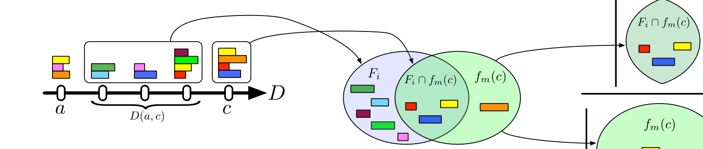

Fig. 5: Depiction of the formalisms described: The straight line indicates D, the linearized sequence of commits (ovals). The stacked colored rectangles above a commit represent its changeset. Here, c is a commit whose nearest, non-merge ancestor in DVC is a. D(a, c) are the commits made by other developers in the intervening time. F_m(c) is the set of files modified in c and F_i is the set of files modified in the commits in D(a, c). The ratio of files in the intersection to files changed in c is the index of similarity δ that we vary in our definition of distraction.

to concurrent development, but previously handled out-of-band by policy and procedure. To upperbound this work, we consider the work to search for semantic conflict that would occur along D where the distraction of integration work potentially intrudes into feature development work at each commit. This measures how often the integration work, ideally deferred to merge time, would instead intrude into feature development in the absence of an isolation mechanism, such as that provided by DVC.

Fig. 5 illustrates the formalisms we introduce to measure the integration interruptions that occur along D. The line at the left represents D, the linearized history. Ovals on D represent commits. Each commit c defines a changeset, a set of files that it modifies. In the figure, these modified files are the rectangles stacked above each commit. Specifically, c is a commit whose nearest, non-merge ancestor in the original DVC history is a, and D(a, c) represents the commits, not including a or c, that developers made to other branches in that history in the intervening time. Definition 4.2 formalizes the set of files changed in a sequence of commits.

### Definition 4.2 (Intervening Files)
The files modified in D(a, c) "intervene" between c and a, its nearest, non-merge ancestor in D. These files therefore change the state of the project into which c is written. The set of intervening files is

F_i = ⋃_{w ∈ D(a,c)} f_m(w).

If c modifies f ∈ F_i, a syntactic or semantic conflict could occur. Semantic conflicts can be more distracting than syntactic conflicts as c's author must review each file in f_m(c) ∩ F_i to ensure their absence, since VC catches syntactic conflicts. For instance, one of the commits in D(x, c) could have changed the semantics of a function used in c. Intuitively, the commit c is distracted if commits fall between it and its nearest,