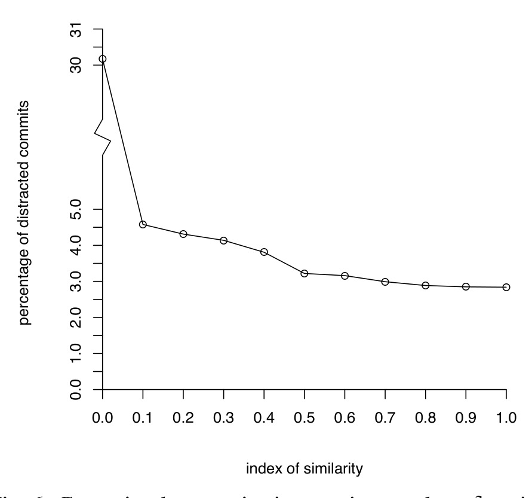

non-merge branch ancestor on D and one of those intervening commits changed a file that c also modified. In Fig. 2, all the commits except commits 1 and 5 are potentially distracted, depending on the set of files each commit changes. Definition 4.3 captures this intuition.

Definition 4.3 (Distraction) The commit c ∈ D is distracted if |Fi ∩ fm(c)| / |fm(c)| > δ, for δ ∈ [0..1].

We cannot know how often files changed in both c and D(a, c) will actually cause a conflict or require the developer committing c to understand a change that occurred in D(a, c). We capture this uncertainty in the threshold δ, an index of similarity, or fraction of the size of the intersection of c’s changeset and the changesets in D(a, c) over the size of c’s changeset. Each setting of δ represents a different assumption about how likely concurrent changes are to generate integration work in order to write the current changeset and form the commit c. At the right of Fig. 5, the fraction of the number of files in the intersection divided by the number of files in c pictorially depicts this index of similarity that we use to measure integration interruptions.

In Fig. 6, we plot the proportion of commits in the linearized history of the Linux kernel that are distracted as δ varies. At zero, we print the percentage of the time there are intervening files (Fi ≠ ∅), regardless of whether they intersect with c’s changeset. Even at δ = 1, i.e. when we require fm(c) ⊆ Fi, 2.8% of commits are distracted, i.e. may encounter conflict or require review to ensure that no semantic assumptions have been violated. After calculating the 95% confidence intervals, we find that a commit c modifies a file that intervenes between c and its ancestor a on D with a confidence interval of 4.47% to 4.69% of the time. This corresponds to the point in Fig. 6 with an index of similarity of 0.1. All of the files in the changeset of a commit c are distracted (index of similarity 1.0) with a confidence interval of 2.47% to 2.93%. Thus, a non-empty overlap occurs approximately once every 22 commits and a complete overlap every 35 commits.

Fig. 6: Commits that require integration work as δ varies when the Linux kernel history is linearized.

Clearly, using a branch reduces distractions by delaying the need to resolve conflicts until merging the branch back into its parent. But how often does the use of branching actually avoid potential distractions in practice? Quantifying exactly how much distraction