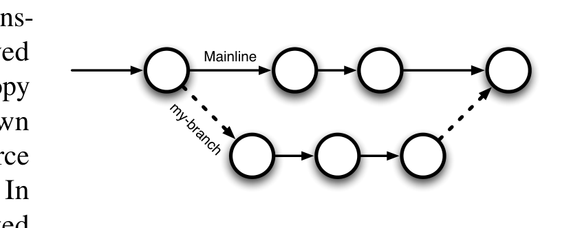

its history. This allows a related set of changes to be rolled back, and also enables the conjoint history of a set of related files to be reconstructed.

Recently, a new generation of VC, distributed version control (DVC), has transformed the use of VC and has achieved widespread adoption. In DVC, every copy of a project is a repository, with its own history and the power to exchange source code changes with other repositories. In contrast with CVC, DVC is distributed in the sense that it allows the change of changesets unmediated by a central repository. DVC also preserves the history of branches after their promotion into the mainline of development. Consider Fig. 1 in which circles represent commits to the repository. Arcs denote the temporal ordering of commits. "Mainline" denotes the main line of development from which releases are made and to which features, like "my-branch", are merged. The dashed edges depict relationships that were untracked, and forgotten in CVC6. In DVC, a commit always tracks its immediate predecessor commits, across both branches and merges; for DVC, the dashed edges are indistinguishable from the edges along a branch. This branch history allows us to augment developer studies with quantitative studies of branch cohesion and isolation. We can use this branch history to crosscheck qualitative results on branch usage. We can also use these measures to shed light on whether differences in how a project uses branches correlate with defect rates or schedule delays.

Open-source software (OSS) projects have rapidly adopted DVC. Our first research question, RQ1, asks "Why did OSS projects rapidly adopt DVC?" We use interviews to show that developers had previously wanted to make heavier use of branches but were dissuaded by "merge pain", the difficulty of resolving conflict that arises during branch integration, and buttress this observation by showing that branch usage has markedly increased in those projects that made the transition from CVC to DVC. We also note that almost all projects making the switch have continued to use a centralized repository, calling into question the conventional wisdom that DVC's support for distributed workflows has been the principal cause of the rapid transition to DVC.

Without branches, developers must share a single mainline and deal with the conflicts that sharing entails. In practice, projects developed workflows to avoid or mitigate conflict, such as baton passing or the "commit bit". We can demonstrate the benefit of branching by simulating a lack of branching. We observe that branched history of a DVC can be linearized onto a single "mainline" in which the conflicts and interruptions that branching avoids become manifest. This linearized history overapproximates the actual conflict and allows us to bound the cohesion and isolation that branches afford.

Ideally, when a task is identified, developers create a branch to work on the task together. But does this occur in practice? Is work performed in a branch more cohesive than all changes across the repository during the same time period? Thus, RQ2 is "How

Fig. 1: DVC history preserves branches and merges.

6 This limitation was addressed in Subversion 1.5.