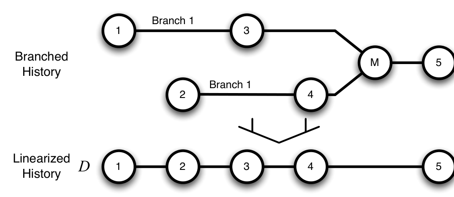

Fig. 2: Branches projected onto D, a single timeline by date. The merge change M that joins the two branches falls out since the work to merge each change occurs, piecemeal, as each change is recorded.

Can be found at http://www.cabird.com/public/vcinterviewquestions.pdf8.

We minimally copy-edited the quotes for readability. We eliminated false starts and superfluous crutch words; we used standard notation, delimiting clarifying comments with brackets and marking the suppression of unnecessary phrases with an ellipsis [17].

For the quantitatively mined data, we developed measures and modified existing ones to best examine the impact of DVC in the context of our dimensions. The data used, the definition of the measure, and attendant threats to validity are discussed in §4. We chose to examine 60 projects that had transitioned to DVC. These projects were drawn from lists of projects using DVC on Wikipedia and GitWiki and include such notable projects as Wine, Samba, Perl, Ruby on Rails, and the Glasgow Haskell Compiler. These projects vary in age from 21 years (in the case of Perl) to 6 months (pthreads-stubs in X.Org) with a median of 4.5 years. The number of contributors as recorded by the repositories ranges from 1,462 (Wine) to 1 (dri2proto in X.Org). The commits to these projects number from 139,187 (Samba) to just 6 (pthread-stubs in X.Org). As such, our selection of projects for analysis spans a broad spectrum of OSS projects in terms of size, age, and development activity. All projects have used DVC for at least 5 months at the time of this study; the majority of them for over one year.

We use Linux to evaluate hypotheses and questions regarding advanced DVC usage because the Linux kernel project has never used a CVC and its developers are generally very experienced with history-preserving branching. Linux started using Git in 2005; we have 3.5 years of Linux VC data and the corresponding data from Linux kernel Mailing List (LKML). Over this period, there were 4K developers, 118K commits, and 443K mail messages for Linux.

## 4 Evaluation

In this section, we answer each of our research questions. To begin, we introduce our branch linearization technique on which much of our analysis rests. To linearize a branched DVC history, we project the concurrent sequence of changes in a DVC history onto the single timeline D, as shown in Fig. 2. The commits along this timeline represent concurrent work that actually occurred across branches. Conflict or interruption, that

8 At the request of the participants, the interviews in their entirety are confidential.