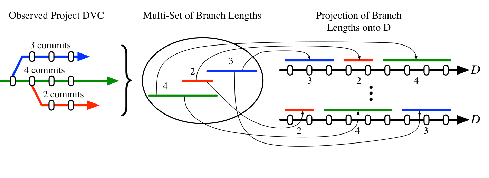
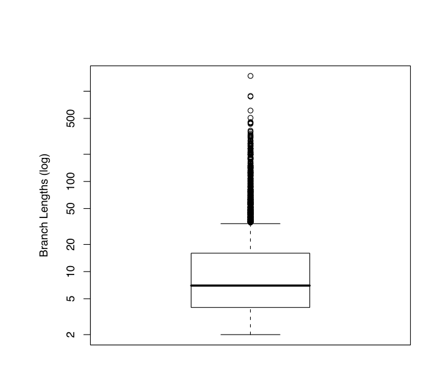
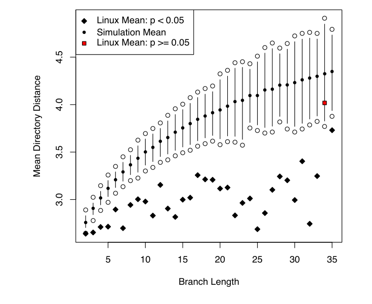

Fig. 3: Depiction of the selection of branches for the Monte Carlo simulation.

(a) Distribution of branch lengths in the Linux kernel.

(b) Observed branches compared to simulated branches over D from 1,000 simulations.

Fig. 4: Linux branch lengths: observed and simulated.

> "Because we'd have these large changes that would go in all at once, it would be really difficult to find the source of problems. For example, if you wanted to find a change that was responsible for certain problems, you would often go back [in history] . . . and pretty soon you'd find one of these 'mega' patches . . . that would essentially change every file in the system and would lump together sets of unrelated changes . . . [these mega changes made it] really, really difficult to track down what change was responsible for a given problem; it makes software maintenance really difficult."

Sperber, XEmacs [21]

In summary, projects continue to use a centralized repository and project maintainers have stated that the DVC branch and merging facilities was a principal motivation, so we find that the answer to RQ1 is branching, not distribution.

## 4.2 Cohesion

Large systems, like the Linux kernel, structure their files in a modular manner. Files that perform similar or related functions are close in the directory hierarchy [5], thus the