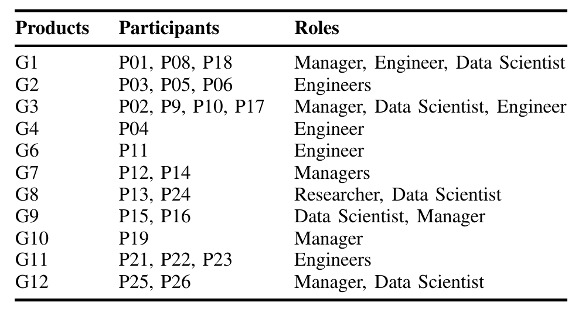

## TABLE II: INTERVIEW PARTICIPANTS

cases. In addition, we aimed to recruit multiple team members in different roles (managers, engineers, and data scientists) from each product team to explore different perspectives. In total, we conducted four pilot interviews, followed by 26 interviews we analyzed for this paper (cf. Table III-A). Our recruitment strategy involved reaching out through company-internal channels and using snowball sampling [53] to identify suitable interviewees.

We conducted the interviews virtually, recorded them with consent, and transcribed them using an in-house tool. We followed the usual best practices for interviews [54], [55] to establish rapport and encourage open dialogue.

We analyzed the interview data with standard qualitative methods [56], [57], involving open coding and memoing to develop and iteratively refine a codebook for challenges and solutions. We established inter-coder agreement on one interview (percentage agreement between two raters coding independently = 80%).

### B. Survey

Drawing from our interview analysis results, we identified the key challenges and emerging solutions and designed our survey to quantify their prevalence within the company, using various rating scales. This included questions about agreement to statements about challenges, ratings of difficulty of select activities (from ‘extremely hard’ to ‘extremely easy’) and ratings of whether participants tried and used techniques (from ‘tried and would recommend’ to ‘would like to try’ to ‘tried but did not find useful’). Similar to the focus in our interviews, we again focused the survey on the quality assurance aspects of developing LLM-based products, allowing us to explore this topic in more depth while keeping the survey to a reasonable length. In addition, we also incorporated a separate section in our survey for non-LLM components to compare and contrast the responses — this is beyond the scope of this paper.

Since it is difficult to identify who exactly works on LLM features at Microsoft, we oversampled and included anyone who committed to a repository containing LLM code as a potential survey participant. Despite expecting a lower response rate [58], it was for us crucial to reach as many LLM practitioners as possible. To ensure accuracy, we incorporated qualifying questions into the LLM section of the survey. In

In total, we emailed 12,878 practitioners, received 977 automated out-of-office replies, and 332 responses (response rate < 3%), among which, 182 responses were directed to the LLM component of the survey.

In this paper, we report primarily quantitative results from ratings regarding challenges and emerging solutions.

### C. Threats to Validity and Credibility

Our research has the kind of limitations typical for this style of research. Both of our interviews and surveys have a risk of response bias, where the respondents may provide inaccurate responses due to misunderstanding, social desirability, and other factors. While the survey affords some generalizability to the population of developers at Microsoft, given that participation in our survey and interviews was voluntary, those who chose to participate might be inherently different from those who did not, potentially skewing the results. Results might be influenced by other practices at Microsoft, hence readers should be careful when generalizing results to other organizations. Also despite following standard practices for coding and careful design of our survey and interview protocol, we cannot entirely exclude biases introduced by us researchers.

## IV. RESULTS

We provided an overview of quality-assurance-related challenges identified in the literature and confirmed in our interviews and survey in Table I. In the remainder of this paper, we focus on emerging solutions reported by the interviewed and surveyed practitioners, again focusing on quality assurance (we report other emerging solutions related to requirements, development and integration, and prompt development in the appendix).

Challenges, disruptions, and emerging solutions: Emerging solutions do not always match perfectly the identified challenges and many solutions implicitly or explicitly address multiple challenges. To organize the emerging solutions, we organize them by themes we call disruptions. Specifically, we refer to challenge as inherent difficulty or obstacles associated with and caused by LLMs and use disruptions to describe how these challenges disrupt traditional software development practices and cause day-to-day disturbance for practitioners in their established workflows and practices (especially for practitioners new to LLMs) as they attempt to address these challenges within their known established practices and tools. The experienced disruption then drives the exploration and adoption of new solutions to overcome them. In essence, the sequence is: One or more challenges lead to disruptions in development practices, which in turn trigger the adoption of a new solution. For example, the challenge lack of specifications (!C1, Table I) leads to perceived insufficiency of objective metrics, which results in the formulation and adoption of the emerging practice of combining multiple qualitative and quantitative metrics (Emerging Solution 2).

For each emerging solution, we include quantitative evidence from our survey (marked with ÿ). Based on the practitioners who rated that they (a) ‘tried and would recommend’