# Enhancing Differential Testing: LLM-Powered Automation in Release Engineering

Ajay Krishna Vajjala∗†, Arun Krishna Vajjala∗†, Carmen Badea¶, Christian Bird¶, Jade D’Souza§  
Robert DeLine¶, Mikhail Demyanyuk§, Jason Entenmann¶, Nicole Forsgren¶, Aliaksandr Hramadski§  
Haris Mohammad§, Sandeepan Sanyal§, Oleg Surmachev§, Thomas Zimmermann∗∗†  
∗George Mason University, §Microsoft, ¶Microsoft Research, ∗∗University of California, Irvine  
Emails: {akrish, akrishn}@gmu.edu, {cabadea, cbird, jadedsouze, rdeline, midemyan, jentenmann, niforsgr, ahramadski, harismo, ssanyal, olegsu}@microsoft.com, tzimmer@uci.edu

Abstract—In modern software engineering, efficient release engineering workflows are essential for quickly delivering new features to production. This not only improves company productivity but also provides customers with frequent updates, which can lead to increased profits. At Microsoft, we collaborated with the Identity and Network Access (IDNA) team to automate their release engineering workflows. They use differential testing to classify differences between test and production environments, which helps them assess how new changes perform with real-world traffic before pushing updates to production. This process enhances resiliency and ensures robust changes to the system. However, on-call engineers (OCEs) must manually label hundreds or thousands of behavior differences, which is time-consuming. In this work, we present a method leveraging Large Language Models (LLMs) to automate the classification of these differences, which saves OCEs a significant amount of time. Our experiments demonstrate that LLMs are effective classifiers for automating the task of behavior difference classification, which can lead to speeding up release workflows, and improved OCE productivity.

Index Terms—Differential Testing, Release Engineering, Large Language Models, Classification

## I. INTRODUCTION

In this modern era of software engineering, ensuring the reliability and robustness of software systems is more important than ever [1]. Companies like Microsoft, whose products are used by millions of people around the world, must prioritize building stable and resilient systems to meet the demands of their large consumer base. A failure to maintain reliability and robustness can lead to negative customer experiences, which can impact customers, brand reputation, and long-term success. Reports put the average cost of downtime at $9,000 per minute, with downtime costs in the millions for large enterprises and higher risk industries [2], [3]. Therefore, the ability to consistently deliver dependable software can lead to a competitive advantage in today’s market. This is where release engineering plays a crucial role. It ensures that new software updates and features are delivered efficiently and reliably [4].

One method for ensuring the reliability and robustness of software systems is differential testing [5]. This approach involves comparing the behavior of different versions of a system or software implementation to detect any inconsistencies or regressions [6]. By running the same inputs through multiple versions of test and production builds on live data from the real world and analyzing differences in their outputs, companies can catch bugs or unexpected changes in behavior that were introduced during updates. Differential testing is effective in maintaining software quality during development workflows, which ensures that new features or small changes in existing code-bases do not negatively impact existing functionality [7]. For large companies, this technique plays a crucial role in delivering resilient updates to millions of users.

Many teams at Microsoft leverage differential testing techniques in their release engineering [4] pipelines before pushing new features into production. However, there are three major drawbacks associated with this approach. First, identifying differences between builds and environments can be complex, often requiring institutional knowledge (which refers to the knowledge acquired by individuals who have performed the same work over an extended period of time) and a deep understanding of the software system to spot meaningful discrepancies. Second, much of this work is done manually by on-call engineers (OCEs) at Microsoft, who often have to sift through hundreds or even thousands of differences and classify them by hand. This process is not only time-consuming but also prone to mistakes due to fatigue, thus increasing the risk of mislabeling. Finally, the existing differential testing workflows at Microsoft are slow due to their reliance on manual labeling by experts. The process of analyzing differences, fixing issues, and pushing changes to production can take days or weeks. For large companies, where speed and efficiency are crucial, these delays can negatively impact the consumer base.

To address the challenges of manual processes in differential testing, we propose a novel approach to automatically classify behavior differences between the test and production environments. OCEs, who are developers, often spend long hours outside of their primary tasks manually labeling hundreds or thousands of diffs. This is an inefficient use of their time. We believe automating the classification of these behavior differences can help improve their productivity and efficiency during on-call sessions. We present an approach

† Ajay Krishna Vajjala and Arun Krishna Vajjala worked on this research during their internships and Thomas Zimmermann worked on this research as a full-time researcher at Microsoft Research in the SAINTES team.

---

that leverages Large Language Models (LLMs) to classify behavior differences. Recent work has demonstrated the strong reasoning capabilities of LLMs across various tasks and their ability to adapt to different domains [8], [9]. By utilizing these models, we show that LLMs can effectively serve as classifiers for behavior differences between the test and production environments. To the best of our knowledge, this is the first piece of work where LLMs have been introduced as classifiers in the release engineering domain. Through extensive experimentation, including in-context learning and fine-tuning for LLMs [10], [11], we demonstrate that LLMs perform exceptionally well in classifying behavior differences between the test and production environments.

By automating the process of classifying behavior differences, our approach helps engineers save time and reduce mistakes, leading to more reliable software updates. This means companies like Microsoft can deliver stable and high-quality updates to users faster and with fewer issues. As a result, millions of users benefit from smoother experiences with less downtime. In the bigger picture, this solution makes release processes more efficient, allowing engineers to focus on more important tasks, while ensuring software is delivered quickly and reliably. This helps create a better and more dependable digital experience for everyone.

To summarize, the contributions in this paper are as follows:
- We introduce a novel method to automate the classification of behavior differences between test and production environments using LLMs, which reduces the reliance on manual labeling by on-call engineers.
- To the best of our knowledge, we introduce the first work that uses LLMs as classifiers in the domain of release engineering.
- We provide a comprehensive evaluation of LLM performance, demonstrating that through in-context learning and fine-tuning, LLMs can effectively and accurately classify behavior differences between test and production environments.

## II. LABELING DIFFERENCES PROBLEM

The reliability and robustness of production systems is important [4]. Every time a team wants to roll out a new feature, they must ensure that it works under real production conditions [12], making the need for sophisticated methods to validate the integrity of these systems increasingly critical for large organizations [13]. To achieve this, it is important to test the new change with actual production traffic before it is fully deployed. By doing so, the team can catch any potential bugs or issues that might arise, which allows them to resolve these problems before the feature reaches the live production environment. This approach enhances the quality of the software and minimizes the risk of introducing errors that could disrupt the user experience or impact system performance.

One such method that achieves this is called differential testing (see Figure 1). Many teams at Microsoft leverage this technique to ensure the new change is robust and resilient before pushing it to the live production environment.

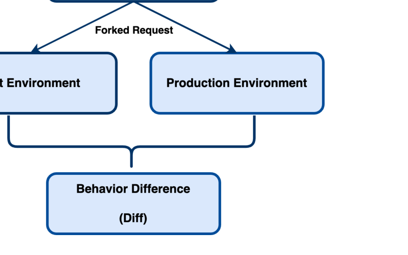

> **Image description:** A simple flow diagram showing a single production request being duplicated (forked) and sent to two parallel boxes labeled “Test Environment” and “Production Environment,” whose outputs are then combined into a single box labeled “Behavior Difference (Diff).” In the paper’s context this represents forking a fraction of real production traffic (1%) to run against a new test build and the live build, with both sides instrumented to collect telemetry and logs; the comparison of those outputs yields diffs containing log and telemetry signals. Those diffs are the artifacts OCEs inspect and label (e.g., UserMarkedNoise, NewFeature, Regression) as part of the release validation workflow.

Fig. 1. Differential Testing Process for Evaluating Test Features

The differential testing process works by first placing the new feature in a test environment that is similar to the production environment. Once the new feature is in this test environment, 1% of the real-world production traffic is sent to both the production and test environments simultaneously. Each request within this 1% is duplicated so that the same request is sent to both environments. Both versions are instrumented with telemetry to record their behavior on the system. The behavioral difference, such as differences in logs and telemetry data, between the outputs of the production and test environments is called a diff. A diff contains information about the build’s outputs, including behavioral signals, various telemetry data, and output logs that provide details about what occurred in the backend leading to the difference. Given that 1% of real-world production traffic is forked into the two environments, there can be thousands of diffs created.

To analyze the diffs and understand why differences occurred between the two environments, on-call engineers (OCEs) must review hundreds of diffs and manually label them. Each diff is assigned one of three labels: UserMarkedNoise, NewFeature, or Regression.

- UserMarkedNoise is applied when the behavior difference between the test and production environments is expected, anticipated, or caused by non-deterministic effects or processes that do not impact the overall outcome. Essentially, it is used when the difference does not matter to the system's performance.
- NewFeature is used when the behavioral difference in the test environment is expected and due to a feature that is absent in the production environment.
- Regression is assigned when the behavior difference is caused by a developer change or a critical issue.

To label a diff, OCEs must manually sift through extensive logs, consult with team members for guidance, and rely on tribal knowledge — a very challenging task for new OCEs. Each on-call session lasts many hours, and labeling hundreds of diffs can be a mind-numbing, time-consuming task, making it an inefficient use of developers' time. Since on-call engineers are also software engineers, they must spend an additional 6–18 hours each week manually labeling these diffs, which negatively impacts their productivity.

---

To address the challenges OCEs face, we propose a solution to automate the diff labeling process. Instead of manually labeling hundreds of diffs during on-call shifts, our approach assists OCEs by automatically suggesting labels, thus making the entire process more efficient and reliable. In the pipeline of rolling out a new feature, testing it against production traffic, addressing differences, and finally deploying it to production, OCEs often become a bottleneck. While most steps in this process are streamlined, the manual labeling of diffs can significantly slow down the push to production. Automating this process can help reduce this bottleneck, improving overall efficiency by minimizing manual work and accelerating the deployment of new features.

### III. APPROACH

To automate the diff labeling process, we developed two novel approaches that leverage the reasoning abilities of Large Language Models (LLMs). LLMs are known for their strong reasoning abilities, given that they have been trained on a large corpus of text data [14]–[16]. Techniques like in-context learning and fine-tuning have shown promise in improving LLM performance [17], especially when working with domain-specific data [8]. Therefore, we present two approaches that are based on in-context learning and fine-tuning of LLMs, and show their impressive performance for the task of automated diff labeling. To automate diff labeling, we take the behavior difference between the outputs from the test and production environments for a single real-world input, examine its relevant properties, and assign one of the three previously mentioned labels based on the available information. This outlines the clear process of labeling a single diff, and we present two different approaches in this work to tackle this problem.

#### A. Dataset

At Microsoft, we worked closely with a team called Identity and Network Access (IDNA). Being one of the largest teams at Microsoft, they need their service to be robust and reliable to cater to customer needs. To maintain the resiliency of their product, they adopted differential testing into their release workflows. For every new change they plan to release, it is put up in the test environment against the production environment, and the diffs created from real-world production traffic are manually labeled by their OCEs. Given that we worked with IDNA at Microsoft, we collected a large number of diffs analyzed and labeled by OCEs in the past year to be the dataset for this work.

Every time a diff occurs between the test and production environments, it is written to a database in IDNA’s internal system. For every new build/version that is rolled out, there can be hundreds of diffs created. Each diff is represented by many different attributes. For this project, we opted to represent each diff by seven unique attributes. After consulting team members and OCEs from IDNA, we confirmed that the seven selected attributes are the most important for representing each diff. In addition, OCEs use these attributes when manually labeling diffs, so we incorporate them to better reflect the information they rely on.

### TABLE I — ATTRIBUTES AND DESCRIPTIONS FOR DIFF LABELING

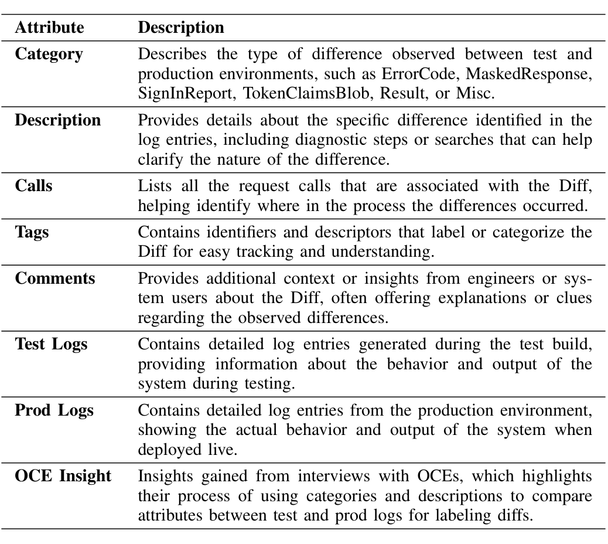

> **Image description:** A two-column table lists the seven attributes the authors use to represent each behavioral diff: Category (high-level diff type such as ErrorCode or MaskedResponse), Description (diagnostic details from log entries), Calls (the request calls involved), Tags (identifiers for tracking), Comments (engineer-provided context), Test Logs and Prod Logs (detailed log entries from each environment), and OCE Insight (automatically extracted comparisons emulating on-call engineers’ tribal knowledge). These attributes were fed to the LLM classifier as the input features; the paper notes that Comments are especially informative (an ablation without Comments reduced accuracy and caused the model to miss Regression labels in live snapshots), while Test/Prod Logs and OCE Insight capture the concrete differences the model must reason about.

The seven attributes are: category, description, calls, tags, comments, test logs, and production logs. The descriptions of these attributes are highlighted in Table I. In addition to the identified attributes, we observed that OCEs also rely on tribal knowledge built over time to label diffs. Tribal knowledge refers to the experience and insights OCEs accumulate over time as they engage in their work. The more experienced an OCE becomes, the better they are at labeling diffs accurately. To gain insight into this tribal knowledge, we conducted informal discussions with several OCEs from IDNA, asking them to demonstrate their diff labeling process.

A consistent pattern emerged: every OCE referred to the logs, using either the category or description to extract key information and compare specific attributes between the test and production logs. To replicate this process, we implemented a function that automatically extracts relevant details from the logs—such as specific categories, descriptions, or other log metadata—and compares key attributes between test and production environments. This function simulates the manual comparison performed by OCEs and provides this information as an additional attribute representing the diff, which we termed “OCE Insight” (see Table I). This can improve the overall information available for each diff.

In this work, we collected two datasets to help with our analysis. For the initial phase of experimentation, where we focused on exploring early results and refining our approach, we gathered a dataset of 3,981 diffs (see Table II). After this phase, once we had some promising insights and new directions, we expanded our efforts and collected a second, much larger dataset of 12,683 diffs (see Table III). Each diff in both datasets was represented by the attributes we discussed earlier, and the true label assigned by an OCE was collected for each one.

For each dataset, we split the data into training, validation, and test sets, following standard practice in machine learning.

---

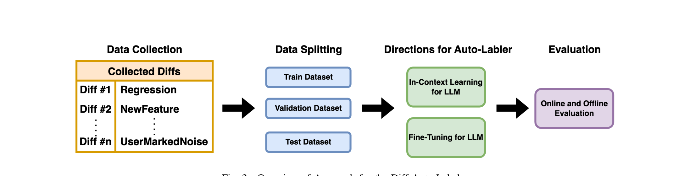

> **Image description:** Diagrammatic overview of the Diff Auto-Labeler: diffs collected from IDNA (each labeled by on-call engineers as Regression, NewFeature, or UserMarkedNoise) are first split into train/validation/test sets. The pipeline then follows two directions for the auto-labeler — in‑context learning with few-shot examples and fine‑tuning of LLMs — before producing predictions. Outputs are validated via both offline test sets and online weekly snapshots (comparing model predictions to OCE labels); the paper further describes in-context retrieval strategies and fine-tuning (LoRA on GPT-4) used to maximize accuracy.

Fig. 2. Overview of Approach for the Diff Auto-Labeler

### TABLE II
INITIAL DATASET AND DISTRIBUTION OF LABELS IN TRAIN/VAL/TEST

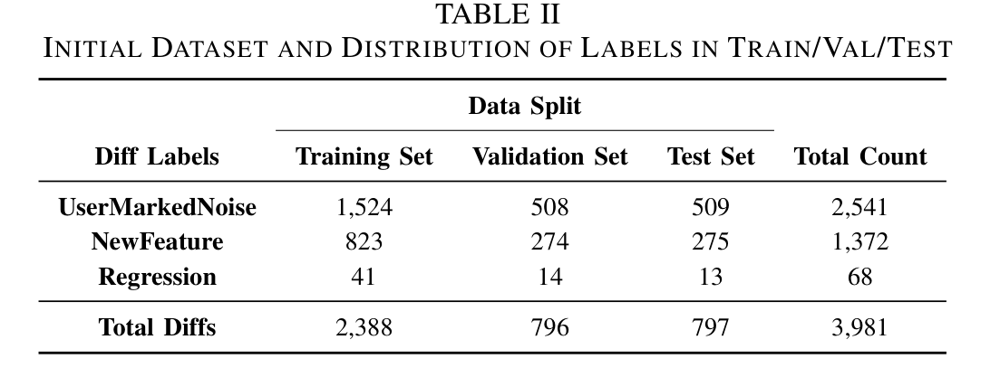

> **Image description:** Table II reports the breakdown of the initial diff dataset (3,981 diffs) by label and data split. Counts per label are: UserMarkedNoise 2,541 (train 1,524 / val 508 / test 509), NewFeature 1,372 (train 823 / val 274 / test 275), and Regression 68 (train 41 / val 14 / test 13). The three splits sum to 2,388 training, 796 validation, and 797 test diffs. The table highlights a strong class imbalance (UserMarkedNoise dominant, Regression very rare), which the paper cites as a challenge for early model training and explains low Regression performance in initial experiments.

### TABLE III
SECOND DATASET AND DISTRIBUTION OF LABELS IN TRAIN/VAL/TEST
Data Split

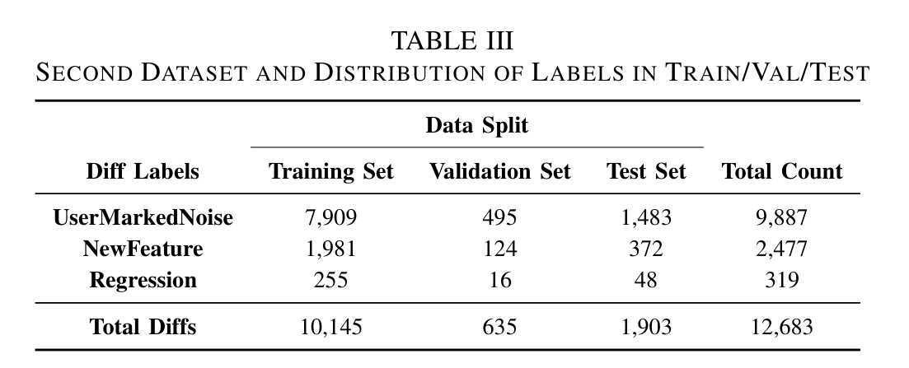

> **Image description:** Table III tabulates the second dataset of 12,683 diffs and its train/validation/test splits. The dataset is split into 10,145 training, 635 validation, and 1,903 test examples. Label counts are highly imbalanced: UserMarkedNoise = 9,887 (≈77.9%), NewFeature = 2,477 (≈19.5%), and Regression = 319 (≈2.5%); the training set contains 7,909 noise, 1,981 new-feature, and 255 regression examples. The paper notes this increase in Regression training examples (from ~41 to 255) was a deliberate effort to improve model performance on the critical Regression class.

[18]. The training set is used to train the model, the validation set helps monitor performance during training to prevent overfitting, and the test set is used for final performance evaluation. Tables II and III show the label distribution across these sets. The most common label is UserMarkedNoise, followed by NewFeature, and then Regression. After consulting with OCEs, we confirmed that this label distribution aligns with their experience in labeling diffs. They mentioned that most of the diffs they encounter are labeled as UserMarkedNoise, followed by NewFeature and Regression, which matches the observed data distribution in both datasets.

After collecting the datasets and gathering the diff information, we explored potential approaches for the diff auto-labeler. We experimented with two main methods: in-context learning and fine-tuning for large language models (LLMs).

### B. In-Context Learning

In this approach, we aimed to rely entirely on the LLMs' knowledge and guide it to predict a label for a diff by providing a few in-context examples. In-context learning involves using an off-the-shelf LLM and inserting relevant examples, known as few-shot examples, directly into the prompt [11]. With this additional context, the model is then asked to generate an output for an unlabeled instance based on the examples provided in the prompt [19]. For this task, we selected three diffs to use as few-shot examples in the prompt. For each example, we included the input (the individual diff) and the expected output (the correct label). We ensured that each of the three examples corresponded to one of the three labels: one Regression diff, one NewFeature diff, and one UserMarkedNoise diff. After providing these examples, we then presented the test diff in the prompt and asked the LLM to predict one of the three labels based on the examples given. For this approach, we used the latest GPT-4o model, which is recognized as one of the largest and most advanced LLMs available [20]. As research has shown that the strategy used to select examples in in-context learning can have a large impact on performance [21], we explored two different methods for selecting few-shot examples: static retrieval, where the examples are predefined and remain consistent, and dynamic retrieval, where the examples are selected based on the specific context or characteristics of the test diff.

#### 1) Static Few-Shot Examples
When retrieving few-shot examples, we aimed to evaluate how the LLM performs with static examples, where the same few-shot examples are provided for each diff in the test dataset. To retrieve these static examples, we went through the training data and selected the first occurrence of a diff corresponding to each label. For instance, to find a NewFeature diff, we scanned the training data, which was created in a random order, and selected the first diff associated with NewFeature as our static example. We repeated this process for UserMarkedNoise and Regression, then used these same static examples for every diff in the test dataset to evaluate performance.

#### 2) Dynamic Few-Shot Examples
In contrast to using static few-shot examples, we aimed to retrieve examples dynamically for each test diff (see Figure 3). To achieve this, we embedded the test diff using OpenAI’s embedding method (text-embedding-ada-002 [22]) and did the same for all diffs in the training set. Embeddings are vector representations of data that capture meaningful relationships between elements, such as words or features, by mapping them to a continuous vector space [23]. Using these embeddings, we identified the three most similar diffs to the test diff by calculating cosine similarity [24] and retrieving the most similar diffs. Specifically, we ensured that the most similar Regression, NewFeature, and UserMarkedNoise diffs were selected as the few-shot examples for each test diff. This approach allows every test diff in the dataset to have unique few-shot examples, which can potentially improve the accuracy of label predictions.

---

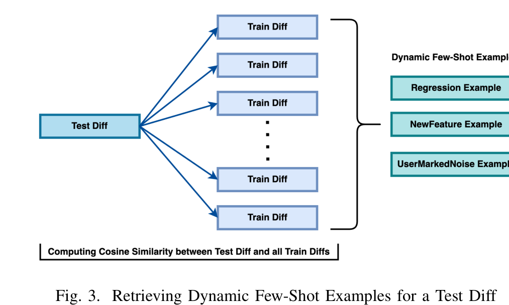

> **Image description:** A schematic showing how a single Test Diff is compared against many Train Diffs to retrieve per-diff few‑shot examples. The diagram illustrates computing cosine similarity between the test diff’s embedding and embeddings of all training diffs (the paper uses OpenAI’s text-embedding-ada-002), then selecting the most similar training examples to produce three dynamic few‑shot examples—one labeled Regression, one NewFeature, and one UserMarkedNoise—for the LLM prompt. The paper reports this dynamic retrieval strategy meaningfully improved in‑context learning performance (raising overall accuracy from ~50% with static examples to ~71.3% with dynamic examples).

Fig. 3. Retrieving Dynamic Few-Shot Examples for a Test Diff

### C. Fine-Tuning

The in-context learning approach used three few-shot examples to predict a label for a single diff. While large language models (LLMs) show impressive reasoning capabilities [14], and three few-shot examples can yield reasonable performance, this approach does not fully utilize the available training data. Given that our dataset contains thousands of diffs, relying on only three few-shot examples significantly limits the model’s capacity to generalize. In addition, increasing the number of few-shot examples to improve performance could exceed the context length limitations of models like GPT-4o.

To address this, we leveraged the large amounts of training data by fine-tuning GPT-4 on thousands of diffs. Tables II and III show the distribution of the datasets that we used to fine-tune GPT-4. Previously, we used GPT-4o for the in-context learning task, but during the time of this work, GPT-4o did not have fine-tuning capabilities. Therefore, we opted to use the GPT-4 model for fine-tuning. Fine-tuning can help improve the model’s performance beyond what is possible through in-context learning alone [10], [25]. Rather than retraining all the weights of the transformer, we applied the Low-Rank Adaptation (LoRA) technique, which was implemented via Azure OpenAI Studio. In this approach, additional LoRA layers are added to the linear layers of the transformer, while the original LLM parameters remain frozen. During fine-tuning, only the LoRA layers are trained, adapting the model to the training data. This enables the LLM to better align with the outputs based on the fine-tuned dataset, which can improve its performance in the specific task of diff labeling [26].

## IV. EVALUATION

The aim of this work is to improve developer productivity and efficiency by developing an automated diff labeler. High accuracy and consistent performance is important to gain the trust of OCEs in the IDNA team, and to effectively support their on-call workflows. By automating the diff labeling process, the use of this model can provide efficiencies to the manual labeling process and may significantly enhance the overall productivity of OCEs. For evaluation, we conducted both offline and online evaluation. The offline evaluation utilized the datasets presented in Tables II and III, which were derived from a historical set of diffs that had already been labeled.

The online evaluation, on the other hand, involved real-time diff data that OCEs label on a weekly basis. We collected the weekly snapshot of diffs that required labeling by the OCEs and compared the model’s predictions with the actual labels assigned by the OCEs after they published their results. Each snapshot, released weekly, serves as a collection of diffs that OCEs need to label. For the online evaluation, we used our model to label the current snapshot and then compared its predictions against the ground truth once the OCEs completed the labeling process. It is important to note that the labels outputted by the LLM are a result of a carefully crafted prompt, which requires the LLM to only output one of the three possible labels. This eliminates the chance of receiving an output which is not one of the specified labels.

### A. Evaluation Metrics

In this work, we calculated accuracy values to validate our approach using the following formula:

Accuracy = (TP_NF + TP_UN + TP_R) / (TP_NF + FN_NF + TP_UN + FN_UN + TP_R + FN_R) (1)

where TP represents true positives, TN represents true negatives, FP represents false positives, and FN represents false negatives. In addition, NF represents NewFeature, UN represents UserMarkedNoise, and R represents Regression. For example, TP_NF represents the true positives for the NewFeature label. We chose this formula for accuracy as it measures how well the model identifies positive cases, which is crucial for minimizing missed positives in critical scenarios.

In addition, we computed the individual label accuracies for NewFeature, UserMarkedNoise, and Regression as follows:

Accuracy_NF = TP_NF / (TP_NF + FN_NF) (2)

Accuracy_UN = TP_UN / (TP_UN + FN_UN) (3)

Accuracy_R = TP_R / (TP_R + FN_R) (4)

The definition of the label specific accuracies is similar to the definition of recall in information retrieval tasks. The reason for this is to measure how well the model predicts and retrieves the true positive cases [27].

### B. Offline Evaluation

We collected 3,981 diffs, shown in Table II, for the initial phase of experimentation with the diff auto-labeler. This phase included experimentation with the in-context learning approach, where we evaluated both static and dynamic few-shot examples. Table IV presents the results using static few-shot examples, revealing an overall accuracy of 50.19%, which is moderate in terms of performance. Specifically, the labeling accuracy was approximately 41% for UserMarkedNoise, 54% for NewFeature, and 61% for Regression. These accuracy levels, hovering around 50%, suggest that the model lacks the reliability needed for practical use. This may also be a result of having the same few-shot examples for every diff in the test dataset, which can affect performance if the few-shot examples are not relevant to the test diff being labeled.

---

### TABLE IV
STATIC FEW-SHOT EXAMPLES ACCURACY RESULTS

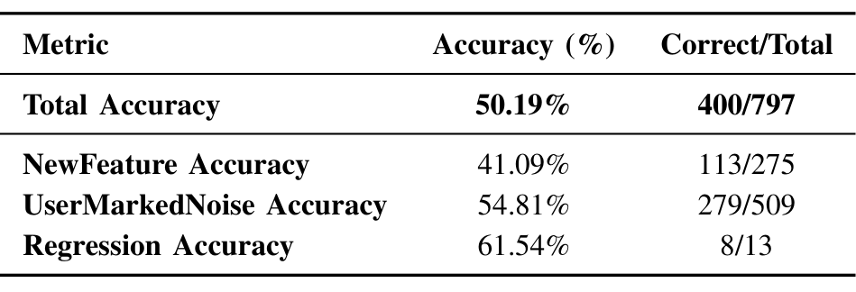

> **Image description:** A summary table reporting labeling accuracy for the static few-shot in-context LLM experiment on a test set of 797 diffs. The model achieved a total accuracy of 50.19% (400/797). Per-class recall-style accuracies and counts are: NewFeature 41.09% (113/275), UserMarkedNoise 54.81% (279/509), and Regression 61.54% (8/13). The table highlights a strong class imbalance (509 noise vs. 13 regression examples), so the Regression figure is based on very few samples; the paper notes this static few-shot result (~50%) is moderate and insufficient for reliable OCE automation compared to later dynamic and fine-tuned approaches.

### TABLE V
DYNAMIC FEW-SHOT EXAMPLES ACCURACY RESULTS

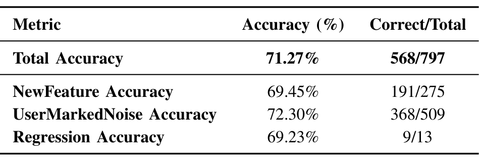

> **Image description:** Table V reports accuracy for the dynamic few‑shot in‑context LLM approach: overall accuracy is 71.27% (568 correct of 797). Per‑label recall-style accuracies are shown with counts: NewFeature 69.45% (191/275), UserMarkedNoise 72.30% (368/509), and Regression 69.23% (9/13). Compared with the static few‑shot result reported earlier (~50.19%), this dynamic retrieval approach yields roughly a 20 percentage‑point lift in overall accuracy, though the Regression metric is based on very few examples (13) and therefore less statistically reliable.

To improve accuracy, we implemented an approach that retrieves dynamic few-shot examples. The results, shown in Table V, indicate a significant improvement, with overall accuracy increasing to 71.27%. The individual label accuracies also improved, with UserMarkedNoise at 69%, NewFeature at 72%, and Regression at 69%. This represents an almost 20% increase in accuracy across all labels compared to the static few-shot examples. The dynamic approach is more promising for in-context learning, as the few-shot examples are retrieved based on their similarity to the test diff being labeled. However, despite the improvement, the accuracy values still hover around 60–70%, which is not enough for OCEs to fully rely on the model. For OCEs to trust and integrate this approach into their workflows, significantly higher accuracy levels are required.

Given the ceiling of 60–70% accuracy in the in-context learning approaches, we wanted to leverage the larger amounts of training data available, rather than relying on only three few-shot examples. To do this, we fine-tuned both GPT-3.5 and GPT-4 using the initial dataset, while monitoring loss curves with validation data to prevent overfitting. Table VI presents the results of the fine-tuned GPT-3.5 model on the same test dataset used in the in-context learning experiments. The overall accuracy significantly increased to 91.5%, with UserMarkedNoise and NewFeature achieving 95% and 89% accuracy, respectively, which are significant improvements from earlier results. However, the Regression accuracy was 0%, which is not ideal since Regression is the most critical diff for OCEs to label. The training data contained only around 40 Regression samples, and GPT-3.5, being a relatively smaller model, struggled to generalize with such a limited number of examples. We tested GPT-3.5 to evaluate its performance, as the cost of fine-tuning this model is significantly lower and more cost-effective compared to GPT-4. Additionally, being a smaller model, GPT-3.5 takes less time to fine-tune. However, the results showed that while it performed well on UserMarkedNoise and NewFeature, it struggled with

### TABLE VI
FINETUNED GPT-3.5 ACCURACY RESULTS

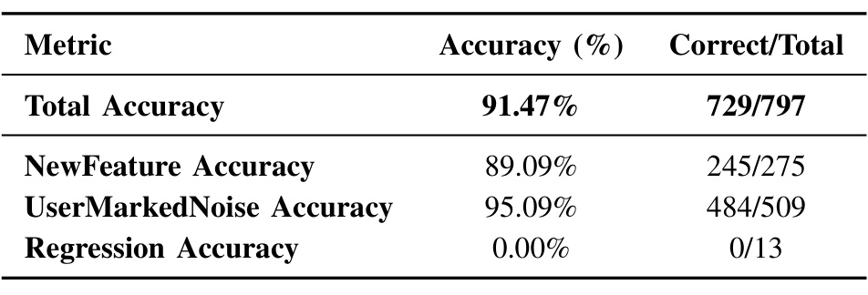

> **Image description:** Table showing accuracy of the fine-tuned GPT-3.5 model on a test set of 797 diffs. The model achieves a total accuracy of 91.47% (729/797). Per-label results are: NewFeature 89.09% (245/275), UserMarkedNoise 95.09% (484/509), and Regression 0.00% (0/13). The breakdown reveals that the high overall accuracy is driven by strong performance on the two majority labels while the model failed to predict any of the 13 Regression cases in this test set.

### TABLE VII
FINETUNED GPT-4 ACCURACY RESULTS

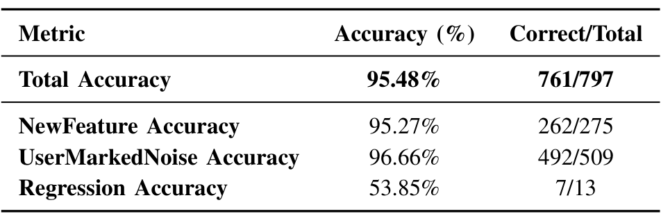

> **Image description:** Results from the fine-tuned GPT-4 model on the initial test split of 797 diffs: total accuracy 95.48% (761/797). Per-label performance: NewFeature 95.27% (262/275), UserMarkedNoise 96.66% (492/509), and Regression 53.85% (7/13). The high overall accuracy is driven by excellent performance on the two majority classes (NewFeature and UserMarkedNoise), while Regression accuracy is much lower because there are very few regression examples in the test set (only 13), yielding only seven correct predictions.

Regression, making GPT-3.5 a less suitable choice if the goal is to use it as an assistant for OCEs in their labeling tasks.

To address this, we fine-tuned GPT-4, a model ten times larger than GPT-3.5. Table VII shows the results of the fine-tuned GPT-4 model on the same test dataset, where accuracy improved further across the board. Overall accuracy reached 95%, with UserMarkedNoise at 96%, NewFeature at 95%, and Regression accuracy climbing to 53%. The significant improvement in Regression labeling accuracy, while unexpected, is reasonable given GPT-4’s capacity to learn complex relationships from smaller amounts of data compared to GPT-3.5. This suggests that the model’s size and capacity played a key role in addressing the challenges posed by limited training samples for Regression examples.

However, the results for the Regression label were still hovering around 50% accuracy. While this is a significant improvement compared to the results from the fine-tuned GPT-3.5 model, it is not helpful for OCEs in terms of reliability and accuracy. To further improve diff auto-labeling performance, not only for the Regression label but also for the other two labels, we increased the dataset size significantly beyond what we initially started with. Table III shows the updated label distribution, where the dataset now contains almost 13,000 diffs, which is more than three times the size of the initial dataset. The goal was to gather as much diff data as possible from the IDNA team to ensure a large sample size for each label in the training set. Identifying Regression diffs is crucial because they result from critical differences between the test and production environments. By collecting as much data as possible, we can ensure a sufficient sample size to fine-tune the model effectively.

After splitting the dataset into training, validation, and testing sets, the number of Regression samples in the training set increased from 41 in the initial dataset to 255 in the new dataset. This large increase in Regression samples provides the model with more diverse training examples, allowing it to generalize better on unseen data. Given the superior performance of GPT-4 in previous experiments compared to

---

## TABLE VIII: FINE-TUNED GPT-4 ACCURACY RESULTS FOR LARGER DATASET

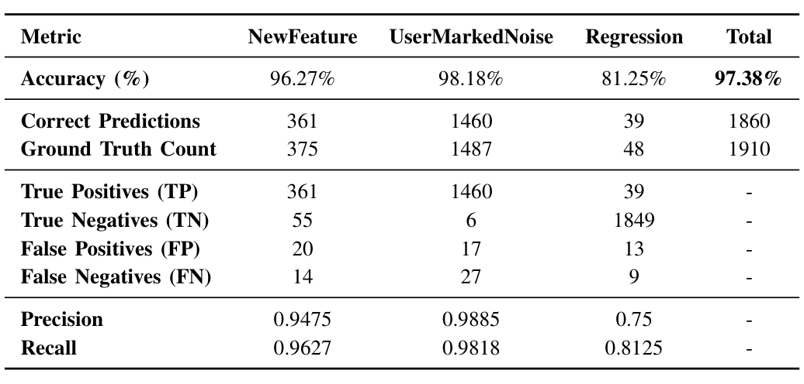

> **Image description:** Table of evaluation metrics for the GPT‑4 model fine-tuned on the expanded dataset (1,910 ground-truth diffs). Overall accuracy is 97.38% (1,860 correct predictions out of 1,910). Per-label: NewFeature — 96.27% accuracy (361 TP / 375 true), precision 0.9475 and recall 0.9627; UserMarkedNoise — 98.18% accuracy (1,460 TP / 1,487 true), precision 0.9885 and recall 0.9818; Regression — 81.25% accuracy (39 TP / 48 true), precision 0.75 and recall 0.8125. The confusion counts show few false positives/negatives for NewFeature and UserMarkedNoise (FP 20/17, FN 14/27), while Regression still has more errors (13 FP, 9 FN) despite marked improvement over earlier experiments.

GPT-3.5, we fine-tuned a new GPT-4 model from scratch using the newly collected dataset.

Table VIII presents the results of fine-tuned GPT-4 on the second dataset. The results show significant improvements in accuracy across all labels compared to the initial dataset. Most importantly, we see that the total labeling accuracy increased to an impressive 97.38%, and the Regression accuracy improved to 81.25%. This is a significant jump from the mid-50% accuracy in the initial results. Furthermore, the UserMarkedNoise accuracy reached 98.18%, which demonstrates both high performance and reliability of the model. Similarly, NewFeature accuracy also saw a big increase, rising to 96.27%.

The precision and recall values [27] in Table VIII provide additional insight into the model’s performance beyond accuracy alone. For UserMarkedNoise, the precision is 0.9885, meaning that 98.85% of the predicted positive cases are correct, while the recall of 0.9818 indicates that the model correctly identified 98.18% of the actual UserMarkedNoise cases. Similarly, for NewFeature, the precision and recall values are 0.9475 and 0.9627, respectively, which tells us that the model is accurate in its predictions and is able to identify most positive instances of this label. Regression, while showing an accuracy of 81.25%, has a lower precision of 0.75, indicating that only 75% of the predicted Regressions are correct, while the recall of 0.8125 shows that the model is able to correctly identify 81.25% of the actual Regressions. This suggests that the model struggles with false positives for the Regression label, which may be a result of the small number of Regression samples in the dataset, relative to the other labels. The confusion matrix highlights this further, with a higher number of false positives (13) and false negatives (9) for Regression compared to the other labels. Overall, the high precision and recall values for UserMarkedNoise and NewFeature, along with the improved performance on Regression, indicate a robust model that performs well on all three labels. This can assist OCEs during on-call sessions by providing an initial predicted label for a diff. If they wish to verify it, they can manually review logs and other information. However, in cases where the OCE feels confident in the auto-generated label, they can use it directly. Overall, providing an initial prediction and the option to either use or verify it helps make the task feel less daunting, as the OCEs have a starting point from the prediction.

The offline evaluation showed impressive model performance on a large test dataset, achieving high accuracy across all three labels with an overall accuracy of ≈ 97%. As part of the offline evaluation, we experimented with many different techniques, ranging from static and dynamic few-shot retrieval for in-context learning to fine-tuning large language models like GPT-3.5 and GPT-4 on different datasets. The results showed that fine-tuning GPT-4 led to impressive results in the offline evaluation setting.

### C. Online Evaluation

Given the strong performance in offline evaluation, we tested the model in real-world scenarios by applying it to the released diff snapshots that OCEs must label in the IDNA team release workflow. Each snapshot contains the diffs that OCEs need to manually label during their on-call session.

To evaluate the model’s performance on these live snapshots, we conducted experiments over a four-week period, running the model on the snapshots released weekly and labeling all the diffs in a snapshot. Once the OCEs completed the manual labeling process and published the results to the IDNA database, we compared the fine-tuned model’s predictions to the ground truth labels. This allowed us to evaluate the model’s performance on current development data. The results show how well the model can perform in practical settings.

Tables IX, X, XI, and XII show the results for the online evaluation of the four different snapshots, using the fine-tuned GPT-4 model. Across all snapshots, the total accuracy exceeds 86%, demonstrating impressive performance in labeling snapshots for OCEs. In addition, for Snapshot #1 and Snapshot #3, R Accuracy and recall are marked as "n.d." (not defined) because there are no Regression labels in these snapshots. Therefore, it is not possible to calculate these metrics for those cases. We can see that the accuracy for the UserMarkedNoise label is consistently above 90% across all four snapshots, which is very promising and suggests that the process of labeling diffs as noise could be almost fully automated. In addition, the NewFeature labeling accuracy is above 90% for two snapshots and remains above 80% for the other two, which shows the model’s strong ability to classify this label accurately in live snapshots. For the Regression label, when there is more than one instance, the accuracy hovers around 67%, which is also impressive. However, since Regression is the most critical label when labeling a diff, OCEs would prefer not to rely solely on the model to label it. Instead, they would want to verify it themselves, but having a model with 67% accuracy assisting in the process can significantly enhance efficiency and reduce manual effort in the labeling process.

Looking at the precision and recall values across all four snapshots, we can see strong labeling performance for both the NewFeature and UserMarkedNoise labels. For example, in Snapshot #4, the NewFeature label has a precision of 0.88 and recall of 0.9565, indicating that the model is highly reliable in identifying NewFeature instances while keeping false positives relatively low. Similarly, the UserMarkedNoise precision is consistently above 0.93 across all snapshots, with Snapshot #4 showing a near-perfect precision of 0.9714. This

---

### TABLE IX
SNAPSHOT #1 RESULTS. (N.D.) INDICATES VALUE IS NOT DEFINED

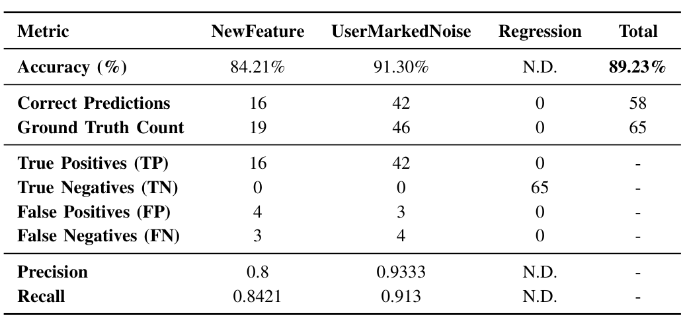

> **Image description:** Table shows the model’s Snapshot #1 performance on 65 diffs: overall accuracy 89.23% with 58 correct predictions. For NewFeature the model predicted 16 of 19 correctly (accuracy 84.21%), with TP=16, FP=4, FN=3, precision=0.80 and recall=0.8421. For UserMarkedNoise it predicted 42 of 46 correctly (accuracy 91.30%), with TP=42, FP=3, FN=4, precision≈0.9333 and recall≈0.913. Regression metrics are marked N.D. because there were zero ground-truth Regression diffs in this snapshot (TP=FP=FN=0, TN=65).

### TABLE X
SNAPSHOT #2 RESULTS

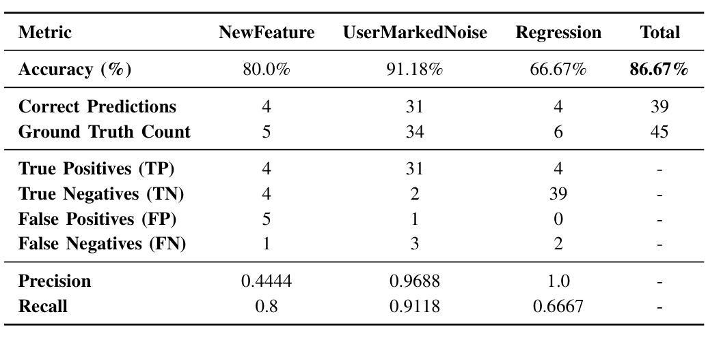

> **Image description:** This table reports the fine-tuned GPT-4 model’s Snapshot #2 results on 45 diffs (39 correct predictions, overall accuracy 86.67%). Per-class accuracy is 80.0% for NewFeature (4 correct of 5), 91.18% for UserMarkedNoise (31/34), and 66.67% for Regression (4/6). Confusion counts show NewFeature had 4 TP, 5 FP and 1 FN (precision 0.4444, recall 0.80), UserMarkedNoise had 31 TP, 1 FP and 3 FN (precision 0.9688, recall 0.9118), and Regression had 4 TP, 0 FP and 2 FN (precision 1.00, recall 0.6667), indicating the model rarely mislabels non-regressions as regressions but misses some regression cases.

### TABLE XI
SNAPSHOT #3 RESULTS. (N.D.) INDICATES VALUE IS NOT DEFINED

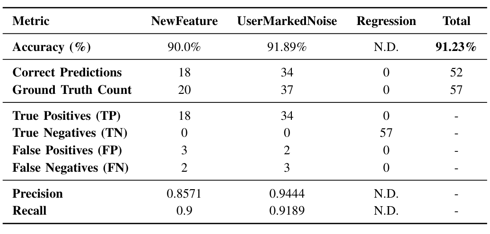

> **Image description:** This table reports online-evaluation results for Snapshot #3 (fine-tuned GPT-4). Out of 57 diffs, the model made 52 correct predictions for an overall accuracy of 91.23%. For NewFeature it correctly labeled 18 of 20 cases (90.0% accuracy) with precision 0.8571 and recall 0.90 (3 false positives, 2 false negatives). For UserMarkedNoise it correctly labeled 34 of 37 cases (91.89% accuracy) with precision 0.9444 and recall 0.9189 (2 false positives, 3 false negatives). The Regression column is marked N.D. because no ground-truth Regression examples were present in this snapshot (model produced 0 Regression true positives and 57 true negatives).

### TABLE XII
SNAPSHOT #4 RESULTS

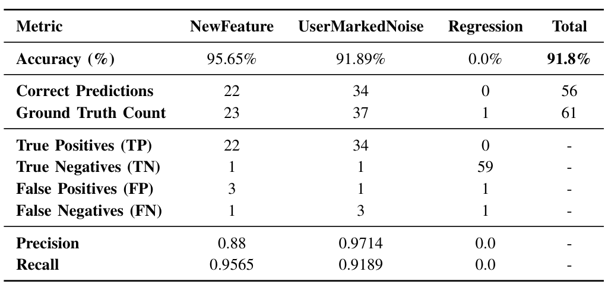

> **Image description:** This table reports Snapshot #4 evaluation over 61 diffs: total accuracy is 91.8% with 56 correct predictions out of 61. Per-label results show NewFeature: 22/23 correct (accuracy 95.65%), precision 0.88 and recall 0.9565 (TP=22, FP=3, FN=1, TN=1). UserMarkedNoise: 34/37 correct (accuracy 91.89%), precision 0.9714 and recall 0.9189 (TP=34, FP=1, FN=3, TN=1). Regression had 1 ground-truth case that the model missed (TP=0), giving 0.0% accuracy and precision/recall of 0.0, though the model correctly identified 59 non-regression examples (TN=59) and produced 1 FP for Regression.

suggests that the model is very effective at correctly predicting when a diff should be labeled as noise, which reduces false positives in this category. The confusion matrix results align with these findings. For the NewFeature label, there are some false positives (e.g., 3 false positives in Snapshot #3) and false negatives, but the overall prediction performance remains impressive. However, for Regression, we see zero true positives in most snapshots and a reliance on true negatives to maintain accuracy. This shows the importance of manual validation in Regression labeling, even though the model can still serve as a useful assistant for other labels.

D. Ablation Analysis

From our experiments, we observed that the fine-tuned GPT-4 model on the larger dataset outperformed all the other models described in this paper in both offline and online evaluations. As mentioned in Section III-A, we used seven attributes to represent each diff, one of which was the user comments. These comments help on-call engineers (OCEs) understand and label diffs correctly, serving as a valuable textual feature for LLMs to identify the appropriate label. To evaluate the importance of the comments attribute, we conducted an ablation study by removing it from the set of diff attributes and fine-tuned a separate GPT-4 model that utilized all other attributes except comments. We initially tested this in an offline evaluation on the same training dataset. Table XIII shows the results of the fine-tuned model without comments.

From the results, we observe that the accuracy values across the three labels decreased compared to the results in Table VIII, which included comments. However, the UserMarkedNoise accuracy remained high, and the accuracy values for the NewFeature and Regression labels stayed above 66%, which

### TABLE XIII
FINE-TUNED GPT-4 RESULTS WITHOUT COMMENTS

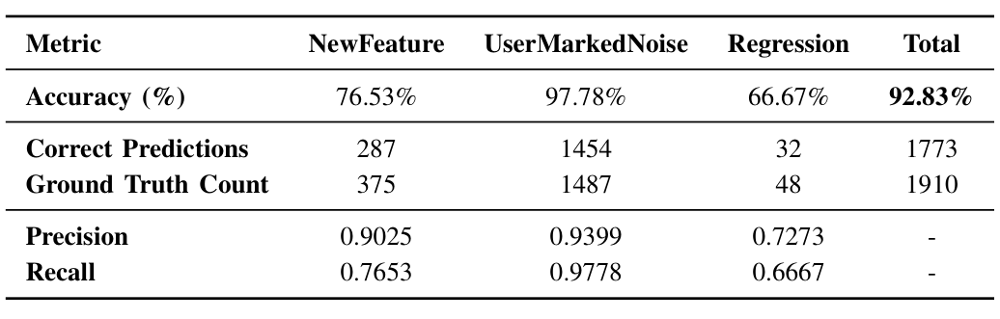

> **Image description:** Table of the fine-tuned GPT‑4 model performance when the user comments attribute is removed (ablation). For 1,910 ground-truth diffs the model made 1,773 correct predictions for an overall accuracy of 92.83%; per-label accuracies are 76.53% (NewFeature, 287/375), 97.78% (UserMarkedNoise, 1,454/1,487) and 66.67% (Regression, 32/48). Reported precision/recall pairs are: NewFeature 0.9025 / 0.7653, UserMarkedNoise 0.9399 / 0.9778, and Regression 0.7273 / 0.6667. These results show high robustness for UserMarkedNoise despite removing comments, while NewFeature and especially Regression labeling degrade compared to the full-feature model (as discussed in the paper).

is reasonable given that each diff is missing one additional, very informative, attribute. The precision and recall values provide further insight into the model’s performance across different labels. Although the model shows high precision (0.9025) and reasonable recall (0.7653) for the NewFeature label, it struggles to capture all relevant instances, suggesting room for improvement in recall. UserMarkedNoise maintains an impressive performance with both precision (0.9399) and recall (0.9778), which indicated that the model effectively classifies most of the diffs associated with this label. However, the Regression label shows lower precision (0.7273) and recall (0.6667). This suggests that the model struggles with these kind of diffs without the comments attribute.

To evaluate the performance of the model without comments in an online setting, we selected two snapshots from recent OCE on-call sessions. The diffs in these snapshots were auto-labeled using the model without comments. Tables XIV and XV present the results, where the diffs were auto-labeled using the fine-tuned GPT-4 model without comments.

The results show that the NewFeature label struggles significantly, with accuracy ranging between 50% and 60% across both snapshots. However, the UserMarkedNoise label main-

---

### TABLE XIV
FINE-TUNED NO-COMMENTS GPT-4 RESULTS FOR SNAPSHOT #2

| Metric | NewFeature | UserMarkedNoise | Regression | Total |
|---|---:|---:|---:|---:|
| Accuracy (%) | 60.0% | 97.06% | 0.0% | 80.0% |
| Correct Predictions | 3 | 33 | 0 | 36 |
| Ground Truth Count | 5 | 34 | 6 | 45 |
| Precision | 0.6 | 0.825 | 0.0 | - |
| Recall | 0.6 | 0.9706 | 0.0 | - |

### TABLE XV
FINE-TUNED NO-COMMENTS GPT-4 RESULTS FOR SNAPSHOT #4

| Metric | NewFeature | UserMarkedNoise | Regression | Total |
|---|---:|---:|---:|---:|
| Accuracy (%) | 56.52% | 91.89% | 0.0% | 77.05% |
| Correct Predictions | 13 | 34 | 0 | 47 |
| Ground Truth Count | 23 | 37 | 1 | 61 |
| Precision | 0.8125 | 0.7556 | 0.0 | - |
| Recall | 0.5652 | 0.9189 | 0.0 | - |

Maintains strong performance, with accuracy between 90% and 98%, which is impressive given that the comments attribute is missing. For Snapshot #2 (Table XIV), the model without comments fails to correctly identify any of the six regression diffs, while the model with comments correctly identifies 4 out of 6 regression diffs, as shown in Table X.

The results of this ablation study, in both offline and online evaluations, show that while the model continues to perform well for the UserMarkedNoise label, it struggles with labeling accuracy for the NewFeature and Regression labels. This is because comments provide valuable textual information that helps the LLM understand the diffs. Without this additional context, the model experiences information loss, leading to reduced prediction accuracy. This suggests that comments are essential for maintaining strong performance, which is critical if OCEs are to rely on the model during on-call sessions.

### E. Time Efficiency

In terms of evaluation, we have shown that by leveraging the reasoning capabilities of LLMs, we can achieve impressive performance for diff labeling, to the point where the labeling for all three labels can be more efficient for OCEs. Given the nature of this labeling task, OCEs are likely to validate the labels over time before fully trusting the automated suggestions. OCEs spend hours each week manually labeling these diffs, and our goal is to significantly reduce this time while improving efficiency. For evaluation, accuracy alone was not the only focus. The main motivation behind this work is to improve workflows within IDNA’s release process at Microsoft, aiming to boost developer productivity and streamline overall software engineering processes, such as labeling diffs. This can also reduce burnout for OCEs, improving their efficiency and leading to better overall work performance.

We conducted informal discussions with OCEs and found that integrating an AI assistant, like the model we presented, reduced the time required to label a snapshot from hours per week to just 15 minutes. This is a significant improvement and it directly benefits OCEs during their on-call sessions.

Not only does this improve productivity for OCEs, it also benefits the IDNA team. For IDNA, saving time is crucial, and by streamlining software engineering workflows, the team can deliver new features faster, which can lead to increased business value for both Microsoft and its customers.

## V. DISCUSSION

The fine-tuned model showed impressive performance in the diff labeling task, achieving very high accuracy values. However, its predictive nature means it can occasionally produce false positives and negatives. Specifically, false negatives for regression (which is the most critical for OCEs) can lower the priority of certain diffs, requiring additional investigation. Despite these limitations, the model serves as an initial opinion for developers, with low error rates for the most important label.

Traditionally, in terms of classification, it is common practice to use existing machine learning techniques such as decision trees, neural networks, and others to make predictions. The traditional models thrive under circumstances where the sources of data are very rich and there is an abundance of it. However, in the diff labeling task, the features are mainly text-based, which contains a lot of rich textual information that can be beneficial to understand a diff. Given the abundance of textual information, the choice of using LLMs for the diff labeling task was not out of question. LLMs have been trained on a large corpus of text data, and are known to be very good at understanding and generating text in various domains [14]. Therefore, by prompting and fine-tuning LLMs, we were able to achieve impressive performance in diff labeling.

The classification task is one of the most important and well-known methods in the field of machine learning. Many attempts in previous research efforts have tried to improve existing models to perform better in these tasks. Based on the results in this work, we showed that the use of LLMs can be adopted to improve classification accuracy. If the data contains textual features or any additional categorical information, we show that LLMs can be a reliable approach to classifying data at a high level. The main drawback of traditional classification models is the need for rich data, which is important to understand the underlying patterns in the data. However, with LLMs, they already have a strong understanding of knowledge, given that they have been trained on a large corpus of text data. Therefore, adapting the model to make predictions in a new domain is not difficult and can lead to good performances.

In addition to the LLMs' abilities in classification tasks, we found that different sizes for LLMs can impact performance. For example, we first started by fine-tuning GPT-3.5 on the diff labeling task, which yielded good results. We followed by fine-tuning GPT-4, which is ten times larger than GPT-3.5, and the results improved drastically across all labels. The field of generative AI is moving at a rapid pace, where newer models are being released quickly. With the increase in performance that we observed when using two different sized LLMs, it is possible that newer models can perform significantly better than the existing models for this same task. In addition, the newer and bigger LLMs have a stronger

---

foundational knowledge, which may make it more useful in classification tasks across distinct domains.

Finally, in machine learning, large datasets are often required to achieve strong performance. However, when data is scarce, it becomes challenging to find underlying patterns and make accurate predictions. Models in these situations may either be underfit due to insufficient data or overfit by overly adapting to the limited available data. LLMs can assist in such cases because, with minimal data, they can leverage textual information and reasoning abilities to learn new tasks. Our work demonstrates this, as we achieved impressive results with only thousands of diffs, which is much less than the tens or hundreds of thousands usually required for strong performance. Therefore, LLMs can still perform very well even with limited data, given their strong reasoning capabilities.

## VI. RELATED WORK

In this work, we focus on automating the task of diff labeling, a key outcome of differential testing. The differential testing process, illustrated in Figure 1, analyzes behavioral differences between test and production environments by forking real production traffic. This approach is widely adopted by teams at Microsoft, as well as by companies outside of Microsoft. Ensuring robust and reliable production systems is crucial for many organizations, and having thorough testing in place improves customer satisfaction and fosters trust in the company [4]. In addition, many companies, even if they don’t use differential testing, rely on other testing methods to ensure that robust and reliable systems are deployed to production [12], [28]. The technique mentioned in this paper builds on existing techniques such as shadow testing [29], and other work from differential testing [5].

Shadow testing is a method in which a new version of a system or feature runs in parallel with the current production system [29], [30]. This allows for the evaluation of the new feature’s behavior under real production traffic, without impacting the production system. By observing how the system reacts, shadow testing provides critical information into the stability and performance of new features before they are fully deployed. Differential testing is a well-known software testing technique used to compare different versions of a system to identify inconsistencies or bugs [5], [6], [31]. In our work, we focus on labeling differences between the test and production builds. Whenever there is a behavioral difference between the outputs of the test and production environments, it indicates an inconsistency between software versions. Our classifier automatically labels and identifies these discrepancies as potential bugs, which is an extension of differential testing.

In addition to building on shadow testing and differential testing, we integrated machine learning (ML) and large language models (LLMs) within the domain of release engineering. Specifically, we fine-tuned and prompted LLMs to label behavior differences in system outputs for a given diff. To our knowledge, this is the first instance of leveraging LLMs as classifiers in the context of software engineering, particularly for labeling differences in release engineering workflows.

While LLMs have been widely used for classification tasks [32], such as text classification and sentiment analysis, where they function as out-of-the-box classifiers, most of this work has focused on natural language data [33]–[36]. LLMs have also seen some use in information retrieval settings, such as predicting user interaction or classifying items in recommender systems [9], [37]–[39]. However, the application of LLMs as classifiers in release engineering remains unexplored, indicating significant potential for further research.

## VII. CONCLUSION AND FUTURE WORK

In this paper, we presented a method that leverages LLMs to automate workflows in differential testing at Microsoft. Our approach demonstrated strong performance in both offline and online evaluations, and to the best of our knowledge, this is the first use of LLMs in release engineering. Currently, our work presents a model with high accuracy that assists OCEs in the labeling process. However, for future work, a simple label prediction may not be sufficient as an AI assistant. When the model predicts a label, the OCE still needs to verify its accuracy, which may add additional overhead to their workload. To improve this experience, we are developing an assistant-style model that not only provides label predictions but also explains why the label was given to a diff.

In addition, another direction for future research is the idea of a confidence score. Currently, the model we presented outputs a single label prediction for a diff. But, to make it more helpful for OCEs, having the model output a confidence score along with a label can be beneficial. This can allow OCEs to quickly assess the reliability of each prediction, where they can focus their effort on low confidence predictions while trusting high confidence results. In terms of developer productivity, this would add an additional feature that OCEs can rely on to help make their on-call sessions more efficient and less intensive.

Next, the model from this work relies on the historical data it has been trained on to make a label prediction. In most cases, this will work well, given that many of the existing diffs are similar to the diffs seen in the historical data. In some cases where new diffs occur, and the model has not seen something similar from the data it has been trained on, the results will not be as impressive. In this case, we are looking into ways where the model can self-learn or self-improve itself in the label prediction task. This can involve a human-in-the-loop feedback mechanism, or some external validation measures to improve the performance of the model on unseen diffs.

Finally, many teams at Microsoft use differential testing to evaluate and test new features against production traffic. In this work, we relied on past diff labeling data from IDNA, since they are one of the biggest teams at Microsoft. For future work we are also looking to scale out this work to other teams at Microsoft. Given that many teams at Microsoft use differential testing, expanding this work can have a big impact on the other teams' workflows and Microsoft as a whole.

---

## REFERENCES

[1] C. C. Venters, R. Capilla, E. Y. Nakagawa, S. Betz, B. Penzenstadler, T. Crick, and I. Brooks, “Sustainable software engineering: Reflections on advances in research and practice,” Information and Software Technology, p. 107316, 2023.

[2] D. Flower, “The true cost of downtime (and how to avoid it),” https://www.forbes.com/councils/forbestechcouncil/2024/04/10/the-true-cost-of-downtime-and-how-to-avoid-it, 2024, Last accessed: 2024-10-08.

[3] J. Chen, X. He, Q. Lin, Y. Xu, H. Zhang, D. Hao, F. Gao, Z. Xu, Y. Dang, and D. Zhang, “An empirical investigation of incident triage for online service systems,” in Proceedings of the 41st International Conference on Software Engineering: Software Engineering in Practice, ser. ICSE-SEIP ’19. IEEE Press, 2019, p. 111–120. [Online]. Available: https://doi.org/10.1109/ICSE-SEIP.2019.00020

[4] B. Adams and S. McIntosh, “Modern release engineering in a nutshell—why researchers should care,” in 2016 IEEE 23rd International Conference on Software Analysis, Evolution, and Reengineering (SANER), vol. 5. IEEE, 2016, pp. 78–90.

[5] W. M. McKeeman, “Differential testing for software,” Digital Technical Journal, vol. 10, no. 1, pp. 100–107, 1998.

[6] R. B. Evans and A. Savoia, “Differential testing: A new approach to change detection,” in The 6th Joint Meeting on European software engineering conference and the ACM SIGSOFT Symposium on the Foundations of Software Engineering: Companion Papers, 2007, pp. 549–552.

[7] M. A. Gulzar, Y. Zhu, and X. Han, “Perception and practices of differential testing,” in 2019 IEEE/ACM 41st International Conference on Software Engineering: Software Engineering in Practice (ICSE-SEIP). IEEE, 2019, pp. 71–80.

[8] H. T. Mai, C. X. Chu, and H. Paulheim, “Do LLMs really adapt to domains? An ontology learning perspective,” arXiv preprint arXiv:2407.19998, 2024.

[9] H. Lyu, S. Jiang, H. Zeng, Y. Xia, Q. Wang, S. Zhang, R. Chen, C. Leung, J. Tang, and J. Luo, “LLM-Rec: Personalized recommendation via prompting large language models,” arXiv preprint arXiv:2307.15780, 2023.

[10] Y. Xia, J. Kim, Y. Chen, H. Ye, S. Kundu, N. Talati et al., “Understanding the performance and estimating the cost of LLM fine-tuning,” arXiv preprint arXiv:2408.04693, 2024.

[11] H. Zhao, M. Andriushchenko, F. Croce, and N. Flammarion, “Is in-context learning sufficient for instruction following in LLMs?” arXiv preprint arXiv:2405.19874, 2024.

[12] T. Karvonen, W. Behutiye, M. Oivo, and P. Kuvaja, “Systematic literature review on the impacts of agile release engineering practices,” Information and Software Technology, vol. 86, pp. 87–100, 2017.

[13] A. Dyck, R. Penners, and H. Lichter, “Towards definitions for release engineering and devops,” in 2015 IEEE/ACM 3rd International Workshop on Release Engineering. IEEE, 2015, pp. 3–3.

[14] W. X. Zhao, K. Zhou, J. Li, T. Tang, X. Wang, Y. Hou, Y. Min, B. Zhang, J. Zhang, Z. Dong et al., “A survey of large language models,” arXiv preprint arXiv:2303.18223, 2023.

[15] H. Touvron, L. Martin, K. Stone, P. Albert, A. Almahairi, Y. Babaei, N. Bashlykov, S. Batra, P. Bhargava, S. Bhosale et al., “Llama 2: Open foundation and fine-tuned chat models,” arXiv preprint arXiv:2307.09288, 2023.

[16] X. Liu, Y. Zheng, Z. Du, M. Ding, Y. Qian, Z. Yang, and J. Tang, “GPT understands, too,” AI Open, 2023.

[17] H. Liu, D. Tam, M. Muqeeth, J. Mohta, T. Huang, M. Bansal, and C. A. Raffel, “Few-shot parameter-efficient fine-tuning is better and cheaper than in-context learning,” Advances in Neural Information Processing Systems, vol. 35, pp. 1950–1965, 2022.

[18] J. Tan, J. Yang, S. Wu, G. Chen, and J. Zhao, “A critical look at the current train/test split in machine learning,” arXiv preprint arXiv:2106.04525, 2021.

[19] Y. Wang, X. Liu, X. Lu, and A. Zhou, “IIPCS: Intent-based in-context learning for project-specific code summarization,” in 2024 International Joint Conference on Neural Networks (IJCNN). IEEE, 2024, pp. 1–8.

[20] S. Shahriar, B. D. Lund, N. R. Mannuru, M. A. Arshad, K. Hayawi, R. V. K. Bevara, A. Mannuru, and L. Batool, “Putting GPT-4o to the sword: A comprehensive evaluation of language, vision, speech, and multimodal proficiency,” Applied Sciences, vol. 14, no. 17, p. 7782, 2024.

[21] S. An, Z. Ma, Z. Lin, N. Zheng, and J.-G. Lou, “Make your LLM fully utilize the context,” arXiv preprint arXiv:2404.16811, 2024.

[22] R. Goel, “Using text embedding models and vector databases as text classifiers with the example of medical data,” arXiv preprint arXiv:2402.16886, 2024.

[23] J. Camacho-Collados and M. T. Pilehvar, “From word to sense embeddings: A survey on vector representations of meaning,” Journal of Artificial Intelligence Research, vol. 63, pp. 743–788, 2018.

[24] F. Rahutomo, T. Kitasuka, M. Aritsugi et al., “Semantic cosine similarity,” in The 7th International Student Conference on Advanced Science and Technology ICAST, vol. 4, no. 1. University of Seoul South Korea, 2012, p. 1.

[25] A. Fan, B. Gokkaya, M. Harman, M. Lyubarskiy, S. Sengupta, S. Yoo, and J. M. Zhang, “Large language models for software engineering: Survey and open problems,” in 2023 IEEE/ACM International Conference on Software Engineering: Future of Software Engineering (ICSE-FoSE). IEEE, 2023, pp. 31–53.

[26] Y. Mao, Y. Ge, Y. Fan, W. Xu, Y. Mi, Z. Hu, and Y. Gao, “A survey on LoRA of large language models,” arXiv preprint arXiv:2407.11046, 2024.

[27] M. Buckland and F. Gey, “The relationship between recall and precision,” Journal of the American Society for Information Science, vol. 45, no. 1, pp. 12–19, 1994.

[28] B. Adams, S. Bellomo, C. Bird, T. Marshall-Keim, F. Khomh, and K. Moir, “The practice and future of release engineering: A roundtable with three release engineers,” IEEE Software, vol. 32, no. 2, pp. 42–49, 2015.

[29] H. Palikareva, T. Kuchta, and C. Cadar, “Shadow of a doubt: Testing for divergences between software versions,” in Proceedings of the 38th International Conference on Software Engineering, 2016, pp. 1181–1192.

[30] S. Satyal, I. Weber, H.-y. Paik, C. Di Ciccio, and J. Mendling, “Shadow testing for business process improvement,” in On the Move to Meaningful Internet Systems. OTM 2018 Conferences: Confederated International Conferences: CoopIS, C&TC, and ODBASE 2018, Valletta, Malta, October 22–26, 2018, Proceedings, Part I. Springer, 2018, pp. 153–171.

[31] A. Zeller and R. Hildebrandt, “Simplifying and isolating failure-inducing input,” IEEE Transactions on Software Engineering, vol. 28, no. 2, pp. 183–200, 2002.

[32] R. Bommasani, D. A. Hudson, E. Adeli, R. Altman, S. Arora, S. von Arx, M. S. Bernstein, J. Bohg, A. Bosselut, E. Brunskill et al., “On the opportunities and risks of foundation models,” arXiv preprint arXiv:2108.07258, 2021.

[33] F. Wei, R. Keeling, N. Huber-Fliflet, J. Zhang, A. Dabrowski, J. Yang, Q. Mao, and H. Qin, “Empirical study of LLM fine-tuning for text classification in legal document review,” in 2023 IEEE International Conference on Big Data (BigData). IEEE, 2023, pp. 2786–2792.

[34] Y. Zhang, M. Wang, C. Ren, Q. Li, P. Tiwari, B. Wang, and J. Qin, “Pushing the limit of LLM capacity for text classification,” arXiv preprint arXiv:2402.07470, 2024.

[35] H. Huang, Y. Qu, J. Liu, M. Yang, and T. Zhao, “An empirical study of LLM-as-a-judge for LLM evaluation: Fine-tuned judge models are task-specific classifiers,” arXiv preprint arXiv:2403.02839, 2024.

[36] P. Liu, W. Yuan, J. Fu, Z. Jiang, H. Hayashi, and G. Neubig, “Pre-train, prompt, and predict: A systematic survey of prompting methods in natural language processing,” ACM Computing Surveys, vol. 55, no. 9, pp. 1–35, 2023.

[37] Y. Gao, T. Sheng, Y. Xiang, Y. Xiong, H. Wang, and J. Zhang, “ChatRec: Towards interactive and explainable LLMs-augmented recommender system,” arXiv preprint arXiv:2303.14524, 2023.

[38] J. Liu, C. Liu, P. Zhou, R. Lv, K. Zhou, and Y. Zhang, “Is ChatGPT a good recommender? A preliminary study,” arXiv preprint arXiv:2304.10149, 2023.

[39] K. Bao, J. Zhang, Y. Zhang, W. Wang, F. Feng, and X. He, “TallRec: An effective and efficient tuning framework to align large language model with recommendation,” in Proceedings of the 17th ACM Conference on Recommender Systems, 2023, pp. 1007–1014.