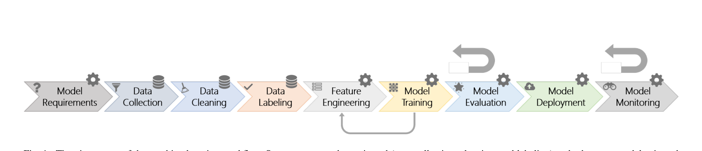

Fig. 1. The nine stages of the machine learning workflow. Some stages are data-oriented (e.g., collection, cleaning, and labeling) and others are model-oriented (e.g., model requirements, feature engineering, training, evaluation, deployment, and monitoring). There are many feedback loops in the workflow. The larger feedback arrows denote that model evaluation and monitoring may loop back to any of the previous stages. The smaller feedback arrow illustrates that model training may loop back to feature engineering (e.g., in representation learning).

always require deep enough knowledge of machine learning to build, evaluate, and tune models from scratch. Third, it can be more difficult to maintain strict module boundaries between machine learning components than for software engineering modules. Machine learning models can be “entangled” in complex ways that cause them to affect one another during training and tuning, even if the software teams building them intended for them to remain isolated from one another.

The lessons we identified via studies of a variety of teams at Microsoft who have adapted their software engineering processes and practices to integrate machine learning can help other software organizations embarking on their own paths towards building AI applications and platforms.

In this paper, we offer the following contributions.

1) A description of how several Microsoft software engineering teams work cast into a nine-stage workflow for integrating machine learning into application and platform development.

2) A set of best practices for building applications and platforms relying on machine learning.

3) A custom machine-learning process maturity model for assessing the progress of software teams towards excellence in building AI applications.

4) A discussion of three fundamental differences in how software engineering applies to machine-learning–centric components vs. previous application domains.

## II. BACKGROUND

### A. Software Engineering Processes

The changing application domain trends in the software industry have influenced the evolution of the software processes practiced by teams at Microsoft. For at least a decade and a half, many teams have used feedback-intense Agile methods to develop their software [2], [3], [4] because they needed to be responsive at addressing changing customer needs through faster development cycles. Agile methods have been helpful at supporting further adaptation, for example, the most recent shift to re-organize numerous teams’ practices around DevOps [5], which better matched the needs of building and supporting cloud computing applications and platforms. 1 The change to DevOps occurred fairly quickly because these teams were able to leverage prior capabilities

1 https://docs.microsoft.com/en-us/azure/devops/learn/devops-at-microsoft/

in continuous integration and diagnostic-gathering, making it simpler to implement continuous delivery.

Process changes not only alter the day-to-day development practices of a team, but also influence the roles that people play. 15 years ago, many teams at Microsoft relied heavily on development triads consisting of a program manager (requirements gathering and scheduling), a developer (programming), and a tester (testing) [6]. These teams’ adoption of DevOps combined the roles of developer and tester and integrated the roles of IT, operations, and diagnostics into the mainline software team.

In recent years, teams have increased their abilities to analyze diagnostics-based customer application behavior, prioritize bugs, estimate failure rates, and understand performance regressions through the addition of data scientists [7], [8], who helped pioneer the integration of statistical and machine learning workflows into software development processes. Some software teams employ polymath data scientists, who “do it all,” but as data science needs to scale up, their roles specialize into domain experts who deeply understand the business problems, modelers who develop predictive models, and platform builders who create the cloud-based infrastructure.

### B. ML Workflow

One commonly used machine learning workflow at Microsoft has been depicted in various forms across industry and research [1], [9], [10], [11]. It has commonalities with prior workflows defined in the context of data science and data mining, such as TDSP [12], KDD [13], and CRISP-DM [14]. Despite the minor differences, these representations have in common the data-centered essence of the process and the multiple feedback loops among the different stages. Figure 1 shows a simplified view of the workflow consisting of nine stages.

In the model requirements stage, designers decide which features are feasible to implement with machine learning and which can be useful for a given existing product or for a new one. Most importantly, in this stage, they also decide what types of models are most appropriate for the given problem. During data collection, teams look for and integrate available datasets (e.g., internal or open source) or collect their own. Often, they might train a partial model using available generic datasets (e.g., ImageNet for object detection), and then use transfer learning together with more specialized data to