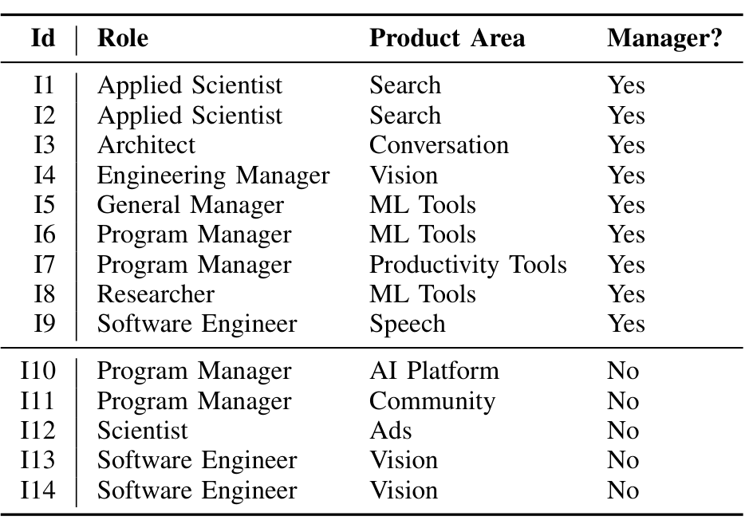

## TABLE I
THE STAKEHOLDERS WE INTERVIEWED FOR THE STUDY.

1. Part 1
   1.1. Background and demographics:
       1.1.1. years of AI experience
       1.1.2. primary AI use case*
       1.1.3. team effectiveness rating
       1.1.4. source of AI components
   1.2. Challenges*
   1.3. Time spent on each of the nine workflow activities
   1.4. Time spent on cross-cutting activities
2. Part 2 (repeated for two activities where most time spent)
   2.1. Tools used*
   2.2. Effectiveness rating
   2.3. Maturity ratings
3. Part 3
   3.1. Dream tools*
   3.2. Best practices*
   3.3. General comments*

Fig. 2. The structure of the study’s questionnaire. An asterisk indicates an open-response item.

To get different levels of experience and different parts of the ecosystem (products with AI components, AI frameworks and platforms, AI created for external companies). In all, we interviewed 14 software engineers, largely in senior leadership roles. These are shown in Table I. The interviews were semi-structured and specialized to each informant’s role. For example, when interviewing Informant I3, we asked questions related to his work overseeing teams building the product’s architectural components.

### B. Survey

Based on the results of the interviews, we designed an open-ended questionnaire whose focus was on existing work practice, challenges in that work practice, and best practices (Figure 2). We asked about challenges both directly and indirectly by asking informants to imagine “dream tools” and improvements that would make their work practice better. We sent the questionnaire to 4,195 members of internal mailing lists on the topics of AI and ML. 551 software engineers responded, giving us a 13.6% response rate. For each open-response item, between two and four researchers analyzed the responses through a card sort. Then, the entire team reviewed the card sort results for clarity and consistency.

Respondents were fairly well spread across all divisions of the company and came from a variety of job roles: Data and applied science (42%), Software engineering (32%), Program management (17%), Research (7%), and other (1%). 21% of respondents were managers and 79% were individual contributors, helping us balance out the majority-manager perspective in our interviews.

In the next sections, we discuss our interview and survey results, starting with the range of AI applications developed by Microsoft, diving into best practices that Microsoft engineers have developed to address some of the essential challenges in building large-scale AI applications and platforms, showing how the perception of the importance of the challenges changes as teams gain experience building AI applications, and finally, describing our proposed AI process maturity model.

## IV. APPLICATIONS OF AI

Many teams across Microsoft have augmented their applications with machine learning and inference, some in surprising domains. We asked survey respondents for the ways that they used AI on their teams. We card sorted this data twice, once to capture the application domain in which AI was being applied, and a second time to look at the (mainly) ML algorithms used to build that application.

We found AI is used in traditional areas such as search, advertising, machine translation, predicting customer purchases, voice recognition, and image recognition, but also saw it being used in novel areas, such as identifying customer leads, providing design advice for presentations and word processing documents, providing unique drawing features, healthcare, and improving gameplay. In addition, machine learning is being used heavily in infrastructure projects to manage incident reporting, identify the most likely causes for bugs, monitor fraudulent fiscal activity, and to monitor network streams for security breaches.

Respondents used a broad spectrum of ML approaches to build their applications, from classification, clustering, dynamic programming, and statistics, to user behavior modeling, social networking analysis, and collaborative filtering. Some areas of the company specialized further, for instance, Search worked heavily with ranking and relevance algorithms along with query understanding. Many divisions in the company work on natural language processing, developing tools for entity recognition, sentiment analysis, intent prediction, summarization, machine translation, ontology construction, text similarity, and connecting answers to questions. Finance and Sales have been keen to build risk prediction models and do forecasting. Internal resourcing organizations make use of decision optimization algorithms such as resource optimization, planning, pricing, bidding, and process optimization.

The takeaway for us was that integration of machine learning components is happening all over the company, not just