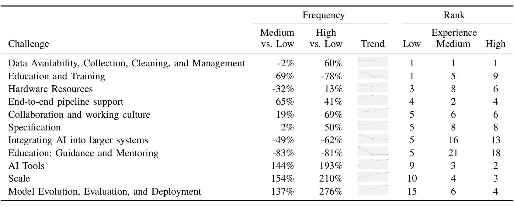

TABLE II
The top-ranked challenges and personal experience with AI. Respondents were grouped into three buckets (low, medium, high) based on the 33rd and 67th percentile of the number of years of AI experience they personally had (N=308). The column Frequency shows the increase/decrease of the frequency in the medium and high buckets compared to the low buckets. The column Rank shows the ranking of the challenges within each experience bucket, with 1 being the most frequent challenge.

We also compared the overall frequency of each kind of challenge using the same three buckets of AI experience. Looking again at the top ranked challenge, Data Availability, Collection, Cleaning, and Management, we notice that it was reported by low and medium experienced respondents at similar rates, but represented a lot more of the responses (60%) given by those with high experience. This also happened for challenges related to Specifications. However, when looking at Education and Training, Integrating AI into larger systems, and Education: Guidance and Mentoring, their frequency drops significantly from the rate reported by the low experience bucket to the rates reported by the medium and high buckets. We interpret this to mean that these challenges were less important to the medium and high experience respondents than to those with low experience levels. Thus, this table gives a big picture of both which problems are perceived as most important within each experience bucket, and which problems are perceived as most important across the buckets.

Finally, we conducted a logistic regression analysis to build a model that could explain the differences in frequency when controlling for personal AI experience, team AI experience, overall work experience, the number of concurrent AI projects, and whether or not a respondent had formal education in machine learning or data science techniques. We found five significant coefficients:

- Education and Training was negatively correlated with personal AI experience with a coefficient of -0.18 (p < 0.02), meaning that people with less AI experience found this to be a more important issue.
- Educating Others was positively correlated with personal AI experience with a coefficient of 0.26 (p < 0.01), meaning that people with greater AI experience found this to be a more important issue.
- Tool issues are positively correlated with team AI experience with a coefficient of 0.13 (p < 0.001), meaning that as the team gains experience working on AI projects, the degree to which they rely on others’ and their own tools goes up, making them think about their impact more often.
- End-to-end pipeline support was positively correlated with formal education (p < 0.01), implying that only those with formal education were working on building such a pipeline.
- Specifications were also positively correlated with formal education (p < 0.03), implying that those with formal education are the ones who write down the specifications for their models and engineering systems.

The lesson we learn from these analyses is that the kinds of issues that engineers perceive as important change as they grow in their experience with AI. Some concerns are transitory, related to one’s position within the team and the accidental complexity of working together. Several others are more fundamental to the practice of integrating machine learning into software applications, affecting many engineers, no matter their experience levels. Since machine learning-based applications are expected to continue to grow in popularity, we call for further research to address these important issues.

## VI. TOWARDS A MODEL OF ML PROCESS MATURITY

As we saw in Section V-G, we see some variance in the experience levels of AI in software teams. That variation affects their perception of the engineering challenges to be addressed in their day-to-day practices. As software teams mature and gel, they can become more effective and efficient in delivering machine learning-based products and platforms.

To capture the maturity of ML more precisely than using a simple years-of-experience number, we created a maturity model with six dimensions evaluating whether each workflow stage: (1) has defined goals, (2) is consistently implemented, (3) documented, (4) automated, (5) measured and tracked, and (6) continuously improved. The factors are loosely based on the concepts behind the Capability Maturity Model (CMM) [26] and Six Sigma [27], which are widely