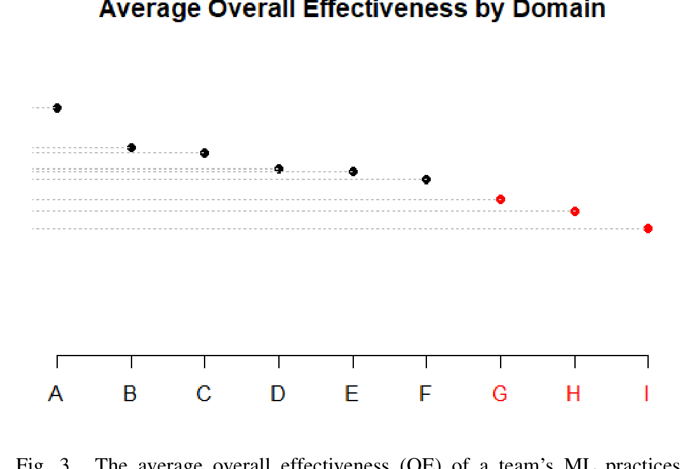

used in software development to assess and improve maturity of software projects.

In the survey, we asked respondents to report the maturity for the two workflow stages that each participant spent the most time on (measured by number of hours they reported spending on each activity). Specifically, we asked participants to rate their agreement with the following statements S1..S6 (bold text was in the original survey) using a Likert response format from Strongly Disagree (1) to Strongly Agree (5):

- S1: My team has goals defined for what to accomplish with this activity.
- S2: My team does this activity in a consistent manner.
- S3: My team has largely documented the practices related to this activity.
- S4: My team does this activity mostly in an automated way.
- S5: My team measures and tracks how effective we are at completing this activity.
- S6: My team continuously improves our practices related to this activity.

We gathered this data for the stages that respondents were most familiar with because we found that they often specialize in various stages of the workflow. This question was intended to be lightweight so that respondents could answer easily, while at the same time accounting for the wide variety of ML techniques applied. Rather than being prescriptive (i.e., do this to get to the next maturity level), our intention was to be descriptive (e.g., how much automation is there in a particular workflow stage? how well is a workflow stage documented?). More work is needed to define maturity levels similar to CMM.

To analyze the responses, we defined an Activity Maturity Index (AMI) to combine the individual scores into a single measure. This index is the average of the agreement with the six maturity statements S1..S6. As a means of validating the Maturity Index, we asked participants to rate the Activity Effectiveness (AE) by answering "How effective do you think your team's practices around this activity are on a scale from 1 (poor) to 5 (excellent)?". The Spearman correlation between the Maturity Index and the Effectiveness was between 0.4982 and 0.7627 (all statistically significant at p < 0.001) for all AI activities. This suggests that the Maturity Index is a valid composite measure that can capture the maturity and effectiveness of AI activities.

In addition to the Activity Maturity Index and Activity Effectiveness, we collected an Overall Effectiveness (OE) score by asking respondents the question "How effectively does your team work with AI on a scale from 1 (poor) to 5 (excellent)?" Having the AMI, AE, and OE measures allowed us to compare the maturity and effectiveness of different organizations, disciplines, and application domains within Microsoft, and identify areas for improvement. We plot one of these comparisons in Figure 3 and show the average overall effectiveness scores divided by nine of the most represented AI application domains in our survey. There are two things to notice. First, the spread of the y-values indicates that the OE metric can numerically distinguish between teams,

Fig. 3. The average overall effectiveness (OE) of a team’s ML practices divided by application domain (anonymized). The y-axis labels have been elided for confidentiality. An ANOVA and Scott Knott test identified two distinct groups to the OE metric, labeled in black (A–F) and red (G–I).

meaning that some respondents feel their teams are at different levels of maturity than others. Second, an ANOVA and Scott Knott test show significant differences in the reported values, demonstrating the potential value of this metric to identify the various ML process maturity levels.

We recognize that these metrics represent a first attempt at quantifying a process metric to enable teams to assess how well they practice ML. In future work, we will refine our instrument and further validate its utility.

## VII. DISCUSSION

In this section, we synthesize our findings into three observations of some fundamental differences in the way that software engineering has been adapted to support past popular application domains and how it can be adapted to support artificial intelligence applications and platforms. There may be more differences, but from our data and discussions with ML experts around Microsoft, these three rose to prominence.

### A. Data discovery and management

Just as software engineering is primarily about the code that forms shipping software, ML is all about the data that powers learning models. Software engineers prefer to design and build systems which are elegant, abstract, modular, and simple. By contrast, the data used in machine learning are voluminous, context-specific, heterogeneous, and often complex to describe. These differences result in difficult problems when ML models are integrated into software systems at scale.

Engineers have to find, collect, curate, clean, and process data for use in model training and tuning. All the data has to be stored, tracked, and versioned. While software APIs are described by specifications, datasets rarely have explicit schema definitions to describe the columns and characterize their statistical distributions. However, due to the rapid iteration involved in ML, the data schema (and the data) change frequently, even many times per day. When data is ingested