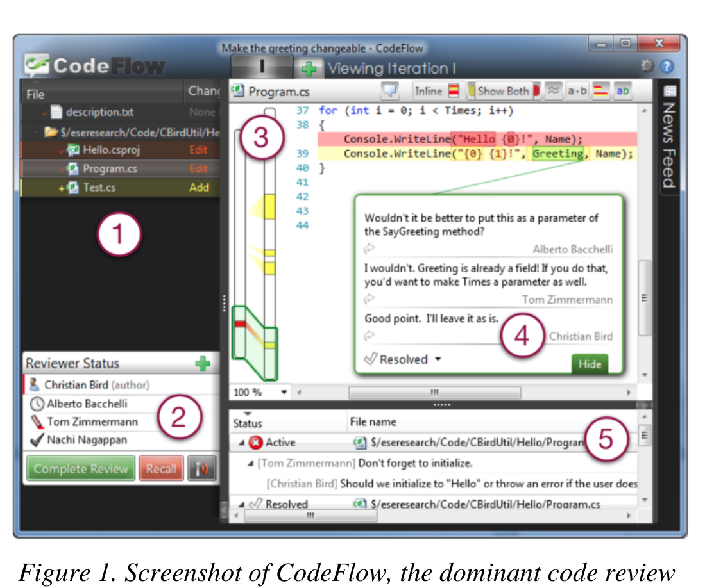

Figure 1. Screenshot of CodeFlow, the dominant code review tool used by developers at Microsoft.

becomes asynchronous. The bottom right pane (5) shows the summary of all the comments in the review.

CodeFlow centralizes and records all the information on code reviews on a central server. This provides an additional data source that we used to analyze real code review comments without incurring the Hawthorne effect [19].

### C. Research Method

Our research method followed a mixed approach [20], depicted in Figure 2, collecting data from different sources for triangulation:
1. analysis of previous study,
2. observations and interviews with developers,
3. card sort on interview data,
4. card sort on code review comments,
5. the creation of an affinity diagram, and
6. survey to managers and programmers.

1. Analysis of previous study: Our research started with the analysis of a study commissioned by Microsoft, between April and May 2012 carried out by an external vendor. The study investigated how different product teams were using CodeFlow. It consisted of structured interviews (lasting 30-50 minutes) to 23 people with different roles.

Most of the interview questions revolved around topics that are very specific to tool usage, and were only tangentially related to this work. We found one relevant as a starting point for our study: “What do you hope to accomplish when you submit a code review?” We analyzed the transcript of this answer, for each interview, through the process of coding [21] (also used in grounded theory [22]): breaking up the answers into smaller coherent units (sentences or paragraphs) and adding codes to them. We organized codes into concepts, which in turn were grouped into more abstract categories.

From this analysis, four motivations emerged for code review: finding defects, maintaining team awareness, improving code quality, and assessing the high-level design. We used them to draw an initial guideline for our interviews.

2. Observations and interviews with developers: Next, we conducted a series of one-to-one meetings with developers who use CodeFlow, each taking 40-60 minutes.

We contacted 100 random candidates who signed-off between 50 and 250 code reviews since the CodeFlow release and sampled across different product teams to address our research questions from a multi-point perspective. We wrote developers who used CodeFlow in the past and asked them to contact us, giving us 30 minute notice when they received their next review task so that we could observe. The respondents that we interviewed comprised five developers, four senior developers, six testers, one senior tester, and one software architect. Their time in the company ranged from 18 months to almost 10 years, with a median of five years.

Each meeting was comprised of two parts: In the first part, we observed them performing the code review that they had been assigned. To minimize invasiveness we used only one observer and to encourage the participant to narrate their work, we asked the participants to think of us as a newcomer to the team. In this way, most developers thought aloud without need of prompting. With consent, we recorded the audio, assuring the participants of anonymity. Since we, as observers, have backgrounds in software development and practices at Microsoft, we were able to understand most of the work and where and how information was obtained without inquiry.

The second part of the meeting was a semi-structured interview [23]. Semi-structured interviews make use of an interview guide that contains general groupings of topics and questions rather than a pre-determined exact set and order of questions. They are often used in an exploratory context to “find out what is happening [and] to seek new insights” [24]. The guideline was iteratively refined after each interview, in particular when developers started providing answers very similar to the earlier ones, thus reaching a saturation effect. Observations also reached a saturation point, thus providing insights very similar to the earlier ones. For this, after the first 5-6 observations, we adjusted the meetings to have shorter observations, which we used as a starting point for our meetings and as a “hook” to talk about topics in our guideline.

The audio of each interview was then transcribed and broken up into smaller coherent units for subsequent analysis.

3. Card sort (meetings): To group codes that emerged from interviews and observations into categories, we conducted a card sort. Card sorting is a sorting technique that is widely used in information architecture to create mental models and derive taxonomies from input data [25]. In our case it helped to organize the codes into hierarchies to deduce a higher level of abstraction and identify common themes. A card sort involves three phases: In the (1) preparation phase, participants of the card sort are selected and the cards are created; in the (2) execution phase, cards are sorted into meaningful groups with a descriptive title; and in the (3) analysis phase, abstract hierarchies are formed to deduce general categories.

We applied an open card sort: There were no predefined groups. Instead, the groups emerged and evolved during the sorting process. In contrast, a closed card sort has predefined groups and is typically applied when themes are known in advance, which was not the case for our study.

The first author of this paper created all of the cards, from the 1,047 coherent units in the interviews. Throughout our