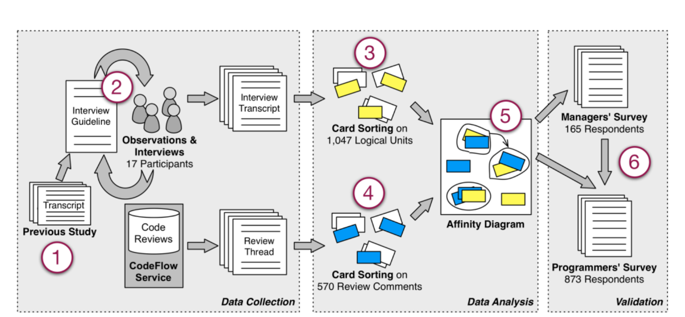

Figure 2. The mixed approach research method applied.

Further analysis, other researchers (the second author and external people) were involved in developing categories and assigning cards to categories, so as to strengthen the validity of the result. The first author played a special role of ensuring that the context of each question was appropriately considered in the categorization, and creating the initial categories. To ensure the integrity of our categories, the cards were sorted by the first author several times to identify initial themes. Next, all researchers reviewed and agreed on the final set of categories.

### 4. Card sort (code review comments)

The same method was applied to group code review comments into categories: We randomly sampled 200 threads with at least two comments (e.g., Point 4 of Figure 2), from the entire dataset of CodeFlow reviews, which embeds data from dozens of independent software products at Microsoft. We printed one card for each comment (along with the entire discussion thread to give the context), totaling 570 cards, and conducted a card sort, as performed for the interviews, to identify common themes.

### 5. Affinity Diagram

We used an affinity diagram to organize the categories that emerged from the card sort. This tool allows large numbers of ideas to be sorted into groups for review and analysis [26]. We used it to generate an overview of the topics that emerged from the card sort, in order to connect the related concepts and derive the main themes. For generating the affinity diagram, we followed the five canonical steps: we
1. recorded the categories on post-it-notes,
2. spread them onto a wall,
3. sorted the categories based on discussions, until all are sorted and all participants agreed,
4. named each group with a description, and
5. captured and discussed the themes.

### 6. Surveys

The final step of our study was aimed at validating the concepts that emerged from the previous phases. Towards this goal, we created two surveys to reach a significant number of participants and to challenge our conclusions (The full surveys are available as a technical report [27]). For the design of the surveys, we followed Kitchenham and Pfleeger’s guidelines for personal opinion surveys [28]. Both surveys were anonymous to increase response rates [29].

We sent the first survey to a cross section of managers. We considered managers for which at least half of their team performed code reviews regularly (on average, one per week or more) and sampled along two dimensions. The first dimension was whether or not the manager had participated in a code review himself since the beginning of the year and the second dimension was whether the manager managed a single team or multiple teams (a manager of managers). Thus, we had one sample of first level managers who participated in review, another sample of second level managers who participated in reviews, etc. The first survey was a short survey comprising 6 questions (all optional), which we sent to 600 managers that had at least ten direct or indirect reporting developers who used CodeFlow in the past. The central focus was the open question asking to enumerate the main motivations for doing code reviews in their team. We received 165 answers (28% response rate), which we analyzed before devising the second survey.

The second survey comprised 18 questions, mostly closed with multiple choice answers, and was sent to 2,000 randomly chosen developers who signed off on average at least one code review per week since the beginning of the year. We used the time frame of January to June of 2012 to minimize the amount of organizational churn during the time period and identify employees’ activity in their current role and team. We received 873 answers (44% response rate). Both response rates were high, as other online surveys in software engineering have reported response rates ranging from 14% to 20% [30].

## IV. WHY DO PROGRAMMERS DO CODE REVIEWS?

Our first research question seeks to understand what motivations and expectations drive code reviews, and whether managers and developers share the same opinions.

Based on the responses that we coded from observations of developers performing code review as well as interviews, there are various motivations for code review. Overall, the interviews revealed that finding defects, even though prominent, is just one of the many motivations driving developers to perform code reviews. Especially when reinforced by a strong team culture around reviews, developers see code reviews as an activity that has multiple beneficial influences not only on the code, but also for the team and the entire development process. In this vein, one senior developer’s comment summarized many of the responses:

> “[code review] also has several beneficial influences: (1) makes people less protective about their code, (2) gives another person insight into the code, so