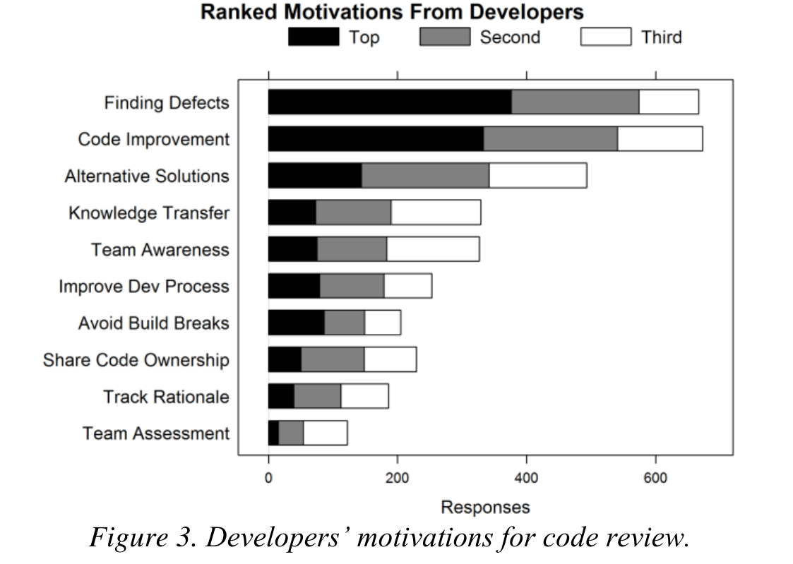

Figure 3. Developers’ motivations for code review.

"are learning the codebase," and "learning tool to teach more junior team members."

Programmers answering the survey declared "knowledge transfer" to be their first motivation for code review in 73 cases (8%), their second in 119 (14%), and their third in 141 (16%).

### E. Team Awareness and Transparency

During one of our observations, one developer was preparing a code review submission as an author: He wanted other developers to "double check" his changes before committing them to the repository. After preparing the code, he specified the developers he wanted to review his code; he required not only two specific people, but he also put a generic email distribution group as an "optional" reviewer. When we inquired about this choice, he explained to us: "I am adding [this alias], so that everybody [in the team] is notified about the change I want to do before I check it in." In the subsequent interviews, this concept of using an email list as optional reviewer, or including specific optional reviewers exclusively for awareness emerged again frequently, e.g., "Code reviews are good FYIs [for your information]."

Managers often mentioned the concept of team awareness as a motivation for code review, frequently justifying it with the notion of "transparency:" Not only must the team be kept aware of the directions taken by the code, but also nobody should be allowed to "secretly" make changes that might break the code or alter functionalities.

The 873 programmers answering the survey ranked "team awareness and transparency" very close to "knowledge transfer." In fact, the two concepts appeared logically related also in the interviews; for example one tester, while reviewing some code said: "oh, this guy just implemented this feature, and now let me back and use it somewhere else." Showing that he both learned about the new feature and he was now aware of the possibility to use it in his own code. 75 (9%) developers considered team awareness their first motivation for code review, 108 (12%) their second, and 149 (17%) their third.

Although team awareness and transparency emerged from our data as clearly promoted by the code review process, academic research seems to have given little attention to it.

### F. Share Code Ownership

The concept of "shared code ownership" is closely related to "team awareness and transparency," but it has a stronger connotation toward active collaboration and overlapping coding activities. Programmers and managers believe that code review is not only an occasion to notify other team members about incoming changes, but also a means to have more than one knowledgeable person about specific parts of the codebase. A manager put the following as her second motivation for code review: "Broaden knowledge & understanding of how specific features/areas are designed and implemented (e.g., grooming "backup developers" for areas where knowledge is too concentrated on one or two expert developers)."

Moreover, both developers and managers have the opinion that practicing code review also improves the personal perception of team members about shared code ownership. On this note, a senior developer, with more than 30 years in the software industry, explained: "In the past people did not use to do code reviews and were very reluctant to put themselves in positions where they were having other people critiquing their code. The fact that code reviews are considered as a normal thing helps immensely with making people less protective about their code." Similarly a manager wrote us explaining that she deems code reviews important because they "Dilute any 'rigid sense of ownership' that might develop over chunks of code."

In the programmers' survey, 51 respondents (6%) marked "share code ownership" as their first motivation, 100 (11%) as their second, and (10%) as their third.

### G. Summary

In this section, we analyzed the motivations that developers and managers have for doing code review. We abstracted them into a list, which we finally included in the programmers' survey. Figure 3 reports the answers given to this question: The black bar is the number of developers that put that row as their top motivation, the gray bar is the number that put it as the second motivation, etc. We have ordered the factors by giving 3 points for a first motivation response, 2 points for a second motivation, etc. and then sorting by the sum.

We discussed the five most prominent motivations, which show that "finding defects" is the top motivation, although participants believe that code review brings other benefits. The first two motivations were already popular in research and their effectiveness have been evaluated in the context of code inspections; on the contrary, the other motivations are still unexplored, especially those regarding more "social" benefits on the team, such as shared code ownership.

Although motivations are well defined, we still have to verify whether they actually translate into real outcomes of a modern code review process.

## V. THE OUTCOMES OF CODE REVIEWS

Our second research question seeks to understand what the actual outcomes of code reviews are, and whether they match the motivations and expectations outlined in the previous section. To that end, we conducted indirect field research [31] by analyzing the content of 200 threads (corresponding to 570