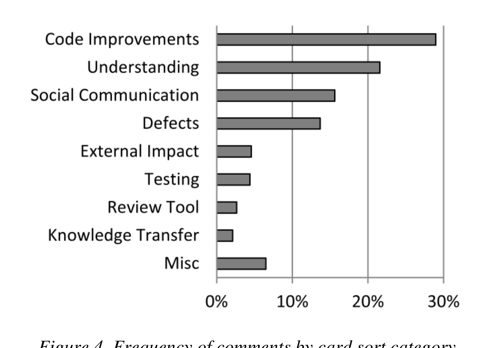

Figure 4. Frequency of comments by card sort category.

comments recorded by CodeFlow. Figure 4 shows the categories of comments found through the card sort.

Code Improvements: The most frequent category, with 165 (29%) comments, is "code improvements." In detail, among "code improvements" comments we find 58 on using better code practices, 55 on removing not necessary or unused code, and 52 on improving code readability.

Defect Finding: Although "defect finding" is the top motivation and expected outcome of code review for many practitioners, the category "defect" is only the fourth most frequent, out of nine items, with 78 (14%) comments. Among "defect" comments, 65 are on logical issues (e.g., a wrong expression in an if clause), 6 on high-level issues, 5 on security, and 3 on wrong exception handling.

Knowledge Transfer: Concerning the other expected outcomes of code reviews, we did not expect to find evidence about them, because of their more "social"—thus harder to quantify—nature. Nevertheless, we found some (12) comments specifically about "knowledge transfer," where the reviewers were directing the code change author to external resources (e.g., internal documentation or websites) for learning how to tackle some issues. This provides additional evidence on the importance of this aspect of reviews.

### A. Finding defects: When expectations do not meet reality

Why do we see this significant gap in frequency between "code improvements" and "defects" comments? Possible reasons may be that our sample of 570 comments is too small to represent the population, that the submitted changes might require less need fixing of "real" defects than of small code improvements, or that programmers could consider "code improvements" as actual defects. However, by triangulating these numbers with the interview discussions, the survey answers, and the other categories of comments, another reason seems to justify this situation. First, we start by noting that most of the comments on "defects" regard uncomplicated logical errors, e.g., corner cases, common configuration values, or operator precedence. Then, from interview data, we see that: (1) most interviewees explained how, with tool-based code reviews, most of the found defects regard "logic issues—where the author might not have considered a particular or corner case"; (2) some interviewees complained that the quality of code reviews is low, because reviewers only look for easy errors: "[Some reviewers] focus on formatting mistakes because they are easy [...], but it doesn't really help. [...] In some ways it's kind of embarrassing if someone asks you to do a code review and all you can find are formatting mistakes when there are real mistakes to be found"; and (3) other interviewees admitted that if the code is not among their codebase, they look at "obvious bugs (such as, exception handling)." Finally, managers mentioned "catching early obvious bugs" or "finding obvious inefficiencies or errors" as reasons for doing code review.

These points illustrate that the reason for the gap between the number of comments on "code improvements" and on "defects" is not to be found in problems in the sample or in classification misconceptions, but it is rather just additional corroborating evidence that the outcome of code review does not match the main expectation of both programmers and managers—finding defects. Review comments about defects are few, comprising one-eighth of the total in our sample, and mostly address "micro" level and superficial concerns; while programmers and managers would expect more insightful remarks on conceptual and design level issues. Why does this happen? The high frequency of understanding comments hints at the answer to our question, addressed in the next section.

## VI. WHAT ARE THE CHALLENGES OF CODE REVIEW?

Our third research question seeks to understand the main challenges faced by the reviewers when performing modern code reviews, also with respect to the expected outcomes. We also seek to uncover the reason behind the mismatch between expectations and actual outcomes on finding defects in code reviews.

### A. Code Review is Understanding

Even though we did not ask any specific question concerning understanding, the theme emerged clearly from our interviews. Many interviewees eventually acknowledged that understanding is their main challenge when doing code reviews. For example, a senior developer autonomously explained to us: "the most difficult thing when doing a code review is understanding the reason of the change;" a tester, in the same vein: "the biggest information need in code review: what instigated the change;" and another senior developer: "in a successful code review submission the author is sure that his peers understand and approve the change." Although the textual description should help reviewers understanding, some developers do not find it useful: "people can say they are doing one thing, while they are doing many more of them," or "the description is not enough;" in general, developers seem to confirm that "not knowing files (or [dealing with] new ones) is a major reason for not understanding a change."

From interviews, no other code review challenge emerged as clearly as understanding the submitted change. Even though scheduling and time issues also appeared challenging, we could always trace them back to the first challenge—through the words of a tester: "understanding the code takes most of the