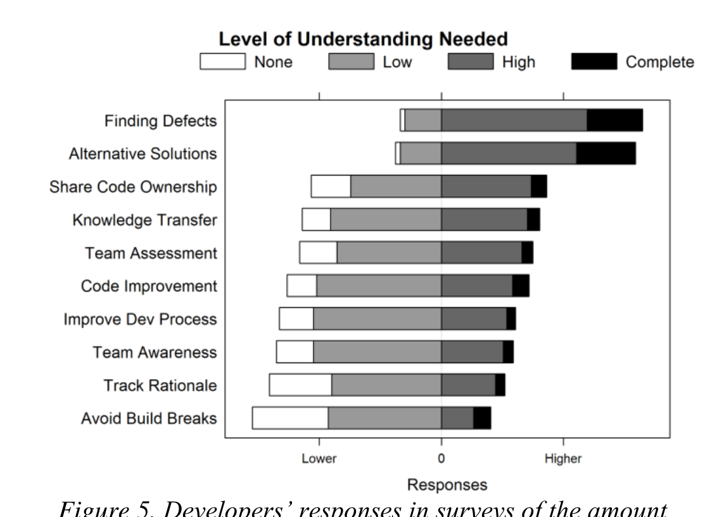

Figure 5. Developers’ responses in surveys of the amount of code understanding for code review outcomes.

“reviewing time.” On the same note, in the code review comments we analyzed, the second most frequent category concerns understanding. This category includes clarification questions and doubts raised by the reviewers who want to grasp the rationale of the changes done on the code, and the corresponding clarification answers. This is also in line with the evidence delivered by Sutherland & Venolia on the relevance of rationale articulation in reviews [17].

Do understanding needs change with the expected outcome of code review? We included a question in the programmers’ survey to know how much understanding they needed to achieve each of the motivations listed in Figure 3. The outcome of the question is summarized in Figure 5. The respondents could answer with a four values Likert’s scale, by selecting the understanding of the change they felt was required to achieve the specific outcome. The most difficult task from the understanding perspective is “finding defects,” immediately followed by “alternative solutions.” Both clearly stand out from the other items. The gap in understanding needs between “finding defects” and “code improvement” seems to corroborate our hypothesis that the difference in the number of comments about these two items in review comments is mostly due to understanding issues. Thus, if managers and developers want code review to match their need for “finding defects,” context and change understanding must be improved.

### B. A Priori Understanding

By observing developers performing code reviews, we noticed that some started code reviews by thoroughly reading the accompanying textual description, while others went directly to a specific changed file. In the first group, the time required for putting the first review comments and understanding the change rationale was noticeably longer, and some of the comments were asking to clarify the reasons for a change. To better comprehend this situation, we included in our interview guideline a question about how the interviewees start code reviews. Participants explained that when they own or are very familiar with the files being changed, they have a better context and it is easier for them to understand the change submitted: “when doing code review I start with things I am familiar with, so it is easier to see what is going on.” When they are file owners, they often do not even need to read the description, but they “go directly to the files they own.” On the contrary, when they do not own files, or have to review new files, they need more information and try to get it from the description, which is deemed good when it states “what was changed and why.”

To better understand this aspect we included two questions in the programmers’ survey to know (1) whether it takes longer to review files they are not familiar with, and why; and (2) whether reviewers familiar with the changed files give different feedback, and how.

Most of the respondents — 798 (91%) — answered positively to the first question, motivating it with the fact that it takes time to familiarize with the code and “learn enough about the files being modified to understand their purpose, invariants, APIs, etc.,” because “big-picture impact analysis requires contextual understanding. When reviewing a small, unfamiliar change, it is often necessary to read through much more code than that being reviewed.” The comment of a developer anticipates the answer to the second question: “It takes a lot longer to understand unknown code, but even then understanding isn’t very deep. With code I am familiar with I have more to say. I know what to say faster. What I have to say is deeper. And I can be more insistent on it.” In fact, the answer to the second question is positive in 716 (82%) cases. The main difference with file owner comments is that they are substantially deeper, more detailed and insightful. A respondent explained: “Comments reflect their deeper understanding — more likely to find subtle defects, feedback is more conceptual (better ideas, approaches) instead of superficial (naming, mechanical style, etc.)” Another tried to boldly summarize the concept: “Difference between algorithmic analysis and comments on coding style. The difference is big.”

In fact, when the context is clear and understanding is very high, as in the case when the reviewer is the owner of changed files, code review authors receive comments that explore “deeper details,” are “more directed” and “more actionable and pertinent,” and find “more subtle issues.”

### C. Dealing with Understanding Needs

From the interviews, we found that, in the current situation, reviewers try different paths to understand the context and the changes: They read the change description, try to run the changed code, send emails for understanding high level details about the review, and often (from 20% to 40% of the times) even go to talk in person to have a “higher communication bandwidth” for asking clarifications to the author. All code review tools that we see in practice today deliver only basic support for the understanding needs of reviewers — providing features such as diffing capabilities, inline commenting, or syntax highlighting, which are limited when dealing with complex code understanding.