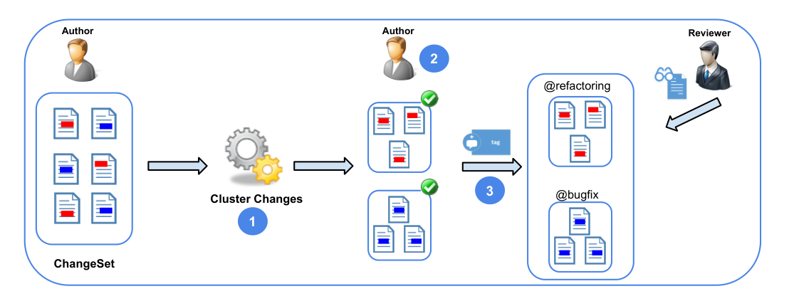

within Microsoft, we have sampled only a very small subset of available changesets. Also, we have restricted ourselves to looking at diff-regions only within C# files. Finally, the small sample size and human factors involved mean that we are not able to achieve statistical significance, even within this scope.

## VII. RELATED WORK

Tao et al. present an empirical study to investigate the role of understanding code changes in software development [20]. Among other results, they observe that developers need to decompose changes in order to understand them — one of the primary goals of our approach.

To the best of our knowledge, there have been three prior approaches towards the problem of decomposing code changes. Kirinuki et al. [21] report a small experiment on identifying unrelated changes. They use the longest common subsequence algorithm to compare previous changes for the project to the one being committed. Herzig and Zeller [6] propose a heuristic-based algorithm to “untangle” changes based on information such as file distance and the call graph of a change. Similarly, Kawrykow and Robillard [4] apply a heuristic-based algorithm to analyze changesets; they focus on a statement-level analysis to find simple changes, such as adding the keyword “this” when accessing fields.

Our work, in contrast, is concerned with developers’ understanding of changes in the context of code reviews. Our exclusive use of def-use information, i.e., semantic information to partition changesets is novel and our validation with actual change owners enabled us to get the ground truth about independent changes being committed together.

Finally, there is a rich literature on techniques for understanding and summarizing changes. They range from change impact analysis [22], summarizing structural changes (automatically [23], [24] or interactively [25]) to the use of symbolic execution and program analysis [26], [27], [28]. These techniques are complementary to the problem of decomposing changes, and can in fact be used in conjunction to further summarize individual partitions suggested by our technique.

## VIII. CONCLUSION

Changesets containing unrelated changes are not a rare event. This can negatively affect understanding: reviewers might need to switch contexts and manually separate unrelated changes to effectively review them. To tackle this problem, we designed an algorithm for partitioning the set of diff-regions present in a code review and implemented it in a tool which was used to perform both studies: quantitative and qualitative. We found that using a single relationship, that between the use of a type, method, or field and its definition, provided a useful decomposition with no false positives. We performed this initial validation with the author of the changes, rather than its consumers in order to see if the partitioning reflects the author’s intent. Now that we have confidence in the accuracy of our partitioning, we can move on to do further studies with code reviewers.

Figure 7 illustrates one way that our work could fit into the development process. Initially, an author creates a changeset,

Fig. 7. Intended workflow for CLUSTERCHANGES.

which is then provided as input to CLUSTERCHANGES, which (step 1) decomposes it into independent partitions. Then, in step 2, the author can review the created partitions to ensure they are consistent with her understanding. In step 3, partitions can be ordered and tagged so that the reviewer sees the structured changeset. Steps 1 and 2 were already addressed by this work; future work includes adding more relationships without compromising precision (to step 1) and allowing developers to tag/order partitions (step 3). We also intend to conduct a broader quantitative study once the tool has been rewritten as an extension of the existing code review tool used at Microsoft.

Another possibility is in the context of other modern distributed revision control systems (e.g. GitHub) that have been promoting code review through lightweight mechanisms to annotate and discuss pull requests and commits. In particular, besides enabling general comments to summarize a commit, GitHub enables comments on code snippets, which can improve changes comprehension. In this context, CLUSTERCHANGES could be used as a mechanism to automatically identify where to include such comments/tags.

CLUSTERCHANGES is not coupled to a specific development environment, programming language, or application domain. Given the set of textual differences, which can be provided by any of the standard text differencing tools, we require only the ability to parse and semantically understand the source code. Many programming languages provide open APIs for retrieving such information.

It is our belief that there is a huge role for automated analysis and tooling for improving the code review process. Tools such as CLUSTERCHANGES or DiffCat [4] should be evaluated in a long-term study after they have been integrated into the “wild”.

## ACKNOWLEDGMENTS

We thank Jack Tilford and Birendra Acharya from the CodeFlow team and Balaji Soundrarajan from the Roslyn team for all of their help. We would also like to thank Tom Ball, Yingnong Dang, Jacek Czerwonka and Andrew Begel for several interesting discussions about the problem and the tool. We would especially like to thank all of the study participants for their valuable time.