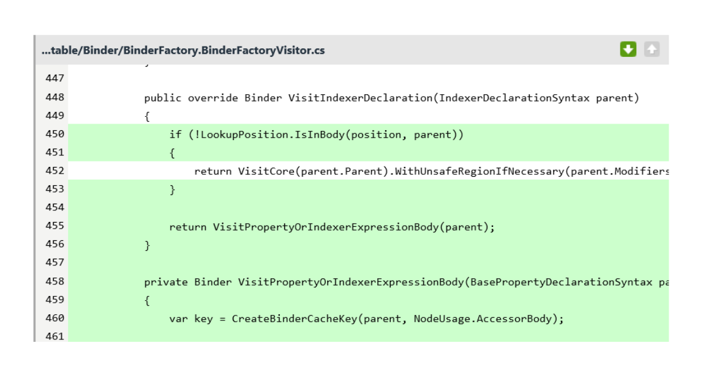
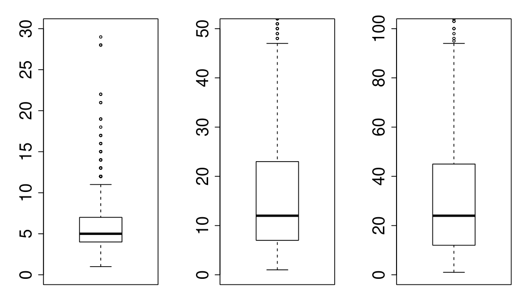

Fig. 1. Example change from a real changeset. The white lines are unchanged lines. The green lines are added lines. There are no deleted lines; those would be shown highlighted in red.

bodied member semantic model tests into their own file and adds some extra tests. ("#244" refers to a bug report that had been made a few weeks prior.) Part of the relevant change is shown in Figure 1. Of particular interest for our work is that line 450 adds a call to a method which is introduced in another file included in the changeset, whereas the method call added on line 455 is to the method introduced on line 458 and so is easily found and understood. CLUSTERCHANGES does indeed decompose the commit into two independent partitions, one of which contains the two relevant files for the bug fix.

b) Literature: Prior literature has found that large changes are problematic to examine [9]. For instance, Rigby et al. [3] found that in order to facilitate review activity, changes should be small and independent. For example, changes that combine refactorings with bug fixes can be difficult to review together, especially if the reviewer doesn't know that there are multiple things going on in the change. Rigby et al. raised the need to enable a divide-and-conquer review style that keeps each change logically and functionally independent.

In a later study, Rigby et al. [10] analyzed change size (number of added and deleted lines, and number of changed files) and its relationship to several complexity metrics for changes submitted for peer review in 6 open source projects. They found that the more files changed and differences produced in a submitted change, the more likely the change actually consisted of multiple relatively independent changes that might affect diverse sections of a system. As a consequence, developers experience more difficulty when trying to understand large code changes.

Herzig and Zeller [6] found that a non-trivial proportion of changes in five open source projects are tangled, meaning that they contain more than one bug fix, feature, refactoring, etc. While their study was on the impact of such changes on research in mining software repositories, they provide evidence that changes do exist which can in some way be decomposed. They point out (and we agree) that there may be a completely valid reason that a developer commits multiple changes that appear unrelated as one change. One of our study participants indicated that the overhead to run regression tests after each commit often leads to a developer combining multiple changes in a commit.

## Boxplots of Change Sizes

Fig. 2. Boxplots showing distributions of the size of changes in terms of the number of files and methods changed as well as the number of diff-regions.

Our goal is not to force developers to commit independent changes separately, but rather to identify independent parts of changes to facilitate understanding.

Tao et al. conducted a large scale study of how developers examine and understand code changes [2] with one of their main goals being to determine "How to improve the effectiveness and efficiency of the practice in understanding code changes." They observed that "engineers sometimes mix multiple bug-fixing changes or changes with other purposes in a single checkin. Understanding [these] composite changes requires non-trivial efforts." One of their main conclusions is that "Participants call for a tool that can automatically decompose a composite change into separate sub-changes," and point out that "however, currently such decomposition lacks tool support." As one of the developers in their study indicated: "It would be useful to be able to analyze groups of functional changes instead of having to go file by file and context switch between changes. I want to be able to see all the changes that related [sic] to one bug, or possibly one variable within the changelist".

c) Discussions with developers: We were also motivated by data gathered from our previous empirical study on code review [1] and follow on observations and discussions with developers. One common theme that developers mentioned when discussing code review is how large a review is. As one developer indicated "If I get a code bomb to review with like thirty files, I can either look at it now and skim it in five to ten minutes or I can save it for later and I may or may not get to it. Both aren't good." A Windows development manager indicated that one of the bottlenecks in their process was reviewing changes made to resolve conflicts after merges from branch to another. It is not uncommon for such changes to include upwards of 50 files and contain many unrelated changes.

d) Code change size at Microsoft: To quantitatively investigate the change size at Microsoft, we conducted a preliminary analysis on 1000 code changes submitted to be reviewed within Microsoft Office during the Office 2013 development cycle. Figure 2 shows quantitative data on the change sizes. "Files changed" shows a boxplot of the number of