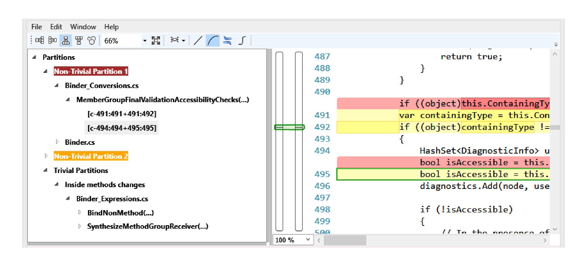

Fig. 3. ClusterChanges - Tree view displaying a change from the Roslyn project (located at https://roslyn.codeplex.com/SourceControl/changeset/4c74a47ca896)

3) Partitioning the set of diff-regions: Now we can define precisely what we mean by two diff-regions being related, using the relation RelatedDiffs. Distinct diff-regions f1 and f2 are in the relation RelatedDiffs if and only if:

SameEnclosingMethod(f1, f2) ∨
(defs(f1) × uses(f2)) ∩ defUsesInDiffs ≠ {} ∨
(uses(f1) × uses(f2)) ∩ useUsesInDiffs ≠ {}

The relation SameEnclosingMethod is true for pairs of distinct diff-regions whose span intersects the span of the same method (or property) definition. We group diff-regions in the same method together because a) in practice, we observe that changes to the same method are often related, and b) in prior research [1], we observed that reviewers usually review methods atomically (i.e., they rarely review different diff-regions in a method separately). Given these relations we create a partitioning over the set of diff-regions by computing the reflexive, symmetric and transitive closure of RelatedDiffs.

We then distinguish the set of trivial partitions as those partitions where all of the diff-regions within the partition are within the same method or where there is only one diff-region in the partition and it is outside of a method definition. We refer to the former category as trivial in-method partitions. That is, the trivial partitions are those diff-regions which we did not group with any other diff-regions (except those that are related only because they occur within the same method). All other partitions are non-trivial partitions: they contain diff-regions from multiple methods or changes in one method along with at least one change outside of any method definition.

### C. Tool description

Summarizing, we have built a tool CLUSTERCHANGES that takes as input a CodeFlow changeset and produces a partitioning of the diff-regions from the after-files. Reviewers visualize the partitions in a tree view, as shown in the left pane of Figure 3.

The tree view is linked to a standard textual difference view of the before-file and the after-file: selecting a diff-region in the tree view produces a view of the source file with the changes highlighted, as shown in the right pane of Figure 3.

Our tool is not meant to replace the current code review tool, but rather is a prototype for validating our techniques.

## IV. QUANTITATIVE EVALUATION

We initially took a random sample of 100 changesets submitted for review from Microsoft's search engine, Bing, in an effort to identify missing relationships and bugs in our implementation. We also used the tool on our own changesets as we worked on it. We selected changesets from reviews rather than commits because a review doesn't always correspond directly to a commit, as the former is used to solicit feedback and drive change while the latter is not intended to be rolled back.

We then applied CLUSTERCHANGES to a randomly chosen set of 1000 changesets submitted for review in Microsoft Office during Office 2013 development to determine the distribution of suggested trivial and non-trivial partitions. Figure 4 shows a histogram of the number of non-trivial partitions in these changesets.

While the most common case are changesets containing just one non-trivial partition, this still makes up only 45%. Nearly 42% of all changes contain more than one non-trivial partition.