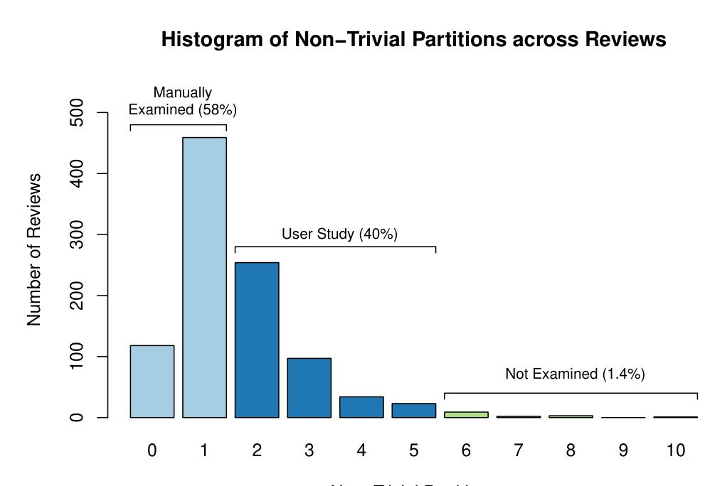
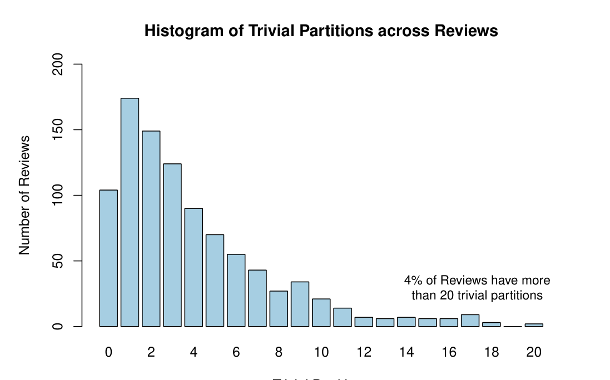

Fig. 4. Distribution of non-trivial partitions from 1000 changesets submitted as reviews

Fig. 5. Distribution of trivial in-method partitions from 1000 changesets submitted as reviews

In addition, the proportion of changed methods that end up in non-trivial partitions is 66% on average per review. To the degree that CLUSTERCHANGES correctly identifies non-trivial partitions, this indicates that i) a large proportion of changesets can be decomposed into multiple independent changes, and ii) our decomposition covers a large fraction of changed methods in a review. At the same time, the other 34% of changed methods that form trivial in-method partitions indicate that there is room for improvement for our technique. Figure 5 shows the distribution of trivial in-method partitions across the same changesets. There is a long tail in this distribution (one change had 326 trivial partitions) and just under 4% of the changesets actually have more than 20 trivial in-method partitions.

Ideally, we would evaluate our technique by validating the suggested partitions with the ground truth about the relative independence of these partitions. The best source of ground truth is the developer who created the changeset, which is feasible for only a very small fraction of the developers that made the 1000 changes. We therefore developed the following strategy to loosely group the set of reviews based on the number of partitions:

- ≤ 1 non-trivial partition: We manually examined changesets that contained fewer than two non-trivial partitions (a changeset can have no non-trivial partitions if it is composed only of trivial partitions) in a manner similar to Herzig and Zeller [6] by examining commit messages and looking at the modifications to the source code to determine if the partitioning appeared correct (Section IV-A).
- 2–5 non-trivial partitions: We selected changes that comprised two to five non-trivial partitions for a user study to obtain the ground truth (Section V). These changes represent a significant fraction (around 40%) of all changes in Figure 4.
- ≥ 6 non-trivial partitions: We excluded reviews with six or more partitions from our study since (a) they constitute only 1.4% of reviews in Figure 4, and (b) consulting developers for these changes would take longer than our goal of a short interview.
- ≥ 10 trivial partitions: Under the hypothesis that a single developer’s change cannot consist of so many independent changes, it is evident that there are relationships not captured by our technique. We performed a manual investigation of several of these reviews (Section IV-B).

### A. Reviews with ≤ 1 non-trivial partition

We manually investigated the changesets that had one or fewer non-trivial partitions, indicated by the leftmost two bars in Figure 4 in an effort to determine if CLUSTERCHANGES ever puts sets of diff-regions into one non-trivial partition when they should actually be split. We examined the commit message to determine if more than one task (bug fix, feature implementation, refactoring, etc.) was accomplished. We also investigated the changeset to determine if the identified non-trivial partition in each changeset should actually be split into multiple partitions (trivial and/or non-trivial) or if any of the identified relationships were spurious.

We randomly sampled 50 of the changesets that had one or fewer non-trivial partitions. Of these, six had changeset descriptions indicating more than one task. In four of the six, CLUSTERCHANGES separated the tasks into partitions, but only one of the tasks comprised a non-trivial partition; the others were contained in trivial partitions. In the other two, the two tasks were actually semantically related. For example, one changeset addressed a bug in which a particular type of data file and its backup were lost or corrupted when it was moved. The changeset contained changes to the file manipulation code and updated tests that made calls to the same code. Since the test code did have a def-use relationship with the code in the bug fix, the diff-regions were placed into the same non-trivial partition.

We observed three cases where one or more trivial partitions in a changeset would have fit into existing non-trivial partitions.